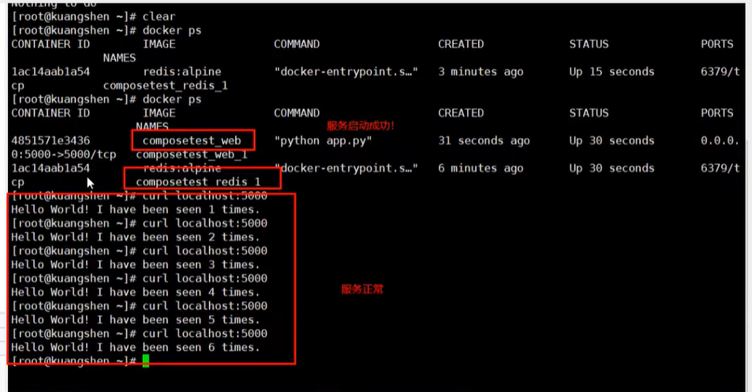
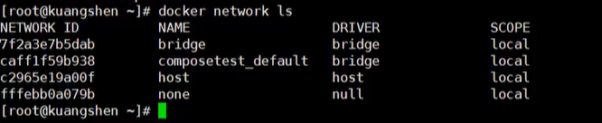
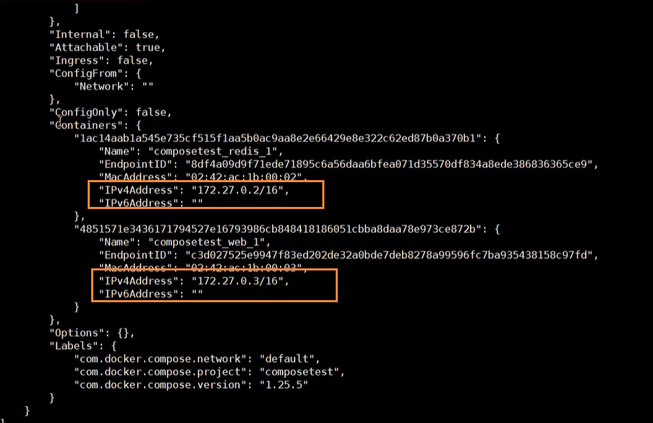

# Docker Compose入门学习

## 简介

我们之前操作Docker的过程是：DockerFile  build run 进行手动操作，单个容器，如果假设我们有100个微服务，并行微服务之间还存在依赖关系。这个时候，我们就可以使用Docker Compose来轻松高效的管理容器，定义运行多个容器。

### 官方介绍：

- 定义、运行多个容器
- YAML file配置环境

> Compose是一个用于定义和运行多容器Docker应用程序的工具。使用Compose，您可以使用YAML文件来配置应用程序的服务。然后，使用一个命令，就可以从配置中创建并启动所有服务。要了解有关Compose的所有特性的更多信息，请参阅[特性列表](https://docs.docker.com/compose/#features)。
>
> Compose可以在所有环境中工作:生产、阶段、开发、测试，以及CI工作流。您可以在常见用例中了解关于每个用例的更多信息
>
> 使用Compose基本上有三个步骤:
>
> - 用 Dockerfile 定义你的应用程序的环境，这样它就可以在任何地方复制。
> - 在 Docker-compose 中定义组成应用程序的服务。这样它们就可以在一个独立的环境中一起运行。
> - 运行 docker-compose up 和 Compose 启动并运行整个应用程序。

### 作用

批量容器编排

> Compose是Docker官方的开源项目，需要安装！
>
> Dockerfile 让程序在任何地方运行，web服务。Redis、MySQL、Nginx。。。多个容器

Compose的YAML文件如下所示

```yaml
version: '2.0'
services:
  web:
    build: .
    ports:
    - "5000:5000"
    volumes:
    - .:/code
    - logvolume01:/var/log
    links:
    - redis
  redis:
    image: redis
volumes:
  logvolume01: {}
```

docker-compose up 100 个服务，也可以一键启动

Compose：重要的概念

- 服务service，容器，应用（web，redis，mysql）
- 项目project，就是一组关联的容器。

## 常见的Docker Compose脚本

下面这个是小伙伴开源的一些Docker Compose脚本，我们如果需要部署某个应用的时候，可以通过下面脚本，非常方便的进行部署

https://gitee.com/zhengqingya/docker-compose

## 安装Docker Compose

官方文档：https://docs.docker.com/compose/install/

### 下载

首先我们先安装一下Docker

```bash
# yum安装
yum -y install docker-ce
#查看docker版本
docker --version  
# 设置开机自启
systemctl enable docker
# 启动docker
systemctl start docker
```

然后下载docker-compose

```bash
sudo curl -L "https://github.com/docker/compose/releases/download/1.26.2/docker-compose-$(uname -s)-$(uname -m)" -o /usr/local/bin/docker-compose
```

### 授权

下载完成后，我们进入到下面的目录

```bash
cd /usr/local/bin
```

然后加入执行权限

```bash
sudo chmod +x docker-compose
```

查看是否安装成功

```bash
docker-compose version
```

###  创建文件体验

在这个页面中，您将构建一个运行在Docker撰写器上的简单Python web应用程序。该应用程序使用了烧瓶框架，并在Redis中维护了一个命中计数器。虽然示例使用Python，但是即使您不熟悉它，这里演示的概念也应该可以理解。

确保你已经安装了Docker引擎和Docker组合。你不需要安装Python或Redis，因为它们都是由Docker images提供的。

```bash
# 创建文件夹
mkdir composetest
# 进入该文件夹
cd composetest
```

然后我们需要创建一个 app.py 文件

```bash
import time

import redis
from flask import Flask

app = Flask(__name__)
cache = redis.Redis(host='redis', port=6379)


def get_hit_count():
    retries = 5
    while True:
        try:
            return cache.incr('hits')
        except redis.exceptions.ConnectionError as exc:
            if retries == 0:
                raise exc
            retries -= 1
            time.sleep(0.5)


@app.route('/')
def hello():
    count = get_hit_count()
    return 'Hello World! I have been seen {} times.\n'.format(count)
```

然后创建一个 requirements.txt 文件，里面需要依赖包

```py
flask
redis
```

### 创建Docker file

在这个步骤中，您将编写一个构建Docker映像的Dockerfile。该映像包含Python应用程序需要的所有依赖项，包括Python本身。在您的项目目录中，创建一个名为Dockerfile的文件，并粘贴以下内容:

```bash
FROM python:3.7-alpine
WORKDIR /code
ENV FLASK_APP app.py
ENV FLASK_RUN_HOST 0.0.0.0
RUN apk add --no-cache gcc musl-dev linux-headers
COPY requirements.txt requirements.txt
RUN pip install -r requirements.txt
EXPOSE 5000
COPY . .
CMD ["flask", "run"]
```

> 上述代码中，是为了告诉Docker
>
> 从Python3.7版本开始构建镜像
>
> 将当前目录设置为 /code
>
> 安装python依赖项
>
> 将容器的默认命令设置为 python app.py

### 定义服务在Compose文件中

创建一个名为docker-compose的文件。yml在您的项目目录，并粘贴以下

```bash
version: '3'
services:
  web:
    build: .
    ports:
      - "5000:5000"
  redis:
    image: "redis:alpine"
```

> 此Compose文件定义了两个服务，web和redis，该web服务使用从Docker file当前目录中构建的镜像
>
> 将容器上的公开端口5000

这个合成文件定义了两个服务:web和redis。

#### Web服务

web服务使用从当前目录中的Dockerfile构建的映像。然后，它将容器和主机绑定到公开的端口5000。这个示例服务使用了Flask web服务器5000的默认端口

#### Redis服务

redis服务使用从Docker Hub注册中心提取的公共redis图像

### 使用Compose构建和运行应用程序

在项目目录中，通过运行启动应用程序  `docker-compose up`.

```bash
docker-compose up
```

运行结果如下

```bash
Creating network "composetest_default" with the default driver
Creating composetest_web_1 ...
Creating composetest_redis_1 ...
Creating composetest_web_1
Creating composetest_redis_1 ... done
Attaching to composetest_web_1, composetest_redis_1
web_1    |  * Running on http://0.0.0.0:5000/ (Press CTRL+C to quit)
redis_1  | 1:C 17 Aug 22:11:10.480 # oO0OoO0OoO0Oo Redis is starting oO0OoO0OoO0Oo
redis_1  | 1:C 17 Aug 22:11:10.480 # Redis version=4.0.1, bits=64, commit=00000000, modified=0, pid=1, just started
redis_1  | 1:C 17 Aug 22:11:10.480 # Warning: no config file specified, using the default config. In order to specify a config file use redis-server /path/to/redis.conf
web_1    |  * Restarting with stat
redis_1  | 1:M 17 Aug 22:11:10.483 * Running mode=standalone, port=6379.
redis_1  | 1:M 17 Aug 22:11:10.483 # WARNING: The TCP backlog setting of 511 cannot be enforced because /proc/sys/net/core/somaxconn is set to the lower value of 128.
web_1    |  * Debugger is active!
redis_1  | 1:M 17 Aug 22:11:10.483 # Server initialized
redis_1  | 1:M 17 Aug 22:11:10.483 # WARNING you have Transparent Huge Pages (THP) support enabled in your kernel. This will create latency and memory usage issues with Redis. To fix this issue run the command 'echo never > /sys/kernel/mm/transparent_hugepage/enabled' as root, and add it to your /etc/rc.local in order to retain the setting after a reboot. Redis must be restarted after THP is disabled.
web_1    |  * Debugger PIN: 330-787-903
redis_1  | 1:M 17 Aug 22:11:10.483 * Ready to accept connections
```

最后查看服务是否启动成功



使用 docker images命令，我们发现在docker compose中的镜像都已经下载好了


### 网络规则

使用下面的命令，就可以查看到docker中的网络

```bash
docker network ls
```



通过compose构建的服务，compose帮我们维护了，都会在一个网络下面，就可以通过域名访问

我们通过以下命令来进行查看，发现启动的两个服务，就是同处于同一个网络下的

```bash
docker network inspect composetest_default
```



### 关闭docker compose

可以使用一下命令退出

```bash
docker-compose down
# 或者
ctrl + c
```

### 总结

我们可以对上述的操作，进行一下总结，就可以分为一下几个步骤

- 应用 app.py
- Docker file  将应用程序打包成镜像
- Docker-compose yaml 文件（定义整个服务，需要的环境，web、redis）完整的上线服务
- 启动compose项目（docker-compose up）
- 流程
  - 创建网络
  - 执行Docker-compose yaml
  - 启动服务

原来我们没有用到docker-compose的时候，都是需要使用docker run，一个个的运行我们的容器

通过docker-compose，我们编写yaml文件，可以通过docker-compose一键启动服务，或者停止。

## yaml规则

docker-compose.yaml规则

```bash
# 三层
version: "3.8"  # 定义版本
services:       # 定义服务
   服务1:web
       images
       build
       network
	   ......
   服务2:redis
   		.....
   服务3:nginx
   		.....
  # 其它配置 网络/卷、全局规则
  volumes:
  networks:
  configs:  
```

完整实例如下

```yaml
version: "3.8"
services:
  redis:
    image: redis:latest
    deploy:
      replicas: 1
    configs:
      - my_config
      - my_other_config
configs:
  my_config:
    file: ./my_config.txt
  my_other_config:
    external: true
```

### 依赖关系

如果我们的项目还有依赖关系，比如  web 依赖于redis，也就是说项目需要首先启动redis

```yaml
version: "3.8"
services:
  web:
    build: .
    depends_on:
      - db
      - redis
  redis:
    image: redis
  db:
    image: postgres
```

## 快速搭建WordPress

官网搭建文档：https://docs.docker.com/compose/wordpress/

首先创建项目的文件夹

```bash
# 创建文件夹
mkdir my_wordpress
# 进入文件夹
cd my_wordpress/
```

然后创建一个 docker-compose.yml 文件

```yaml
version: '3.3' # 定义版本

services:
   db:
     image: mysql:5.7
     volumes:
       - db_data:/var/lib/mysql
     restart: always
     environment:
       MYSQL_ROOT_PASSWORD: somewordpress
       MYSQL_DATABASE: wordpress
       MYSQL_USER: wordpress
       MYSQL_PASSWORD: wordpress

   wordpress:
     depends_on:  # 依赖于上一个db，也就是需要db启动
       - db
     image: wordpress:latest
     ports:
       - "8000:80"
     restart: always
     environment:
       WORDPRESS_DB_HOST: db:3306
       WORDPRESS_DB_USER: wordpress
       WORDPRESS_DB_PASSWORD: wordpress
       WORDPRESS_DB_NAME: wordpress
volumes:
    db_data: {}
```

后台启动项目

```bash
docker-compose  -d
```

到此为止，项目已经成功搭建完毕

> 正常的开源项目，可能还需要依赖 build后的jar包，所以我们还需要使用Dockerfile
>
> 当我们的文件准备齐全的时候，就可以一键启动项目

未来的趋势：linux、docker、k8s

掌握：docker基础、原理、网络、服务、集群、错误排查、日志。

## docker-compose搭建微服务

我们可以使用下面命令 ，创建一个SpringBoot项目：https://start.spring.io/

- 编写项目微服务
- dockerfile构建镜像
- 创建docker-compose来启动项目，进行服务编排
- 丢到服务器 docker-compose启动
- 如果出现了问题：使用docker-compose up  --build（重新构建）

## Docker小结

- Docker镜像 -> 通过 run命令启动镜像
- Dockerfile 构建镜像（服务打包）
- docker-compose 启动项目（编排、多个微服务/ 环境）
- Docker 网络

## 参考

https://www.bilibili.com/video/BV1kv411q7Qc