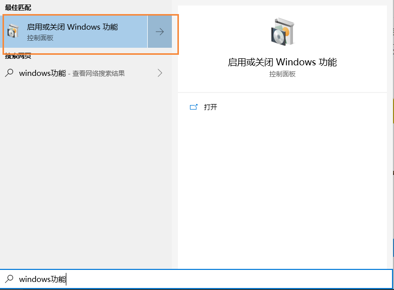
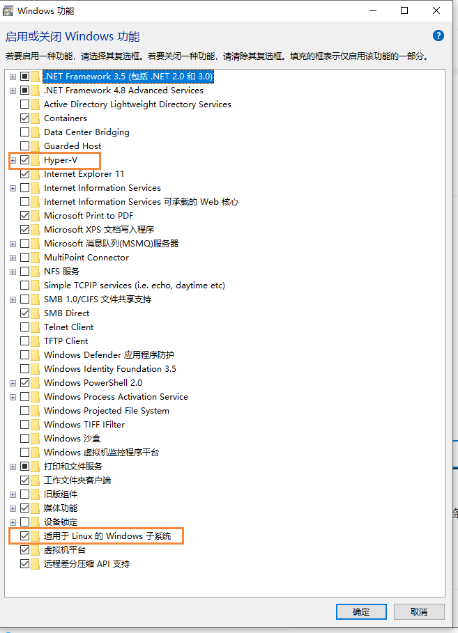
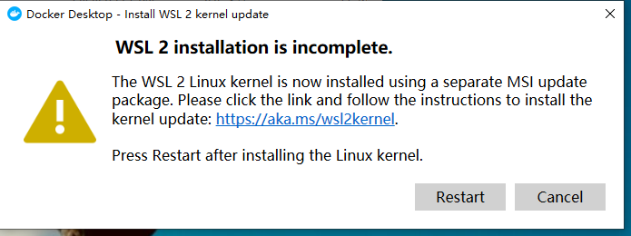
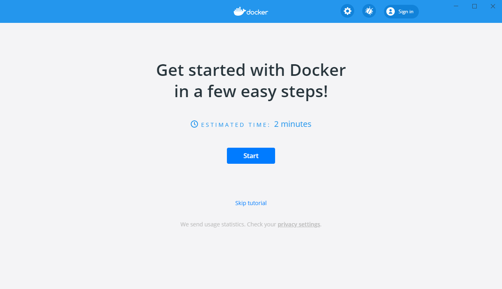
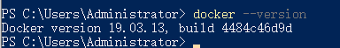

# DockerDesktop入门简介

## 参考

参考：https://segmentfault.com/a/1190000022059895

## 介绍

Docker Desktop是一款专门为Windows和Mac提供桌面化的容器开发环境，在Windows中，Docker Desktop使用了Windows的Hyper-V虚拟化技术，因此需要一台打开了硬件虚拟化的电脑，并且安装的是Windows10专业版以上的系统。

## 下载

首先到官网下载对应版本的 [Docker Desktop安装包](https://www.docker.com/products/docker-desktop)

## 安装

首先我们需要：启用或关闭Windows功能



然后勾选下面的选项



然后开始运行我们下载好的 DockerDesktop.exe，我们进行安装过程中，首先会进行一系列的检查，包括是否开启虚拟化，以及是否满足条件

## 运行

安装完成后，点击图片Docker Desktop



这个问题是因为我们使用的wsl2版本太旧，需要我们手动更新一下，首先根据提示去微软官网下载最新版的wsl2安装包，然后进行安装：[安装包点我传送](https://wslstorestorage.blob.core.windows.net/wslblob/wsl_update_x64.msi)

然后在重新安装，即可完成我们Docker Desktop



然后我们打开 powershell即可查看到我们安装的docker版本了

```bash
docker --version
```



下面就可以安装在Linux使用Docker的操作，到Windows进行操作了~