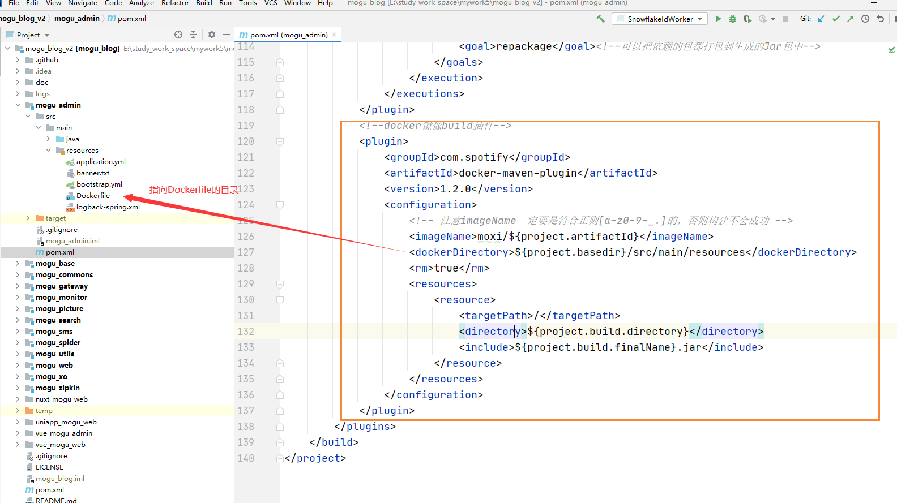
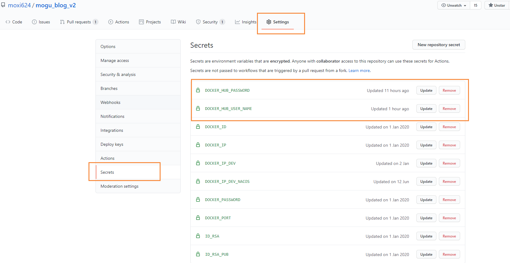
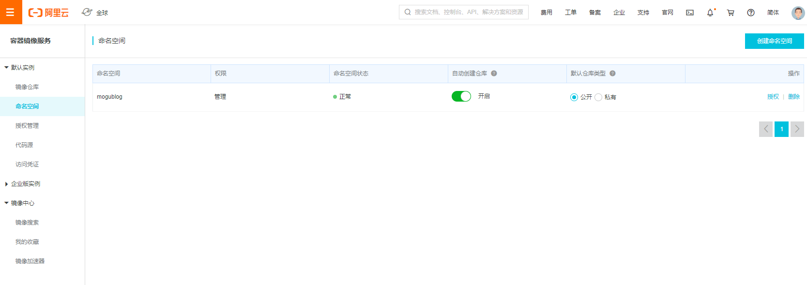
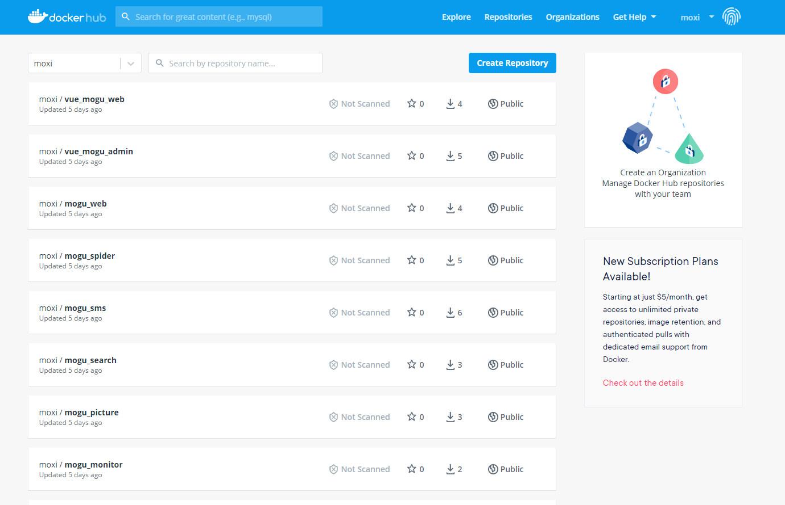
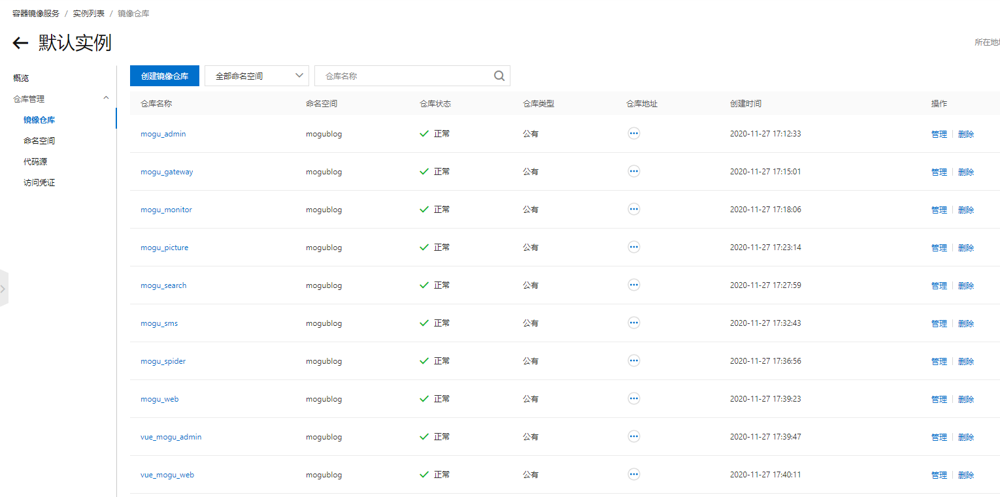

# 使用GithubAction构建蘑菇博客镜像提交DockerHub

## 前言

这阵子使用DockerCompose部署蘑菇博客， 但是还存在一些问题，就是每次我们需要下载 [蘑菇博客](https://gitee.com/moxi159753/mogu_blog_v2) 源码，然后进行编译，打包，部署。而因为蘑菇博客还是前后端分离项目，因此为了完成这一系列的操作，就需要在环境中安装maven、node、git 等环境。但是因为这些环境只是在我们项目的构建阶段才会使用，而构建项目完成后，就不需要使用了，因此就打算使用Github Actions在代码提交的后，我们提前把蘑菇博客的镜像给构建完成，然后上传到DockerHub上，最后在其它人需要使用的时候，就不需要自己重新构建镜像了，而是直接拉取线上的镜像，完成项目的部署。

如果你想了解Github Actions的使用，参考：[使用Github Action完成蘑菇博客持续集成](http://www.moguit.cn/#/info?blogUid=0762bfb392c2cf0a94c8a7934fe46f8f)

如果你想知道更多的官方Actions，参考：[Build and push Docker images](https://github.com/marketplace/actions/build-and-push-docker-images)

如果想了解蘑菇博客镜像构建和部署，参考： [使用DockerCompose制作蘑菇博客YAML镜像文件](http://www.moguit.cn/#/info?blogOid=567)

如果想快速一键部署蘑菇博客，参考：[DockerCompose一键部署蘑菇博客(Nacos版)](http://www.moguit.cn/#/info?blogOid=565)

## 环境准备

因为我们需要在Actions中进行镜像构建，首先我们需要创建一个Github Actions的任务，首先定义我们的 actions name，以及触发的条件【触发条件这里有两种，一种是根据tag操作触发，一种是push操作触发】

```bash
name: Master-Build-Docker-Images
# 根据tag操作触发
on:
  push:
    # 每次 push tag 时进行构建，不需要每次 push 都构建。
    # 使用通配符匹配每次 tag 的提交，记得 tag 名一定要以 v 开头
    tags:
      - v*
      
# 根据push操作触发
on:
  push:
    branches:
      - Nacos

```

然后我们就需要在里面引入我们的环境依赖，因此我们引入以下环境

- git拉取代码
- java环境
- docker环境

```bash
jobs:
  push:
    # 如果需要在构建前进行测试的话需要取消下面的注释和上面对应的 test 动作的注释。
    # needs: test

    runs-on: ubuntu-latest
    steps:
      - uses: actions/checkout@v2
      - uses: actions/setup-java@v1
        with:
          java-version: 1.8
      - uses: docker/setup-buildx-action@v1
```

## 构建镜像

在我们完成基础环境的搭建后，我们就可以开始使用maven命令 构建我们的镜像了，其实就是运行以下的脚本

```bash
# 安装依赖
mvn clean install
# 打包
mvn docker:build
```

但是在我们进行打包操作的时候，我们需要在 pom文件中添加docker打包插件，以及Dockerfile文件

```bash
<!--docker镜像build插件-->
<plugin>
    <groupId>com.spotify</groupId>
    <artifactId>docker-maven-plugin</artifactId>
    <version>1.2.0</version>
    <configuration>
        <!-- 注意imageName一定要是符合正则[a-z0-9-_.]的，否则构建不会成功 -->
        <imageName>moxi/${project.artifactId}</imageName>
        <dockerDirectory>${project.basedir}/src/main/resources</dockerDirectory>
        <rm>true</rm>
        <resources>
            <resource>
                <targetPath>/</targetPath>
                <directory>${project.build.directory}</directory>
                <include>${project.build.finalName}.jar</include>
            </resource>
        </resources>
    </configuration>
</plugin>
```

在pom文件中，我们指定了Dockerfile文件路径，以及最后打包的镜像名称



同时在Dockerfile文件中，主要定义的就是一些镜像相关的信息，主要包括依赖的java环境，启动时的JVM参数

```bash
FROM java:alpine
VOLUME /tmp
ADD mogu_admin-0.0.1-SNAPSHOT.jar app.jar
ENTRYPOINT ["java","-Xms256m","-Xmx256m","-jar","/app.jar"]
```

完整的镜像构建过程如下：

```bash
        # 构建镜像，指定镜像名
      - name: Build Docker Images
        run: |
          echo '=====开始mvn clean====='
          mvn clean

          echo '=====开始mvn install&&package====='
          mvn install -DskipTests=true && mvn package -DskipTests=true

          echo '=====开始构建镜像====='
          echo '=====开始构建mogu_admin====='
          cd mogu_admin
          mvn docker:build
          cd ..

          echo '=====开始构建mogu_gateway====='
          cd mogu_gateway
          mvn docker:build
          cd ..

          echo '=====开始构建mogu_monitor====='
          cd mogu_monitor
          mvn docker:build
          cd ..

          echo '=====开始构建mogu_picture====='
          cd mogu_picture
          mvn docker:build
          cd ..

          echo '=====开始构建mogu_search====='
          cd mogu_search
          mvn docker:build
          cd ..

          echo '=====开始构建mogu_sms====='
          cd mogu_sms
          mvn docker:build
          cd ..

          echo '=====开始构建mogu_spider====='
          cd mogu_spider
          mvn docker:build
          cd ..

          echo '=====开始构建mogu_web====='
          cd mogu_web
          mvn docker:build
          cd ..

          echo '=====镜像构建结束====='
```

## 登录镜像网站

### 登录DockerHub

登录DockerHub，将我们构建成功的镜像上传

```bash
# 登录到 dockerhub，使用 GitHub secrets 传入账号密码，密码被加密存储在 GitHub 服务器
- name: Login to DockerHub
    uses: docker/login-action@v1
    with:
      username: ${{ secrets.DOCKER_HUB_USER_NAME }}
      password: ${{ secrets.DOCKER_HUB_PASSWORD }}
```

上面的一部分，使用到了Github的加密方式 Secrets，将我们项目中的敏感信息储存在secrets中，然后通过`${{ secrets.XX }}` 的方式获取，Secrets的存储在下图所示



我们通过 new repository secret，给我们的项目添加密钥，这里主要是对DockerHub的用户名和密码加密，防止直接泄漏在我们的仓库中

### 提交阿里云

如果我们要提交到 [Aliyun容器镜像服务](https://cr.console.aliyun.com/) ，那么就应该这样写 【这里主要以提交DockerHub为重心】

```yaml
      # 登录到 阿里云镜像服务，使用 GitHub secrets 传入账号密码，密码被加密存储在 GitHub 服务器
      - name: Login to Aliyun
        uses: docker/login-action@v1
        with:
          registry: registry.cn-shenzhen.aliyuncs.com
          username: ${{ secrets.ALIYUN_USER_NAME }}
          password: ${{ secrets.ALIYUN_PASSWORD }}
```

同时要求我们的镜像前缀为 `registry.cn-shenzhen.aliyuncs.com/mogublog` ，其中 mogublog 为我们阿里云容器镜像服务的命名空间



最后我们在 maven打包的pom文件中，就需要修改我们的前缀了

```pom
<!--docker镜像build插件-->
<plugin>
    <groupId>com.spotify</groupId>
    <artifactId>docker-maven-plugin</artifactId>
    <version>1.2.0</version>
    <configuration>
        <!-- 注意imageName一定要是符合正则[a-z0-9-_.]的，否则构建不会成功 -->
        <imageName>registry.cn-shenzhen.aliyuncs.com/mogublog/${project.artifactId}</imageName>
        <dockerDirectory>${project.basedir}/src/main/resources</dockerDirectory>
        <rm>true</rm>
        <resources>
            <resource>
                <targetPath>/</targetPath>
                <directory>${project.build.directory}</directory>
                <include>${project.build.finalName}.jar</include>
            </resource>
        </resources>
    </configuration>
</plugin>
```

并且vue打包的时候，也需要使用对应的前缀

```bash
# 打包镜像
docker build -t registry.cn-shenzhen.aliyuncs.com/mogublog/vue_mogu_web .
# 提交镜像
docker push registry.cn-shenzhen.aliyuncs.com/mogublog/vue_mogu_web
```

在我们完成DockerHub的登录后，我们就可以使用 `docker push 镜像名`   提交我们的镜像了

脚本如下

```bash
      - name: Push Docker Image
        run: |
          echo '=====开始上传镜像====='
          echo '=====开始上传mogu_admin====='
          docker push moxi/mogu_admin

          echo '=====开始上传mogu_gateway====='
          docker push moxi/mogu_gateway

          echo '=====开始上传mogu_monitor====='
          docker push moxi/mogu_monitor

          echo '=====开始上传mogu_picture====='
          docker push moxi/mogu_picture

          echo '=====开始上传mogu_search====='
          docker push moxi/mogu_search

          echo '=====开始上传mogu_sms====='
          docker push moxi/mogu_sms

          echo '=====开始上传mogu_spider====='
          docker push moxi/mogu_spider

          echo '=====开始上传mogu_web====='
          docker push moxi/mogu_web
```

## 完整脚本

### DockerHub

上传至DockerHub的完整的脚本，如下所示： `actions_master_build_image.yml` 

```bash
name: Master-Build-Docker-Images

#on:
#  push:
#    # 每次 push tag 时进行构建，不需要每次 push 都构建。使用通配符匹配每次 tag 的提交，记得 tag 名一定要以 v 开头
#    tags:
#      - v*

on:
  push:
    branches:
      - Nacos

jobs:
  push:
    # 如果需要在构建前进行测试的话需要取消下面的注释和上面对应的 test 动作的注释。
    # needs: test

    runs-on: ubuntu-latest
    steps:
      - uses: actions/checkout@v2
      - uses: actions/setup-java@v1
        with:
          java-version: 1.8
      - uses: docker/setup-buildx-action@v1
        # 构建镜像，指定镜像名
      - name: Build Docker Images
        run: |
          echo '=====开始mvn clean====='
          mvn clean

          echo '=====开始mvn install&&package====='
          mvn install -DskipTests=true && mvn package -DskipTests=true

          echo '=====开始构建镜像====='
          echo '=====开始构建mogu_admin====='
          cd mogu_admin
          mvn docker:build
          cd ..

          echo '=====开始构建mogu_gateway====='
          cd mogu_gateway
          mvn docker:build
          cd ..

          echo '=====开始构建mogu_monitor====='
          cd mogu_monitor
          mvn docker:build
          cd ..

          echo '=====开始构建mogu_picture====='
          cd mogu_picture
          mvn docker:build
          cd ..

          echo '=====开始构建mogu_search====='
          cd mogu_search
          mvn docker:build
          cd ..

          echo '=====开始构建mogu_sms====='
          cd mogu_sms
          mvn docker:build
          cd ..

          echo '=====开始构建mogu_spider====='
          cd mogu_spider
          mvn docker:build
          cd ..

          echo '=====开始构建mogu_web====='
          cd mogu_web
          mvn docker:build
          cd ..

          echo '=====镜像构建结束====='

      # 登录到 dockerhub，使用 GitHub secrets 传入账号密码，密码被加密存储在 GitHub 服务器
      - name: Login to DockerHub
        uses: docker/login-action@v1
        with:
          username: ${{ secrets.DOCKER_HUB_USER_NAME }}
          password: ${{ secrets.DOCKER_HUB_PASSWORD }}

      - name: Push Docker Image
        run: |
          echo '=====开始上传镜像====='
          echo '=====开始上传mogu_admin====='
          docker push moxi/mogu_admin

          echo '=====开始上传mogu_gateway====='
          docker push moxi/mogu_gateway

          echo '=====开始上传mogu_monitor====='
          docker push moxi/mogu_monitor

          echo '=====开始上传mogu_picture====='
          docker push moxi/mogu_picture

          echo '=====开始上传mogu_search====='
          docker push moxi/mogu_search

          echo '=====开始上传mogu_sms====='
          docker push moxi/mogu_sms

          echo '=====开始上传mogu_spider====='
          docker push moxi/mogu_spider

          echo '=====开始上传mogu_web====='
          docker push moxi/mogu_web

          echo '=====镜像上传结束====='

```

执行完脚本后，进入到 [DockerHub](https://registry.hub.docker.com/) 中，发现已经成功提交到仓库了



### 阿里云容器镜像服务

上传至阿里云容器镜像服务的完整的脚本，如下所示

```yaml
name: Master-Build-Docker-Images

#on:
#  push:
#    # 每次 push tag 时进行构建，不需要每次 push 都构建。使用通配符匹配每次 tag 的提交，记得 tag 名一定要以 v 开头
#    tags:
#      - v*

on:
  push:
    branches:
      - Nacos

jobs:
  push:
    # 如果需要在构建前进行测试的话需要取消下面的注释和上面对应的 test 动作的注释。
    # needs: test

    runs-on: ubuntu-latest
    steps:
      - uses: actions/checkout@v2
      - uses: actions/setup-java@v1
        with:
          java-version: 1.8
      - uses: docker/setup-buildx-action@v1
      - uses: actions/setup-node@v1
        with:
          node-version: 12.x
      # 安装maven依赖
      - name: Maven Clean Install
        run: |
          echo '=====开始mvn clean====='
          mvn clean

          echo '=====开始mvn install&&package====='
          mvn install -DskipTests=true && mvn package -DskipTests=true

      - name: Build vue_mogu_admin and vue_mogu_web
        run: |
          echo '=====开始安装Vue_mogu_admin依赖====='
          cd ./vue_mogu_admin
          npm install
          npm run build
          cd ..

          echo '=====开始安装Vue_mogu_web依赖====='
          cd ./vue_mogu_web
          npm install
          npm run build
          cd ..

        # 构建镜像，指定镜像名
      - name: Build Java Docker Images
        run: |

          echo '=====开始构建镜像====='
          echo '=====开始构建mogu_admin====='
          cd mogu_admin
          mvn docker:build
          cd ..

          echo '=====开始构建mogu_gateway====='
          cd mogu_gateway
          mvn docker:build
          cd ..

          echo '=====开始构建mogu_monitor====='
          cd mogu_monitor
          mvn docker:build
          cd ..

          echo '=====开始构建mogu_picture====='
          cd mogu_picture
          mvn docker:build
          cd ..

          echo '=====开始构建mogu_search====='
          cd mogu_search
          mvn docker:build
          cd ..

          echo '=====开始构建mogu_sms====='
          cd mogu_sms
          mvn docker:build
          cd ..

          echo '=====开始构建mogu_spider====='
          cd mogu_spider
          mvn docker:build
          cd ..

          echo '=====开始构建mogu_web====='
          cd mogu_web
          mvn docker:build
          cd ..

          echo '=====镜像构建结束====='

      # 构建镜像，指定镜像名
      - name: Build Vue Docker Images
        run: |

          echo '=====开始构建镜像====='
          echo '=====开始构建vue_mogu_admin====='
          cd vue_mogu_admin
          docker build -t registry.cn-shenzhen.aliyuncs.com/mogublog/vue_mogu_admin .
          cd ..

          cd vue_mogu_web
          docker build -t registry.cn-shenzhen.aliyuncs.com/mogublog/vue_mogu_web .
          cd ..

          echo '=====镜像构建结束====='

      # 登录到 阿里云镜像服务，使用 GitHub secrets 传入账号密码，密码被加密存储在 GitHub 服务器
      - name: Login to Aliyun
        uses: docker/login-action@v1
        with:
          registry: registry.cn-shenzhen.aliyuncs.com
          username: ${{ secrets.ALIYUN_USER_NAME }}
          password: ${{ secrets.ALIYUN_PASSWORD }}

      - name: Push Docker Image
        run: |
          echo '=====开始上传镜像====='
          echo '=====开始上传mogu_admin====='
          docker push registry.cn-shenzhen.aliyuncs.com/mogublog/mogu_admin

          echo '=====开始上传mogu_gateway====='
          docker push registry.cn-shenzhen.aliyuncs.com/mogublog/mogu_gateway

          echo '=====开始上传mogu_monitor====='
          docker push registry.cn-shenzhen.aliyuncs.com/mogublog/mogu_monitor

          echo '=====开始上传mogu_picture====='
          docker push registry.cn-shenzhen.aliyuncs.com/mogublog/mogu_picture

          echo '=====开始上传mogu_search====='
          docker push registry.cn-shenzhen.aliyuncs.com/mogublog/mogu_search

          echo '=====开始上传mogu_sms====='
          docker push registry.cn-shenzhen.aliyuncs.com/mogublog/mogu_sms

          echo '=====开始上传mogu_spider====='
          docker push registry.cn-shenzhen.aliyuncs.com/mogublog/mogu_spider

          echo '=====开始上传mogu_web====='
          docker push registry.cn-shenzhen.aliyuncs.com/mogublog/mogu_web

          echo '=====开始上传vue_mogu_admin====='
          docker push registry.cn-shenzhen.aliyuncs.com/mogublog/vue_mogu_admin

          echo '=====开始上传vue_mogu_web====='
          docker push registry.cn-shenzhen.aliyuncs.com/mogublog/vue_mogu_web

          echo '=====镜像上传结束====='
```

执行完上述脚本后，我们发现已经成功提交到  [阿里云容器镜像服务](https://cr.console.aliyun.com/)



到目前为止，自动化镜像制作已经完成了~