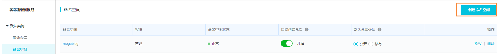
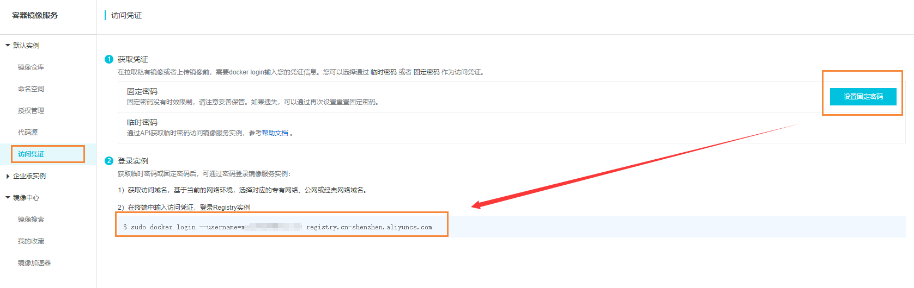
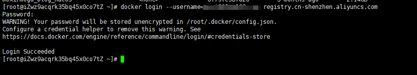
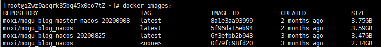
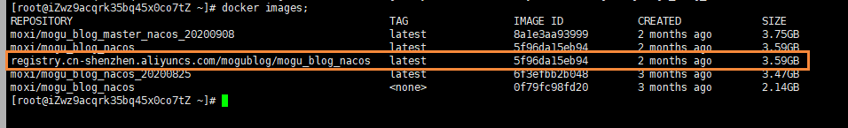
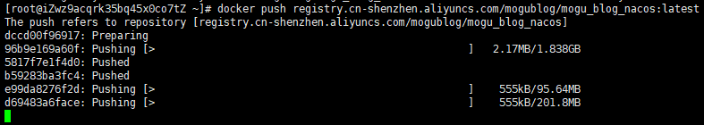

# 如何将镜像推送到阿里云容器镜像服务

## 前言

原来我都是将镜像推送到Dockerhub中的，因为Dockerhub是国外的软件，所以经常会各种超时的问题，这阵子研究了一下阿里云容器镜像服务，发现可以把一些常用的镜像推送到自己的容器镜像仓库里，然后就可以快速的进行拉取了~，所以我也打算将蘑菇博客的镜像也推送到阿里云，提高后面镜像拉取的速度。

## 阿里云容器镜像服务

首先我们需要开通 [阿里云容器镜像服务](https://cr.console.aliyun.com/cn-qingdao/instances/repositories) ，然后创建命名空间



这里我已经创建了一个 `mogublog`，创建完成后，我们需要到访问凭证设置我们的密码，然后复制 登录脚本



然后在我们的服务器登录docker进行测试

```bash
# 登录阿里云容器镜像服务
docker login --username=moxi****@163.com registry.cn-shenzhen.aliyuncs.com
```

登录成功



## 提交镜像

登录后，首先可以查看目前已经存在的镜像有哪些



我们就可以开始给镜像打tag了 【针对已经制作好的镜像打TAG】

```bash
# 格式
docker tag [ImageId] registry.cn-shenzhen.aliyuncs.com/mogublog/mogu_admin:[镜像版本号]
# 样例代码【如下】
docker tag 5f96da15eb94  registry.cn-shenzhen.aliyuncs.com/mogublog/mogu_blog_nacos:latest
```

如果你的镜像没有制作好，可以先制作镜像

```bash
# 查看容器ID
docker ps -a
# 提交镜像
docker commit -m "制作镜像" 容器ID registry.cn-shenzhen.aliyuncs.com/mogublog/mogu_blog_nacos:latest
```

打完tag后，我们就能够看到我们的镜像的tag了

```bash
docker images;
```



下面我们就可以提交到我们的阿里云仓库

```bash
docker push registry.cn-shenzhen.aliyuncs.com/mogublog/mogu_blog_nacos:latest
```



推送完成后，我们到阿里云容器服务仓库，即可看到我们刚刚提交的了


