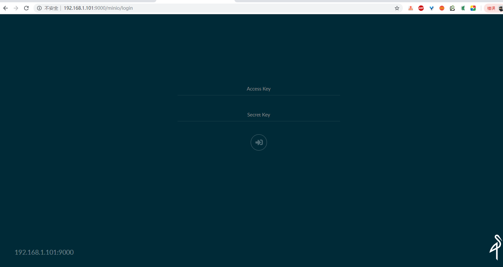
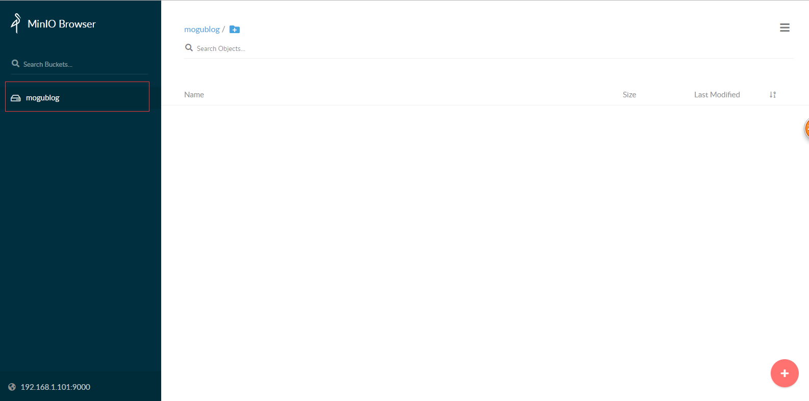
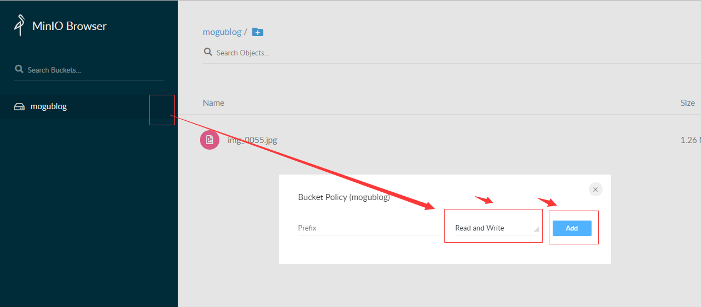

# 对象存储MinIO入门介绍

## 几种常见的对象存储方式

- 直接将图片保存到服务的硬盘
  - 优点：开发便捷，成本低
  - 缺点：扩容困难

- 使用分布式文件系统进行存储
  - 优点：容易实现扩容
  - 缺点：开发复杂度稍大（尤其是开发复杂的功能）

- 使用nfs做存储
  - 优点：开发较为便捷
  - 缺点：需要有一定的运维知识进行部署和维护

- 使用第三方的存储服务
  - 优点：开发简单，拥有强大功能，免维护
  - 缺点：付费

## 为何不采取FastDFs进行文件存储

我们前面使用分布式文件系统FastDFS简直不要太爽，但是有几个问题不知道大家发现没有

- 第一个就是FastDFS没有一个完善的官方文档，各种第三方文档满天飞。
- 第二个就是创建容器比较麻烦，要创建存储服务与跟踪服务.
- 第三个就是安全性问题

## 对象存储MinIO

MinIO是世界上最快的对象存储服务器，在标准硬件上，读写速度分贝为183GB/s 和 171GB/s，对象存储可以作为主要存储层，用于Spark，Presto，TensorFlow，H20.ai 以及替代产品等各种工作负载用于Hadoop HDFS

MinIO是一种高性能的分布式对象存储系统，它是软件定义的，可在行业标准硬件上运行，并且在Apache 2.0许可下，百分百开放源代码。

文档地址：https://docs.min.io/cn/

## 下载

我们使用的是Docker的方式安装MinIO，首先拉取对应的镜像

```bash
docker pull minio/minio
```

然后我们需要创建两个目录，用于保存我们的文件和配置

```bash
mkdir -p /home/minio/data
mkdir -p /home/minio/config
```

## 启动容器

然后我们启动我们的容器，后面有个目录，就是我们需要挂载的硬盘目录

```bash
docker run -p 9000:9000 --name minio \
-e "MINIO_ACCESS_KEY=mogu2018" \
--privileged=true \
-e "MINIO_SECRET_KEY=mogu2018" \
-v /home/minio/data:/data \
-v /home/minio/config:/root/.minio \
minio/minio server /data
```

运行成功后，我们就能看到我们下面的提示信息


## 访问

我们只需要访问上面提到的ip地址，就能够进入到我们的页面了

```bash
http://192.168.1.101:9000
```



会有一个不错的登录页面，我们输入刚刚配置的账号和密码  mogu2018  mogu2018 即可进入


## 创建bucket

我们首先需要创建一个桶，可以当成是一个目录，点击我们的右下角 加号 按钮，选择 create bucket进行创建

我们创建一个叫 mogublog 的桶，创建完成后，在侧边栏就能够看到我们刚刚创建的了



## 上传文件

然后我们选中我们的桶，在点击加号，选择 upload file进行文件上传


上传成功后，即可看到我们刚刚上传的文件列表了~

## SpringBoot整合MinIO

参考文档：Java Client API文档

### 修改权限

如果要使用SDK，比如Java客户端来操作我们的minio的话，那么我们还需要修改一下我们的bucket权限



首先点击我们的mogublog的右边区域，点击Edit policy，然后添加我们的权限为 可读可写，保存即可

### 添加依赖

```xml
<dependency>
    <groupId>io.minio</groupId>
    <artifactId>minio</artifactId>
    <version>7.0.2</version>
</dependency>
```

### 添加application.yml

```yml
server:
  port: 9001
spring:
  application:
    name: minio-application
  main:
    allow-bean-definition-overriding: true

minio:
  endpoint: http://192.168.1.101:9000
  accessKey: mogu2018
  secretKey: mogu2018
  bucketImageName: mogublog
```

### 添加配置文件

