# ElasticSearch安装与介绍

## Elastic Stack简介

如果你没有听说过Elastic Stack，那你一定听说过ELK，实际上ELK是三款软件的简称，分别是Elasticsearch、
Logstash、Kibana组成，在发展的过程中，又有新成员Beats的加入，所以就形成了Elastic Stack。所以说，ELK是旧的称呼，Elastic Stack是新的名字。

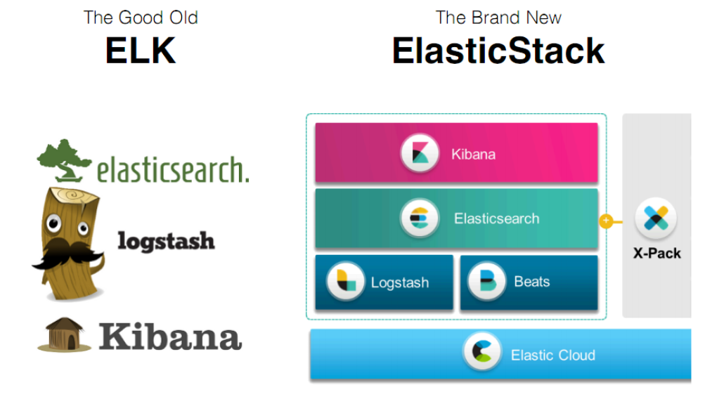

全系的Elastic Stack技术栈包括：


### Elasticsearch

Elasticsearch 基于java，是个开源分布式搜索引擎，它的特点有：分布式，零配置，自动发现，索引自动分片，索引副本机制，restful风格接口，多数据源，自动搜索负载等。

### Logstash

Logstash 基于java，是一个开源的用于收集,分析和存储日志的工具。

### Kibana

Kibana 基于nodejs，也是一个开源和免费的工具，Kibana可以为 Logstash 和 ElasticSearch 提供的日志分析友好的Web 界面，可以汇总、分析和搜索重要数据日志。

### Beats

Beats是elastic公司开源的一款采集系统监控数据的代理agent，是在被监控服务器上以客户端形式运行的数据收集器的统称，可以直接把数据发送给Elasticsearch或者通过Logstash发送给Elasticsearch，然后进行后续的数据分析活动。Beats由如下组成:

- Packetbeat：是一个网络数据包分析器，用于监控、收集网络流量信息，Packetbeat嗅探服务器之间的流量，解析应用层协议，并关联到消息的处理，其支 持ICMP (v4 and v6)、DNS、HTTP、Mysql、PostgreSQL、Redis、MongoDB、Memcache等协议；
- Filebeat：用于监控、收集服务器日志文件，其已取代 logstash forwarder；
- Metricbeat：可定期获取外部系统的监控指标信息，其可以监控、收集 Apache、HAProxy、MongoDB
  MySQL、Nginx、PostgreSQL、Redis、System、Zookeeper等服务；

> Beats和Logstash其实都可以进行数据的采集，但是目前主流的是使用Beats进行数据采集，然后使用 Logstash进行数据的分割处理等，早期没有Beats的时候，使用的就是Logstash进行数据的采集。

## ElasticSearch快速入门

### 简介

官网：https://www.elastic.co/

ElasticSearch是一个基于Lucene的搜索服务器。它提供了一个分布式多用户能力的全文搜索引擎，基于RESTful web接口。Elasticsearch是用Java开发的，并作为Apache许可条款下的开放源码发布，是当前流行的企业级搜索引擎。设计用于云计算中，能够达到实时搜索，稳定，可靠，快速，安装使用方便。

我们建立一个网站或应用程序，并要添加搜索功能，但是想要完成搜索工作的创建是非常困难的。我们希望搜索解决方案要运行速度快，我们希望能有一个零配置和一个完全免费的搜索模式，我们希望能够简单地使用JSON通过HTTP来索引数据，我们希望我们的搜索服务器始终可用，我们希望能够从一台开始并扩展到数百台，我们要实时搜索，我们要简单的多租户，我们希望建立一个云的解决方案。因此我们利用Elasticsearch来解决所有这些问题及可能出现的更多其它问题。

ElasticSearch是Elastic Stack的核心，同时Elasticsearch 是一个分布式、RESTful风格的搜索和数据分析引擎，能够解决不断涌现出的各种用例。作为Elastic Stack的核心，它集中存储您的数据，帮助您发现意料之中以及意料之外的情况。

### 前言

Elasticsearch的发展是非常快速的，所以在ES5.0之前，ELK的各个版本都不统一，出现了版本号混乱的状态，所以从5.0开始，所有Elastic Stack中的项目全部统一版本号。目前最新版本是6.5.4，我们将基于这一版本进行学习。


### 下载

到官网下载：https://www.elastic.co/cn/downloads/

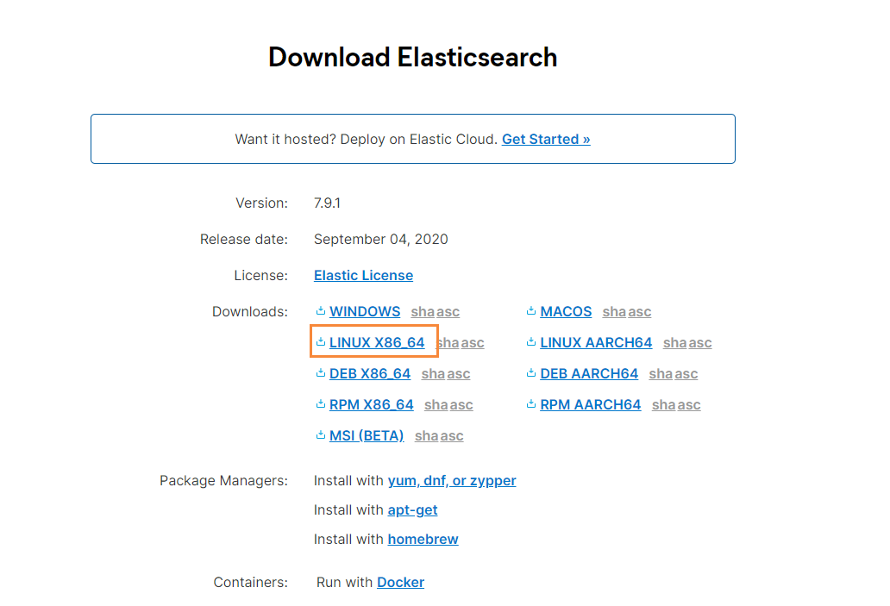

选择对应版本的数据，这里我使用的是Linux来进行安装，所以就先下载好ElasticSearch的Linux安装包

### 拉取Docker容器

因为我们需要部署在Linux下，为了以后迁移ElasticStack环境方便，我们就使用Docker来进行部署，首先我们拉取一个带有ssh的centos docker镜像

```bash
# 拉取镜像
docker pull moxi/centos_ssh
# 制作容器
docker run --privileged -d -it -h ElasticStack --name ElasticStack -p 11122:22 -p 9200:9200 -p 5601:5601 -p 9300:9300 -v /etc/localtime:/etc/localtime:ro  moxi/centos_ssh /usr/sbin/init
```

然后直接远程连接11122端口即可

### 单机版安装

因为ElasticSearch不支持Root用户直接操作，因此我们需要创建一个elsearch用户

```bash
# 添加新用户
useradd elsearch

# 创建一个soft目录，存放下载的软件
mkdir /soft

# 进入，然后通过xftp工具，将刚刚下载的文件拖动到该目录下
cd /soft

# 解压缩
tar -zxvf elasticsearch-7.9.1-linux-x86_64.tar.gz

#重命名
mv elasticsearch-7.9.1/ elsearch
```

因为刚刚我们是使用root用户操作的，所以我们还需要更改一下/soft文件夹的所属，改为elsearch用户

```bash
chown elsearch:elsearch /soft/ -R
```

然后在切换成elsearch用户进行操作

```bash
# 切换用户
su - elsearch
```

然后我们就可以对我们的配置文件进行修改了

```bash
# 进入到 elsearch下的config目录
cd /soft/elsearch/config
```

然后找到下面的配置

```yaml
#打开配置文件
vim elasticsearch.yml 

#设置ip地址，任意网络均可访问
network.host: 0.0.0.0 
```

在Elasticsearch中如果，network.host不是localhost或者127.0.0.1的话，就会认为是生产环境，会对环境的要求比较高，我们的测试环境不一定能够满足，一般情况下需要修改2处配置，如下：

```bash
# 修改jvm启动参数
vim conf/jvm.options

#根据自己机器情况修改
-Xms128m 
-Xmx128m
```

然后在修改第二处的配置，这个配置要求我们到宿主机器上来进行配置

```bash
# 到宿主机上打开文件
vim /etc/sysctl.conf
# 增加这样一条配置，一个进程在VMAs(虚拟内存区域)创建内存映射最大数量
vm.max_map_count=655360
# 让配置生效
sysctl -p
```

### 启动ElasticSearch

首先我们需要切换到 elsearch用户

```bash
su - elsearch
```

然后在到bin目录下，执行下面

```bash
# 进入bin目录
cd /soft/elsearch/bin
# 后台启动
./elasticsearch -d
```

启动成功后，访问下面的URL

```bash
http://202.193.56.222:9200/
```

如果出现了下面的信息，就表示已经成功启动了


如果你在启动的时候，遇到过问题，那么请参考下面的错误分析~

## 错误分析

### 错误情况1

如果出现下面的错误信息

```
java.lang.RuntimeException: can not run elasticsearch as root
	at org.elasticsearch.bootstrap.Bootstrap.initializeNatives(Bootstrap.java:111)
	at org.elasticsearch.bootstrap.Bootstrap.setup(Bootstrap.java:178)
	at org.elasticsearch.bootstrap.Bootstrap.init(Bootstrap.java:393)
	at org.elasticsearch.bootstrap.Elasticsearch.init(Elasticsearch.java:170)
	at org.elasticsearch.bootstrap.Elasticsearch.execute(Elasticsearch.java:161)
	at org.elasticsearch.cli.EnvironmentAwareCommand.execute(EnvironmentAwareCommand.java:86)
	at org.elasticsearch.cli.Command.mainWithoutErrorHandling(Command.java:127)
	at org.elasticsearch.cli.Command.main(Command.java:90)
	at org.elasticsearch.bootstrap.Elasticsearch.main(Elasticsearch.java:126)
	at org.elasticsearch.bootstrap.Elasticsearch.main(Elasticsearch.java:92)
For complete error details, refer to the log at /soft/elsearch/logs/elasticsearch.log
[root@e588039bc613 bin]# 2020-09-22 02:59:39,537121 UTC [536] ERROR CLogger.cc@310 Cannot log to named pipe /tmp/elasticsearch-5834501324803693929/controller_log_381 as it could not be opened for writing
2020-09-22 02:59:39,537263 UTC [536] INFO  Main.cc@103 Parent process died - ML controller exiting
```

就说明你没有切换成 elsearch用户，因为不能使用root操作es

```bash
su - elsearch
```

### 错误情况2

```bash
[1]:max file descriptors [4096] for elasticsearch process is too low, increase to at least[65536]
```

解决方法：切换到root用户，编辑limits.conf添加如下内容

```bash
vi /etc/security/limits.conf

# ElasticSearch添加如下内容:
* soft nofile 65536
* hard nofile 131072
* soft nproc 2048
* hard nproc 4096
```

### 错误情况3

```bash
[2]: max number of threads [1024] for user [elsearch] is too low, increase to at least
[4096]
```

也就是最大线程数设置的太低了，需要改成4096

```bash
#解决：切换到root用户，进入limits.d目录下修改配置文件。
vi /etc/security/limits.d/90-nproc.conf
#修改如下内容：
* soft nproc 1024
#修改为
* soft nproc 4096
```

### 错误情况4

```bash
[3]: system call filters failed to install; check the logs and fix your configuration
or disable system call filters at your own risk
```

解决：Centos6不支持SecComp，而ES5.2.0默认bootstrap.system_call_filter为true

```bash
vim config/elasticsearch.yml
# 添加
bootstrap.system_call_filter: false
bootstrap.memory_lock: false
```

### 错误情况5

```bash
[elsearch@e588039bc613 bin]$ Exception in thread "main" org.elasticsearch.bootstrap.BootstrapException: java.nio.file.AccessDeniedException: /soft/elsearch/config/elasticsearch.keystore
Likely root cause: java.nio.file.AccessDeniedException: /soft/elsearch/config/elasticsearch.keystore
	at java.base/sun.nio.fs.UnixException.translateToIOException(UnixException.java:90)
	at java.base/sun.nio.fs.UnixException.rethrowAsIOException(UnixException.java:111)
	at java.base/sun.nio.fs.UnixException.rethrowAsIOException(UnixException.java:116)
	at java.base/sun.nio.fs.UnixFileSystemProvider.newByteChannel(UnixFileSystemProvider.java:219)
	at java.base/java.nio.file.Files.newByteChannel(Files.java:375)
	at java.base/java.nio.file.Files.newByteChannel(Files.java:426)
	at org.apache.lucene.store.SimpleFSDirectory.openInput(SimpleFSDirectory.java:79)
	at org.elasticsearch.common.settings.KeyStoreWrapper.load(KeyStoreWrapper.java:220)
	at org.elasticsearch.bootstrap.Bootstrap.loadSecureSettings(Bootstrap.java:240)
	at org.elasticsearch.bootstrap.Bootstrap.init(Bootstrap.java:349)
	at org.elasticsearch.bootstrap.Elasticsearch.init(Elasticsearch.java:170)
	at org.elasticsearch.bootstrap.Elasticsearch.execute(Elasticsearch.java:161)
	at org.elasticsearch.cli.EnvironmentAwareCommand.execute(EnvironmentAwareCommand.java:86)
	at org.elasticsearch.cli.Command.mainWithoutErrorHandling(Command.java:127)
	at org.elasticsearch.cli.Command.main(Command.java:90)
	at org.elasticsearch.bootstrap.Elasticsearch.main(Elasticsearch.java:126)
	at org.elasticsearch.bootstrap.Elasticsearch.main(Elasticsearch.java:92)

```

我们通过排查，发现是因为 /soft/elsearch/config/elasticsearch.keystore 存在问题


也就是说该文件还是所属于root用户，而我们使用elsearch用户无法操作，所以需要把它变成elsearch

```bash
chown elsearch:elsearch elasticsearch.keystore
```

### 错误情况6

```bash
[1]: the default discovery settings are unsuitable for production use; at least one of [discovery.seed_hosts, discovery.seed_providers, cluster.initial_master_nodes] must be configured
ERROR: Elasticsearch did not exit normally - check the logs at /soft/elsearch/logs/elasticsearch.log
```

继续修改配置 elasticsearch.yaml

```bash
# 取消注释，并保留一个节点
node.name: node-1
cluster.initial_master_nodes: ["node-1"]
```


## ElasticSearchHead可视化工具

由于ES官方没有给ES提供可视化管理工具，仅仅是提供了后台的服务，elasticsearch-head是一个为ES开发的一个页面客户端工具，其源码托管于Github，地址为 [传送门](https://github.com/mobz/elasticsearch-head)

head提供了以下安装方式

- 源码安装，通过npm run start启动（不推荐）
- 通过docker安装（推荐）
- 通过chrome插件安装（推荐）
- 通过ES的plugin方式安装（不推荐）

### 通过Docker方式安装

```bash
#拉取镜像
docker pull mobz/elasticsearch-head:5
#创建容器
docker create --name elasticsearch-head -p 9100:9100 mobz/elasticsearch-head:5
#启动容器
docker start elasticsearch-head
```

通过浏览器进行访问：


注意：
由于前后端分离开发，所以会存在跨域问题，需要在服务端做CORS的配置，如下：

```bash
vim elasticsearch.yml

http.cors.enabled: true http.cors.allow-origin: "*"
```

通过chrome插件的方式安装不存在该问题

### 通过Chrome插件安装

打开chrome的应用商店，即可安装 https://chrome.google.com/webstore/detail/elasticsearch-head/ffmkiejjmecolpfloofpjologoblkegm


我们也可以新建索引

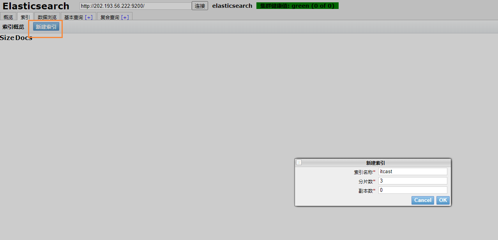

建议：推荐使用chrome插件的方式安装，如果网络环境不允许，就采用其它方式安装。

## ElasticSearch中的基本概念

### 索引

- 索引（index）是Elasticsearch对逻辑数据的逻辑存储，所以它可以分为更小的部分。
- 可以把索引看成关系型数据库的表，索引的结构是为快速有效的全文索引准备的，特别是它不存储原始值。
- Elasticsearch可以把索引存放在一台机器或者分散在多台服务器上，每个索引有一或多个分片（shard），每个分片可以有多个副本（replica）。

### 文档

- 存储在Elasticsearch中的主要实体叫文档（document）。用关系型数据库来类比的话，一个文档相当于数据库表中的一行记录。
- Elasticsearch和MongoDB中的文档类似，都可以有不同的结构，但Elasticsearch的文档中，相同字段必须有相同类型。
- 文档由多个字段组成，每个字段可能多次出现在一个文档里，这样的字段叫多值字段（multivalued）。
  每个字段的类型，可以是文本、数值、日期等。字段类型也可以是复杂类型，一个字段包含其他子文档或者数
  组。

### 映射

所有文档写进索引之前都会先进行分析，如何将输入的文本分割为词条、哪些词条又会被过滤，这种行为叫做
映射（mapping）。一般由用户自己定义规则。

### 文档类型

- 在Elasticsearch中，一个索引对象可以存储很多不同用途的对象。例如，一个博客应用程序可以保存文章和评
  论。
- 每个文档可以有不同的结构。
- 不同的文档类型不能为相同的属性设置不同的类型。例如，在同一索引中的所有文档类型中，一个叫title的字段必须具有相同的类型。

## RESTful API

在Elasticsearch中，提供了功能丰富的RESTful API的操作，包括基本的CRUD、创建索引、删除索引等操作。

### 创建非结构化索引

在Lucene中，创建索引是需要定义字段名称以及字段的类型的，在Elasticsearch中提供了非结构化的索引，就是不需要创建索引结构，即可写入数据到索引中，实际上在Elasticsearch底层会进行结构化操作，此操作对用户是透明的。

### 创建空索引

```bash
PUT /haoke
{
    "settings": {
        "index": {
        "number_of_shards": "2", #分片数
        "number_of_replicas": "0" #副本数
        }
    }
}
```

### 删除索引

```bash
#删除索引
DELETE /haoke
{
	"acknowledged": true
}
```

### 插入数据

>URL规则：
>POST /{索引}/{类型}/{id}

```bash
POST /haoke/user/1001
#数据
{
"id":1001,
"name":"张三",
"age":20,
"sex":"男"
}
```

使用postman操作成功后

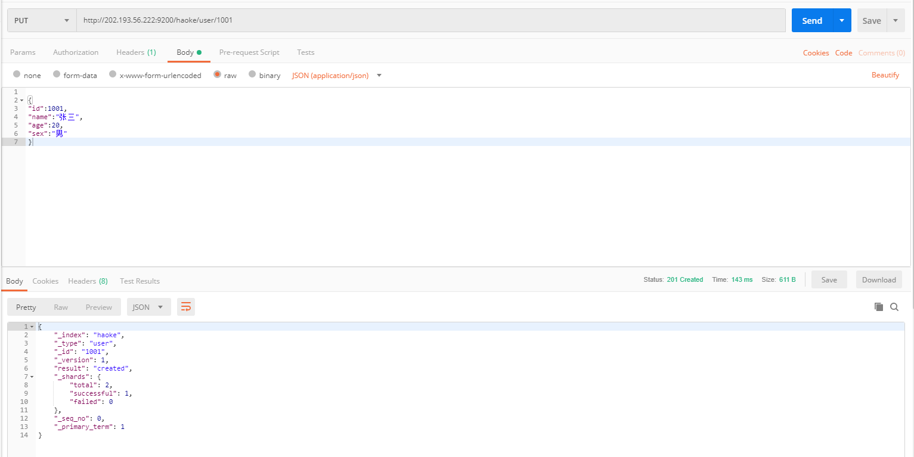

我们通过ElasticSearchHead进行数据预览就能够看到我们刚刚插入的数据了


说明：非结构化的索引，不需要事先创建，直接插入数据默认创建索引。不指定id插入数据：

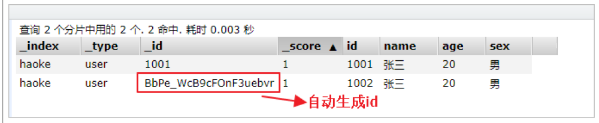

### 更新数据

在Elasticsearch中，文档数据是不为修改的，但是可以通过覆盖的方式进行更新。

```bash
PUT /haoke/user/1001
{
"id":1001,
"name":"张三",
"age":21,
"sex":"女"
}
```

更新结果如下：


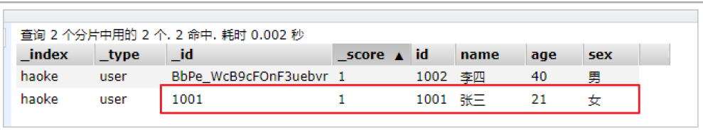

可以看到数据已经被覆盖了。问题来了，可以局部更新吗？ -- 可以的。前面不是说，文档数据不能更新吗？ 其实是这样的：在内部，依然会查询到这个文档数据，然后进行覆盖操作，步骤如下：

1. 从旧文档中检索JSON
2. 修改它
3. 删除旧文档
4. 索引新文档

```bash
#注意：这里多了_update标识
POST /haoke/user/1001/_update
{
"doc":{
"age":23
}
}
```

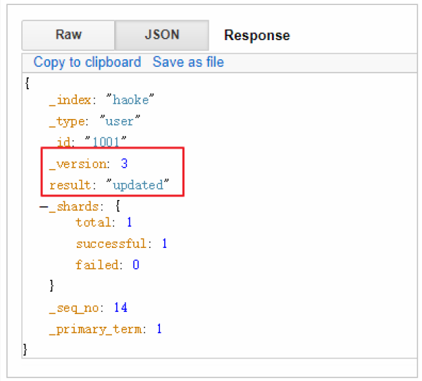

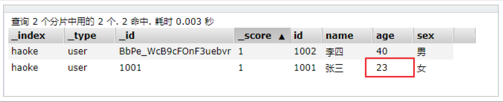

可以看到，数据已经是局部更新了

### 删除索引

在Elasticsearch中，删除文档数据，只需要发起DELETE请求即可，不用额外的参数

```bash
DELETE 1 /haoke/user/1001
```


需要注意的是，result表示已经删除，version也增加了。

如果删除一条不存在的数据，会响应404

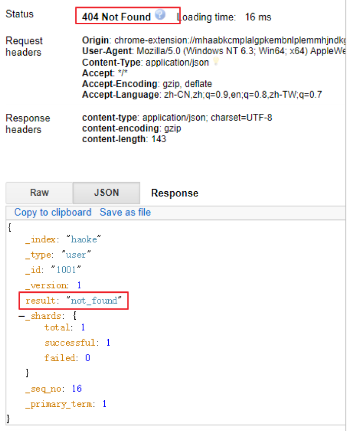

> 删除一个文档也不会立即从磁盘上移除，它只是被标记成已删除。Elasticsearch将会在你之后添加更多索引的时候才会在后台进行删除内容的清理。【相当于批量操作】

### 搜索数据

#### 根据id搜索数据

```bash
GET /haoke/user/BbPe_WcB9cFOnF3uebvr
#返回的数据如下
{
    "_index": "haoke",
    "_type": "user",
    "_id": "BbPe_WcB9cFOnF3uebvr",
    "_version": 8,
    "found": true,
    "_source": { #原始数据在这里
        "id": 1002,
        "name": "李四",
        "age": 40,
        "sex": "男"
        }
}
```

#### 搜索全部数据

```bash
GET 1 /haoke/user/_search
```

注意，使用查询全部数据的时候，默认只会返回10条


#### 关键字搜索数据

```bash
#查询年龄等于20的用户
GET /haoke/user/_search?q=age:20
```

结果如下：


### DSL搜索

Elasticsearch提供丰富且灵活的查询语言叫做DSL查询(Query DSL),它允许你构建更加复杂、强大的查询。
DSL(Domain Specific Language特定领域语言)以JSON请求体的形式出现。

```bash
POST /haoke/user/_search
#请求体
{
    "query" : {
        "match" : { #match只是查询的一种
        	"age" : 20
        }
    }
}
```

实现：查询年龄大于30岁的男性用户。

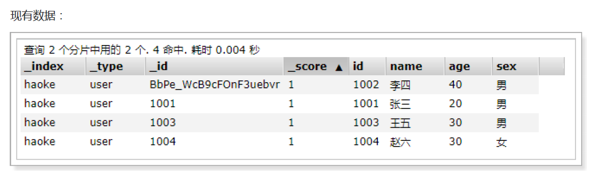

```bash
POST /haoke/user/_search
#请求数据
{
    "query": {
        "bool": {
            "filter": {
                    "range": {
                        "age": {
                        "gt": 30
                    }
                }
            },
            "must": {
                "match": {
                	"sex": "男"
                }
            }
        }
    }
}
```

查询出来的结果


#### 全文搜索

```bash
POST /haoke/user/_search
#请求数据
{
    "query": {
        "match": {
        	"name": "张三 李四"
        }
    }
}
```


高亮显示，只需要在添加一个 highlight即可

```bash
POST /haoke/user/_search
#请求数据
{
    "query": {
        "match": {
        	"name": "张三 李四"
        }
    }
    "highlight": {
        "fields": {
        	"name": {}
        }
    }
}
```

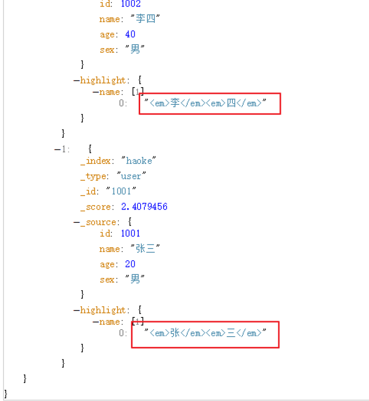

#### 聚合

在Elasticsearch中，支持聚合操作，类似SQL中的group by操作。

```bash
POST /haoke/user/_search
{
    "aggs": {
        "all_interests": {
            "terms": {
                "field": "age"
            }
        }
    }
}
```

结果如下，我们通过年龄进行聚合


从结果可以看出，年龄30的有2条数据，20的有一条，40的一条。

## ElasticSearch核心详解

### 文档

在Elasticsearch中，文档以JSON格式进行存储，可以是复杂的结构，如：

```bash
{
    "_index": "haoke",
    "_type": "user",
    "_id": "1005",
    "_version": 1,
    "_score": 1,
    "_source": {
        "id": 1005,
        "name": "孙七",
        "age": 37,
        "sex": "女",
        "card": {
            "card_number": "123456789"
         }
    }
}
```

其中，card是一个复杂对象，嵌套的Card对象

### 元数据（metadata）

一个文档不只有数据。它还包含了元数据(metadata)——关于文档的信息。三个必须的元数据节点是：

