# Logstash入门简介

## 介绍

Logstash是一个开源的服务器端数据处理管道，能够同时从多个来源采集数据，转换数据，然后将数据发送到最喜欢的存储库中（我们的存储库当然是ElasticSearch）

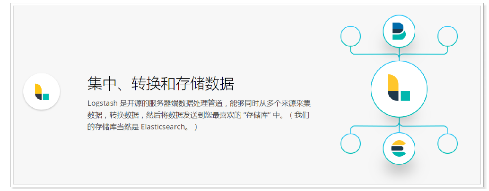

我们回到我们ElasticStack的架构图，可以看到Logstash是充当数据处理的需求的，当我们的数据需要处理的时候，会将它发送到Logstash进行处理，否则直接送到ElasticSearch中


## 用途

Logstash可以处理各种各样的输入，从文档，图表中=，数据库中，然后处理完后，发送到

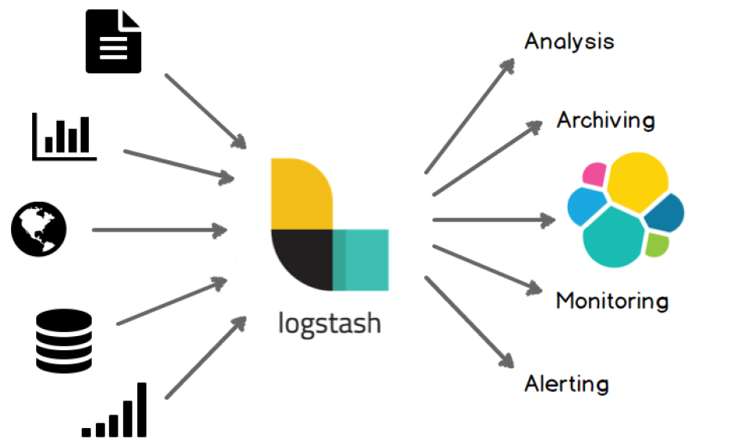

## 部署安装

Logstash主要是将数据源的数据进行一行一行的处理，同时还直接过滤切割等功能。

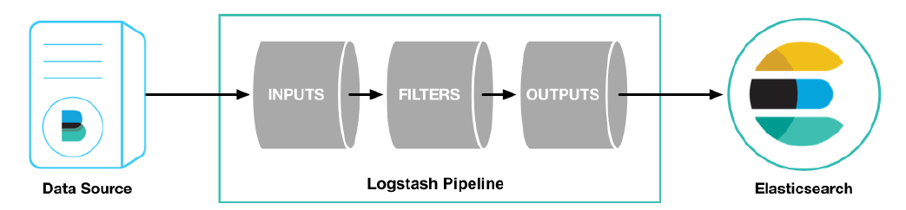

首先到官网下载logstash：https://www.elastic.co/cn/downloads/logstash

选择我们需要下载的版本：

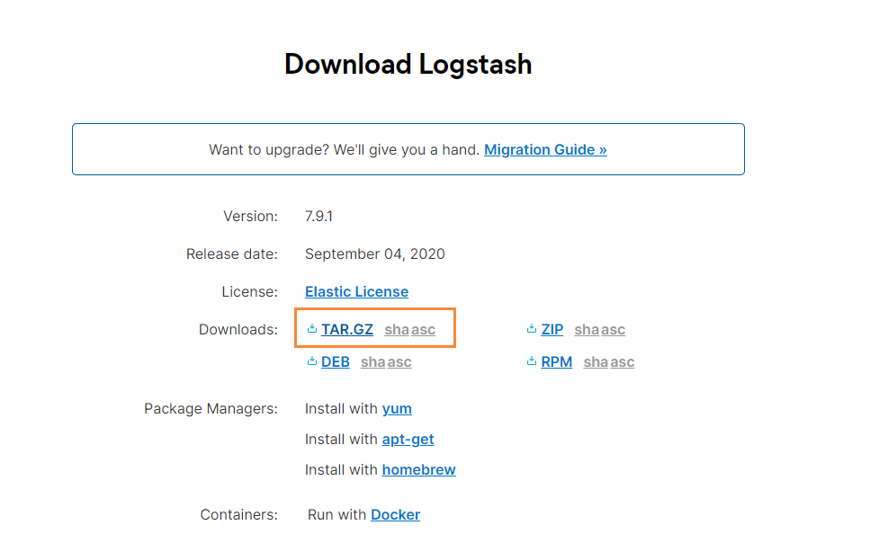

下载完成后，使用xftp工具，将其丢入到服务器中

```bash
#检查jdk环境，要求jdk1.8+
java -version

#解压安装包
tar -xvf logstash-7.9.1.tar.gz

#第一个logstash示例
bin/logstash -e 'input { stdin { } } output { stdout {} }'
```

其实原来的logstash的作用，就是为了做数据的采集，但是因为logstash的速度比较慢，所以后面使用beats来代替了Logstash，当我们使用上面的命令进行启动的时候，就可以发现了，因为logstash使用java写的，首先需要启动虚拟机，最后下图就是启动完成的截图

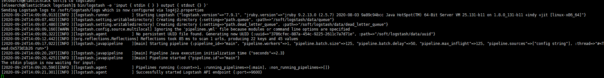

## 测试

我们在控制台输入 hello，马上就能看到它的输出信息

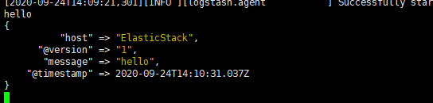

## 配置详解

Logstash的配置有三部分，如下所示

```bash
input { #输入
stdin { ... } #标准输入
}
filter { #过滤，对数据进行分割、截取等处理
...
}
output { #输出
stdout { ... } #标准输出
}
```

### 输入

- 采集各种样式、大小和来源的数据，数据往往以各种各样的形式，或分散或集中地存在于很多系统中。
- Logstash 支持各种输入选择 ，可以在同一时间从众多常用来源捕捉事件。能够以连续的流式传输方式，轻松地从您的日志、指标、Web 应用、数据存储以及各种 AWS 服务采集数据。

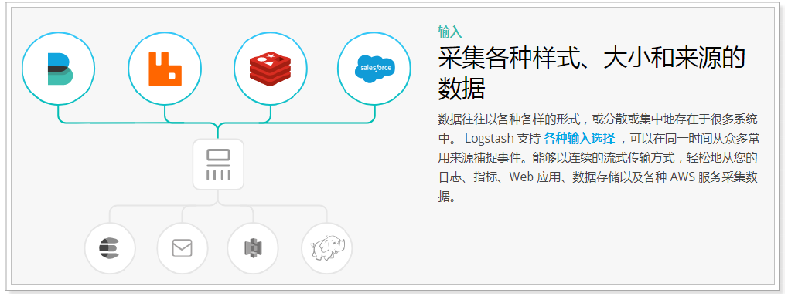

### 过滤

- 实时解析和转换数据
- 数据从源传输到存储库的过程中，Logstash 过滤器能够解析各个事件，识别已命名的字段以构建结构，并将它们转换成通用格式，以便更轻松、更快速地分析和实现商业价值。

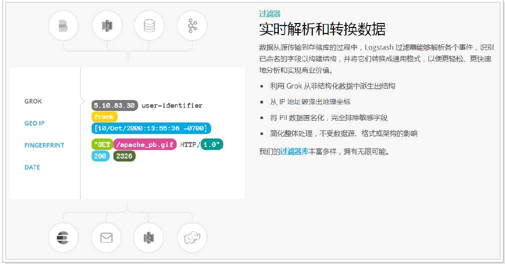

### 输出

Logstash 提供众多输出选择，您可以将数据发送到您要指定的地方，并且能够灵活地解锁众多下游用例。

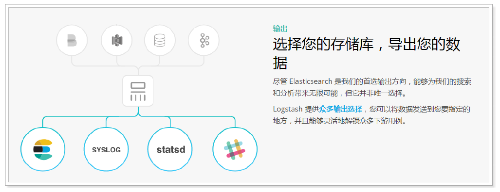

## 读取自定义日志

前面我们通过Filebeat读取了nginx的日志，如果是自定义结构的日志，就需要读取处理后才能使用，所以，这个时候就需要使用Logstash了，因为Logstash有着强大的处理能力，可以应对各种各样的场景。

### 日志结构

```bash
2019-03-15 21:21:21|ERROR|1 读取数据出错|参数：id=1002
```

可以看到，日志中的内容是使用“|”进行分割的，使用，我们在处理的时候，也需要对数据做分割处理。

### 编写配置文件

```bash
vim mogublog-pipeline.conf
```

然后添加如下内容

```bash
input {
    file {
        path => "/soft/beats/logs/app.log"
        start_position => "beginning"
    }
}
filter {
    mutate {
    	split => {"message"=>"|"}
    }
}
output {
	stdout { codec => rubydebug }
}
```

启动

```bash
#启动
./bin/logstash -f ./mogublog-pipeline.conf
```

然后我们就插入我们的测试数据

```bash
echo "2019-03-15 21:21:21|ERROR|读取数据出错|参数：id=1002" >> app.log
```

然后我们就可以看到logstash就会捕获到刚刚我们插入的数据，同时我们的数据也被分割了

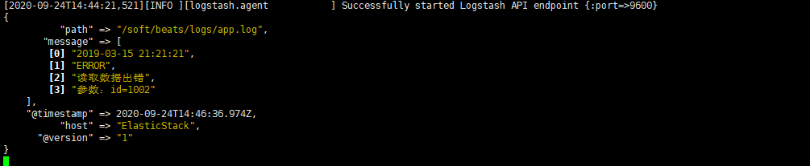

### 输出到Elasticsearch

我们可以修改我们的配置文件，将我们的日志记录输出到ElasticSearch中

```bash
input {
    file {
        path => "/soft/beats/logs/app.log"
        start_position => "beginning"
    }
}
filter {
    mutate {
    	split => {"message"=>"|"}
    }
}
output {
	elasticsearch {
		hosts => ["127.0.0.1:9200"]
	}
}
```

然后在重启我们的logstash

```bash
./bin/logstash -f ./mogublog-pipeline.conf
```

然后向日志记录中，插入两条数据

```bash
echo "2019-03-15 21:21:21|ERROR|读取数据出错|参数：id=1002" >> app.log
echo "2019-03-15 21:21:21|ERROR|读取数据出错|参数：id=1002" >> app.log
```

最后就能够看到我们刚刚插入的数据了

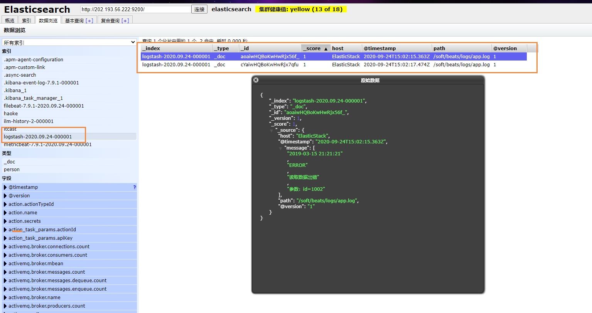