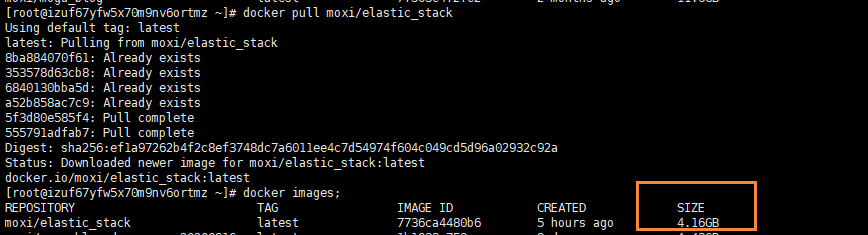
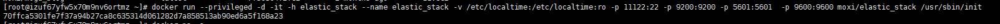
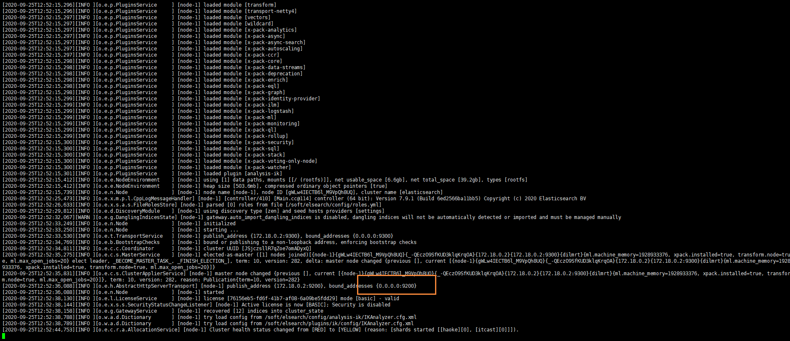
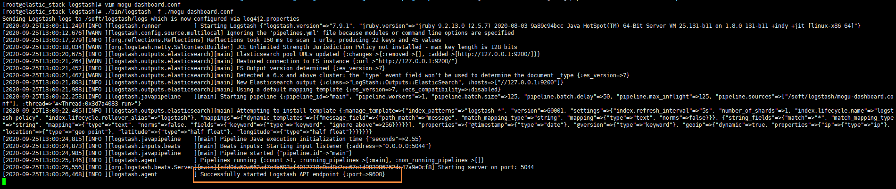
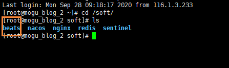
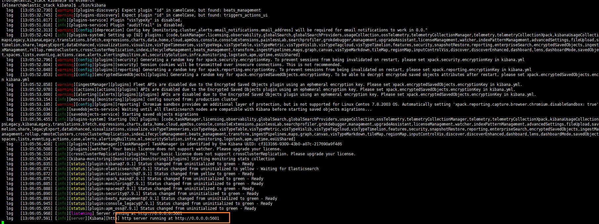
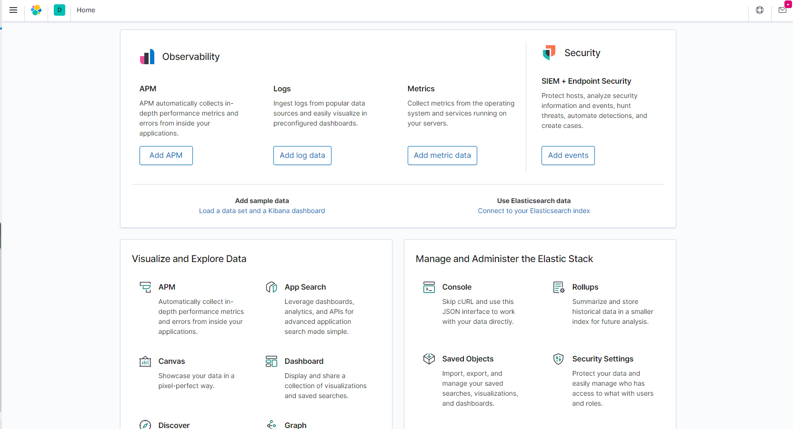

# 使用ELK搭建蘑菇博客日志收集

## 前言

前阵子学习了ElasticStack的技术栈，其中包括ElasticSearch 、Beats、Kibana、Logstash。因为打算将其用于蘑菇博客的项目中，关于ElasticStack的技术栈学习，可以参考前面写的博客~

- [ElasticSearch介绍与安装](../1_ElasticSearch介绍与安装/README.md)
- [Beats入门简介](../2_Beats入门简介/README.md)
- [Kibana安装与介绍](../3_Kibana安装与介绍/README.md)
- [Logstash入门简介](../4_Logstash入门简介/README.md)
- [ElasticStack综合案例](../5_ElasticStack综合案例/README.md)

## 拉取ElasticStack镜像

通过本教程，可以非常方便的给蘑菇博客项目，集成ELK用于分布式日志收集

为了更加方便的部署ELK环境，我已经提前将环境打包成了Docker镜像，发布到了DockerHub中，所以我们只需要拉取我提前制作的ElasticStack镜像即可

```bash
# 拉取镜像
docker pull moxi/elastic_stack

# 查看镜像
docker images;
```

拉取完成后，查看我们的镜像信息，容量大概在4.16G左右



## 制作容器

在我们拉取完成后，就可以开始通过镜像制作我们的ElasticStack容器了

```bash
docker run --privileged -d -it -h elastic_stack --name elastic_stack -v /etc/localtime:/etc/localtime:ro -p 11122:22 -p 9200:9200 -p 5601:5601  -p 5044:5044 -p 9600:9600 moxi/elastic_stack /usr/sbin/init
```

其中这里主要使用的端口号有

- 11122：用于建立ssh连接内部容器
- 9200：ElasticSearch默认端口号
- 5601：Kibana默认端口号
- 5044：Logstash默认端口号

执行完上面的命令后，如果没有错误，那么就代表执行成功



然后我们就可以通过在启动一个xshell窗口，连接我们的容器了


输入你服务器的ip地址，以及端口号为 11122，然后点击确定，然后在输入服务器的账号和密码

- 账号：root
- 密码：mogu2018

即可进入到我们的容器内部，我们到/soft目录下，能看到里面安装的软件


- ElasticSearch：分布式搜索引擎
- jdk：java1.8
- kibana：图形化工具
- logstash：用于数据的过滤和处理

## 启动ElasticSearch

因为ElasticSearch的启动配置要求比较高，所以我们需要修改一些配置，首先我们到宿主机【是刚刚安装Docker的机器，不是现在容器里面！！】

```bash
# 到宿主机上打开文件
vim /etc/sysctl.conf

# 增加这样一条配置，一个进程在VMAs(虚拟内存区域)创建内存映射最大数量
vm.max_map_count=655360

# 让配置生效
sysctl -p
```

然后再去启动ElasticSearch，因为ElasticSearch不能使用root用户直接启动，所以我们需要切换到elsearch

```bash
# 切换用户
su elsearch

# 进入到ElasticSearch目录
cd elsearch

# 启动
./bin/elasticsearch

# 后台启动
./bin/elasticsearch -d
```

启动完成后，我们就可以看到ElasticSearch运行在9200端口上



我们输入下面的地址到浏览器中访问

```bash
http://your_ip:9200/
```

如果出现下面的内容，表示ElasticSearch服务已经正常启动~


## 启动Logstash

Logstash的作用就是收集Beats发送过来的数据，然后进行处理，处理完成后，在将其推送到ElasticSearch中，如果需要查看更多的关于Logstash，可以跳转到上面提到的博客中

我们首先到Logstash目录

```bash
cd /soft/logstash
```

然后我们可以查看配置文件

```bash
vim mogu-dashboard.conf
```

可以看到我之前配置的信息

```bash
input {
        beats {
                port => "5044"
        }
}
filter {
        mutate {
                split => {"message"=>"|"}
        }
        mutate {
                add_field => {
                "userId" => "%{[message][1]}"
                "visit" => "%{[message][2]}"
                "date" => "%{[message][3]}"
                }
        }
        mutate {
                convert => {
                "userId" => "integer"
                "visit" => "string"
                "date" => "string"
                }
        }
        mutate {
           remove_field => [ "host" ]
        }
}
#output {
# stdout { codec => rubydebug }
#}

output {
    if [from] == 'mogu_web' {
        elasticsearch {
          hosts => ["127.0.0.1:9200"]
          index => "logstash_mogu_web_%{+YYYY.MM.dd}"
        }
    }

    if [from] == "mogu_admin" {
        elasticsearch {
          hosts => ["127.0.0.1:9200"]
          index => "logstash_mogu_admin_%{+YYYY.MM.dd}"
        }
    }

    if [from] == "mogu_sms" {
        elasticsearch {
          hosts => ["127.0.0.1:9200"]
          index => "logstash_mogu_sms_%{+YYYY.MM.dd}"
        }
    }

    if [from] == "mogu_picture" {
        elasticsearch {
          hosts => ["127.0.0.1:9200"]
          index => "logstash_mogu_picture_%{+YYYY.MM.dd}"
        }
    }
    
    if [from] == "mogu_nginx" {
        elasticsearch {
          hosts => ["127.0.0.1:9200"]
          index => "logstash_mogu_nginx_%{+YYYY.MM.dd}"
        }
    }
}

```

> 我们可以通过获取到传递过来的from字段，就是在filebeat时候指定的 一个字段，代表是这条日志属于哪个模块的，然后在根据logstash的if判断，然后生成不同的ElasticSearch索引


下面，我们指定该配置文件后，然后启动项目

```bash
# 前台启动
./bin/logstash -f ./mogu-dashboard.conf

# 后台启动
nohup ./bin/logstash -f ./mogu-dashboard.conf  > catalina.out  2>&1 &
```

注意：logstash的启动可能会比较慢，需要耐心的等待一会~



启动完成后，会占用9600端口~，同时经过logstash的数据都会发送到ElasticSearch中

## 启动Beats

### 启动filebeat

filebeat是一个轻量级的日志文件收集器，主要用于收集我们的一些日志文件【它和应用服务器存放在一起】

> 需要注意，Beats不在我们ELK服务器上进行启动了，我们需要到部署蘑菇博客的服务器上，然后找到Beats目录



我们首先需要到我们应用服务器中，然后启动filebeats 【如果你的目录下没有，可以参考 [Beats入门简介](../2_Beats入门简介/README.md) 安装】

```bash
# 进入到filebeat目录
cd /soft/beats/filebeat
```

然后查看我们的配置文件

```bash
vim mogu-dashboard.yml
```

然后修改我们配置文件中logstash的地址，我们要把它改成刚刚部署的logstash服务器的ip即可

```bash
filebeat.inputs:
- type: log
  enabled: true
  paths:
    - /home/mogu_blog/mogu_web/catalina.out
  fields:
    from: mogu_web
  fields_under_root: true

- type: log
  enabled: true
  paths:
    - /home/mogu_blog/mogu_admin/catalina.out
  fields:
    from: mogu_admin
  fields_under_root: true

- type: log
  enabled: true
  paths:
    - /home/mogu_blog/mogu_sms/catalina.out
  fields:
    from: mogu_sms
  fields_under_root: true

- type: log
  enabled: true
  paths:
    - /home/mogu_blog/mogu_picture/catalina.out
  fields:
    from: mogu_picture
  fields_under_root: true

setup.template.settings:
  index.number_of_shards: 1
output.logstash:
  hosts: ["101.132.122.175:5044"]
```

然后启动我们的filebeat

```bash
# 前台启动
./filebeat -e -c mogu-dashboard.yml

# 后台启动
#!/bin/bash 
nohup ./filebeat -e -c mogu-dashboard.yml > catalina.out  2>&1 &
```

启动完成后，我们能够看到日志文件已经被加载


## 启动Kibana

Kibana的作用就是对我们的数据进行图形化的显示，首先我们到Kibana目录 【回到ELK目录下】

```bash
# 到kibana安装目录
cd /soft/kibana
```

因为Kibana和ElasticSearch一样，不支持root用户启动，所以我们继续切换成elsearch用户

```bash
su elsearch
```

然后启动

```bash
./bin/kibana
```

查看启动信息，我们发现Kibana启动在5601端口号



启动后，我们在浏览器中访问我们的地址

```bash
http://your_ip:5601
```




我们找到dashboard就可以看到蘑菇博客的日志记录了


> tip：这里就只介绍了ElasticStack的日志收集，关于更多的Kibana图形化页面，小伙伴可以参考其它文件进行配置，这里就不列举出来啦~