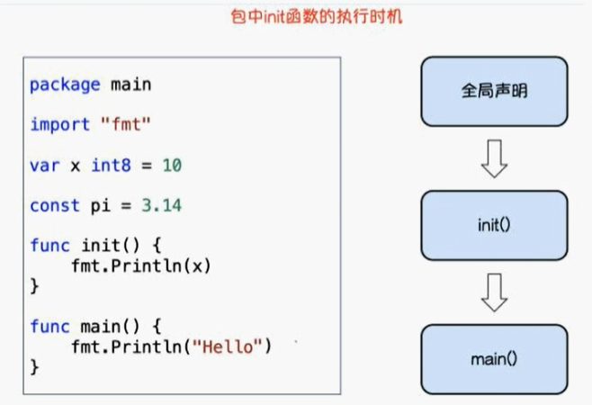
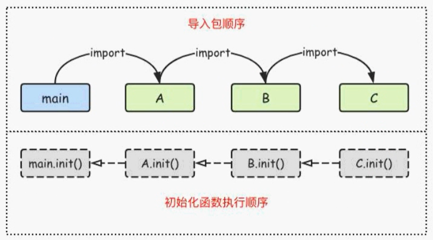

# Go中的包

## Go中的包的介绍和定义

包（package）是多个Go源码的集合，是一种高级的代码复用方案，Go语言为我们提供了很多内置包，如fmt、strconv、strings、sort、errors、time、encoding/json、os、io等。

Golang中的包可以分为三种：1、系统内置包   2、自定义包   3、第三方包

- **系统内置包**：Golang 语言给我们提供的内置包，引入后可以直接使用，如fmt、strconv、strings、sort、errors、time、encoding/json、os、io等。
- **自定义包**：开发者自己写的包
- **第三方包**：属于自定义包的一种，需要下载安装到本地后才可以使用，如前面给大家介绍的
  "github.com/shopspring/decimal"包解决float精度丢失问题。

## Go包管理工具 go mod

在Golang1.11版本之前如果我们要自定义包的话必须把项目放在GOPATH目录。Go1.11版本之后无需手动配置环境变量，使用go mod 管理项目，也不需要非得把项目放到GOPATH指定目录下，你可以在你磁盘的任何位置新建一个项目，Go1.13以后可以彻底不要GOPATH了。

### go mod init初始化项目

实际项目开发中我们首先要在我们项目目录中用go mod命令生成一个go.mod文件管理我们项目的依赖。

比如我们的golang项目文件要放在了itying这个文件夹，这个时候我们需要在itying文件夹里面使用go mod命令生成一个go.mod文件

```
go mod init goProject
```


然后会生成一个 go.mod 的文件，里面的内容是go版本，以及以后添加的包

```go
module goProject

go 1.14
```

### 引入其它项目的包

首先我们创建一个 calc，然后里面有一个calc的文件

```go
package calc

// 自定义包，最好和文件夹统一起来

// 公有变量
var age = 10
// 私有变量
var Name = "张三"

// 首字母大写，表示共有方法
func Add(x, y int)int  {
	return x + y
}
func Sub(x, y int)int  {
	return x - y
}
```

在其它地方需要引用的话，就是这样

```go
package main
import (
	"fmt"
	"goProject/calc"
)
func main() {
	fmt.Printf("%v", calc.Add(2, 5))
}
```

## Golang中自定义包

包（package）是多个Go源码的集合，一个包可以简单理解为一个存放多个.go文件的文件夹。该文件夹下面的所有go文件都要在代码的第一行添加如下代码，声明该文件归属的包。

```go
package 包名
```

**注意事项**

- 一个文件夹下面直接包含的文件只能归属一个package，同样一个package的文件不能在多个文件夹下。
- 包名可以不和文件夹的名字一样，包名不能包含-符号。
- 包名为main的包为应用程序的入口包，这种包编译后会得到一个可执行文件，而编译不包含main包的源代码则不会得到可执行文件。

## Go中init()初始化函数

### init函数介绍

在Go 语言程序执行时导入包语句会自动触发包内部init（）函数的调用。需要注意的是：init（）
函数没有参数也没有返回值。init（）函数在程序运行时自动被调用执行，不能在代码中主动调用它。
包初始化执行的顺序如下图所示：

包初始化执行的顺序如下图所示：



### init函数执行顺序

Go语言包会从main包开始检查其导入的所有包，每个包中又可能导入了其他的包。Go编译器由此构建出一个树状的包引用关系，再根据引用顺序决定编译顺序，依次编译这些包的代码。

在运行时，被最后导入的包会最先初始化并调用其init（）函数，如下图示：



也就是父类中的init先执行

## Go中的第三方包

我们可以在 https://pkg.go.dev/ 查找看常见的golang第三方包

例如，前面找到前面我们需要下载的第三方包的地址

```
https://github.com/shopspring/decimal
```

然后安装这个包

### 方法1：go get 包全名 （全局）

```bash
go get github.com/shopspring/decimal
```

### 方法2：go mod download （全局）

```bash
go mod download
```

依赖包会自动下载到 $GOPATH/pkg/mod目录，并且多个项目可以共享缓存的mod，注意使用go mod download的时候，需要首先在你的项目中引入第三方包

### 方法3：go mod vendor 将依赖复制到当前项目的vendor（本项目）

```bash
go mod vendor
```

将依赖复制到当前项目的vendor下

注意：使用go mod vendor的时候，首先需要在你的项目里面引入第三方包

### go mod常见命令

- go download：下载依赖的module到本地cache
- go edit：编辑go.mod文件
- go graph：打印模块依赖图
- go init：在当前文件夹下初始化一个新的module，创建go.mod文件
- tidy：增加丢失的module，去掉未使用的module
- vendor：将依赖复制到vendor下
- verify：校验依赖，检查下载的第三方库有没有本地修改，如果有修改，则会返回非0，否则校验成功

## 安装依赖

首先我们先去官网找到这个包，https://github.com/shopspring/decimal

然后在我们的项目中引入

```go
import (
	"fmt"
	"github.com/shopspring/decimal"
	"goProject/calc"
)
func main() {
	fmt.Printf("%v \n", calc.Add(2, 5))
	// 打印公有变量
	fmt.Println(calc.Name)

	_, err := decimal.NewFromString("136.02")
	if err != nil {
		panic(err)
	}
}
```

引入后，我们运行项目，就会去下载了，下载完成后，我们到  go.mod文件夹，能够看到依赖被引入了

```go
module goProject

go 1.14

require github.com/shopspring/decimal v1.2.0 // indirect
```

同时还生成了一个 go.sum文件

```go
github.com/shopspring/decimal v1.2.0 h1:abSATXmQEYyShuxI4/vyW3tV1MrKAJzCZ/0zLUXYbsQ=
github.com/shopspring/decimal v1.2.0/go.mod h1:DKyhrW/HYNuLGql+MJL6WCR6knT2jwCFRcu2hWCYk4o=
```

这样我们就可以使用第三包开始具体的使用了~，我们实现一个Float类型的加法

```go
package main

import (
	"fmt"
	"github.com/shopspring/decimal"
)

func main() {
	var num1 float64 = 3.1
	var num2 float64 = 4.2
	d1 := decimal.NewFromFloat(num1).Add(decimal.NewFromFloat(num2))
	fmt.Println(d1)
}
```

## 完整案例

### 寻找依赖

首先我们需要去 [依赖官网](https://pkg.go.dev/)，类似于我们的  maven repository


然后我们搜索gJson的包，这个包主要是用于json相关的操作


我们进去后，找到它的https://github.com/tidwall/gjson，然后提供了完整的教程

```bash
# 下载依赖
go get -u github.com/tidwall/gjson
```

使用

```go
package main

import "github.com/tidwall/gjson"

const json = `{"name":{"first":"Janet","last":"Prichard"},"age":47}`

func main() {
	value := gjson.Get(json, "name.last")
	println(value.String())
}
```

