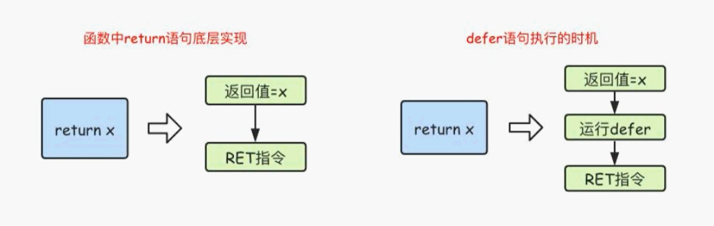

# Go的函数

## 函数定义

函数是组织好的、可重复使用的、用于执行指定任务的代码块

Go语言支持：函数、匿名函数和闭包

Go语言中定义函数使用func关键字，具体格式如下：

```go
func 函数名(参数)(返回值) {
    函数体
}
```

其中：

- 函数名：由字母、数字、下划线组成。但函数名的第一个字母不能是数字。在同一个包内，函数名也不能重名

示例

```go
// 求两个数的和
func sumFn(x int, y int) int{
	return x + y
}
// 调用方式
sunFn(1, 2)
```

获取可变的参数，可变参数是指函数的参数数量不固定。Go语言中的可变参数通过在参数名后面加... 来标识。

注意：可变参数通常要作为函数的最后一个参数

```go
func sunFn2(x ...int) int {
	sum := 0
	for _, num := range x {
		sum = sum + num
	}
	return sum
}
// 调用方法
sunFn2(1, 2, 3, 4, 5, 7)
```

方法多返回值，Go语言中函数支持多返回值，同时还支持返回值命名，函数定义时可以给返回值命名，并在函数体中直接使用这些变量，最后通过return关键字返回

```go
// 方法多返回值
func sunFn4(x int, y int)(sum int, sub int) {
	sum = x + y
	sub = x -y
	return
}
```

## 函数类型和变量

### 定义函数类型

我们可以使用type关键字来定义一个函数类型，具体格式如下

```bash
type calculation func(int, int) int
```

上面语句定义了一个calculation类型，它是一种函数类型，这种函数接收两个int类型的参数并且返回一个int类型的返回值。

简单来说，凡是满足这两个条件的函数都是calculation类型的函数，例如下面的add 和 sub 是calculation类型

```go
type calc func(int, int) int
// 求两个数的和
func sumFn(x int, y int) int{
	return x + y
}
func main() {
    var c calc
    c = add
}
```

### 方法作为参数

```
/**
	传递两个参数和一个方法
 */
func sunFn (a int, b int, sum func(int, int)int) int {
	return sum(a, b)
}
```

或者使用switch定义方法，这里用到了匿名函数

```go
// 返回一个方法
type calcType func(int, int)int
func do(o string) calcType {
	switch o {
		case "+":
			return func(i int, i2 int) int {
				return i + i2
			}
		case "-":
			return func(i int, i2 int) int {
				return i - i2
			}
		case "*":
			return func(i int, i2 int) int {
				return i * i2
			}
		case "/":
			return func(i int, i2 int) int {
				return i / i2
			}
		default:
			return nil

	}
}

func main() {
	add := do("+")
	fmt.Println(add(1,5))
}
```

## 匿名函数

函数当然还可以作为返回值，但是在Go语言中，函数内部不能再像之前那样定义函数了，只能定义匿名函数。匿名函数就是没有函数名的函数，匿名函数的定义格式如下

```go
func (参数)(返回值) {
    函数体
}
```

匿名函数因为没有函数名，所以没有办法像普通函数那样调用，所以匿名函数需要保存到某个变量或者作为立即执行函数：

```
func main() {
	func () {
		fmt.Println("匿名自执行函数")
	}()
}
```

## Golang中的闭包

### 全局变量和局部变量

全局变量的特点：

- 常驻内存
- 污染全局

局部变量的特点

- 不常驻内存
- 不污染全局

### 闭包

- 可以让一个变量常驻内存
- 可以让一个变量不污染全局

闭包可以理解成 “定义在一个函数内部的函数”。在本质上，闭包就是将函数内部 和 函数外部连接起来的桥梁。或者说是函数和其引用环境的组合体。

- 闭包是指有权访问另一个函数作用域中的变量的函数
- 创建闭包的常见的方式就是在一个函数内部创建另一个函数，通过另一个函数访问这个函数的局部变量

注意：由于闭包里作用域返回的局部变量资源不会被立刻销毁，所以可能会占用更多的内存，过度使用闭包会导致性能下降，建议在非常有必要的时候才使用闭包。

```go
// 闭包的写法：函数里面嵌套一个函数，最后返回里面的函数就形成了闭包
func adder() func() int {
	var i = 10
	return func() int {
		return i + 1
	}
}

func main() {
	var fn = adder()
	fmt.Println(fn())
	fmt.Println(fn())
	fmt.Println(fn())
}
```

最后输出的结果

```bash
11
11
11
```

另一个闭包的写法，让一个变量常驻内存，不污染全局

```
func adder2() func(y int) int {
	var i = 10
	return func(y int) int {
		i = i + y
		return i
	}
}

func main() {
	var fn2 = adder2()
	fmt.Println(fn2(10))
	fmt.Println(fn2(10))
	fmt.Println(fn2(10))
}
```

## defer语句

Go 语言中的defer 语句会将其后面跟随的语句进行延迟处理。在defer归属的函数即将返回时，将延迟处理的语句按defer定义的逆序进行执行，也就是说，先被defer的语句最后被执行，最后被defer的语句，最先被执行。

```go
// defer函数
fmt.Println("1")
defer fmt.Println("2")
fmt.Println("3")
fmt.Println("4")
```

defer将会延迟执行

```bash
1
3
4
2
```

如果有多个defer修饰的语句，将会逆序进行执行

```go
// defer函数
fmt.Println("1")
defer fmt.Println("2")
defer fmt.Println("3")
fmt.Println("4")
```

运行结果

```bash
1
4
3
2
```

如果需要用defer运行一系列的语句，那么就可以使用匿名函数

```go
func main() {
	fmt.Println("开始")
	defer func() {
		fmt.Println("1")
		fmt.Println("2")
	}()
	fmt.Println("结束")
}
```

运行结果

```bash
开始
结束
1
2
```


### defer执行时机

在Go语言的函数中return语句在底层并不是原子操作，它分为返回值赋值和RET指令两步。而defer语句执行的时机就在返回值赋值操作后，RET指令执行前，具体如下图所示



## panic/revocer处理异常

Go语言中是没有异常机制，但是使用panic / recover模式来处理错误

- panic：可以在任何地方引发
- recover：只有在defer调用函数内有效

```go
func fn1() {
	fmt.Println("fn1")
}

func fn2() {
	panic("抛出一个异常")
}
func main() {
    fn1()
	fn2()
    fmt.Println("结束")
}
```

上述程序会直接抛出异常，无法正常运行

```bash
fn1
panic: 抛出一个异常
```

解决方法就是使用 recover进行异常的监听

```go
func fn1() {
	fmt.Println("fn1")
}

func fn2() {
	// 使用recover监听异常
	defer func() {
		err := recover()
		if err != nil {
			fmt.Println(err)
		}
	}()
	panic("抛出一个异常")
}
func main() {
    fn1()
	fn2()
    fmt.Println("结束")
}
```

## 异常运用场景

模拟一个读取文件的方法，这里可以主动发送使用panic  和 recover

```go
func readFile(fileName string) error {
	if fileName == "main.go" {
		return nil
	} else {
		return errors.New("读取文件失败")
	}
}

func myFn () {
	defer func() {
		e := recover()
		if e != nil {
			fmt.Println("给管理员发送邮件")
		}
	}()
	err := readFile("XXX.go")
	if err != nil {
		panic(err)
	}
}

func main() {
	myFn()
}
```

## 内置函数

| 内置函数      | 介绍                                                         |
| ------------- | ------------------------------------------------------------ |
| close         | 主要用来关闭channel                                          |
| len           | 用来求长度，比如string、array、slice、map、channel           |
| new           | 用来分配内存、主要用来分配值类型，比如 int、struct ，返回的是指针 |
| make          | 用来分配内存，主要用来分配引用类型，比如chan、map、slice     |
| append        | 用来追加元素到数组、slice中                                  |
| panic\recover | 用来处理错误                                                 |

