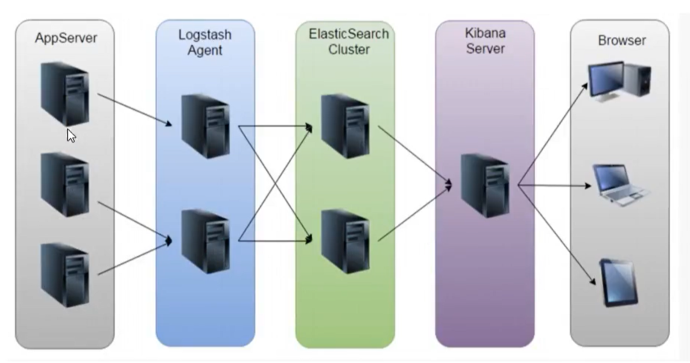
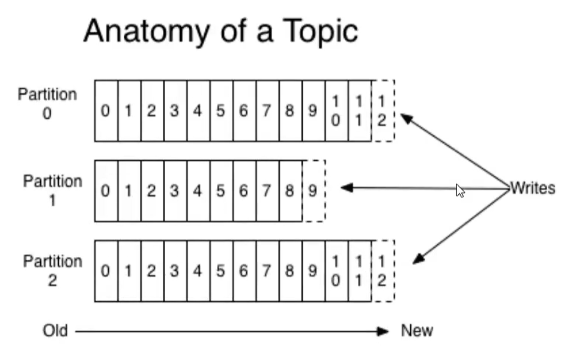
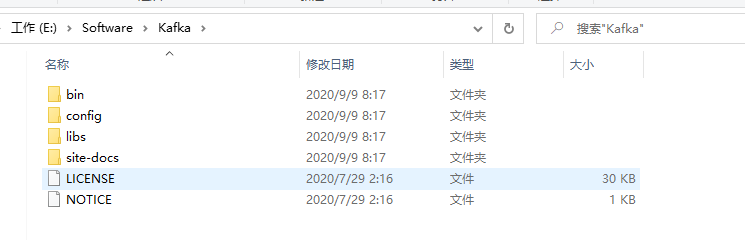
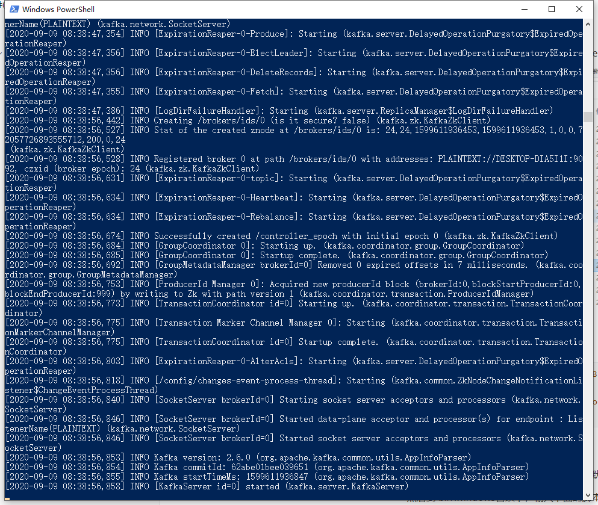
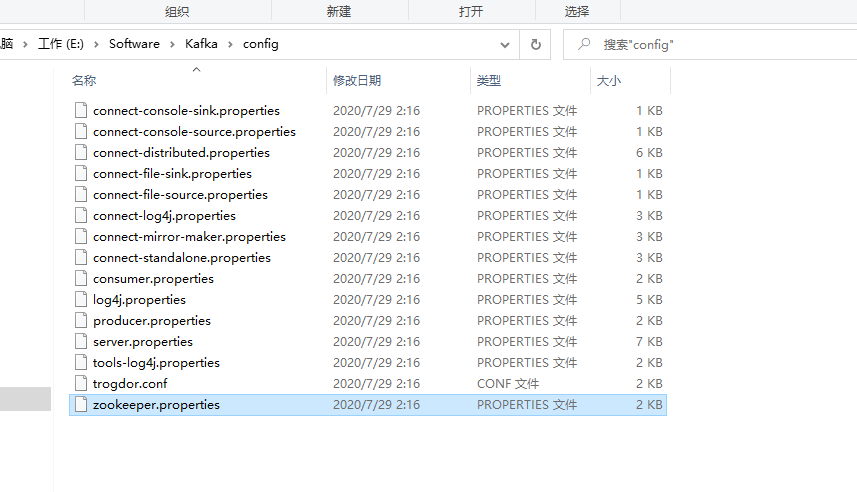
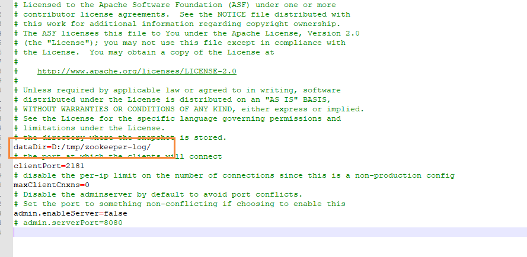
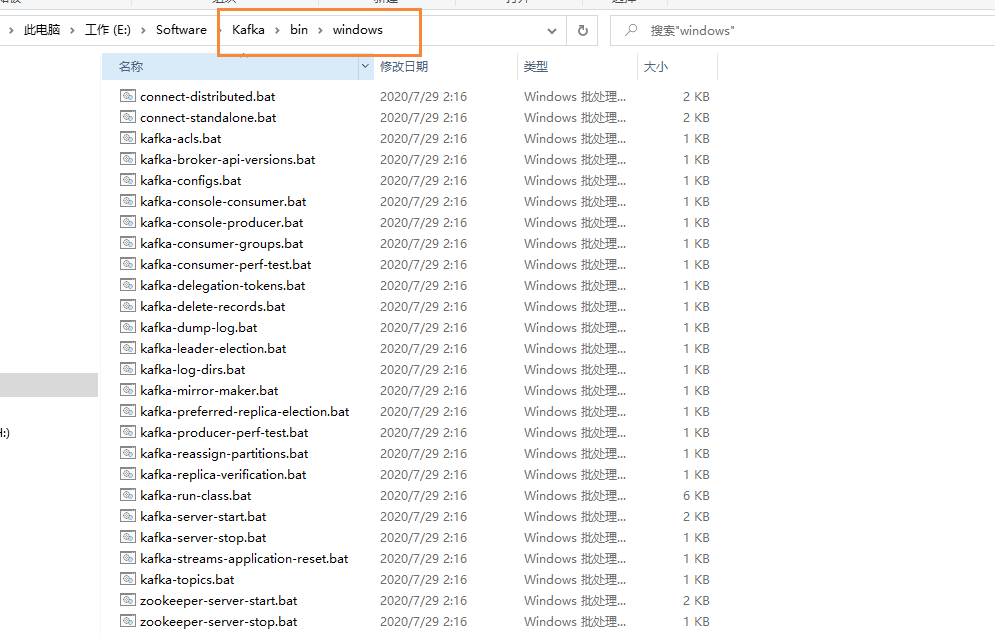
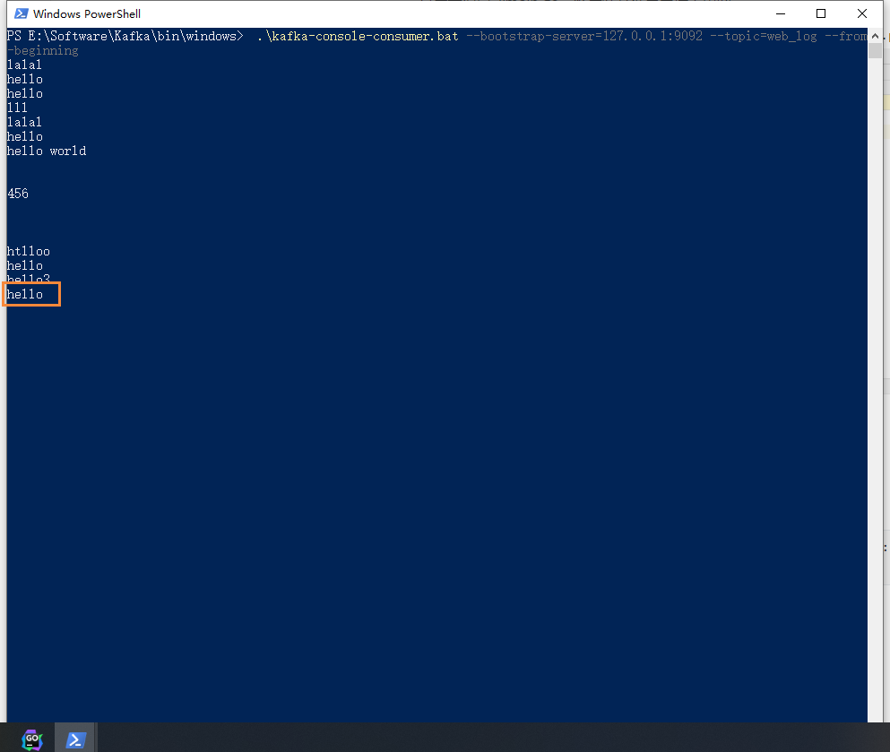

# 日志收集项目架构设计及Kafka介绍

## 项目背景

每个业务系统都有日志，当系统出现问题时，需要通过日志信息来定位和解决问题。当系统机器比较少时，登陆到服务器上查看即可满足当系统机器规模巨大，登陆到机器上查看几乎不现实（分布式的系统，一个系统部署在十几台机器上）

## 解决方案

把机器上的日志实时收集，统一存储到中心系统。再对这些日志建立索引，通过搜索即可快速找到对应的日志记录。通过提供一个界面友好的web页面实现日志展示与检索。

## 面临的问题

实时日志量非常大，每天处理几十亿条。日志准实时收集，延迟控制在分钟级别。系统的架构设计能够支持水平扩展。

## 业界方案

### ELK



- AppServer：跑业务的服务器
- Logstash Agent：
- Elastic Search Cluster
- Kibana Server：数据可视化
- Browser：浏览器

### ELK方案的问题

- 运维成本高，每增加一个日志收集项，都需要手动修改配置
  - 使用etcd来管理被收集的日志项
- 监控缺失，无法精准获取logstash的状态
- 无法做到定制化开发与维护

## 日志收集系统架构设计

### 架构设计


通过etcd做一个配置中心的概念，它是用go写的，是可以用来替代Zookeeper的

LogAgent收集日志，然后将其发送到Kafka中，Kafka既可以作为消息队列，也可以做到消息的存储组件

然后Log transfer就将Kafka中的日志记录取出来，进行处理，然后写入到ElasticSearch中，然后将对应的日志

最后通过Kibana进行可视化展示，SysAgent是用来采集系统的日志信息（或者使用 普罗米修斯）

### 组件介绍

- LogAgent：日志收集客户端，用来收集服务器上的日志 
- Kafka：高吞吐量的分布式队列（Linkin开发，Apache顶级开源项目）
- ElasticSearch：开源的搜索引擎，提供基于HTTP RESTful的web接口
- Kibana：开源的ES数据分析和可视化工具
- Hadoop：分布式计算框架，能够对大量数据进行分布式处理的平台
- Storm：一个免费并开源的分布式实时计算框架

### 将学到的技能

- 服务端agent开发
- 后端服务组件开发
- Kafka和Zookeeper的使用
- ES和Kibana使用
- etcd的使用（配置中心，配置共享）

## 消息队列的通信模型

### 点对点模式 queue

消息生产者发送到queue中，然后消息消费者从queue中取出并消费信息，一条消息被消费以后，queue中就没有了，不存在重复消费的问题

### 发布/订阅 topic

消息生产者（发布）将消息发布到topic中，同时有多个消息消费者（订阅）消费该消息。和点对点方式不同，发布到topic的消息会被所有的订阅者消费（类似于关注了微信公众号的人都能收到推送的文章）。

补充：发布订阅模式下，当发布者消息量很大时，显然单个订阅者的处理能力是不足的。实际上现实场景中多个订阅者节点组成一个订阅组负载均衡消费topic消息即分组订阅，这样订阅者很容易实现消费能力线扩展。可以看成是一个topic下有多个Queue，每个Queue是点对点的方式，Queue之间是发布订阅方式。

## Kafka

Apache Kafka由著名职业社交公司Linkedin开发，最初是被设计用来解决LinkedIn公司内部海量日志传输问题，Kafka使用Scala语言编写，于2011年开源并进入Apache孵化器，2012年10月正式毕业，现在为Apache顶级项目

### 介绍

Kafka是一个分布式数据流平台，可以运行在单台服务器上，也可以在多台服务器上部署形成集群。它提供了发布和订阅功能，使用这可以发送数据到Kafka中，也可以从Kafka中读取数据（以便进行后续处理）。Kafka具有高吞吐、低延迟、高容错等特点。


### Kafka的架构图


- Producer:Producer即生产者，消息的产生者，是消息的入口。
- kafka cluster:kafka集群，一台或多台服务器组成
  - Broker:Broker是指部署了Kafka实例的服务器节点。每个服务器上有一个或多个kafka的实例，我们姑且认为每个broker对应一台服务器。每个kafka集群内的broker都有一个不重复的编号，如图中的broker-0、broker-1等…
  - Topic：消息的主题，可以理解为消息的分类，kafka的数据就保存在topic。在每个broker上都可以创建多个topic。实际应用中通常是一个业务线建一个topic。
  - Partition:Topic的分区，每个topic可以有多个分区，分区的作用是做负载，提高kafka的吞吐量。同一个topic在不同的分区的数据是不重复的，partition的表现形式就是一个一个的文件夹！
  - Replication：每一个分区都有多个副本，副本的作用是做备胎。当主分区（Leader）故障的时候会选择一个备胎（Follower）上位，成为Leader。在kafka中默认副本的最大数量是10个，且副本的数量不能大于Broker的数量，follower和leader绝对是在不同的机器，同一机器对同一个分区也只可能存放一个副本（包括自己）。
- Consumer：消费者，即消息的消费方，是消息的出口。

### 工作流程

我们看上面的架构图中，produce就是生产者，是数据的入口。Producer在写入数据的时候会把数据写入到Leader中，不会直接将数据写入follower！那leader怎么找呢？写入流程又是怎么样的呢？我们看下图


- 生产者从Kafka集群获取分区leader信息
- 生产者将消息发送给leader
- leader将消息写入本地磁盘
- follower从leader拉取消息数据
- follower将消息写入本地磁盘后向leader发送ACK
- leader收到所有的follower的ACK之后向生产者发送ACK

### 选择partition的原则

那在kafka中，如果某低opic有多个partition，producer又怎么知道该将数据发往哪个partition呢？
kafka中有几个原则：

- partition在写入的时候可以指定需要写入的partition，如果有指定，则写入对应的partition。
- 如果没有指定partition，但是设置了数据的key，则会根据key的值hash出一个partition。
- 如果既没指定partition，又没有设置key，则会采用轮询方式，即每次取一小段时间的数据写入某个partition，下一小段的时间写入下一个partition。

### ACK应答机制

producer在向kafka写入消息的时候，可以设置参数来确定是否确认kafka接收到数据，这个参数可设置的值为0、1、all。

- 0：代表producer往集群发送数据不需要等到集群的返回，不确保消息发送成功。安全性最低但是效I率最高。
- 1：代表producer往集群发送数据只要leader应答就可以发送下一条，只确保leader发送成功。
- all：代表producer往集群发送数据需要所有的follower都完成从leader的同步才会发送下一条，确保leader发送成功和所有的副本都完成备份。安全性最高，但是效率最低。

最后要注意的是，如果往不存在的topic写数据，kafka会自动创建topic，partition和replication的数量默认配置都是1。

### Topic和数据日志

topic是同一类别的消息记录（record）的集合。在kafka中，一个主题通常有多个订阅者。对于每个主题、Kafka集群维护了一个分区数据日志文件结构如下：



每个partition都是一个有序并且不可变的消息记录集合。当新的数据写入时，就被追加到partition的末尾。在每个partition中，每条消息都会被分配一个顺序的唯一标识，这个标识被称为offset，即偏移量。注意，kafka只保证在他同一个partition内部消息是有序的，在不同partition之间，并不能保证消息有序。

Kafka可以配置一个保留期限，用来标识日志会在Kafka集群中保留多长时间。Kafka集群会保留在保留期限内所有发布的消息，不管这些消息是否被消费过，比如保留期限设置为两天，那么数据被发布到Kafka集群的两天以内，所有的这些数据都可以被消费，当超过两天，这些数据将会被清空。以便为后续的数据腾出空间，由于Kafka会将数据进行持久化存储（即写入到硬盘上），所以保留的数据大小可以设置为一个比较大的值。

### Partition结构

Partition在服务器上的表现形式就是一个一个的文件夹，每个partition的文件夹下面会有多组segment文件，每组segment文件又包含.index文件、.log文件、.timeindex文件三个文件，其中.log文件就是实际存储message的地方，而.index和.timeindex文件为索引文件，用于检索消息。

### 消费数据

多个消费者实例可以组成一个消费者组，并用一个标签来标识这个消费者组。一个消费者组中的不同消费者实例可以运行在不同的进程甚至不同的服务器上。

如果所有的消费者实例都在同一个消费者组中，那么消息记录会被很好的均衡的发送到每个消费者实例。

如果所有的消费者实例都在不同的消费者组，那么每一条消息记录会被广播到每一个消费者实例。


上面是kafka集群，下面就是消费者组

举个例子，如上图所示一个两个节点的Kafka集群上拥有一个四个partition（PO-P3）的topic。有两个消费者组都在消费这个topic中的数据，消费者组A有两个消费者实例，消费者组B有四个消费者实例。

从图中我们可以看到，在同一个消费者组中，每个消费者实例可以消费多个分区，但是每个分区最多只能被消费者组中的一个实例消费。也就是说，如果有一个4个分区的主题，那么消费者组中最多只能有4个消费者实例去消费，多出来的都不会被分配到分区。其实这也很好理解，如果允许两个消费者实例同时消费同一个分区，那么就无法记录这个分区被这个消费者组消费的offset了。如果在消费者组中动态的上线或下线消费者，那么Kafka集群会自动调整分区与消费者实例间的对应关系。

### 使用场景

上面介绍了Kafka的一些基本概念和原理，那么Kafka可以做什么呢？目前主流使用场景基本如下：

#### 消息队列（MQ）

在系统架构设计中，经常会使用消息队列（Message Queue）——MQ。MQ是一种跨进程的通信机制，用于上下游的消息传递，使用MQ可以使上下游解耦，消息发送上游只需要依赖MQ，逻辑上和物理上都不需要依赖其他下游服务。MQ的常见使用场景如流量削峰、数据驱动的任务依赖等等。在MQ领域，除了Kafka外还有传统的消息队列如ActiveMQ和RabbitMQ等。

#### 追踪网站活动

Kafka最出就是被设计用来进行网站活动（比如PV、UV、搜索记录等）的追踪。可以将不同的活动放入不同的主题，供后续的实时计算、实时监控等程序使用，也可以将数据导入到数据仓库中进行后续的离线处理和生成报表等。

#### Metrics 

 Kafka 经常被用来传输监控数据。主要用来聚合分布式应用程序的统计数据，将数据集中后进行统一的分析和展示等。

#### 日志聚合

很多人使用Kafka作为日志聚合的解决方案。日志聚合通常指将不同服务器上的日志收集起来并放入一个日志中心，比如一台文件服务器或者HDFS中的一个目录，供后续进行分析处理。相比于Flume和Scribe等日志聚合工具，Kafka具有更出色的性能。

## Kafka安装和启动

### 下载

下载地址：https://www.apache.org/dyn/closer.cgi?path=/kafka/2.6.0/kafka_2.12-2.6.0.tgz

### 安装

将下载好的压缩包解压到本地，注意Kafka需要先安装JDK环境



### 修改配置

我们首先找到Kafka的配置文件 server.properties


然后修改日志存放位置

```bash
############################# Log Basics #############################

# A comma separated list of directories under which to store log files
log.dirs=D:/tmp/kafka-logs
```

### 启动

修改完成后，我们即可启动Kafka了，kafka默认端口号是9092

然后到 bin\windows目录下，输入下面的脚本

```bash
 .\kafka-server-start.bat ..\..\config\server.properties
```

Kafka启动成功



## Zookeeper启动

注意，我们安装的Kafka里面，就包含了所需的Zookeeper配置文件，因此我们只需要修改配置即可



找到Zookeeper.properties配置文件，修改数据目录



修改完成后，我们到 bin\windows目录下



启动脚本

```bash
 .\zookeeper-server-start.bat ..\..\config\zookeeper.properties
```

启动完成后，将占用 2181端口号


## LogAgent的工作流程


- 读日志
- 往kafka中写日志

首先我们需要下载tailf，使用下面的命令

```bash
go get github.com/hpcloud/tail
```

然后编写测试样例

```go
package main

import (
	"fmt"
	"github.com/hpcloud/tail"
	"time"
)

// tailf的用法
func main() {
	// 需要记录的日志文件
	fileName := "./my.log"

	//
	config := tail.Config{
		ReOpen: true, // 重新打开，日志文件到了一定大小，就会分裂
		Follow: true, // 是否跟随
		Location: &tail.SeekInfo{Offset: 0, Whence: 2}, // 从文件的哪个位置开始读
		MustExist: false, // 是否必须存在，如果不存在是否报错
		Poll: true, //
	}

	tails, err := tail.TailFile(fileName, config)
	if err != nil {
		fmt.Println("tail file failed, err:", err)
		return
	}

	var(
		line *tail.Line
		ok bool
	)
	for {
		// 从tails中一行一行的读取
		line, ok = <- tails.Lines
		if !ok {
			fmt.Println("tail file close reopen, filename:%s\n", tails.Filename)
			time.Sleep(time.Second)
			continue
		}
		fmt.Println("line", line.Text)
	}
}

```

但是我们在启动的时候，又出错了

```bash
cannot find module providing package gopkg.in/fsnotify.v1
```

我们定位到源码目录，因为 opkg.in/fsnotify.v1的包改名了，所以我们需要修改两个文件，inotify.go 和 inotify_tracker.go


将里面出错的文件，替换成下面的这个文件即可

### log agent开发

#### 下载安装

```bash
go get github.com/Shopify/sarama
```

sarama V1.20之后的版本加入了zstd压缩算法，需要用到cgo，在Windows平台编译时会提示类似如下错误：

```bash
exec: "gcc":executable file not found in %PATH%
```

所以在Windows平台请使用v1.19版本的sarama，因此我们需要使用下面命令创建一个go.mod文件

```bash
go mod init kafkaDemo
```

然后在文件里面配置一下版本号 v1.19.0 

```mod

go 1.14

require (
	github.com/Shopify/sarama v1.19.0
)
```

然后在项目的目录下，下载依赖

```bash
go mod download
```

下载完成后，我们就可以写测试代码了

```bash
package main

import (
	"fmt"
	"github.com/Shopify/sarama"
)

// 基于sarama第三方库开发的Kafka client
func main() {
	config := sarama.NewConfig()

	// tailf包使用，发送完数据需要 leader 和 follow都确定
	config.Producer.RequiredAcks = sarama.WaitForAll
	// 新选出一个partition
	config.Producer.Partitioner = sarama.NewRandomPartitioner
	// 成功交付的消息将在 success channel返回
	config.Producer.Return.Successes = true

	msg := &sarama.ProducerMessage{}
	msg.Topic = "web_log"
	msg.Value = sarama.StringEncoder("this is a test log")
	// 连接kafka，可以连接一个集群
	client, err := sarama.NewSyncProducer([]string{"127.0.0.1:9092"}, config)
	if err != nil {
		fmt.Println("producer closed, err: ", err)
	}
	fmt.Println("连接kafka成功！")
	// 定义延迟关闭
	defer client.Close()

	// 发送消息
	pid, offset, err := client.SendMessage(msg)
	if err != nil {
		fmt.Println("send msg failed, err:", err)
		return
	}
	fmt.Printf("pid:%v offset:%v \n", pid, offset)
}
```

## LogAgent编码

首先我们需要创建一个 kafka.go 用来初始化kafka和发送消息到kafka

```go
package kafka

import (
	"fmt"
	"github.com/Shopify/sarama"
)

// 专门往kafka写日志的模块

var (
	// 声明一个全局连接kafka的生产者
	client sarama.SyncProducer
)

// 初始化client
func Init()(err error)  {
	config := sarama.NewConfig()

	// tailf包使用，发送完数据需要 leader 和 follow都确定
	config.Producer.RequiredAcks = sarama.WaitForAll
	// 新选出一个partition
	config.Producer.Partitioner = sarama.NewRandomPartitioner
	// 成功交付的消息将在 success channel返回
	config.Producer.Return.Successes = true

	msg := &sarama.ProducerMessage{}
	msg.Topic = "web_log"
	msg.Value = sarama.StringEncoder("this is a test log")
	// 连接kafka，可以连接一个集群
	client, err = sarama.NewSyncProducer([]string{"127.0.0.1:9092"}, config)
	if err != nil {
		fmt.Println("producer closed, err: ", err)
	}
	fmt.Println("Kafka初始化成功")
	return err
}

// 发送消息到Kafka
func SendToKafka(topic, data string) {
	msg := &sarama.ProducerMessage{}
	msg.Topic = topic
	msg.Value = sarama.StringEncoder(data)
	// 发送到kafka
	pid, offset, err := client.SendMessage(msg)
	if err != nil {
		fmt.Println("send msg failed, err:", err)
		return
	}
	fmt.Println("发送消息：", data)
	fmt.Printf("发送成功~  pid:%v offset:%v \n", pid, offset)
}
```

然后我们在创建一个 taillog.go文件，用来记录日志

```go
package taillog

import (
	"fmt"
	"github.com/hpcloud/tail"
)

// 定义全局对象
var (
	// 声明一个全局连接kafka的生产者
	tailObj *tail.Tail
)

// 专门从日志文件收集日志的模块
func Init(fileName string)(err error ){

	// 定义配置文件
	config := tail.Config{
		ReOpen: true, // 重新打开，日志文件到了一定大小，就会分裂
		Follow: true, // 是否跟随
		Location: &tail.SeekInfo{Offset: 0, Whence: 2}, // 从文件的哪个位置开始读
		MustExist: false, // 是否必须存在，如果不存在是否报错
		Poll: true, //
	}

	tailObj, err = tail.TailFile(fileName, config)
	if err != nil {
		fmt.Println("tail file failed, err:", err)
		return
	}
	return err
}

// 读取日志，返回一个只读的chan
func ReadChan() <-chan *tail.Line {
	return tailObj.Lines
}
```

最后我们创建main.go作为启动类

```go
package main

import (
	"LogDemo/kafka"
	"LogDemo/taillog"
	"fmt"
	"time"
)

// logAgent入口程序
func run()  {
	// 1.读取日志
	for {
		select {
		case line := <-taillog.ReadChan():
			{
				// 2.发送到kafka
				kafka.SendToKafka("web_log", line.Text)
			}
		default:
			time.Sleep(1 * time.Second)
		}
	}
}

func main() {
	// 1. 初始化kafka连接
	err := kafka.Init()
	if err != nil {
		fmt.Printf("init Kafka failed, err:%v \n", err)
		return
	}
	// 2. 打开日志文件，准备收集
	err = taillog.Init("./my.log")
	if err != nil {
		fmt.Printf("Init taillog failed, err: %v \n", err)
		return
	}

	// 3.执行业务逻辑
	run()
}
```

最后我们启动main.go，然后往文件里面插入内容，然后就会将日志记录发送到kafka中


最后通过下面的脚本，来进行kafka的消息的消费

```bash
 .\kafka-console-consumer.bat --bootstrap-server=127.0.0.1:9092 --topic=web_log --from-beginning
```

然后就开始消费kafka中的消息



### 存在的问题

上述的代码还存在硬编码的问题，我们将通过配置文件将一些信息配置出来，这样能够提高代码的扩展性，这里我们用的是ini文件，创建一个 config.ini文件，填入配置信息

```ini
[kafka]
address=127.0.0.1:9092
topic=web_log

[taillog]
path:=./my.log
```

### 引入依赖

我们需要使用go-ini的依赖，来对我们的配置文件进行解析  ，[go-ini官网](https://github.com/go-ini/ini)

首先下载依赖

```bash
go get gopkg.in/ini.v1
```

然后通过下面的方式进行读取

```go
// 0. 加载配置文件
cfg, err := ini.Load("./conf/config.ini")
if err != nil {
    fmt.Printf("Fail to read file: %v", err)
    os.Exit(1)
}

// 典型读取操作，默认分区可以使用空字符串表示
fmt.Println("kafka address:", cfg.Section("kafka").Key("address").String())
fmt.Println("kafka topic:", cfg.Section("kafka").Key("topic").String())
fmt.Println("taillog path:", cfg.Section("taillog").Key("path").String())
```

优化后的main.go如下所示

```go
package main

import (
	"LogDemo/kafka"
	"LogDemo/taillog"
	"fmt"
	"gopkg.in/ini.v1"
	"os"
	"time"
)

// logAgent入口程序
func run()  {
	// 1.读取日志
	for {
		select {
		case line := <-taillog.ReadChan():
			{
				// 2.发送到kafka
				kafka.SendToKafka("web_log", line.Text)
			}
		default:
			time.Sleep(1 * time.Second)
		}
	}
}

func main() {
	// 0. 加载配置文件
	cfg, err := ini.Load("./conf/config.ini")
	if err != nil {
		fmt.Printf("Fail to read file: %v", err)
		os.Exit(1)
	}

	// 典型读取操作，默认分区可以使用空字符串表示
	fmt.Println("kafka address:", cfg.Section("kafka").Key("address").String())
	fmt.Println("kafka topic:", cfg.Section("kafka").Key("topic").String())
	fmt.Println("taillog path:", cfg.Section("taillog").Key("path").String())

	// 1. 初始化kafka连接
	address := []string{cfg.Section("kafka").Key("address").String()}
	topic := cfg.Section("taillog").Key("path").String()
	err = kafka.Init(address, topic)
	if err != nil {
		fmt.Printf("init Kafka failed, err:%v \n", err)
		return
	}
	// 2. 打开日志文件，准备收集
	err = taillog.Init(cfg.Section("taillog").Key("path").String())
	if err != nil {
		fmt.Printf("Init taillog failed, err: %v \n", err)
		return
	}
	// 3.执行业务逻辑
	run()
}
```

### 最终版本

上述的方式，还是存在一些问题，就是配置信息不能传递，只能在main方法里面，那么我们可以在定义一个结构体，conf.go

```go
package conf

type AppConf struct {
	KafkaConf `ini:"kafka"`
	TaillogConf `ini:"taillog"`
}
type KafkaConf struct {
	Address string `ini:"address"`
	Topic string `ini:"topic"`
}

type TaillogConf struct {
	FileName string `ini:"filename"`
}
```

然后原来的main.go改为

```go
package main

import (
	"LogDemo/conf"
	"LogDemo/kafka"
	"LogDemo/taillog"
	"fmt"
	"gopkg.in/ini.v1"
	"time"
)

var (
	cfg = new(conf.AppConf)
)

// logAgent入口程序
func run()  {
	// 1.读取日志
	for {
		select {
		case line := <-taillog.ReadChan():
			{
				// 2.发送到kafka
				kafka.SendToKafka(cfg.Topic, line.Text)
			}
		default:
			time.Sleep(1 * time.Second)
		}
	}
}

func main() {
	// 0. 加载配置文件
	// 方式2
	err := ini.MapTo(&cfg, "./conf/config.ini")
	if err != nil {
		fmt.Printf("load ini failed, err: %v \n", err)
		return
	}
	fmt.Println("读取到的配置信息", cfg)

	// 1. 初始化kafka连接
	address := []string{cfg.Address}
	topic := cfg.Topic
	err = kafka.Init(address, topic)
	if err != nil {
		fmt.Printf("init Kafka failed, err:%v \n", err)
		return
	}
	// 2. 打开日志文件，准备收集
	err = taillog.Init(cfg.FileName)
	if err != nil {
		fmt.Printf("Init taillog failed, err: %v \n", err)
		return
	}
	// 3.执行业务逻辑
	run()
}
```


