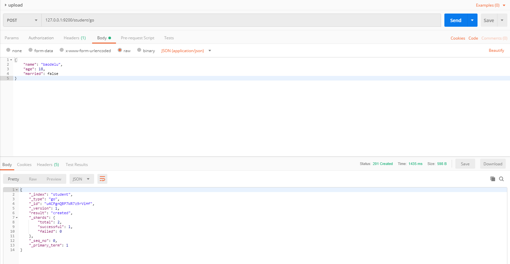

# ES介绍和使用

## 来源

https://www.liwenzhou.com/posts/Go/go_elasticsearch/

## 今日内容

### Logtransfer

从Kafka里面把日志取出来，写入ES，使用Kibana做可视化展示

### 系统监控

psutil：采集系统信息的，写入到influxDB，使用 Grafana做展示

promethenus监控：采集性能指标数据，保存起来，使用grafana做展示

### ElasticSearch

Elasticsearch（ES）是一个基于Lucene构建的开源、分布式、RESTful接口的全文搜索引擎。Elasticsearch还是一个分布式文档数据库，其中每个字段均可被索引，而且每个字段的数据均可被搜索，ES能够横向扩展至数以百计的服务器存储以及处理PB级的数据。可以在极短的时间内存储、搜索和分析大量的数据。通常作为具有复杂搜索场景情况下的核心发动机。

### Kibana

图形化展示

## ElasticSearch安装

去官网下载 [ElasticSearch](https://www.elastic.co/cn/elasticsearch/) ，下载完成后，到bin目录，双击启动


启动完成后，访问下面的URL

```bash
http://127.0.0.1:9200/
```

即可看到ElasticSearch的信息


## ES API

以下示例使用`curl`演示。

### 查看健康状态

```bash
curl -X GET 127.0.0.1:9200/_cat/health?v
```

输出：

```bash
epoch      timestamp cluster       status node.total node.data shards pri relo init unassign pending_tasks max_task_wait_time active_shards_percent
1564726309 06:11:49  elasticsearch yellow          1         1      3   3    0    0        1             0                  -                 75.0%
```

### 查询当前es集群中所有的indices

```bash
curl -X GET 127.0.0.1:9200/_cat/indices?v
```

输出：

```bash
health status index                uuid                   pri rep docs.count docs.deleted store.size pri.store.size
green  open   .kibana_task_manager LUo-IxjDQdWeAbR-SYuYvQ   1   0          2            0     45.5kb         45.5kb
green  open   .kibana_1            PLvyZV1bRDWex05xkOrNNg   1   0          4            1     23.9kb         23.9kb
yellow open   user                 o42mIpDeSgSWZ6eARWUfKw   1   1          0            0       283b           283b
```

### 创建索引

```bash
curl -X PUT 127.0.0.1:9200/www
```


输出：

```bash
{"acknowledged":true,"shards_acknowledged":true,"index":"www"}
```

### 删除索引

```bash
curl -X DELETE 127.0.0.1:9200/www
```


输出：

```bash
{"acknowledged":true}
```

### 插入记录

```bash
curl -H "ContentType:application/json" -X POST 127.0.0.1:9200/user/person -d '
{
	"name": "dsb",
	"age": 9000,
	"married": true
}'
```



输出：

```bash
{
    "_index": "user",
    "_type": "person",
    "_id": "MLcwUWwBvEa8j5UrLZj4",
    "_version": 1,
    "result": "created",
    "_shards": {
        "total": 2,
        "successful": 1,
        "failed": 0
    },
    "_seq_no": 3,
    "_primary_term": 1
}
```

也可以使用PUT方法，但是需要传入id

```bash
curl -H "ContentType:application/json" -X PUT 127.0.0.1:9200/user/person/4 -d '
{
	"name": "sb",
	"age": 9,
	"married": false
}'
```

### 检索

Elasticsearch的检索语法比较特别，使用GET方法携带JSON格式的查询条件。

全检索：

```bash
curl -X GET 127.0.0.1:9200/user/person/_search
```

按条件检索：

```bash
curl -H "ContentType:application/json" -X PUT 127.0.0.1:9200/user/person/4 -d '
{
	"query":{
		"match": {"name": "sb"}
	}	
}'
```

ElasticSearch默认一次最多返回10条结果，可以像下面的示例通过size字段来设置返回结果的数目。

```bash
curl -H "ContentType:application/json" -X PUT 127.0.0.1:9200/user/person/4 -d '
{
	"query":{
		"match": {"name": "sb"}, 
		"size": 2
	}	
}'
```

## Go操作Elasticsearch

### elastic client

我们使用第三方库https://github.com/olivere/elastic来连接ES并进行操作。

注意下载与你的ES相同版本的client，例如我们这里使用的ES是7.2.1的版本，那么我们下载的client也要与之对应为`github.com/olivere/elastic/v7`。

```bash
# 初始化mod
go mod init es
# 下载依赖
go get github.com/olivere/elastic/v7
```

使用`go.mod`来管理依赖：

```go
require (
    github.com/olivere/elastic/v7 v7.0.4
)
```

简单示例：

```go
package main

import (
	"context"
	"fmt"

	"github.com/olivere/elastic/v7"
)

// Elasticsearch demo

type Person struct {
	Name    string `json:"name"`
	Age     int    `json:"age"`
	Married bool   `json:"married"`
}

func main() {
	client, err := elastic.NewClient(elastic.SetURL("http://192.168.1.7:9200"))
	if err != nil {
		// Handle error
		panic(err)
	}

	fmt.Println("connect to es success")
	p1 := Person{Name: "rion", Age: 22, Married: false}
	put1, err := client.Index().
		Index("user").
		BodyJson(p1).
		Do(context.Background())
	if err != nil {
		// Handle error
		panic(err)
	}
	fmt.Printf("Indexed user %s to index %s, type %s\n", put1.Id, put1.Index, put1.Type)
}
```

更多使用详见文档：https://godoc.org/github.com/olivere/elastic