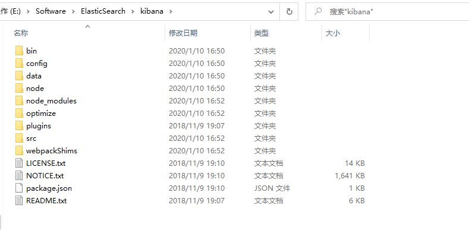
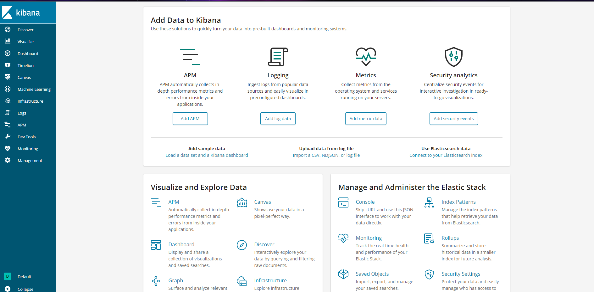

# Kibana介绍和使用

## 注意

Kibana和ElasticSearch配合使用的时候，需要确保两者的版本号一直，不然可能出现无法正常使用的问题

## 下载

[官网](https://www.elastic.co/cn/kibana)下载Kibana，下载完成后，解压缩文件，修改对应的配置



找到 config/kibana.yml，然后修改下面的配置信息，因为kibana

```bash
# Specifies locale to be used for all localizable strings, dates and number formats.
i18n.locale: "zh-CN"
```

## 启动

修改配置完成后，找到 bin/kibana.bat，双击启动即可


启动完成后，访问下面的URL进入到管理页面

```bash
http://127.0.0.1:5601
```

