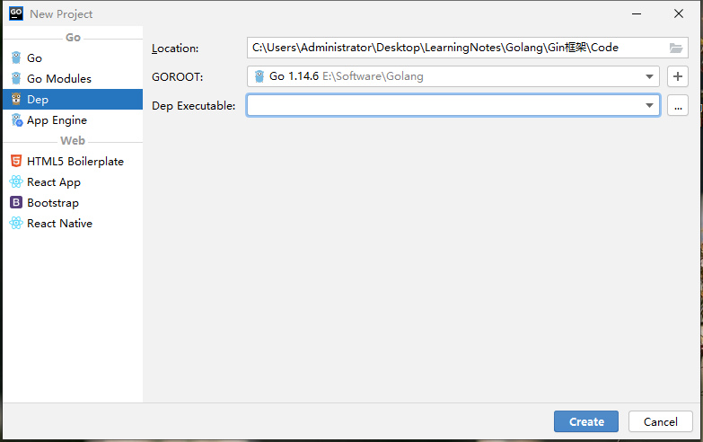
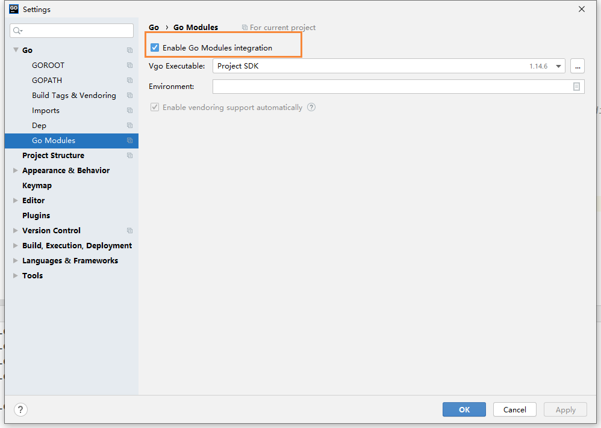
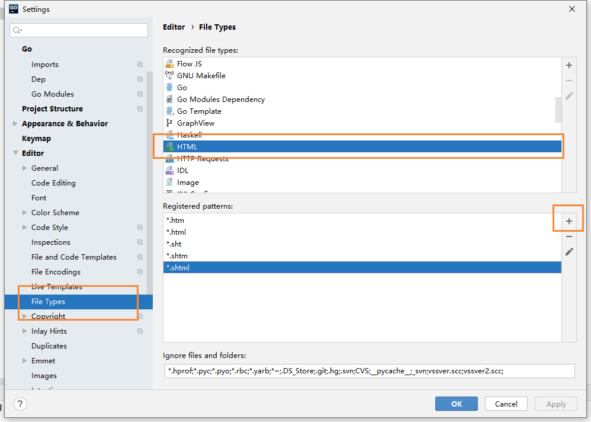
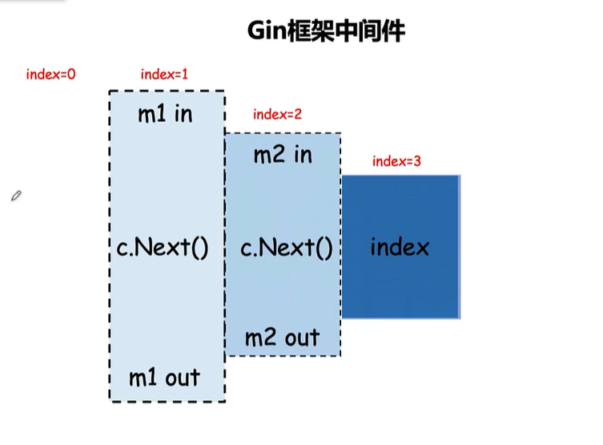
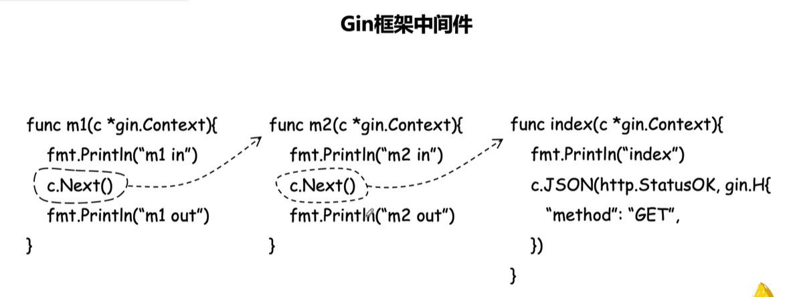
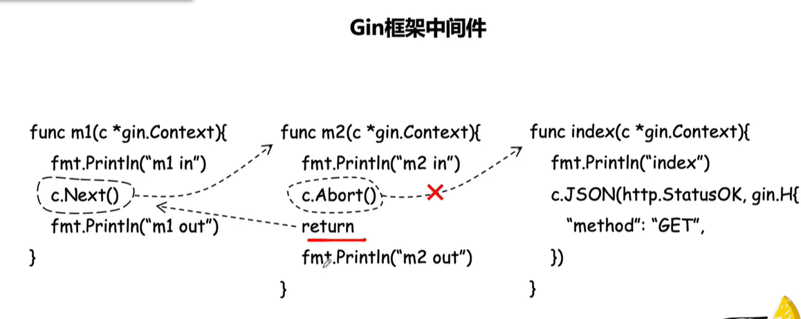

# Gin内容介绍

## 参考

参考博客和文档：

- [Gin框架介绍及使用](https://www.liwenzhou.com/posts/Go/Gin_framework/)
- [Gin中文文档](https://gin-gonic.com/zh-cn/docs/)

## 主要内容

本教程主要从下面几个方面来进行讲解

- Gin框架基本使用
- GORM基本使用
- Web开发项目实战

## 关于Web

- Web是基于HTTP协议进行交互的应用网络
- Web就是通过使用浏览器/APP访问的各种资源

一个请求对应一个响应，以淘宝网为例，我们输入一个url，就会返回一个页面


## 创建项目

首先我们使用Goland创建一个Go项目



创建完成后，打开命令窗口，输入下面的命令，创建一个依赖管理

```bash
go mod init gin_demo
```

然后打开setting页面，勾选这个选项【不勾选会导致go.mod依赖爆红】



我们创建一个main.go文件，然后使用go代码实现一个请求和响应

```go
package main

import (
	"fmt"
	"net/http"
)

// http.ResponseWriter：代表响应，传递到前端的
// *http.Request：表示请求，从前端传递过来的
func sayHello(w http.ResponseWriter, r *http.Request) {
	_, _ = fmt.Fprintln(w, "hello Golang!");
}

func main() {
	http.HandleFunc("/hello", sayHello)
	err := http.ListenAndServe(":9090", nil)
	if err != nil {
		fmt.Println("http server failed, err:%v \n", err)
		return
	}
}
```

在浏览器访问如下地址

```bash
http://localhost:9090/hello
```

就能打开我们的hello golang页面了


我们可以给文字添加色彩

```bash
// http.ResponseWriter：代表响应，传递到前端的
// *http.Request：表示请求，从前端传递过来的
func sayHello(w http.ResponseWriter, r *http.Request) {
	_, _ = fmt.Fprintln(w, "<h1 style='color:red'>hello Golang!<h1>");
}
```

然后重启后，在刷新


我们还可以把里面的字符串放在一个文件里，我们定义一个 hello.html文件

```html
<html>
    <title>hello golang</title>
    <body>
        <h1 style='color:red'>
            hello Golang!
        </h1>
        <h1>
            hello gin!
        </h1>
        
    </body>
</html>

```

然后修改刚刚的main.go，使用  ioutil解析文件

```go
package main

import (
	"fmt"
	"io/ioutil"
	"net/http"
)

// http.ResponseWriter：代表响应，传递到前端的
// *http.Request：表示请求，从前端传递过来的
func sayHello(w http.ResponseWriter, r *http.Request) {
	html, _ := ioutil.ReadFile("./template/hello.html")
	_, _ = fmt.Fprintln(w, string(html));
}

func main() {
	http.HandleFunc("/hello", sayHello)
	err := http.ListenAndServe(":9090", nil)
	if err != nil {
		fmt.Println("http server failed, err:%v \n", err)
		return
	}
}
```

最后刷新我们的页面，就出来这样的效果了，这就是我们通过golang开发的一个Web页面


## 为什么要用框架

我们通过上面的http包，就能够实现一个web的开发，那为什么还要用gin呢？

其实框架的好处，就是别人帮我们搭建了一个舞台，同时提供了很多现成的轮子，让我们专注于业务的开发，同时让开发效率更高。

## Gin框架介绍

`Gin`是一个用Go语言编写的web框架。它是一个类似于`martini`但拥有更好性能的API框架, 由于使用了`httprouter`，速度提高了近40倍。 如果你是性能和高效的追求者, 你会爱上`Gin`。

Go世界里最流行的Web框架，[Github](https://github.com/gin-gonic/gin)上有`32K+`star。 基于[httprouter](https://github.com/julienschmidt/httprouter)开发的Web框架。 [中文文档](https://gin-gonic.com/zh-cn/docs/)齐全，简单易用的轻量级框架。

## Gin框架安装与使用

### 安装

下载并安装`Gin`:

```bash
go get -u github.com/gin-gonic/gin
```

### 第一个Gin示例：

```golang
package main

import (
	"github.com/gin-gonic/gin"
)

func main() {
	// 创建一个默认的路由引擎
	r := gin.Default()
	// GET：请求方式；/hello：请求的路径
	// 当客户端以GET方法请求/hello路径时，会执行后面的匿名函数
	r.GET("/hello", func(c *gin.Context) {
		// c.JSON：返回JSON格式的数据
		c.JSON(200, gin.H{
			"message": "Hello world!",
		})
	})
	// 启动HTTP服务，默认在0.0.0.0:8080启动服务
	r.Run()
}
```

将上面的代码保存并编译执行，然后使用浏览器打开`127.0.0.1:8080/hello`就能看到一串JSON字符串。

## RESTful API

REST与技术无关，代表的是一种软件架构风格，REST是Representational State Transfer的简称，中文翻译为“表征状态转移”或“表现层状态转化”。

推荐阅读[阮一峰 理解RESTful架构](http://www.ruanyifeng.com/blog/2011/09/restful.html)

简单来说，REST的含义就是客户端与Web服务器之间进行交互的时候，使用HTTP协议中的4个请求方法代表不同的动作。

- `GET`用来获取资源
- `POST`用来新建资源
- `PUT`用来更新资源
- `DELETE`用来删除资源。

只要API程序遵循了REST风格，那就可以称其为RESTful API。目前在前后端分离的架构中，前后端基本都是通过RESTful API来进行交互。

例如，我们现在要编写一个管理书籍的系统，我们可以查询对一本书进行查询、创建、更新和删除等操作，我们在编写程序的时候就要设计客户端浏览器与我们Web服务端交互的方式和路径。按照经验我们通常会设计成如下模式：

| 请求方法 |     URL      |     含义     |
| :------: | :----------: | :----------: |
|   GET    |    /book     | 查询书籍信息 |
|   POST   | /create_book | 创建书籍记录 |
|   POST   | /update_book | 更新书籍信息 |
|   POST   | /delete_book | 删除书籍信息 |

同样的需求我们按照RESTful API设计如下：

| 请求方法 |  URL  |     含义     |
| :------: | :---: | :----------: |
|   GET    | /book | 查询书籍信息 |
|   POST   | /book | 创建书籍记录 |
|   PUT    | /book | 更新书籍信息 |
|  DELETE  | /book | 删除书籍信息 |

Gin框架支持开发RESTful API的开发。

```go
func main() {
	r := gin.Default()
	r.GET("/book", func(c *gin.Context) {
		c.JSON(200, gin.H{
			"message": "GET",
		})
	})

	r.POST("/book", func(c *gin.Context) {
		c.JSON(200, gin.H{
			"message": "POST",
		})
	})

	r.PUT("/book", func(c *gin.Context) {
		c.JSON(200, gin.H{
			"message": "PUT",
		})
	})

	r.DELETE("/book", func(c *gin.Context) {
		c.JSON(200, gin.H{
			"message": "DELETE",
		})
	})
    
   	// 启动HTTP服务，默认在0.0.0.0:8080启动服务
	r.Run()
}
```

开发RESTful API的时候我们通常使用[Postman](https://www.getpostman.com/)来作为客户端的测试工具。

## Gin渲染

### HTML渲染

我们首先定义一个存放模板文件的`templates`文件夹，然后在其内部按照业务分别定义一个`posts`文件夹和一个`users`文件夹。 `posts/index.html`文件的内容如下：

```template
{{define "posts/index.html"}}
<!DOCTYPE html>
<html lang="en">

<head>
    <meta charset="UTF-8">
    <meta name="viewport" content="width=device-width, initial-scale=1.0">
    <meta http-equiv="X-UA-Compatible" content="ie=edge">
    <title>posts/index</title>
</head>
<body>
    {{.title}}
</body>
</html>
{{end}}
```

`users/index.html`文件的内容如下：

```template
{{define "users/index.html"}}
<!DOCTYPE html>
<html lang="en">
<head>
    <meta charset="UTF-8">
    <meta name="viewport" content="width=device-width, initial-scale=1.0">
    <meta http-equiv="X-UA-Compatible" content="ie=edge">
    <title>users/index</title>
</head>
<body>
    {{.title}}
</body>
</html>
{{end}}
```

Gin框架中使用`LoadHTMLGlob()`或者`LoadHTMLFiles()`方法进行HTML模板渲染。

```go
func main() {
	r := gin.Default()
	r.LoadHTMLGlob("templates/**/*")
	//r.LoadHTMLFiles("templates/posts/index.html", "templates/users/index.html")
	r.GET("/posts/index", func(c *gin.Context) {
		c.HTML(http.StatusOK, "posts/index.html", gin.H{
			"title": "posts/index",
		})
	})

	r.GET("users/index", func(c *gin.Context) {
		c.HTML(http.StatusOK, "users/index.html", gin.H{
			"title": "users/index",
		})
	})

	r.Run(":8080")
}
```

### 自定义模板函数

定义一个不转义相应内容的`safe`模板函数如下：

```go
func main() {
	router := gin.Default()
	router.SetFuncMap(template.FuncMap{
		"safe": func(str string) template.HTML{
			return template.HTML(str)
		},
	})
	router.LoadHTMLFiles("./index.tmpl")

	router.GET("/index", func(c *gin.Context) {
		c.HTML(http.StatusOK, "index.tmpl", "<a href='https://liwenzhou.com'>李文周的博客</a>")
	})

	router.Run(":8080")
}
```

在`index.tmpl`中使用定义好的`safe`模板函数：

```template
<!DOCTYPE html>
<html lang="zh-CN">
<head>
    <title>修改模板引擎的标识符</title>
</head>
<body>
<div>{{ . | safe }}</div>
</body>
</html>
```

为了让index.tmpl文件有语法显示，我们还需要配置一下



然后我们加入 *.tmpl，保存即可

### 静态文件处理

当我们渲染的HTML文件中引用了静态文件时，我们只需要按照以下方式在渲染页面前调用`gin.Static`方法即可。

```go
func main() {
	r := gin.Default()
	r.Static("/static", "./static")
	r.LoadHTMLGlob("templates/**/*")
   // ...
	r.Run(":8080")
}
```

### 使用模板继承

Gin框架默认都是使用单模板，如果需要使用`block template`功能，可以通过`"github.com/gin-contrib/multitemplate"`库实现，具体示例如下：

首先，假设我们项目目录下的templates文件夹下有以下模板文件，其中`home.tmpl`和`index.tmpl`继承了`base.tmpl`：

```bash
templates
├── includes
│   ├── home.tmpl
│   └── index.tmpl
├── layouts
│   └── base.tmpl
└── scripts.tmpl
```

然后我们定义一个`loadTemplates`函数如下：

```go
func loadTemplates(templatesDir string) multitemplate.Renderer {
	r := multitemplate.NewRenderer()
	layouts, err := filepath.Glob(templatesDir + "/layouts/*.tmpl")
	if err != nil {
		panic(err.Error())
	}
	includes, err := filepath.Glob(templatesDir + "/includes/*.tmpl")
	if err != nil {
		panic(err.Error())
	}
	// 为layouts/和includes/目录生成 templates map
	for _, include := range includes {
		layoutCopy := make([]string, len(layouts))
		copy(layoutCopy, layouts)
		files := append(layoutCopy, include)
		r.AddFromFiles(filepath.Base(include), files...)
	}
	return r
}
```

我们在`main`函数中

```go
func indexFunc(c *gin.Context){
	c.HTML(http.StatusOK, "index.tmpl", nil)
}

func homeFunc(c *gin.Context){
	c.HTML(http.StatusOK, "home.tmpl", nil)
}

func main(){
	r := gin.Default()
	r.HTMLRender = loadTemplates("./templates")
	r.GET("/index", indexFunc)
	r.GET("/home", homeFunc)
	r.Run()
}
```

### 补充文件路径处理

关于模板文件和静态文件的路径，我们需要根据公司/项目的要求进行设置。可以使用下面的函数获取当前执行程序的路径。

```go
func getCurrentPath() string {
	if ex, err := os.Executable(); err == nil {
		return filepath.Dir(ex)
	}
	return "./"
}
```

### JSON渲染

```go
func main() {
	r := gin.Default()

	// gin.H 是map[string]interface{}的缩写
	r.GET("/someJSON", func(c *gin.Context) {
		// 方式一：自己拼接JSON
		c.JSON(http.StatusOK, gin.H{"message": "Hello world!"})
	})
	r.GET("/moreJSON", func(c *gin.Context) {
		// 方法二：使用结构体
		var msg struct {
			Name    string `json:"user"`
			Message string
			Age     int
		}
		msg.Name = "小王子"
		msg.Message = "Hello world!"
		msg.Age = 18
		c.JSON(http.StatusOK, msg)
	})
	r.Run(":8080")
}
```

### XML渲染

注意需要使用具名的结构体类型。

```go
func main() {
	r := gin.Default()
	// gin.H 是map[string]interface{}的缩写
	r.GET("/someXML", func(c *gin.Context) {
		// 方式一：自己拼接JSON
		c.XML(http.StatusOK, gin.H{"message": "Hello world!"})
	})
	r.GET("/moreXML", func(c *gin.Context) {
		// 方法二：使用结构体
		type MessageRecord struct {
			Name    string
			Message string
			Age     int
		}
		var msg MessageRecord
		msg.Name = "小王子"
		msg.Message = "Hello world!"
		msg.Age = 18
		c.XML(http.StatusOK, msg)
	})
	r.Run(":8080")
}
```

### YMAL渲染

```go
r.GET("/someYAML", func(c *gin.Context) {
	c.YAML(http.StatusOK, gin.H{"message": "ok", "status": http.StatusOK})
})
```

### protobuf渲染

```go
r.GET("/someProtoBuf", func(c *gin.Context) {
	reps := []int64{int64(1), int64(2)}
	label := "test"
	// protobuf 的具体定义写在 testdata/protoexample 文件中。
	data := &protoexample.Test{
		Label: &label,
		Reps:  reps,
	}
	// 请注意，数据在响应中变为二进制数据
	// 将输出被 protoexample.Test protobuf 序列化了的数据
	c.ProtoBuf(http.StatusOK, data)
})
```

## 获取参数

### 获取querystring参数

`querystring`指的是URL中`?`后面携带的参数，例如：`/user/search?username=小王子&address=沙河`。 获取请求的querystring参数的方法如下：

```go
func main() {
	//Default返回一个默认的路由引擎
	r := gin.Default()
	r.GET("/user/search", func(c *gin.Context) {
        // 可以添加默认值
		username := c.DefaultQuery("username", "小王子")
		//username := c.Query("username")
		address := c.Query("address")
		//输出json结果给调用方
		c.JSON(http.StatusOK, gin.H{
			"message":  "ok",
			"username": username,
			"address":  address,
		})
	})
	r.Run()
}
```

我们输入对应的URL，就能获取到对应的参数了

```bash
http://localhost:9090/web?username=小王子&address=沙河
```

### 获取form参数

请求的数据通过form表单来提交，例如向`/user/search`发送一个POST请求，获取请求数据的方式如下：

```go
func main() {
	//Default返回一个默认的路由引擎
	r := gin.Default()
	r.POST("/user/search", func(c *gin.Context) {
		// DefaultPostForm取不到值时会返回指定的默认值
		//username := c.DefaultPostForm("username", "小王子")
		username := c.PostForm("username")
		address := c.PostForm("address")
		//输出json结果给调用方
		c.JSON(http.StatusOK, gin.H{
			"message":  "ok",
			"username": username,
			"address":  address,
		})
	})
	r.Run(":8080")
}
```

### 获取path参数

请求的参数通过URL路径传递，例如：`/user/search/小王子/沙河`。 获取请求URL路径中的参数的方式如下。

```go
func main() {
	//Default返回一个默认的路由引擎
	r := gin.Default()
	r.GET("/user/search/:username/:address", func(c *gin.Context) {
		username := c.Param("username")
		address := c.Param("address")
		//输出json结果给调用方
		c.JSON(http.StatusOK, gin.H{
			"message":  "ok",
			"username": username,
			"address":  address,
		})
	})

	r.Run(":8080")
}
```

### 参数绑定

为了能够更方便的获取请求相关参数，提高开发效率，我们可以基于请求的`Content-Type`识别请求数据类型并利用反射机制自动提取请求中`QueryString`、`form表单`、`JSON`、`XML`等参数到结构体中。 下面的示例代码演示了`.ShouldBind()`强大的功能，它能够基于请求自动提取`JSON`、`form表单`和`QueryString`类型的数据，并把值绑定到指定的结构体对象。

```go
// Binding from JSON
type Login struct {
	User     string `form:"user" json:"user" binding:"required"`
	Password string `form:"password" json:"password" binding:"required"`
}

func main() {
	router := gin.Default()

	// 绑定JSON的示例 ({"user": "q1mi", "password": "123456"})
	router.POST("/loginJSON", func(c *gin.Context) {
		var login Login

		if err := c.ShouldBind(&login); err == nil {
			fmt.Printf("login info:%#v\n", login)
			c.JSON(http.StatusOK, gin.H{
				"user":     login.User,
				"password": login.Password,
			})
		} else {
			c.JSON(http.StatusBadRequest, gin.H{"error": err.Error()})
		}
	})

	// 绑定form表单示例 (user=q1mi&password=123456)
	router.POST("/loginForm", func(c *gin.Context) {
		var login Login
		// ShouldBind()会根据请求的Content-Type自行选择绑定器
		if err := c.ShouldBind(&login); err == nil {
			c.JSON(http.StatusOK, gin.H{
				"user":     login.User,
				"password": login.Password,
			})
		} else {
			c.JSON(http.StatusBadRequest, gin.H{"error": err.Error()})
		}
	})

	// 绑定QueryString示例 (/loginQuery?user=q1mi&password=123456)
	router.GET("/loginForm", func(c *gin.Context) {
		var login Login
		// ShouldBind()会根据请求的Content-Type自行选择绑定器
		if err := c.ShouldBind(&login); err == nil {
			c.JSON(http.StatusOK, gin.H{
				"user":     login.User,
				"password": login.Password,
			})
		} else {
			c.JSON(http.StatusBadRequest, gin.H{"error": err.Error()})
		}
	})

	// Listen and serve on 0.0.0.0:8080
	router.Run(":8080")
}
```

`ShouldBind`会按照下面的顺序解析请求中的数据完成绑定：

1. 如果是 `GET` 请求，只使用 `Form` 绑定引擎（`query`）。
2. 如果是 `POST` 请求，首先检查 `content-type` 是否为 `JSON` 或 `XML`，然后再使用 `Form`（`form-data`）。

## 文件上传

### 单个文件上传

文件上传前端页面代码：

```html
<!DOCTYPE html>
<html lang="zh-CN">
<head>
    <title>上传文件示例</title>
</head>
<body>
<form action="/upload" method="post" enctype="multipart/form-data">
    <input type="file" name="f1">
    <input type="submit" value="上传">
</form>
</body>
</html>
```

后端gin框架部分代码：

```go
func main() {
	router := gin.Default()
	// 处理multipart forms提交文件时默认的内存限制是32 MiB
	// 可以通过下面的方式修改
	// router.MaxMultipartMemory = 8 << 20  // 8 MiB
	router.POST("/upload", func(c *gin.Context) {
		// 单个文件
		file, err := c.FormFile("f1")
		if err != nil {
			c.JSON(http.StatusInternalServerError, gin.H{
				"message": err.Error(),
			})
			return
		}

		log.Println(file.Filename)
		dst := fmt.Sprintf("C:/tmp/%s", file.Filename)
		// 上传文件到指定的目录
		c.SaveUploadedFile(file, dst)
		c.JSON(http.StatusOK, gin.H{
			"message": fmt.Sprintf("'%s' uploaded!", file.Filename),
		})
	})
	router.Run()
}
```

### 多个文件上传

```go
func main() {
	router := gin.Default()
	// 处理multipart forms提交文件时默认的内存限制是32 MiB
	// 可以通过下面的方式修改
	// router.MaxMultipartMemory = 8 << 20  // 8 MiB
	router.POST("/upload", func(c *gin.Context) {
		// Multipart form
		form, _ := c.MultipartForm()
		files := form.File["file"]

		for index, file := range files {
			log.Println(file.Filename)
			dst := fmt.Sprintf("C:/tmp/%s_%d", file.Filename, index)
			// 上传文件到指定的目录
			c.SaveUploadedFile(file, dst)
		}
		c.JSON(http.StatusOK, gin.H{
			"message": fmt.Sprintf("%d files uploaded!", len(files)),
		})
	})
	router.Run()
}
```

## 重定向

### HTTP重定向

HTTP 重定向很容易。 内部、外部重定向均支持。

```go
r.GET("/test", func(c *gin.Context) {
	c.Redirect(http.StatusMovedPermanently, "http://www.sogo.com/")
})
```

### 路由重定向

路由重定向，使用`HandleContext`：

```go
r.GET("/test", func(c *gin.Context) {
    // 指定重定向的URL
    c.Request.URL.Path = "/test2"
    r.HandleContext(c)
})
r.GET("/test2", func(c *gin.Context) {
    c.JSON(http.StatusOK, gin.H{"hello": "world"})
})
```

## Gin路由

### 普通路由

```go
r.GET("/index", func(c *gin.Context) {...})
r.GET("/login", func(c *gin.Context) {...})
r.POST("/login", func(c *gin.Context) {...})
```

此外，还有一个可以匹配所有请求方法的`Any`方法如下：

```go
r.Any("/test", func(c *gin.Context) {...})
```

为没有配置处理函数的路由添加处理程序，默认情况下它返回404代码，下面的代码为没有匹配到路由的请求都返回`views/404.html`页面。

```go
r.NoRoute(func(c *gin.Context) {
		c.HTML(http.StatusNotFound, "views/404.html", nil)
	})
```

### 路由组

我们可以将拥有共同URL前缀的路由划分为一个路由组。习惯性一对`{}`包裹同组的路由，这只是为了看着清晰，你用不用`{}`包裹功能上没什么区别。

```go
func main() {
	r := gin.Default()
	userGroup := r.Group("/user")
	{
		userGroup.GET("/index", func(c *gin.Context) {...})
		userGroup.GET("/login", func(c *gin.Context) {...})
		userGroup.POST("/login", func(c *gin.Context) {...})

	}
	shopGroup := r.Group("/shop")
	{
		shopGroup.GET("/index", func(c *gin.Context) {...})
		shopGroup.GET("/cart", func(c *gin.Context) {...})
		shopGroup.POST("/checkout", func(c *gin.Context) {...})
	}
	r.Run()
}
```

路由组也是支持嵌套的，例如：

```go
shopGroup := r.Group("/shop")
	{
		shopGroup.GET("/index", func(c *gin.Context) {...})
		shopGroup.GET("/cart", func(c *gin.Context) {...})
		shopGroup.POST("/checkout", func(c *gin.Context) {...})
		// 嵌套路由组
		xx := shopGroup.Group("xx")
		xx.GET("/oo", func(c *gin.Context) {...})
	}
```

通常我们将路由分组用在划分业务逻辑或划分API版本时。

### 路由原理

Gin框架中的路由使用的是[httprouter](https://github.com/julienschmidt/httprouter)这个库。

其基本原理就是构造一个路由地址的前缀树。

## Gin中间件

Gin框架允许开发者在处理请求的过程中，加入用户自己的钩子（Hook）函数。这个钩子函数就叫中间件，中间件适合处理一些公共的业务逻辑，比如登录认证、权限校验、数据分页、记录日志、耗时统计等。

### 定义中间件

Gin中的中间件必须是一个`gin.HandlerFunc`类型。例如我们像下面的代码一样定义一个统计请求耗时的中间件。

```go
// StatCost 是一个统计耗时请求耗时的中间件
func StatCost() gin.HandlerFunc {
	return func(c *gin.Context) {
		start := time.Now()
		c.Set("name", "小王子") // 可以通过c.Set在请求上下文中设置值，后续的处理函数能够取到该值
		// 调用该请求的剩余处理程序
		c.Next()
		// 不调用该请求的剩余处理程序
		// c.Abort()
		// 计算耗时
		cost := time.Since(start)
		log.Println(cost)
	}
}
```

### 注册中间件

在gin框架中，我们可以为每个路由添加任意数量的中间件。





中间的这个通过 Abort() 可以阻止执行



#### 为全局路由注册

```go
func main() {
	// 新建一个没有任何默认中间件的路由
	r := gin.New()
	// 注册一个全局中间件
	r.Use(StatCost())
	
	r.GET("/test", func(c *gin.Context) {
		name := c.MustGet("name").(string) // 从上下文取值
		log.Println(name)
		c.JSON(http.StatusOK, gin.H{
			"message": "Hello world!",
		})
	})
	r.Run()
}
```

#### 为某个路由单独注册

```go
// 给/test2路由单独注册中间件（可注册多个）
	r.GET("/test2", StatCost(), func(c *gin.Context) {
		name := c.MustGet("name").(string) // 从上下文取值
		log.Println(name)
		c.JSON(http.StatusOK, gin.H{
			"message": "Hello world!",
		})
	})
```

#### 为路由组注册中间件

为路由组注册中间件有以下两种写法。

写法1：

```go
shopGroup := r.Group("/shop", StatCost())
{
    shopGroup.GET("/index", func(c *gin.Context) {...})
    ...
}
```

写法2：

```go
shopGroup := r.Group("/shop")
shopGroup.Use(StatCost())
{
    shopGroup.GET("/index", func(c *gin.Context) {...})
    ...
}
```

### 中间件注意事项

#### gin默认中间件

`gin.Default()`默认使用了`Logger`和`Recovery`中间件，其中：

- `Logger`中间件将日志写入`gin.DefaultWriter`，即使配置了`GIN_MODE=release`。
- `Recovery`中间件会recover任何`panic`。如果有panic的话，会写入500响应码。

如果不想使用上面两个默认的中间件，可以使用`gin.New()`新建一个没有任何默认中间件的路由。

#### gin中间件中使用goroutine

当在中间件或`handler`中启动新的`goroutine`时，**不能使用**原始的上下文（c *gin.Context），必须使用其只读副本（`c.Copy()`）。

## 运行多个服务

我们可以在多个端口启动服务，例如：

```go
package main

import (
	"log"
	"net/http"
	"time"

	"github.com/gin-gonic/gin"
	"golang.org/x/sync/errgroup"
)

var (
	g errgroup.Group
)

func router01() http.Handler {
	e := gin.New()
	e.Use(gin.Recovery())
	e.GET("/", func(c *gin.Context) {
		c.JSON(
			http.StatusOK,
			gin.H{
				"code":  http.StatusOK,
				"error": "Welcome server 01",
			},
		)
	})

	return e
}

func router02() http.Handler {
	e := gin.New()
	e.Use(gin.Recovery())
	e.GET("/", func(c *gin.Context) {
		c.JSON(
			http.StatusOK,
			gin.H{
				"code":  http.StatusOK,
				"error": "Welcome server 02",
			},
		)
	})

	return e
}

func main() {
	server01 := &http.Server{
		Addr:         ":8080",
		Handler:      router01(),
		ReadTimeout:  5 * time.Second,
		WriteTimeout: 10 * time.Second,
	}

	server02 := &http.Server{
		Addr:         ":8081",
		Handler:      router02(),
		ReadTimeout:  5 * time.Second,
		WriteTimeout: 10 * time.Second,
	}
   // 借助errgroup.Group或者自行开启两个goroutine分别启动两个服务
	g.Go(func() error {
		return server01.ListenAndServe()
	})

	g.Go(func() error {
		return server02.ListenAndServe()
	})

	if err := g.Wait(); err != nil {
		log.Fatal(err)
	}
}
```
