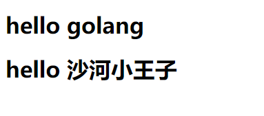
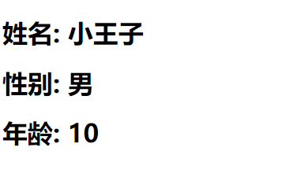
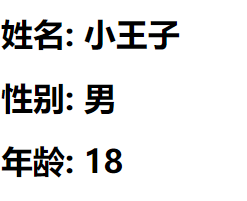

# http及Template介绍

## 来源

https://www.liwenzhou.com/posts/Go/go_template/

## 介绍

`html/template`包实现了数据驱动的模板，用于生成可防止代码注入的安全的HTML内容。它提供了和`text/template`包相同的接口，Go语言中输出HTML的场景都应使用`html/template`这个包。

## 模板与渲染

在一些前后端不分离的Web架构中，我们通常需要在后端将一些数据渲染到HTML文档中，从而实现动态的网页（网页的布局和样式大致一样，但展示的内容并不一样）效果。

我们这里说的模板可以理解为事先定义好的HTML文档文件，模板渲染的作用机制可以简单理解为文本替换操作–使用相应的数据去替换HTML文档中事先准备好的标记。

很多编程语言的Web框架中都使用各种模板引擎，比如Python语言中Flask框架中使用的jinja2模板引擎。

## Go语言的模板引擎

Go语言内置了文本模板引擎`text/template`和用于HTML文档的`html/template`。它们的作用机制可以简单归纳如下：

1. 模板文件通常定义为`.tmpl`和`.tpl`为后缀（也可以使用其他的后缀），必须使用`UTF8`编码。
2. 模板文件中使用`{{`和`}}`包裹和标识需要传入的数据。
3. 传给模板这样的数据就可以通过点号（`.`）来访问，如果数据是复杂类型的数据，可以通过{ { .FieldName }}来访问它的字段。
4. 除`{{`和`}}`包裹的内容外，其他内容均不做修改原样输出。

## 模板引擎的使用

Go语言模板引擎的使用可以分为三部分：定义模板文件、解析模板文件和模板渲染.

### 定义模板文件

其中，定义模板文件时需要我们按照相关语法规则去编写，后文会详细介绍。

### 解析模板文件

上面定义好了模板文件之后，可以使用下面的常用方法去解析模板文件，得到模板对象：

```go
func (t *Template) Parse(src string) (*Template, error)
func ParseFiles(filenames ...string) (*Template, error)
func ParseGlob(pattern string) (*Template, error)
```

当然，你也可以使用`func New(name string) *Template`函数创建一个名为`name`的模板，然后对其调用上面的方法去解析模板字符串或模板文件。

### 模板渲染

渲染模板简单来说就是使用数据去填充模板，当然实际上可能会复杂很多。

```go
func (t *Template) Execute(wr io.Writer, data interface{}) error
func (t *Template) ExecuteTemplate(wr io.Writer, name string, data interface{}) error
```

### 基本示例

#### 定义模板文件

我们按照Go模板语法定义一个`hello.tmpl`的模板文件，内容如下：

```html
<!DOCTYPE html>
<html lang="zh-CN">
<head>
    <title>hello</title>
</head>
<body>
    <h1> hello golang</h1>
    <h1>hello {{.}}</h1>
</body>
</html>
```

#### 解析和渲染模板文件

然后我们创建一个`main.go`文件，在其中写下HTTP server端代码如下：

```go
package main

import (
	"fmt"
	"html/template"
	"net/http"
	"os"
)

func sayHello(w http.ResponseWriter, r *http.Request) {
	// 获取项目的绝对路径
	wd, err := os.Getwd()
	if err != nil {
		fmt.Printf("get wd failed, err:%v \n", wd)
		return
	}
	fmt.Println("wd:", wd + "\\lesson04\\hello.tmpl")
	// 解析指定文件生成模板对象
	tmpl, err := template.ParseFiles( wd + "\\lesson04\\hello.tmpl")

	if err != nil {
		fmt.Println("create template failed, err:", err)
		return
	}
	// 利用给定数据渲染模板，并将结果写入w
	tmpl.Execute(w, "沙河小王子")
}
func main() {
	http.HandleFunc("/", sayHello)
	err := http.ListenAndServe(":9090", nil)
	if err != nil {
		fmt.Println("HTTP server failed,err:", err)
		return
	}
}
```

将上面的`main.go`文件编译执行，然后使用浏览器访问`http://127.0.0.1:9090`就能看到页面上显示了“Hello 沙河小王子”。 这就是一个最简单的模板渲染的示例，Go语言模板引擎详细用法请往下阅读。+

得到运行结果



## 模板语法

### {{.}}

模板语法都包含在`{{`和`}}`中间，其中`{{.}}`中的点表示当前对象。

当我们传入一个结构体对象时，我们可以根据`.`来访问结构体的对应字段。例如：

```go
package main

import (
	"fmt"
	"html/template"
	"net/http"
	"os"
)

//定义用户结构体
type User struct {
	Name string
	Gender string
	Age int
}

func sayHello(w http.ResponseWriter, r *http.Request) {
	// 获取项目的绝对路径
	wd, err := os.Getwd()
	if err != nil {
		fmt.Printf("get wd failed, err:%v \n", wd)
		return
	}
	fmt.Println("wd:", wd + "\\lesson05\\hello.tmpl")
	// 解析指定文件生成模板对象
	tmpl, err := template.ParseFiles( wd + "\\lesson05\\hello.tmpl")

	if err != nil {
		fmt.Println("create template failed, err:", err)
		return
	}

	u1 := User{
		Name: "小王子",
		Gender: "男",
		Age: 10,
	}

	// 利用给定数据渲染模板，并将结果写入w
	tmpl.Execute(w, u1)
}
func main() {
	http.HandleFunc("/", sayHello)
	err := http.ListenAndServe(":9090", nil)
	if err != nil {
		fmt.Println("HTTP server failed,err:", err)
		return
	}
}
```

模板文件`hello.tmpl`内容如下：

```html
<!DOCTYPE html>
<html lang="zh-CN">
<head>
    <meta charset="UTF-8">
    <meta name="viewport" content="width=device-width, initial-scale=1.0">
    <meta http-equiv="X-UA-Compatible" content="ie=edge">
    <title>Hello</title>
</head>
<body>
<h1>姓名: {{.Name}}</h1>
<h1>性别: {{.Gender}}</h1>
<h1>年龄: {{.Age}}</h1>
</body>
</html>
```

在浏览器输入如下网址

```bash
http://localhost:9090/sayHello
```

能够渲染出我们结构体中的值



同理，当我们传入的变量是map时，也可以在模板文件中通过`.`根据key来取值。

```go

// 采用一个map
m1 := map[string]interface{}{
    "Name": "小王子",
    "Age": 18,
    "Gender": "男",
}

// 利用给定数据渲染模板，并将结果写入w
tmpl.Execute(w, m1)
```

如果我们想把map 和 结构体都传递到前端，那么就需要在定义一个大的map来进行存储

```bash
	// 采用结构体
	u1 := User{
		Name: "小王子",
		Gender: "男",
		Age: 10,
	}

	// 采用一个map
	m1 := map[string]interface{}{
		"Name": "小王子",
		"Age": 18,
		"Gender": "男",
	}

	m2 := map[string]interface{}{
		"map": m1,
		"user": u1,
	}
```


### 注释

```template
{{/* a comment */}}
注释，执行时会忽略。可以多行。注释不能嵌套，并且必须紧贴分界符始止。
```

### pipeline

`pipeline`是指产生数据的操作。比如`{{.}}`、`{{.Name}}`等。Go的模板语法中支持使用管道符号`|`链接多个命令，用法和unix下的管道类似：`|`前面的命令会将运算结果(或返回值)传递给后一个命令的最后一个位置。

**注意：**并不是只有使用了`|`才是pipeline。Go的模板语法中，`pipeline的`概念是传递数据，只要能产生数据的，都是`pipeline`。

### 变量

我们还可以在模板中声明变量，用来保存传入模板的数据或其他语句生成的结果。具体语法如下：

```template
$obj := {{.}}
```

其中`$obj`是变量的名字，在后续的代码中就可以使用该变量了。

### 移除空格

有时候我们在使用模板语法的时候会不可避免的引入一下空格或者换行符，这样模板最终渲染出来的内容可能就和我们想的不一样，这个时候可以使用`{{-`语法去除模板内容左侧的所有空白符号， 使用`-}}`去除模板内容右侧的所有空白符号。

例如：

```template
{{- .Name -}}
```

**注意：**`-`要紧挨`{{`和`}}`，同时与模板值之间需要使用空格分隔。

### 条件判断

Go模板语法中的条件判断有以下几种:

```template
{{if pipeline}} T1 {{end}}

{{if pipeline}} T1 {{else}} T0 {{end}}

{{if pipeline}} T1 {{else if pipeline}} T0 {{end}}
```

### range

Go的模板语法中使用`range`关键字进行遍历，有以下两种写法，其中`pipeline`的值必须是数组、切片、字典或者通道。

```template
{{range pipeline}} T1 {{end}}
如果pipeline的值其长度为0，不会有任何输出

{{range pipeline}} T1 {{else}} T0 {{end}}
如果pipeline的值其长度为0，则会执行T0。
```

### with

```template
{{with pipeline}} T1 {{end}}
如果pipeline为empty不产生输出，否则将dot设为pipeline的值并执行T1。不修改外面的dot。

{{with pipeline}} T1 {{else}} T0 {{end}}
如果pipeline为empty，不改变dot并执行T0，否则dot设为pipeline的值并执行T1。
```

### 预定义函数

执行模板时，函数从两个函数字典中查找：首先是模板函数字典，然后是全局函数字典。一般不在模板内定义函数，而是使用Funcs方法添加函数到模板里。

预定义的全局函数如下：

```template
and
    函数返回它的第一个empty参数或者最后一个参数；
    就是说"and x y"等价于"if x then y else x"；所有参数都会执行；
or
    返回第一个非empty参数或者最后一个参数；
    亦即"or x y"等价于"if x then x else y"；所有参数都会执行；
not
    返回它的单个参数的布尔值的否定
len
    返回它的参数的整数类型长度
index
    执行结果为第一个参数以剩下的参数为索引/键指向的值；
    如"index x 1 2 3"返回x[1][2][3]的值；每个被索引的主体必须是数组、切片或者字典。
print
    即fmt.Sprint
printf
    即fmt.Sprintf
println
    即fmt.Sprintln
html
    返回与其参数的文本表示形式等效的转义HTML。
    这个函数在html/template中不可用。
urlquery
    以适合嵌入到网址查询中的形式返回其参数的文本表示的转义值。
    这个函数在html/template中不可用。
js
    返回与其参数的文本表示形式等效的转义JavaScript。
call
    执行结果是调用第一个参数的返回值，该参数必须是函数类型，其余参数作为调用该函数的参数；
    如"call .X.Y 1 2"等价于go语言里的dot.X.Y(1, 2)；
    其中Y是函数类型的字段或者字典的值，或者其他类似情况；
    call的第一个参数的执行结果必须是函数类型的值（和预定义函数如print明显不同）；
    该函数类型值必须有1到2个返回值，如果有2个则后一个必须是error接口类型；
    如果有2个返回值的方法返回的error非nil，模板执行会中断并返回给调用模板执行者该错误；
```

### 比较函数

布尔函数会将任何类型的零值视为假，其余视为真。

下面是定义为函数的二元比较运算的集合：

```template
eq      如果arg1 == arg2则返回真
ne      如果arg1 != arg2则返回真
lt      如果arg1 < arg2则返回真
le      如果arg1 <= arg2则返回真
gt      如果arg1 > arg2则返回真
ge      如果arg1 >= arg2则返回真
```

为了简化多参数相等检测，eq（只有eq）可以接受2个或更多个参数，它会将第一个参数和其余参数依次比较，返回下式的结果：

```template
{{eq arg1 arg2 arg3}}
```

比较函数只适用于基本类型（或重定义的基本类型，如”type Celsius float32”）。但是，整数和浮点数不能互相比较。

### 自定义函数

Go的模板支持自定义函数。

```go
package main

import (
	"fmt"
	"html/template"
	"net/http"
	"os"
)

/**
 * @Description f1函数
 * @Param 
 * @return
 **/
func f1(w http.ResponseWriter, r *http.Request) {
	// 定义模板
	// 解析模板
	// 获取项目的绝对路径
	wd, err := os.Getwd()
	if err != nil {
		fmt.Printf("get wd failed, err:%v \n", wd)
		return
	}

	// 定义一个自定义函数
	// 要么只有一个返回值，要么有两个返回值，第二个返回值必须是error类型
	kua := func(name string)(string, error) {
		return name + "年轻又帅气!", nil
	}

	// 创建一个名字为f的模板对象。注意，这个名字一定要和模板的名字对应上
	tmpl := template.New("hello.tmpl")

	// 告诉模板引擎，我现在多了一个自定义的函数kua
	tmpl.Funcs(template.FuncMap{
		"kua": kua,
	})

	// 解析模板
	_, err = tmpl.ParseFiles( wd + "\\lesson06\\hello.tmpl")
	if err != nil {
		fmt.Printf("parse template failed, err:%v \n", err)
		return
	}

	// 采用一个map
	m1 := map[string]interface{}{
		"Name": "小王子",
		"Age": 18,
		"Gender": "男",
	}

	// 渲染模板
	tmpl.Execute(w, m1)
}
func main() {
	http.HandleFunc("/hello", f1)
	err := http.ListenAndServe(":9090", nil)
	if err != nil {
		fmt.Println("HTTP server failed,err:", err)
		return
	}
}
```

我们可以在模板文件`hello.tmpl`中按照如下方式使用我们自定义的`kua`函数了。

```template
{{kua .Name}}
```

最后运行的结果


### 模板的嵌套template

我们可以在template中嵌套其他的template。这个template可以是单独的文件，也可以是通过`define`定义的template。

举个例子： `t.tmpl`文件内容如下：

```template
<!DOCTYPE html>
<html lang="zh-CN">
<head>
    <meta charset="UTF-8">
    <meta name="viewport" content="width=device-width, initial-scale=1.0">
    <meta http-equiv="X-UA-Compatible" content="ie=edge">
    <title>tmpl test</title>
</head>
<body>
    
    <h1>测试嵌套template语法</h1>
    <hr>
    {{template "ul.tmpl"}}
    <hr>
    {{template "ol.tmpl"}}
</body>
</html> 

{{ define "ol.tmpl"}}
<ol>
    <li>吃饭</li>
    <li>睡觉</li>
    <li>打豆豆</li>
</ol>
{{end}}
```

`ul.tmpl`文件内容如下：

```template
<ul>
    <li>注释</li>
    <li>日志</li>
    <li>测试</li>
</ul>
```

我们注册一个`templDemo`路由处理函数.

```go
http.HandleFunc("/tmpl", tmplDemo)
```

`tmplDemo`函数的具体内容如下：

```go
func tmplDemo(w http.ResponseWriter, r *http.Request) {
	tmpl, err := template.ParseFiles("./t.tmpl", "./ul.tmpl")
	if err != nil {
		fmt.Println("create template failed, err:", err)
		return
	}
	user := UserInfo{
		Name:   "小王子",
		Gender: "男",
		Age:    18,
	}
	tmpl.Execute(w, user)
}
```

**注意**：在解析模板时，被嵌套的模板一定要在后面解析，例如上面的示例中`t.tmpl`模板中嵌套了`ul.tmpl`，所以`ul.tmpl`要在`t.tmpl`后进行解析。

### block

```template
{{block "name" pipeline}} T1 {{end}}
```

`block`是定义模板`{{define "name"}} T1 {{end}}`和执行`{{template "name" pipeline}}`缩写，典型的用法是定义一组根模板，然后通过在其中重新定义块模板进行自定义。

定义一个根模板`templates/base.tmpl`，内容如下：

```template
<!DOCTYPE html>
<html lang="zh-CN">
<head>
    <title>Go Templates</title>
</head>
<body>
<div class="container-fluid">
    {{block "content" . }}{{end}}
</div>
</body>
</html>
```

然后定义一个`templates/index.tmpl`，”继承”`base.tmpl`：

```tempalte
{{template "base.tmpl"}}

{{define "content"}}
    <div>Hello world!</div>
{{end}}
```

然后使用`template.ParseGlob`按照正则匹配规则解析模板文件，然后通过`ExecuteTemplate`渲染指定的模板：

```go
func index(w http.ResponseWriter, r *http.Request){
	tmpl, err := template.ParseGlob("templates/*.tmpl")
	if err != nil {
		fmt.Println("create template failed, err:", err)
		return
	}
	err = tmpl.ExecuteTemplate(w, "index.tmpl", nil)
	if err != nil {
		fmt.Println("render template failed, err:", err)
		return
	}
}
```

如果我们的模板名称冲突了，例如不同业务线下都定义了一个`index.tmpl`模板，我们可以通过下面两种方法来解决。

1. 在模板文件开头使用`{{define 模板名}}`语句显式的为模板命名。
2. 可以把模板文件存放在`templates`文件夹下面的不同目录中，然后使用`template.ParseGlob("templates/**/*.tmpl")`解析模板。

### 修改默认的标识符

Go标准库的模板引擎使用的花括号`{{`和`}}`作为标识，而许多前端框架（如`Vue`和 `AngularJS`）也使用`{{`和`}}`作为标识符，所以当我们同时使用Go语言模板引擎和以上前端框架时就会出现冲突，这个时候我们需要修改标识符，修改前端的或者修改Go语言的。这里演示如何修改Go语言模板引擎默认的标识符：

```go
template.New("test").Delims("{[", "]}").ParseFiles("./t.tmpl")
```

最后我们在渲染的时候

```html
<!DOCTYPE html>
<html lang="zh-CN">
<head>
    <meta charset="UTF-8">
    <meta name="viewport" content="width=device-width, initial-scale=1.0">
    <meta http-equiv="X-UA-Compatible" content="ie=edge">
    <title>自定义模板函数</title>
</head>
<body>
<h1>姓名: {[.Name]}</h1>
<h1>性别: {[.Gender]}</h1>
<h1>年龄: {[.Age]}</h1>
</body>
</html>
```

最后运行结果，发现也能够正常显示



## text/template与html/tempalte的区别

`html/template`针对的是需要返回HTML内容的场景，在模板渲染过程中会对一些有风险的内容进行转义，以此来防范跨站脚本攻击。

例如，我定义下面的模板文件：

```template
<!DOCTYPE html>
<html lang="zh-CN">
<head>
    <meta charset="UTF-8">
    <meta name="viewport" content="width=device-width, initial-scale=1.0">
    <meta http-equiv="X-UA-Compatible" content="ie=edge">
    <title>Hello</title>
</head>
<body>
    {{.}}
</body>
</html>
```

这个时候传入一段JS代码并使用`html/template`去渲染该文件，会在页面上显示出转义后的JS内容。 `alert('嘿嘿嘿')` 这就是`html/template`为我们做的事。

但是在某些场景下，我们如果相信用户输入的内容，不想转义的话，可以自行编写一个safe函数，手动返回一个`template.HTML`类型的内容。示例如下：

```go
func xss(w http.ResponseWriter, r *http.Request){
	tmpl,err := template.New("xss.tmpl").Funcs(template.FuncMap{
		"safe": func(s string)template.HTML {
			return template.HTML(s)
		},
	}).ParseFiles("./xss.tmpl")
	if err != nil {
		fmt.Println("create template failed, err:", err)
		return
	}
	jsStr := `<script>alert('嘿嘿嘿')</script>`
	err = tmpl.Execute(w, jsStr)
	if err != nil {
		fmt.Println(err)
	}
}
```

这样我们只需要在模板文件不需要转义的内容后面使用我们定义好的safe函数就可以了。

```template
{{ . | safe }}
```