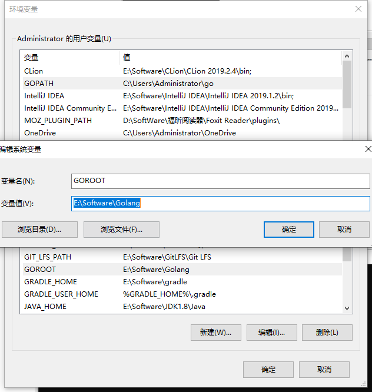
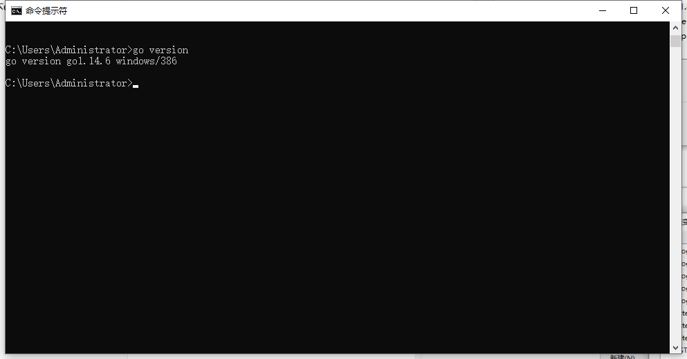

# Windows下Go语言的安装

## 前言

这阵子因为以后工作的原因，所以开始了go语言的学习之旅，工欲善其事必先利其器，首先就得把go语言环境搭建完成

## 下载Go

因为go语言的官网经常打不开，所以我就找了一个 [镜像网站](https://studygolang.com/dl)，里面有很多版本的Go语言，选择自己合适的，比如我的是Windows电脑，所以我选中里面的Windows版本的


下载完成是一个安装文件，我们需要进行安装，同时需要注意的就是安装目录，因为事后还需要配置环境变量，下面是安装成功后的图片


## 配置环境变量

根据windows系统在查找可执行程序的原理，可以将Go所在路径定义到环境变量中，让系统帮我们去找运行的执行程序，这样在任何目录下都可以执行go指令，需要配置的环境变量有：

| 环境变量 | 说明              |
| -------- | ----------------- |
| GOROOT   | 指定SDK的安装目录 |
| Path     | 添加SDK的/binmulu |
| GOPATH   | 工作目录          |

首先我们需要打开我们的环境变量，然后添加上GOROOT



然后我们在PATH上添加我们的bin目录


添加完成后，我们输入下面的命令，查看是否配置成功

```bash
go version
```



## 下载Jetbrain下的GoLang

在我们配置好环境，我们就可以使用Jetbrain公司开发的Goland编辑器了，首先进入官网下载

https://www.jetbrains.com/

下载完成后，进行启动


启动完成后，我们需要配置一下环境，点击：File ->settings -> GOROOT，配置一下刚刚go安装的目录


以及GOPATH项目所在的目录


## hello world

在上面的方法都完成以后，我来来输出hello world吧~

```go
package main

import "fmt"

func main() {
	fmt.Println("hello world!")
}
```

代码的说明

- go文件的后缀是.go
- package main：表示该hello.go文件所在的包是main，在go中，每个文件都归属与一个包
- import "fmt"：表示引入一个包，可以调用里面的函数
- func main()：表示程序入口，是一个主函数

输出结果


## 编译和执行

我们可以通过使用下面命令进行编译和执行

```bash
# 编译 hello.go 后 会生成一个 hello.exe文件
go build hello.go
# 运行 hello.ext
hello.ext
```

需要注意的是，我们也可以使用下面的方式，来直接运行的（使用go run会比较慢，因为内部有个编译的过程）

```bash
go run hello.go
```

但是在生产环境中，是需要先编译在执行的

