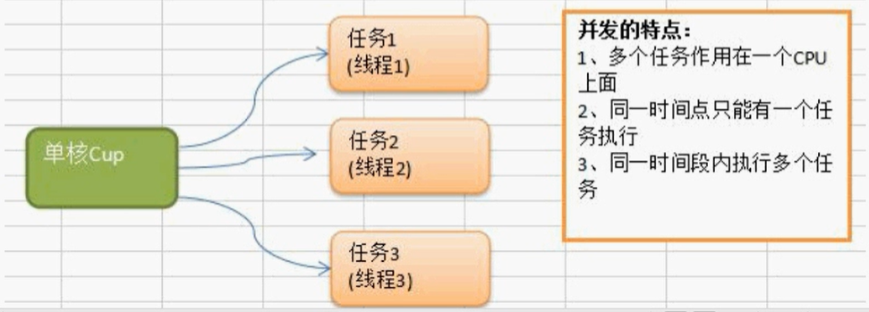

# Golang goroutine channel 实现并发和并行

## 为什么要使用goroutine呢

需求：要统计1-10000000的数字中那些是素数，并打印这些素数？

素数：就是除了1和它本身不能被其他数整除的数

**实现方法：**

- 传统方法，通过一个for循环判断各个数是不是素数
- 使用并发或者并行的方式，将统计素数的任务分配给多个goroutine去完成，这个时候就用到了goroutine
- goroutine 结合 channel

## 进程、线程以及并行、并发

### 进程

进程（Process）就是程序在操作系统中的一次执行过程，是系统进行资源分配和调度的基本单位，进程是一个动态概念，是程序在执行过程中分配和管理资源的基本单位，每一个进程都有一个自己的地址空间。一个进程至少有5种基本状态，它们是：初始态，执行态，等待状态，就绪状态，终止状态。

通俗的讲进程就是一个正在执行的程序。

### 线程

线程是进程的一个执行实例，是程序执行的最小单元，它是比进程更小的能独立运行的基本单位

一个进程可以创建多个线程，同一个进程中多个线程可以并发执行 ，一个线程要运行的话，至少有一个进程

### 并发和并行

并发：多个线程同时竞争一个位置，竞争到的才可以执行，每一个时间段只有一个线程在执行。

并行：多个线程可以同时执行，每一个时间段，可以有多个线程同时执行。

通俗的讲多线程程序在单核CPU上面运行就是并发，多线程程序在多核CUP上运行就是并行，如果线程数大于CPU核数，则多线程程序在多个CPU上面运行既有并行又有并发




## Golang中协程（goroutine）以及主线程

golang中的主线程：（可以理解为线程/也可以理解为进程），在一个Golang程序的主线程上可以起多个协程。Golang中多协程可以实现并行或者并发。

**协程**：可以理解为用户级线程，这是对内核透明的，也就是系统并不知道有协程的存在，是完全由用户自己的程序进行调度的。Golang的一大特色就是从语言层面原生持协程，在函数或者方法前面加go关键字就可创建一个协程。可以说Golang中的协程就是goroutine。


Golang中的多协程有点类似于Java中的多线程

### 多协程和多线程

多协程和多线程：Golang中每个goroutine（协程）默认占用内存远比Java、C的线程少。

OS线程（操作系统线程）一般都有固定的栈内存（通常为2MB左右），一个goroutine（协程）占用内存非常小，只有2KB左右，多协程goroutine切换调度开销方面远比线程要少。

这也是为什么越来越多的大公司使用Golang的原因之一。

## goroutine的使用以及sync.WaitGroup

### 并行执行需求

在主线程（可以理解成进程）中，开启一个goroutine，该协程每隔50毫秒秒输出“你好golang"

在主线程中也每隔50毫秒输出“你好golang"，输出10次后，退出程序，要求主线程和goroutine同时执行。

这是时候，我们就可以开启协程来了，通过 go关键字开启

```go
// 协程需要运行的方法
func test()  {
	for i := 0; i < 5; i++ {
		fmt.Println("test 你好golang")
		time.Sleep(time.Millisecond * 100)
	}
}
func main() {

	// 通过go关键字，就可以直接开启一个协程
	go test()

	// 这是主进程执行的
	for i := 0; i < 5; i++ {
		fmt.Println("main 你好golang")
		time.Sleep(time.Millisecond * 100)
	}
}
```

运行结果如下，我们能够看到他们之间不存在所谓的顺序关系了

```go
main 你好golang
test 你好golang
main 你好golang
test 你好golang
test 你好golang
main 你好golang
main 你好golang
test 你好golang
test 你好golang
main 你好golang
```

但是上述的代码其实还有问题的，也就是说当主进程执行完毕后，不管协程有没有执行完成，都会退出


这是使用我们就需要用到  sync.WaitGroup等待协程

首先我们需要创建一个协程计数器

```go
// 定义一个协程计数器
var wg sync.WaitGroup
```

然后当我们开启协程的时候，我们要让计数器加1

```go
// 开启协程，协程计数器加1
wg.Add(1)
go test2()
```

当我们协程结束前，我们需要让计数器减1

```go
// 协程计数器减1
wg.Done()
```

完整代码如下

```go
// 定义一个协程计数器
var wg sync.WaitGroup

func test()  {
	// 这是主进程执行的
	for i := 0; i < 1000; i++ {
		fmt.Println("test1 你好golang", i)
		//time.Sleep(time.Millisecond * 100)
	}
	// 协程计数器减1
	wg.Done()
}

func test2()  {
	// 这是主进程执行的
	for i := 0; i < 1000; i++ {
		fmt.Println("test2 你好golang", i)
		//time.Sleep(time.Millisecond * 100)
	}
	// 协程计数器减1
	wg.Done()
}

func main() {

	// 通过go关键字，就可以直接开启一个协程
	wg.Add(1)
	go test()

	// 协程计数器加1
	wg.Add(1)
	go test2()

	// 这是主进程执行的
	for i := 0; i < 1000; i++ {
		fmt.Println("main 你好golang", i)
		//time.Sleep(time.Millisecond * 100)
	}
	// 等待所有的协程执行完毕
	wg.Wait()
	fmt.Println("主线程退出")
}
```

## 设置Go并行运行的时候占用的cpu数量

Go运行时的调度器使用GOMAXPROCS参数来确定需要使用多少个OS线程来同时执行Go代码。默认值是机器上的CPU核心数。例如在一个8核心的机器上，调度器会把Go代码同时调度到8个oS线程上。

Go 语言中可以通过runtime.GOMAXPROCS（）函数设置当前程序并发时占用的CPU逻辑核心数。

Go1.5版本之前，默认使用的是单核心执行。Go1.5版本之后，默认使用全部的CPU逻辑核心数。

```go
func main() {
	// 获取cpu个数
	npmCpu := runtime.NumCPU()
	fmt.Println("cup的个数:", npmCpu)
	// 设置允许使用的CPU数量
	runtime.GOMAXPROCS(runtime.NumCPU() - 1)
}
```

## for循环开启多个协程

类似于Java里面开启多个线程，同时执行

```go
func test(num int)  {
	for i := 0; i < 10; i++ {
		fmt.Printf("协程（%v）打印的第%v条数据 \n", num, i)
	}
	// 协程计数器减1
	vg.Done()
}

var vg sync.WaitGroup

func main() {
	for i := 0; i < 10; i++ {
		go test(i)
		vg.Add(1)
	}
	vg.Wait()
	fmt.Println("主线程退出")
}
```

因为我们协程会在主线程退出后就终止，所以我们还需要使用到  sync.WaitGroup来控制主线程的终止。

## Channel管道

管道是Golang在语言级别上提供的goroutine间的通讯方式，我们可以使用channel在多个goroutine之间传递消息。如果说goroutine是Go程序并发的执行体，channel就是它们之间的连接。channel是可以让一个goroutine发送特定值到另一个goroutine的通信机制。

Golang的并发模型是CSP（Communicating Sequential Processes），提倡通过通信共享内存而不是通过共享内存而实现通信。

Go语言中的管道（channel）是一种特殊的类型。管道像一个传送带或者队列，总是遵循先入先出（First In First Out）的规则，保证收发数据的顺序。每一个管道都是一个具体类型的导管，也就是声明channel的时候需要为其指定元素类型。

### channel类型

channel是一种类型，一种引用类型。声明管道类型的格式如下：

```go
// 声明一个传递整型的管道
var ch1 chan int
// 声明一个传递布尔类型的管道
var ch2 chan bool
// 声明一个传递int切片的管道
var ch3 chan []int
```

### 创建channel

声明管道后，需要使用make函数初始化之后才能使用

```go
make(chan 元素类型, 容量)
```

举例如下：

```go
// 创建一个能存储10个int类型的数据管道
ch1 = make(chan int, 10)
// 创建一个能存储4个bool类型的数据管道
ch2 = make(chan bool, 4)
// 创建一个能存储3个[]int切片类型的管道
ch3 = make(chan []int, 3)
```

### channel操作

管道有发送，接收和关闭的三个功能

发送和接收 都使用 <- 符号

现在我们先使用以下语句定义一个管道：

```go
ch := make(chan int, 3)
```

#### 发送

将数据放到管道内，将一个值发送到管道内

```go
// 把10发送到ch中
ch <- 10
```

#### 取操作

```go
x := <- ch
```

#### 关闭管道.

通过调用内置的close函数来关闭管道

```go
close(ch)
```


#### 完整示例

```go
// 创建管道
ch := make(chan int, 3)

// 给管道里面存储数据
ch <- 10
ch <- 21
ch <- 32

// 获取管道里面的内容
a := <- ch
fmt.Println("打印出管道的值：", a)
fmt.Println("打印出管道的值：", <- ch)
fmt.Println("打印出管道的值：", <- ch)

// 管道的值、容量、长度
fmt.Printf("地址：%v 容量：%v 长度：%v \n", ch, cap(ch), len(ch))

// 管道的类型
fmt.Printf("%T \n", ch)

// 管道阻塞（当没有数据的时候取，会出现阻塞，同时当管道满了，继续存也会）
<- ch  // 没有数据取，出现阻塞
ch <- 10
ch <- 10
ch <- 10
ch <- 10 // 管道满了，继续存，也出现阻塞
```

## for range从管道循环取值

当向管道中发送完数据时，我们可以通过close函数来关闭管道，当管道被关闭时，再往该管道发送值会引发panic，从该管道取值的操作会去完管道中的值，再然后取到的值一直都是对应类型的零值。那如何判断一个管道是否被关闭的呢？

```go
// 创建管道
ch := make(chan int, 10)
// 循环写入值
for i := 0; i < 10; i++ {
    ch <- i
}
// 关闭管道
close(ch)

// for range循环遍历管道的值(管道没有key)
for value := range ch {
    fmt.Println(value)
}
// 通过上述的操作，能够打印值，但是出出现一个deadlock的死锁错误，也就说我们需要关闭管道
```

注意：使用for range遍历的时候，一定在之前需要先关闭管道

思考：通过for循环来遍历管道，需要关闭么？

```go
// 创建管道
ch := make(chan int, 10)
// 循环写入值
for i := 0; i < 10; i++ {
    ch <- i
}

for i := 0; i < 10; i++ {
    fmt.Println(<- ch)
}
```

上述代码没有报错，说明通过for i的循环方式，可以不关闭管道

## Goroutine 结合 channel 管道

需求1：定义两个方法，一个方法给管道里面写数据，一个给管道里面读取数据。要求同步进行。

- 开启一个fn1的的协程给向管道inChan中写入00条数据
- 开启一个fn2的协程读取inChan中写入的数据
- 注意：fn1和fn2同时操作一个管道
- 主线程必须等待操作完成后才可以退出

```go
func write(ch chan int)  {
	for i := 0; i < 10; i++ {
		fmt.Println("写入:", i)
		ch <- i
		time.Sleep(time.Microsecond * 10)
	}
	wg.Done()
}
func read(ch chan int)  {
	for i := 0; i < 10; i++ {
		fmt.Println("读取:", <- ch)
		time.Sleep(time.Microsecond * 10)
	}
	wg.Done()
}
var wg sync.WaitGroup
func main() {
	ch := make(chan int, 10)
	wg.Add(1)
	go write(ch)
	wg.Add(1)
	go read(ch)

	// 等待
	wg.Wait()
	fmt.Println("主线程执行完毕")
}
```

管道是安全的，是一边写入，一边读取，当读取比较快的时候，会等待写入

## goroutine 结合 channel打印素数


```go
// 想intChan中放入 1~ 120000个数
func putNum(intChan chan int)  {
	for i := 2; i < 120000; i++ {
		intChan <- i
	}
	wg.Done()
	close(intChan)
}

// cong intChan取出数据，并判断是否为素数，如果是的话，就把得到的素数放到primeChan中
func primeNum(intChan chan int, primeChan chan int, exitChan chan bool)  {
	for value := range intChan {
		var flag = true
		for i := 2; i <= int(math.Sqrt(float64(value))); i++ {
			if  i % i == 0 {
				flag = false
				break
			}
		}
		if flag {
			// 是素数
			primeChan <- value
			break
		}
	}

	// 这里需要关闭 primeChan，因为后面需要遍历输出 primeChan
	exitChan <- true

	wg.Done()
}

// 打印素数
func printPrime(primeChan chan int)  {
	for value := range primeChan {
		fmt.Println(value)
	}
	wg.Done()
}


var wg sync.WaitGroup
func main() {
	// 写入数字
	intChan := make(chan int, 1000)

	// 存放素数
	primeChan := make(chan int, 1000)

	// 存放 primeChan退出状态
	exitChan := make(chan bool, 16)

	// 开启写值的协程
	go putNum(intChan)

	// 开启计算素数的协程
	for i := 0; i < 10; i++ {
		wg.Add(1)
		go primeNum(intChan, primeChan, exitChan)
	}

	// 开启打印的协程
	wg.Add(1)
	go printPrime(primeChan)

	// 匿名自运行函数
	wg.Add(1)
	go func() {
		for i := 0; i < 16; i++ {
			// 如果exitChan 没有完成16次遍历，将会等待
			<- exitChan
		}
		// 关闭primeChan
		close(primeChan)
		wg.Done()
	}()

	wg.Wait()
	fmt.Println("主线程执行完毕")
	
}
```

## 单向管道

有时候我们会将管道作为参数在多个任务函数间传递，很多时候我们在不同的任务函数中，使用管道都会对其进行限制，比如限制管道在函数中只能发送或者只能接受

> 默认的管道是 可读可写

```go
// 定义一种可读可写的管道
var ch = make(chan int, 2)
ch <- 10
<- ch

// 管道声明为只写管道，只能够写入，不能读
var ch2 = make(chan<- int, 2)
ch2 <- 10

// 声明一个只读管道
var ch3 = make(<-chan int, 2)
<- ch3
```

## Select多路复用

在某些场景下我们需要同时从多个通道接收数据。这个时候就可以用到golang中给我们提供的select多路复用。
通常情况通道在接收数据时，如果没有数据可以接收将会发生阻塞。

比如说下面代码来实现从多个通道接受数据的时候就会发生阻塞

这种方式虽然可以实现从多个管道接收值的需求，但是运行性能会差很多。为了应对这种场景，Go内置了select关键字，可以同时响应多个管道的操作。

select的使用类似于switch 语句，它有一系列case分支和一个默认的分支。每个case会对应一个管道的通信（接收或发送）过程。select会一直等待，直到某个case的通信操作完成时，就会执行case分支对应的语句。具体格式如下：

```go
intChan := make(chan int, 10)
intChan <- 10
intChan <- 12
intChan <- 13
stringChan := make(chan int, 10)
stringChan <- 20
stringChan <- 23
stringChan <- 24

// 每次循环的时候，会随机中一个chan中读取，其中for是死循环
for {
    select {
        case v:= <- intChan:
        fmt.Println("从initChan中读取数据：", v)
        case v:= <- stringChan:
        fmt.Println("从stringChan中读取数据：", v)
        default:
        fmt.Println("所有的数据获取完毕")
        return
    }
}
```

> tip：使用select来获取数据的时候，不需要关闭chan，不然会出现问题

## Goroutine Recover解决协程中出现的Panic

```go
func sayHello()  {
	for i := 0; i < 10; i++ {
		fmt.Println("hello")
	}
}
func errTest()  {
	// 捕获异常
	defer func() {
		if err := recover(); err != nil {
			fmt.Println("errTest发生错误")
		}
	}()
	var myMap map[int]string
	myMap[0] = "10"
}
func main {
    go sayHello()
    go errTest()
}
```

当我们出现问题的时候，我们还是按照原来的方法，通过defer func创建匿名自启动

```go
// 捕获异常
defer func() {
    if err := recover(); err != nil {
        fmt.Println("errTest发生错误")
    }
}()
```

## Go中的并发安全和锁

如下面一段代码，我们在并发环境下进行操作，就会出现并发访问的问题

```go
var count = 0
var wg sync.WaitGroup

func test()  {
	count++
	fmt.Println("the count is : ", count)
	time.Sleep(time.Millisecond)
	wg.Done()
}
func main() {
	for i := 0; i < 20; i++ {
		wg.Add(1)
		go test()
	}
	time.Sleep(time.Second * 10)
}
```

### 互斥锁

互斥锁是传统并发编程中对共享资源进行访问控制的主要手段，它由标准库sync中的Mutex结构体类型表示。sync.Mutex类型只有两个公开的指针方法，Lock和Unlock。Lock锁定当前的共享资源，Unlock 进行解锁

```go
// 定义一个锁
var mutex sync.Mutex
// 加锁
mutex.Lock()
// 解锁
mutex.Unlock()
```

完整代码

```go
var count = 0
var wg sync.WaitGroup
var mutex sync.Mutex

func test()  {
	// 加锁
	mutex.Lock()
	count++
	fmt.Println("the count is : ", count)
	time.Sleep(time.Millisecond)
	wg.Done()
	// 解锁
	mutex.Unlock()
}
func main() {
	for i := 0; i < 20; i++ {
		wg.Add(1)
		go test()
	}
	time.Sleep(time.Second * 10)
}
```

通过下面命令，build的时候，可以查看是否具有竞争关系

```go
// 通过 -race 参数进行构建
go build -race main.go
// 运行插件
main.ext
```

### 读写互斥锁

互斥锁的本质是当一个goroutine访问的时候，其他goroutine都不能访问。这样在资源同步，避免竞争的同时也降低了程序的并发性能。程序由原来的并行执行变成了串行执行。

其实，当我们对一个不会变化的数据只做“读”操作的话，是不存在资源竞争的问题的。因为数据是不变的，不管怎么读取，多少goroutine同时读取，都是可以的。

所以问题不是出在“读”上，主要是修改，也就是“写”。修改的数据要同步，这样其他goroutine才可以感知到。所以真正的互斥应该是读取和修改、修改和修改之间，读和读是没有互斥操作的必要的。

因此，衍生出另外一种锁，叫做读写锁。

读写锁可以让多个读操作并发，同时读取，但是对于写操作是完全互斥的。也就是说，当一个goroutine进行写操作的时候，其他goroutine既不能进行读操作，也不能进行写操作。

GO中的读写锁由结构体类型sync.RWMutex表示。此类型的方法集合中包含两对方法：