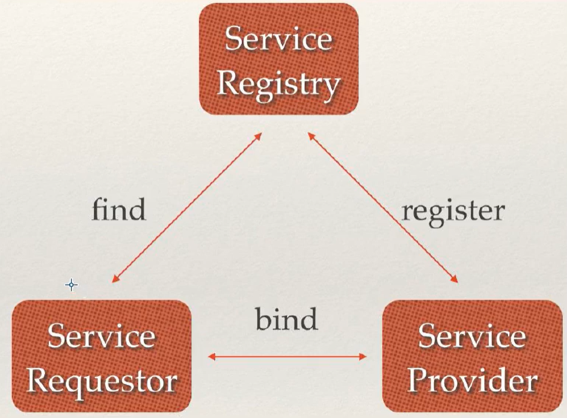
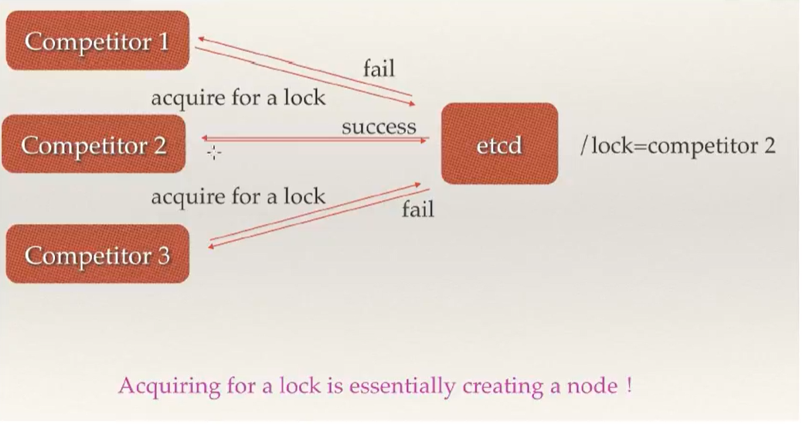
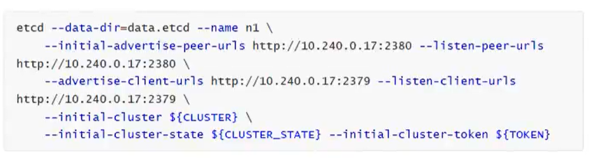
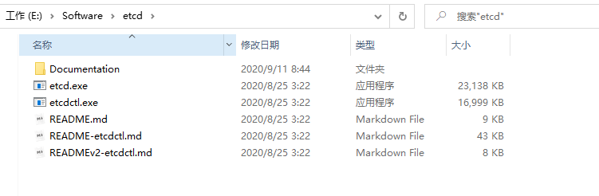
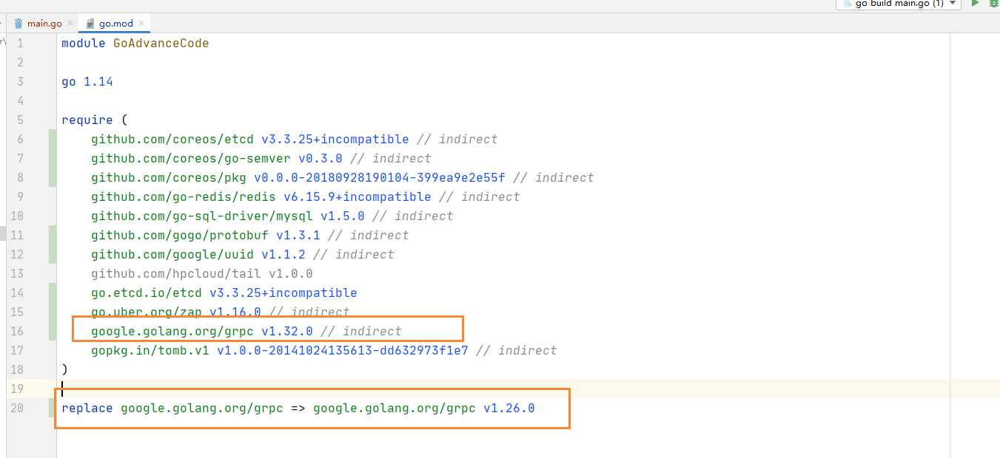

# etcd介绍

### 前言

etcd：目前比较火的开源库，docker和k8s都是使用的它

目标：使用etcd优化日志收集项目

## 介绍

etcd是使用Go语言开发的一个开源的、高可用的分布式key-value存储系统，可以用于配置共享和服务的注册和发现，类似项目有Zookeeper和consul

etcd具有以下特点

- 完全复制：集群中的每个节点都可以使用完整的存档
- 高可用性：Etcd可用于避免硬件的单点故障或网络问题（选择出另外的leader）
- 一致性：每次读取都会返回跨多主机的最新写入
- 简单：包括一个定义良好、面向用户的API（gRPC）
- 安全：实现了带有可选的客户端证书身份验证的自动化TLS
- 快速：每秒10000次写入的基准速度
- 可靠：使用 **Raft** 算法实现了强一致性，高可用的服务存储目录
  - Raft协议：选举、日志复制机制、异常处理（脑裂）、Zookeeper的zad协议的区别

## etcd应用场景

### 服务发现

服务发现要解决的也是分布式系统中最常见的问题之一，即在同一个分布式集群中的进程或服务，要如何才能找到对方并建立连接。本质上来说，服务发现就是想要了解集群中是否有进程在监听udp或tcp端口，并且通过名字就可以查找和连接。



### 配置中心

将一些配置信息放到etcd上进行集中管理。这类场景的使用方式通常是这样的：应用启动的时候，主动从etcd获取一次配置信息，同时，在etcd节点上注册一个Watcher并等待，以后每次配置有更新的时候，etcd都会实时通知订阅者，以此达到获取最新配置信息的目的。

### 分布式锁

因为etcd使用Raft算法保持了数据的强一致性，某次操作存储到集群中的值必然是全局一致性的，所以很容易实现分布式锁。锁服务有两种使用方式，一种是保持独占，二是控制时序。

- 保持独占即所有获取锁的用户最终只有一个可以得到。etcd为此提供了一套实现分布式锁原子操作CAS（CompareAndSwap）的API。通过设置preExist值，可以保证在多个节点同时去创建某个目录时，只有一个成功，而创建成功的用户就可以认为是获得了锁。
- 控制时序，即所有想要获得锁的用户都会被安排执行，但是获得锁的顺序也是全局唯一的，同时决定了执行顺序。etcd为此也提供了一套API（自动创建有序键），对一个目录建值时指定为POST动作，这样etcd会自动在目录下生成一个当前最大的键值。此时这些键的值就是客户端的时序，而这些键中的存储的值可以代表客户端的编号。



上图就是三个同时来竞争锁，最后只有一个获取到了锁

## 为什么使用etcd而不用Zookeeper？

### Zookeeper存在的问题

etcd 实现的这些功能，ZooKeeper都能实现。那么为什么要用etcd 而非直接使用ZooKeeper呢？相较之下，ZooKeeper有如下缺点：

- **复杂**：ZooKeeper的部署维护复杂，管理员需要掌握一系列的知识和技能；而Paxos 强一致性算法也是素来以复杂难懂而闻名于世；另外，ZooKeeper的使用也比较复杂，需要安装客户端，官方只提供了Java和C两种语言的接口。
- **Java编写**：这里不是对Java有偏见，而是Java本身就偏向于重型应用，它会引入大量的依赖。而运维人员则普遍希望保持强一致、高可用的机器集群尽可能简单，维护起来也不易出错。
- **发展缓慢**：Apache 基金会项目特有的"Apache Way”在开源界饱受争议，其中一大原因就是由于基金会庞大的结构以及松散的管理导致项目发展缓慢。

### etcd的优势

而etcd作为一个后起之秀，其优点也很明显

**简单**：使用Go语言编写部署简单；使用HTTP作为接口使用简单；使用Raft 算法保证强一致性让用户易于理解。

**数据持久化**：etcd 默认数据一更新就进行持久化。

**安全**：etcd 支持SSL客户端安全认证。

最后，etcd作为一个年轻的项目，真正告诉迭代和开发中，这既是一个优点，也是一个缺点。优点是它的未来具有无限的可能性，缺点是无法得到大项目长时间使用的检验。然而，目前CoreOS、Kubernetes 和CloudFoundry等知名项目均在生产环境中使用了etcd，所以总的来说，etcd值得你去尝试。

## etcd架构


从etcd的架构图中我们可以看到，etcd主要分为四个部分

- HTTP Server：用于处理用户发送的API请求以及其他etcd节点的同步与心跳信息请求
- Store：用于处理etcd支持的各类功能的事务，包括数据索引、节点状态变更、监控与反馈、事件处理与执行等等，是etcd对用户提供的大多数API功能的具体实现
- Raft：Raft强一致性算法的具体实现，是etcd的核心
- WAL：Write Ahead Log（预写式日志），是etcd的数据存储方式。除了在内存中存有所有数据的状态以及节点的索引以外，etcd就通过WAL进行持久化存储。WAL中，所有的数据提交前都会实现记录日志。Snapshot是为了防止数据过多而进行的状态快照；Entry表示存储的具体日志内容。

### etcd集群

etcd作为一个高可用键值存储系统，天生就是为集群化而设计的，由于Raft算法在做决策时需要多数节点投票，所以etcd一般部署集群推荐奇数个节点，推荐的数量为3、5或者7个节点构成一个集群。

## 搭建一个3节点集群示例

在每个etcd节点指定集群成员，为了区分不同的集群最好同时配置一个独一无二的token。

下面是提前定义好的集群信息，其中n1、n2和n3表示3个不同的etcd节点。


在n1这台机器上执行以下命令来启动etcd：



在n2这台机器上执行以下命令启动etcd：


在n3这台机器上执行以下命令启动etcd：


etcd官网提供了一个公网访问的etcd存储地址，你可以通过如下命令得到etcd服务的目录，并把它作为-discovery参数使用

## etcd部署

### 下载

找到对应的 **Github官网**，到相应的releases，找到windows平台的压缩包进行下载


解压完成后的目录



### 启动

双击etcd.exe就是启动了etcd。其它平台解压之后在bin目录下找etcd可执行文件。

默认会在2379端口监听客户端通信，在2380端口监听节点间的通信。


etcdctl.ext可以理解为一个客户端或者本机etcd的控制端

### 连接

默认的etcdctrl使用的是v2版本的命令，我们需要设置环境变量ETCDCTL_API=3来使用v3版本的API，而默认的也就是环境变量为ETCDCTL_API=2是使用v2版本的API

修改环境变量指定使用API的版本

```bash
SET_ETCDCTL_API=3
```

### 简单使用

#### put：设置

```bash
.\etcdctl.exe --endpoints=http://127.0.0.1:2379 put baodelu "dsb"
```


显示设置成功~

#### get：获取

```bash
.\etcdctl.exe --endpoints=http://127.0.0.1:2379 get baodelu
```

#### del：删除

```bash
.\etcdctl.exe --endpoints=http://127.0.0.1:2379 del baodelu
```

## Go操作etcd

### 安装依赖

这里使用官方的 etcd/clientv3包来连接etcd并进行相关操作

```bash
go get go.etcd.io/etcd/clientv3
```

### put和get操作

put命令用来设置键值对数据，get命令用来根据key获取值

```go
package main

import (
	"context"
	"fmt"
	"go.etcd.io/etcd/clientv3"
	"time"
)

func main() {
	cli, err := clientv3.New(clientv3.Config {
		Endpoints: []string{"127.0.0.1:2379"}, // etcd的节点，可以传入多个
		DialTimeout: 5*time.Second, // 连接超时时间
	})

	if err != nil {
		fmt.Printf("connect to etcd failed, err: %v \n", err)
		return
	}
	fmt.Println("connect to etcd success")

	// 延迟关闭
	defer cli.Close()

	// put操作  设置1秒超时
	ctx, cancel := context.WithTimeout(context.Background(), time.Second)
	_, err = cli.Put(ctx, "moxi", "lalala")
	cancel()
	if err != nil {
		fmt.Printf("put to etcd failed, err:%v \n", err)
		return
	}

	// get操作，设置1秒超时
	ctx, cancel = context.WithTimeout(context.Background(), time.Second)
	resp, err := cli.Get(ctx, "q1mi")
	cancel()
	if err != nil {
		fmt.Printf("get from etcd failed, err:%v \n", err)
		return
	}
	fmt.Println(resp)
}
```

### 错误实例

在我们运行代码的时候，突然出错了，undefined: resolver.BuildOption

经过排查，是因为 google.golang.org/grpc 1.26后的版本不支持clientv3的

所以我们只能将其改成1.26版本的就可以了，具体操作需要在go.mod上加上以下代码

```bash
replace google.golang.org/grpc => google.golang.org/grpc v1.26.0
```



### watch

使用watch可以做服务的热更新

```go
import (
	"context"
	"fmt"
	"go.etcd.io/etcd/clientv3"
	"time"
)
// etcd 的watch操作
func main() {
	cli, err := clientv3.New(clientv3.Config {
		Endpoints: []string{"127.0.0.1:2379"}, // etcd的节点，可以传入多个
		DialTimeout: 5*time.Second, // 连接超时时间
	})

	if err != nil {
		fmt.Printf("connect to etcd failed, err: %v \n", err)
		return
	}
	fmt.Println("connect to etcd success")
	defer cli.Close()

	// watch
	// 派一个哨兵，一直监视着 moxi 这个key的变化（新增，修改，删除），返回一个只读的chan
	ch := cli.Watch(context.Background(), "moxi")

	// 从通道中尝试获取值（监视的信息）
	for wresp := range ch{
		for _, evt := range wresp.Events{
			fmt.Printf("Type:%v key:%v value:%v \n", evt.Type, evt.Kv.Key, evt.Kv.Value)
		}
	}
}
```

然后我们往etcd中插入数据的时候


我们的代码就会监听到数据的变化


## 使用etcd优化日志项目


## logagent根据etcd的配置创建多个tailtask


**见代码部分 18_LogAgent**


etcd底层如何实现watch给客户端发通知（websocket）


## logagent根据IP拉取配置