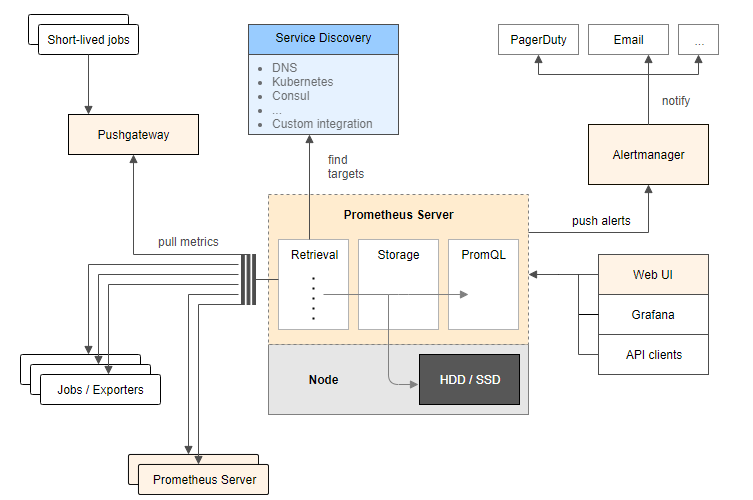
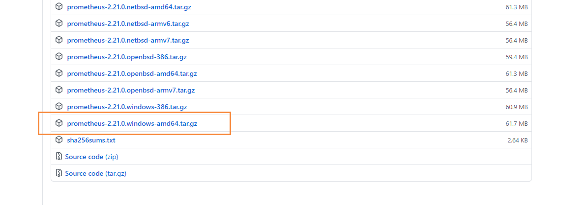
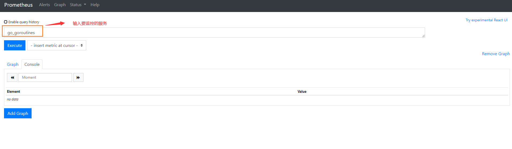
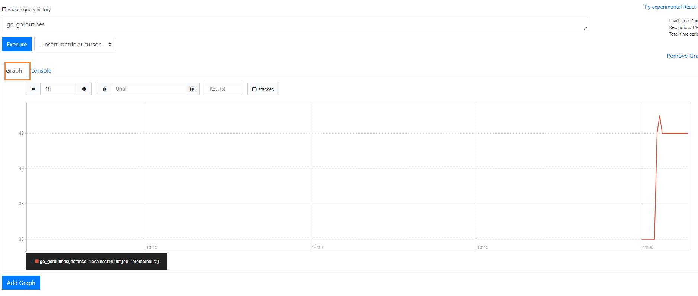
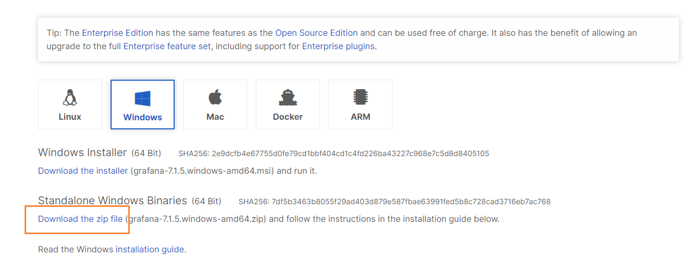
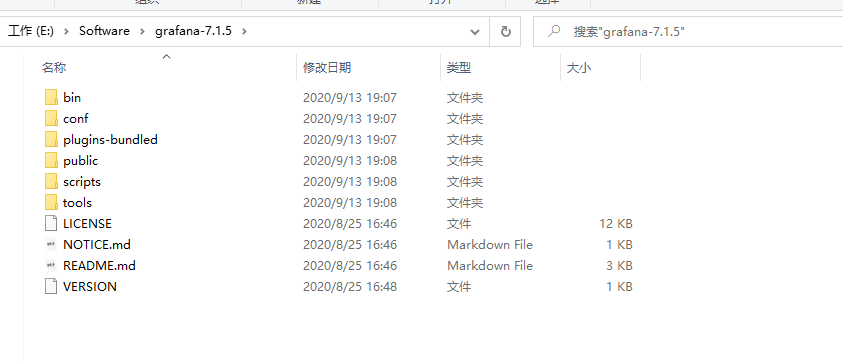
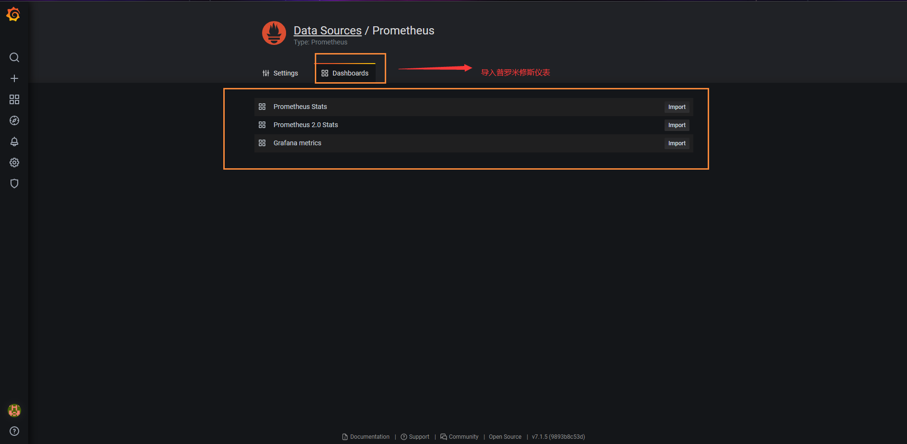
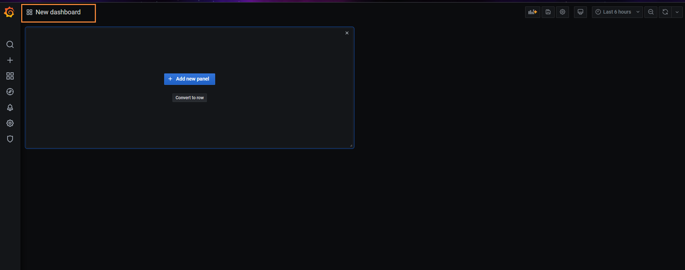
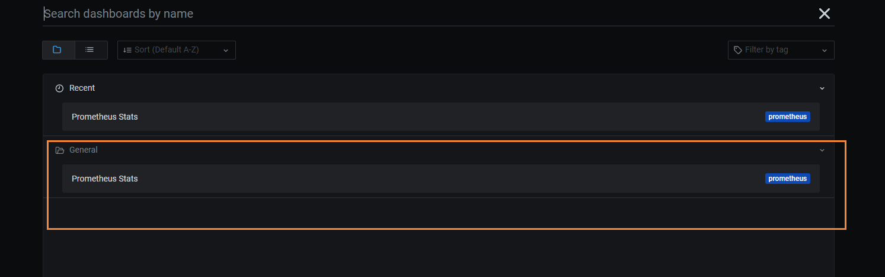
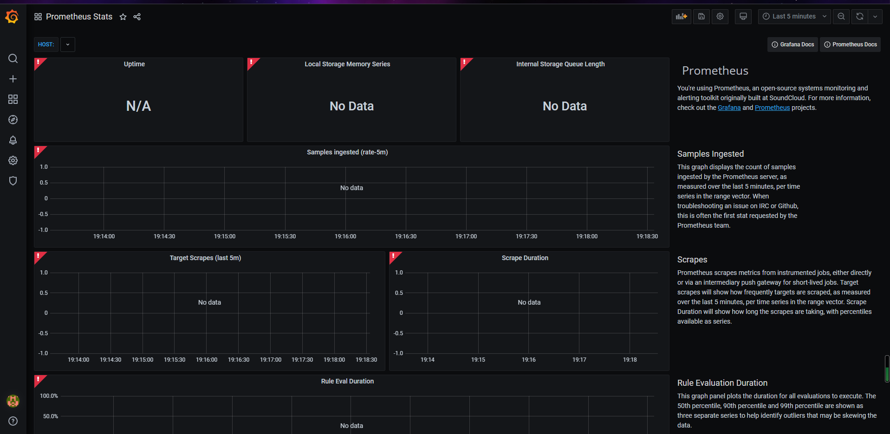

# Prometheus和Grafana介绍

## 系统监控

[gopsutil](https://www.liwenzhou.com/posts/Go/go_gopsutil/)：做系统监控信息的采集，写入influxDb，使用grafana作展示

prometheus：采集性能指标数据，使用grafana作展示

## Prometheus

[普罗米修斯](https://github.com/prometheus/prometheus)：专用于服务监控，主动去拉取数据



- Jobs/Exporters：任务，监控项
- Serveice Discovery：服务发现
- Short-lived jobs：短期存活的任务

### 下载普罗米修斯

去Github的[官网](https://github.com/prometheus/prometheus/releases/tag/v2.21.0)下载



下载完成后解压即可


双击 prometheus.exe启动，然后访问下面的地址

```bash
http://localhost:9090/graph
```

进入到prometheus的图形化页面


### 使用



就能够看到我们的图形化信息了



通过上图我们发现，使用 prometheus的图形化界面好像不太美观，所以就引出了下面的  [grafana](https://grafana.com/)

## grafana

grafana是采用go语言编写的，非常美观的图形化展示，我们找到[官网下载](https://grafana.com/grafana/download?platform=windows)，选择window环境



解压后的目录，如下所示



我们进入bin目录，找到 grafana-server.exe 然后启动 【首次启动比较慢，需要建立数据库】，启动成功后，访问下面的地址

```bash
http://127.0.0.1:3000
```

即可进入到grafana的图形化页面了


然后输入admin  admin 登录即可


然后选择普罗米修斯


然后输入url保存


然后导入我们的普罗米修斯的仪表盘



然后到Home目录下，选择 new board



选择刚刚的import 的 仪表信息



这样就生成了我们的仪表信息了



或者可以选择另外一个样式


## 结语

如果我们要监控其它的一些服务，比如redis、mysql、Memcache等等，需要自己到官网下载对应的包

https://prometheus.io/download/

