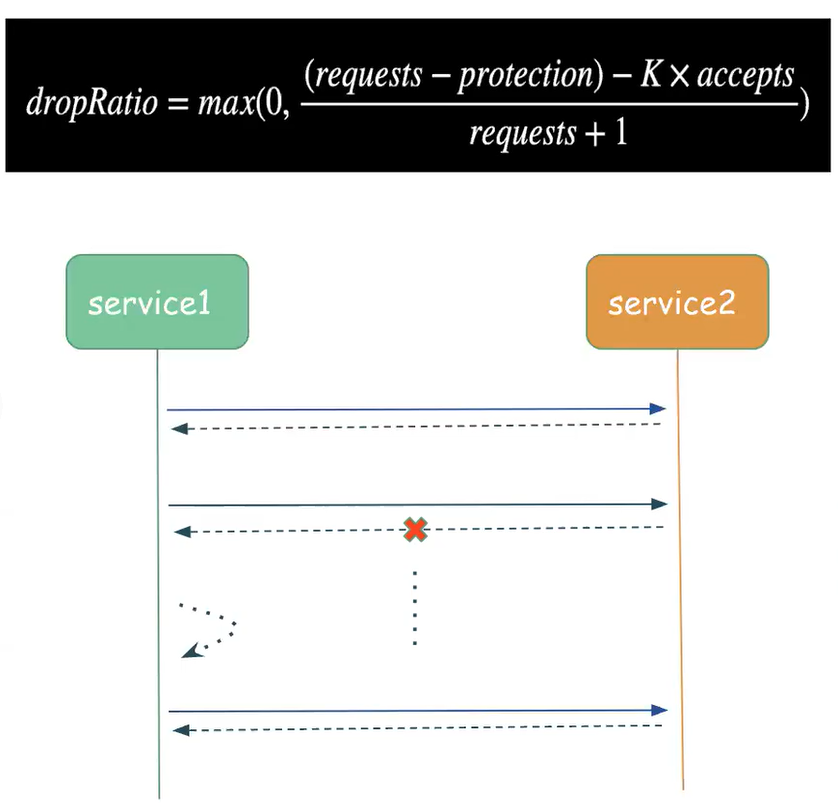
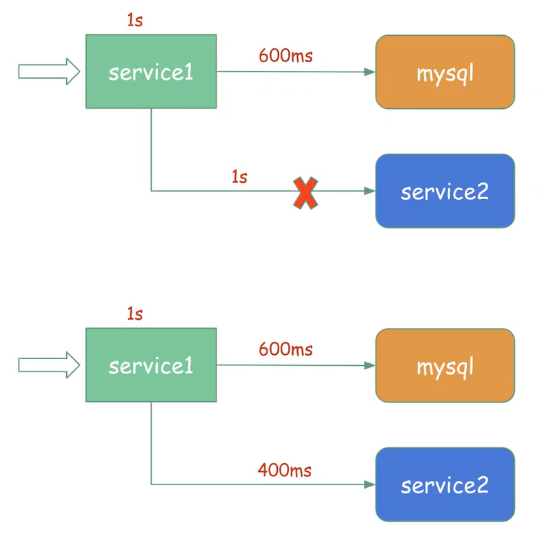
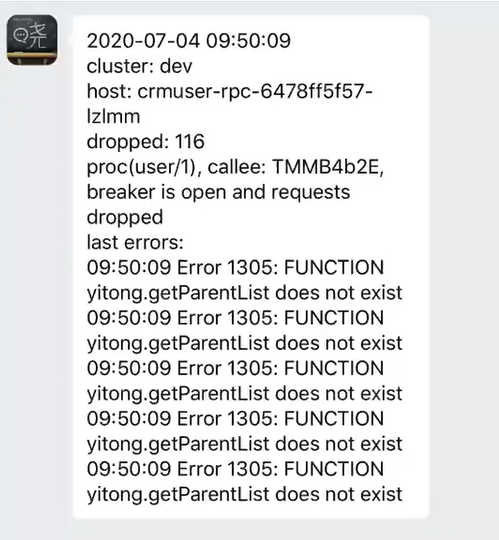

# go-zero架构设计

## 来源

[晓黑板 go-zero 微服务框架的架构设计](https://www.bilibili.com/video/BV1rD4y127PD/ ) 

晓黑板为例 打算做日活千万的项目

## 架构设计的几点思考

- 架构设计不能脱离业务
- 能够快速迭代
- PHP？Java or Golang？
- 开源 or 自研？

## 设计原则

- 保持简单，第一法则
- 高可用
- 高并发
- 易扩展
- 弹性设计
- 封装微服务复杂度，业务开发友好
- 做一件事只提供一种方式

## Go服务实现

微服务重要组件

- 限流
- 自适应降载
- 自适应熔断
- 负载均衡
- 级联超时控制
- 缓存
- 可观测性

## 限流

### 进程内限流

- 控制并发请求量
- 简单高效
- 可配置，有默认值
- 有效防止突发恶意流量
- 第一道防护（WAF等除外）

如上图所示，我们可以在门口设置并发控制，让外面的人不会一股脑拥挤进来

### 分布式限流

- 基于redis / lua
- 令牌桶
- 漏铜
- 广泛适用，短信，推送等

## 自适应降载

基于优先级进行分级降载保护

- K8S的HPA 80%触发
- CPU > 90% 开始拒绝低优先级请求
- CPU > 95% 开始拒绝高优先级请求
- http / rpc框架内建
- 基于滑动窗口，防止毛刺
- 有冷却时间，防止抖动
- 实践检验，配合K8S弹性伸缩
- 第二道防护

高优先级和低优先级服务？

- 登录请求 是 高优先级请求
- 一些个人信息页这种，就是低优先级请求

## 自适应熔断

路径级别的自适应熔断

- 自动触发，自动恢复
- http /rpc 框架内建
- Google SRE算法
- 放弃了Netfix Hystrix算法
- 基于滑动窗口（10秒 / 40窗口）
- 支持自定义触发条件
- 支持自定义fallback
- 第三道防护

### Netfix Hystrix算法 和 Google SRE算法

Netfix Hystrix算法相比于 Google SRE算法，Hystrix算法没有那么灵敏，因为有三个状态

- 半开
- 闭
- 开

而SRE算法是根据滑动窗口来的，能够很好的把握服务的状态，能够更加细粒度处理

## 负载均衡

负载均衡基于服务发现

- 服务提供方注册上报
- 服务调用方watch发现
- 进行服务调用

### Round Robin

使用轮询的方式，来解决服务的负载均衡

- 简单
- 要求后端性能均等，也就是要求所有的机器性能一致的，不会出现性能的差别
- 响应时间变化较大时，容易出现负载不均衡

### Power Of Two Choices

参考来自 Nginx & Envoy & Finagle & Linked的文章

https://www.nginx.com/blog/nginx-power-of-two-choices-load-balancing-algorithm/

https://linkerd.io/2016/03/16/beyond-round-robin-load-balancing-for-latency/index.html

Power Of Two Choices 主要用于当系统出现较高延迟的请求时

- 默认算法
- 当前请求数
- 处理时长，指数加权移动
- e ^ (-x)

## 多重防护

多重防护，保障高可用

这里主要分了三层的防护控制

- 第一层通过在网关处进行限流，拦截对应的请求，达到防护效果
- 第二层主要是自适应降载 和 K8S弹性伸缩，完成服务的可用性
- 第三方 在服务出现宕机时，触发熔断效果

最后在一层调用一层，实现服务的可用

## 级联超时控制

### 进程内超时控制

- Fail Fast，少做无用功
- 有默认值，业务开发无需关注
- 注意和客户端协同

也就是说超时时间，是根据两个服务请求时间相加起来的，而不是每个服务都有一个时间

### 服务间的超时控制

- Fail Fast，少做无用功
- 通过context自动传递
- 忽略服务间调用网络损耗（一般几ms），降低复杂度

## 重试？

go-zero 不支持超时重试！

重试机制注意事项

- 指数退避
- 流量quota
- 超时相关性

## http请求自动解析校验

支持的特性

- path，form，json
- default，optional，options，range

解析校验

- httpx.Parse(...)
- 参数错误自动返回400
- 配合goctl使用，效果更佳

## 缓存

缓存设计的三要点

- 缓存穿透，不存在的数据
- 缓存击穿，热点key过期
- 缓存雪崩，大量缓存同时过期

### 上述问题的解决思路

- 缓存穿透
  - 即使查不到，也自动缓存，短过期时间，1分钟
- 缓存击穿
  - 确保一个进程同时只拿一次数据，并共享结果
- 缓存雪崩
  - 针对缓存过期时间，设置随机偏差，确保分散过期

- 缓存基于非主键的查询
  - 也就是有些查询，不是通过主键来进行缓存的，而是通过查询条件
  - 可以说将查询条件，转换成了主键来进行缓存
  - 获取复杂：查询 -> 主键 -> 缓存
  - 过期复杂，顺序重要
- 分布式缓存
  - 多虚拟节点一致性hash，避免升降级后过多的cache miss
  - 通过提出虚拟环的概念，避免因为单个缓存服务的添加和移除，导致大量的缓存记录失效
- 很难全做对，是不是？
  - 全部自动化，goctl自动生成CRUD + Cache代码，省力不出错
  - 自带sql慢查询记录和缓存命中率统计

## 可观测性

- 链路跟踪
- Logging日志
- Metrics
- 监控报警

### 链路跟踪

- 框架内建，context传递
- Trace id，贯穿整个调用链
- Span id，有层次和时序关系
- 记录起止时间
- 记录调用关系，client / server

### Logging日志

- 自动rotate
- 多模式支持，console，file，volume
- 自动压缩
- 自动删除过期日志

使用k8s会直接放到console中

### 监控报警

- 自动聚合汇报异常，比如 http code 5XX
- 自动控制频率并汇总异常

### 数据上报

- 上报到控制台服务
- 上报到promethenus（普罗米修斯监控平台）

## 其它

- 基于JWT的自动鉴权
- MapReduce
  - 主要是用于进程内的，比如一个请求过来，但是这个请求可能会依赖后面很多个服务，但是很多个服务之间是没有先后顺序的，如果我们按流水线的方式处理，可能需要处理完第一个后，在处理第二个。。
  - 如果不相关的服务，就可以使用MapReduce来进行并行的处理，来提高我们的响应速度
  - 同时，如果我们某一个请求失败了，那么可以直接调用cancel，让其它的操作都失效，快速返回
- Graceful shutdown
- 并发控制工具箱
- 资源控制工具箱，比如多个线程同时创建同一个数据库链接
- 分布式高可用延迟任务框架（后续开源）
- 极简Kafka Pub/Sub框架
- Logstash 5倍性能的go-stash框架
- 不只是微服务框架，还有很多常见工具集

## 工具大于约定和文档

goctl工具

- 极简API描述语法
- 极大简化前后端代码编写
- 减少沟通，避免出错
- 自动生成Golang后端Restful、RPC代码、IOS代码等，并可直接运行
- 自动生成CRUD + Cache代码
- 自动生成docker、K8S部署文件

