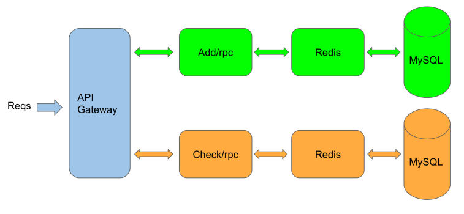
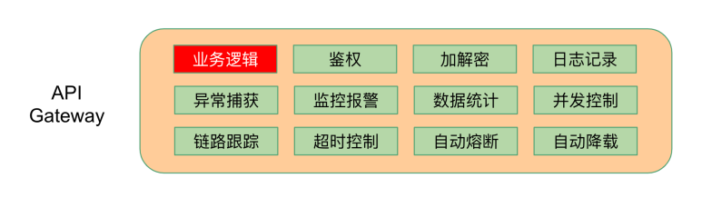
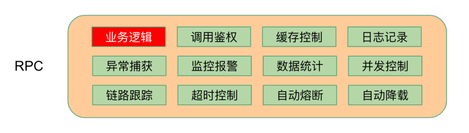
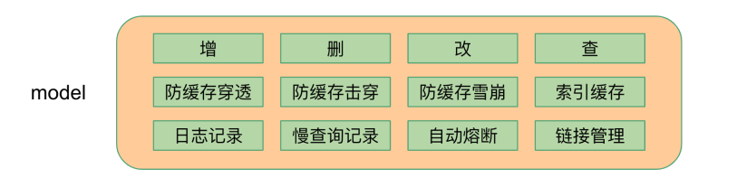

# 使用go-zero构建微服务项目

## 前言

这里我们首先以书店服务作为示例，并且只实现其中的增加书目和检查价格功能，写此书店服务是为了整体上演示go-zero构建完整微服务的过程，实现细节尽可能简化

此外，秉承着工具大于约定和文档的理念，尽可能减少开发人员的心智负担，把精力投入到产生业务价值的代码上，减少重复代码的编写，因此开发了 goctl 工具

## 书店微服务架构图

首先请求过来后，通过的是网关，然后在请求各自的 Add服务 和 Check服务



## goctl各层代码

所有绿色背景的功能模块都是自动生成的，按需激活，红色模块是需要自己写的，也就是增加下依赖、编写业务特有逻辑，各层示意图分别如下

### 网关

网关是所有请求的入口，在这里可以进行如下的操作



### RPC

RPC被称为远程过程调用



### Model

model是模型层



## 准备工作

### 安装软件

通过上面的架构图我们发现，我们使用到了 etcd、mysql、redis，因此我们首先需要安装如下服务

### 安装 protoc-gen-go 工具

然后在安装 protoc-gen-go 

```bash
# 配置代理
go env -w GO111MODULE=on
go env -w GOPROXY=https://goproxy.cn/,direct
# 下载
go get -u github.com/golang/protobuf/protoc-gen-go
```

### 安装 goctl工具

goctl工具主要用于代码生成

```bash
go get -u github.com/tal-tech/go-zero/tools/goctl
```

### 创建目录

安装完成后，我们就创建 bookstore 目录，然后执行下面代码，初始化go mod依赖管理

```bash
# 初始化go mod
go mod init bookstore
```


## 编写API Gateway代码

在 `bookstore/api` 目录下通过goctl生成 `api/bookstore.api`

```bash
goctl api -o bookstore.api
```

编辑`bookstore.api`，为了简洁，去除了文件开头的`info`，代码如下：

```go
type (
	addReq struct {
		book  string `form:"book"`
		price int64  `form:"price"`
	}

	addResp struct {
		ok bool `json:"ok"`
	}
)

type (
	checkReq struct {
		book string `form:"book"`
	}

	checkResp struct {
		found bool  `json:"found"`
		price int64 `json:"price"`
	}
)

service bookstore-api {
	@server(
		handler: AddHandler
	)
	get /add(addReq) returns(addResp)

	@server(
		handler: CheckHandler
	)
	get /check(checkReq) returns(checkResp)
}
```

- type用法和go一致，service用来定义get/post/head/delete等api请求，解释如下：

- - `service bookstore-api {`   这一行定义了service名字

- - `@server` 部分用来定义server端用到的属性

- - `handler`定义了服务端handler名字

- - `get /add(addReq) returns(addResp)`定义了get方法的路由、请求参数、返回参数等


使用goctl生成API Gateway代码

```bash
goctl api go -api bookstore.api -dir .
```

生成的文件结构如下：

```bash
api
├── bookstore.api                  // api定义
├── bookstore.go                   // main入口定义
├── etc
│   └── bookstore-api.yaml         // 配置文件
└── internal
    ├── config
    │   └── config.go              // 定义配置
    ├── handler
    │   ├── addhandler.go          // 实现addHandler
    │   ├── checkhandler.go        // 实现checkHandler
    │   └── routes.go              // 定义路由处理
    ├── logic
    │   ├── addlogic.go            // 实现AddLogic
    │   └── checklogic.go          // 实现CheckLogic
    ├── svc
    │   └── servicecontext.go      // 定义ServiceContext
    └── types
        └── types.go               // 定义请求、返回结构体
```

启动API Gateway服务，默认侦听在8888端口

```bash
go run bookstore.go -f etc/bookstore-api.yaml
```

启动完成后，我们使用如下命令来测试API Gateway服务

```bash
curl -i "http://localhost:8888/check?book=go-zero"
```

返回结果如下

```bash
HTTP/1.1 200 OK
Content-Type: application/json
Date: Thu, 03 Sep 2020 06:46:18 GMT
Content-Length: 25

{"found":false,"price":0}
```

- 可以看到我们API Gateway其实啥也没干，就返回了个空值，接下来我们会在rpc服务里实现业务逻辑

- 可以修改`internal/svc/servicecontext.go`来传递服务依赖（如果需要）

- 实现逻辑可以修改`internal/logic`下的对应文件

- 可以通过`goctl`生成各种客户端语言的api调用代码

- 到这里，你已经可以通过goctl生成客户端代码给客户端同学并行开发了，支持多种语言，详见文档

## 编写add rpc服务

在`rpc/add`目录下编写`add.proto`文件，可以通过命令生成proto文件模板

```bash
goctl rpc template -o add.proto
```

修改文件内容如下

```bash
syntax = "proto3";

package add;

message addReq {
    string book = 1;
    int64 price = 2;
}

message addResp {
    bool ok = 1;
}

service adder {
    rpc add(addReq) returns(addResp);
}
```

用`goctl`生成rpc代码，在`rpc/add`目录下执行命令

```bash
goctl rpc proto -src add.proto
```

生成的目录结构如下

```bash
rpc/add
├── add.go                      // rpc服务main函数
├── add.proto                   // rpc接口定义
├── adder
│   ├── adder.go                // 提供了外部调用方法，无需修改
│   ├── adder_mock.go           // mock方法，测试用
│   └── types.go                // request/response结构体定义
├── etc
│   └── add.yaml                // 配置文件
├── internal
│   ├── config
│   │   └── config.go           // 配置定义
│   ├── logic
│   │   └── addlogic.go         // add业务逻辑在这里实现
│   ├── server
│   │   └── adderserver.go      // 调用入口, 不需要修改
│   └── svc
│       └── servicecontext.go   // 定义ServiceContext，传递依赖
└── pb
    └── add.pb.go
```

直接可以运行，如下

```bash
$ go run add.go -f etc/add.yaml
Starting rpc server at 127.0.0.1:8080...
```

`etc/add.yaml`文件里可以修改侦听端口等配置

## 编写check rpc服务

在`rpc/check`目录下编写`check.proto`文件，可以通过命令生成proto文件模板

```bash
goctl rpc template -o check.proto
```

修改后文件内容如下：

```bash
syntax = "proto3";

package check;

message checkReq {
    string book = 1;
}

message checkResp {
    bool found = 1;
    int64 price = 2;
}

service checker {
    rpc check(checkReq) returns(checkResp);
}
```

用 `goctl` 生成rpc代码，在 `rpc/check` 目录下执行命令：

```bash
goctl rpc proto -src check.proto
```

文件结构如下：

```bash
rpc/check
├── check.go                    // rpc服务main函数
├── check.proto                 // rpc接口定义
├── checker
│   ├── checker.go              // 提供了外部调用方法，无需修改
│   ├── checker_mock.go         // mock方法，测试用
│   └── types.go                // request/response结构体定义
├── etc
│   └── check.yaml              // 配置文件
├── internal
│   ├── config
│   │   └── config.go           // 配置定义
│   ├── logic
│   │   └── checklogic.go       // check业务逻辑在这里实现
│   ├── server
│   │   └── checkerserver.go    // 调用入口, 不需要修改
│   └── svc
│       └── servicecontext.go   // 定义ServiceContext，传递依赖
└── pb
    └── check.pb.go
```

`etc/check.yaml`文件里可以修改侦听端口等配置，需要修改`etc/check.yaml`的端口为`8081`，因为`8080`已经被`add`服务使用了，直接可以运行，如下

```bash
$ go run check.go -f etc/check.yaml
Starting rpc server at 127.0.0.1:8081...
```

## 修改API Gateway代码

修改API Gateway代码调用add/check rpc服务

我们现在需要修改的就是配置文件，`/etc/bookstore-api.yaml`，增加如下内容

```yaml
Add:
  Etcd:
    Hosts:
      - localhost:2379
    Key: add.rpc
Check:
  Etcd:
    Hosts:
      - localhost:2379
    Key: check.rpc
```

通过etcd自动去发现可用的add /check服务

修改 `internal/config/config.go` ，增加 add/check 服务依赖

```go
type Config struct {
    rest.RestConf
    Add   zrpc.RpcClientConf     // 手动代码
    Check zrpc.RpcClientConf     // 手动代码
}
```

修改`internal/svc/servicecontext.go`，如下：

```go
type ServiceContext struct {
    Config  config.Config
    Adder   adder.Adder          // 手动代码
    Checker checker.Checker      // 手动代码
}

func NewServiceContext(c config.Config) *ServiceContext {
    return &ServiceContext{
        Config:  c,
        Adder:   adder.NewAdder(zrpc.MustNewClient(c.Add)),         // 手动代码
        Checker: checker.NewChecker(zrpc.MustNewClient(c.Check)),   // 手动代码
    }
}
```

通过ServiceContext在不同业务逻辑之间传递依赖,修改`internal/logic/addlogic.go`里的`Add`方法，如下：


## 来源

https://www.yuque.com/tal-tech/go-zero/rm435c