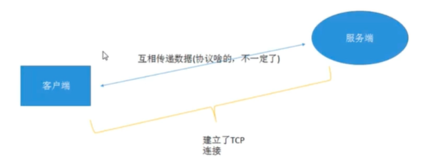
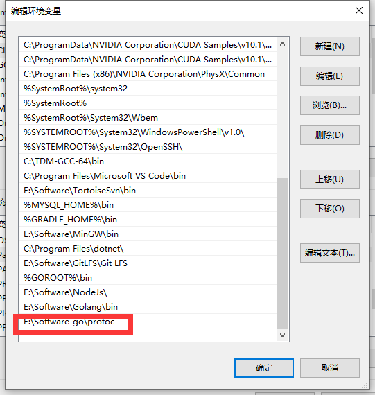
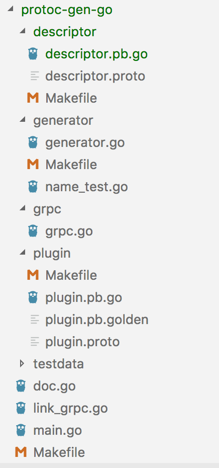
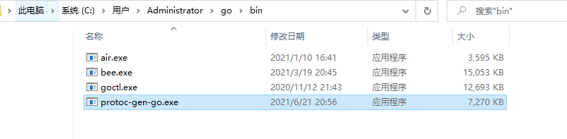
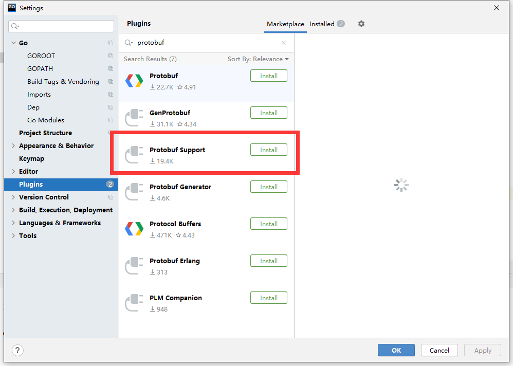
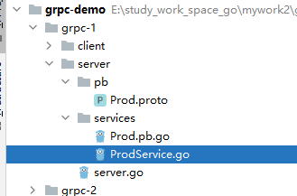

## 基本原理

首先需要有客户端和服务端，通过建立一个TCP链接进行数据传输，至于是否拥有传输协议，这个就不一定了。



整个过程就是：

- 客户端发送数据（以字节流的方式）
- 服务端接收，并解析，根据约定知道要知道执行什么，然后把结果返回客户端

**RPC** 就是把上述过程封装下，使其操作更加优化，使用一些大家都认可的协议，其规范化，做成一些框架，直接或间接产生利益。

## gRPC

刚才我们讲的 "赚钱利器" 其中一个框架就是一款语言中立、平台中立、开源的远程过程调用（RPC）框架 **gRPC**。

目前 **GPRC** 支持 **Java**、**C++**、**Golang**、**PHP** 多个语言版本.

> Golang版本：https://github.com/grpc/grpc-go

## Protobuf

> 参考链接：https://studygolang.com/articles/12673?fr=sidebar

**Protobuf**（Google Protocol Buffer）是 **google** 的一种数据交换的格式，它独立于语言，独立于平台。**google** 提供了多种语言的实现：java、c#、c++、go 和 python，每一种实现都包含了相应语言的编译器以及库文件。由于它是一种二进制的格式，比使用 xml 进行数据交换快许多。可以把它用于分布式应用之间的数据通信或者异构环境下的数据交换。作为一种效率和兼容性都很优秀的二进制数据传输格式，可以用于诸如网络传输、配置文件、数据存储等诸多领域。

轻便高效的序列化数据结构的协议，可以用于网络通信和数据存储。
特点：性能高、传输快、维护方便，反正就是各种好，各种棒一些第三方 **rpc** 库都会支持 **protobuf**

> Github地址：https://github.com/protocolbuffers/protobuf
>
> Golang库所属地址：https://github.com/golang/protobuf

## 什么是protoc

**protoc** 是 **protobuf** 文件（.proto）的编译器，可以借助这个工具把 .proto 文件转译成各种编程语言对应的源码，包含数据类型定义、调用接口等。


通过查看 **protoc** 的源码，可以知道，**protoc** 在设计上把 **protobuf** 和不同的语言解耦了，底层用 **C++** 来实现 **protobuf** 结构的存储，然后通过插件的形式来生成不同语言的源码。可以把 **protoc** 的编译过程分成简单的两个步骤（如上图所示）：

- 解析.proto文件，转译成protobuf的原生数据结构在内存中保存；
- 把protobuf相关的数据结构传递给相应语言的编译插件，由插件负责根据接收到的protobuf原生结构渲染输出特定语言的模板。

到下面地址，下载好 **Windows** 版的 **Protobuf** 的编译器，Protobuf编译器的作用是将 .proto 文件，转译为 **protobuf** 的原生结构

> https://github.com/protocolbuffers/protobuf/releases

选择好对应的 **release** 版本进行下载


解压完成后，是一个 **exe** 文件，我们将其放在指定的目录下


然后配置环境变量



## 什么是 protoc-gen-go

**protoc-gen-go** 是 **protobuf** **编译插件**系列中的 **Go** 版本。从上一小节知道原生的 **protoc** 并不包含 **Go** 版本的插件，不过可以在 **Github** 上发现专门的代码库。

由于protoc-gen-go是Go写的，所以安装它变得很简单，只需要运行 `go get -u github.com/golang/protobuf/protoc-gen-go`，便可以在$GOPATH/bin目录下发现这个工具。至此，就可以通过下面的命令来使用protoc-gen-go了。

```bash
protoc --go_out=output_directory input_directory/file.proto
```

其中"--go_out="表示生成Go文件，protoc会自动寻找PATH（系统执行路径）中的protoc-gen-go执行文件。

## protoc-gen-go的源码



按照 **Go** 的代码风格，**protoc-gen-go** 源码主要包含六个包（package）：

- main包
  - doc.go：主要是说明。
  - link_grpc.go：显式引用protoc-gen-go/grpc包，触发grpc的init函数。
  - main.go：代码不到50行，初始化generator，并调用generator相应的方法输出protobuf的Go语言文件。
- generator包
  - generator.go 包含了大部分由protobuf原生结构到Go语言文件的渲染方法，其中 `func (g *Generator) P(str ...interface{})` 这个方法会把渲染输出到generator的output（generator匿名嵌套了bytes.Buffer，因此有Buffer的方法）。
  - name_test.go 测试，主要包含generator中名称相关方法的测试。
- grpc包
  - grpc.go 与generator相似，但是包含了很多生成grpc相关方法的方法，比如渲染转译protobuf中定义的rpc方法（在generator中不包含，其默认不转译service的定义）
- descriptor 包含protobuf的描述文件（.proto文件及其对应的Go编译文件），其中proto文件来自于proto库
- plugin 包含plugin的描述文件（.proto文件及其对应的Go编译文件），其中proto文件来自于proto库

## 开启第一个gRPC项目

首先创建一个空项目，使用 **go module** 的方式

首先创建相关的执行下面命令，下载依赖

```bash
 go get -u google.golang.org/grpc
```

然后按照 **protobuf** 下载对应的 **go** 版本插件

```bash
go get github.com/golang/protobuf/protoc-gen-go
```

此时，会在你的 GOPATH 的 bin 目录下生成可执行文件，**protobuf** 的编译插件 **protoc-gen-go** 



稍后我们执行 **protoc** 命令时，就会自动调用这个插件。首先安装 **Goland** 的插件 **Protobuf Support**



## 创建文件

下面我们将创建一个 ProdService.proto 文件

```bash
syntax="proto3";  // 表示现在使用的proto是 3.0版本
package services;
option go_package = "../services";  // 高版本的go需要添加这个，代表生成的包名

message ProdRequest {  // 表示构建一个请求体
    int32 prod_id = 1; //商品ID
}

message ProdResponse {  // 构建响应体
    int32 prod_stock = 1; //商品库存
}

service ProductService {
    rpc  GetProductStock (ProdRequest) returns (ProdResponse);
} 
```

## 生成 Go PRC文件

然后执行下面命令进行转换

```bash
protoc --go_out=. Prod.proto
```

最后会生成一个  **Prod.proto.go** 文件

```bash
// Code generated by protoc-gen-go. DO NOT EDIT.
// versions:
// 	protoc-gen-go v1.22.0-devel
// 	protoc        v3.11.4
// source: Prod.proto

package services

import (
	context "context"
	proto "github.com/golang/protobuf/proto"
	grpc "google.golang.org/grpc"
	codes "google.golang.org/grpc/codes"
	status "google.golang.org/grpc/status"
	protoreflect "google.golang.org/protobuf/reflect/protoreflect"
	protoimpl "google.golang.org/protobuf/runtime/protoimpl"
	reflect "reflect"
	sync "sync"
)

const (
	// Verify that this generated code is sufficiently up-to-date.
	_ = protoimpl.EnforceVersion(20 - protoimpl.MinVersion)
	// Verify that runtime/protoimpl is sufficiently up-to-date.
	_ = protoimpl.EnforceVersion(protoimpl.MaxVersion - 20)
)

// This is a compile-time assertion that a sufficiently up-to-date version
// of the legacy proto package is being used.
const _ = proto.ProtoPackageIsVersion4

type ProdRequest struct {
	state         protoimpl.MessageState
	sizeCache     protoimpl.SizeCache
	unknownFields protoimpl.UnknownFields

	ProdId int32 `protobuf:"varint,1,opt,name=prod_id,json=prodId,proto3" json:"prod_id,omitempty"` //商品ID
}

func (x *ProdRequest) Reset() {
	*x = ProdRequest{}
	if protoimpl.UnsafeEnabled {
		mi := &file_Prod_proto_msgTypes[0]
		ms := protoimpl.X.MessageStateOf(protoimpl.Pointer(x))
		ms.StoreMessageInfo(mi)
	}
}

func (x *ProdRequest) String() string {
	return protoimpl.X.MessageStringOf(x)
}

func (*ProdRequest) ProtoMessage() {}

func (x *ProdRequest) ProtoReflect() protoreflect.Message {
	mi := &file_Prod_proto_msgTypes[0]
	if protoimpl.UnsafeEnabled && x != nil {
		ms := protoimpl.X.MessageStateOf(protoimpl.Pointer(x))
		if ms.LoadMessageInfo() == nil {
			ms.StoreMessageInfo(mi)
		}
		return ms
	}
	return mi.MessageOf(x)
}

// Deprecated: Use ProdRequest.ProtoReflect.Descriptor instead.
func (*ProdRequest) Descriptor() ([]byte, []int) {
	return file_Prod_proto_rawDescGZIP(), []int{0}
}

func (x *ProdRequest) GetProdId() int32 {
	if x != nil {
		return x.ProdId
	}
	return 0
}

type ProdResponse struct {
	state         protoimpl.MessageState
	sizeCache     protoimpl.SizeCache
	unknownFields protoimpl.UnknownFields

	ProdStock int32 `protobuf:"varint,1,opt,name=prod_stock,json=prodStock,proto3" json:"prod_stock,omitempty"` //商品库存
}

func (x *ProdResponse) Reset() {
	*x = ProdResponse{}
	if protoimpl.UnsafeEnabled {
		mi := &file_Prod_proto_msgTypes[1]
		ms := protoimpl.X.MessageStateOf(protoimpl.Pointer(x))
		ms.StoreMessageInfo(mi)
	}
}

func (x *ProdResponse) String() string {
	return protoimpl.X.MessageStringOf(x)
}

func (*ProdResponse) ProtoMessage() {}

func (x *ProdResponse) ProtoReflect() protoreflect.Message {
	mi := &file_Prod_proto_msgTypes[1]
	if protoimpl.UnsafeEnabled && x != nil {
		ms := protoimpl.X.MessageStateOf(protoimpl.Pointer(x))
		if ms.LoadMessageInfo() == nil {
			ms.StoreMessageInfo(mi)
		}
		return ms
	}
	return mi.MessageOf(x)
}

// Deprecated: Use ProdResponse.ProtoReflect.Descriptor instead.
func (*ProdResponse) Descriptor() ([]byte, []int) {
	return file_Prod_proto_rawDescGZIP(), []int{1}
}

func (x *ProdResponse) GetProdStock() int32 {
	if x != nil {
		return x.ProdStock
	}
	return 0
}

var File_Prod_proto protoreflect.FileDescriptor

var file_Prod_proto_rawDesc = []byte{
	0x0a, 0x0a, 0x50, 0x72, 0x6f, 0x64, 0x2e, 0x70, 0x72, 0x6f, 0x74, 0x6f, 0x12, 0x08, 0x73, 0x65,
	0x72, 0x76, 0x69, 0x63, 0x65, 0x73, 0x22, 0x26, 0x0a, 0x0b, 0x50, 0x72, 0x6f, 0x64, 0x52, 0x65,
	0x71, 0x75, 0x65, 0x73, 0x74, 0x12, 0x17, 0x0a, 0x07, 0x70, 0x72, 0x6f, 0x64, 0x5f, 0x69, 0x64,
	0x18, 0x01, 0x20, 0x01, 0x28, 0x05, 0x52, 0x06, 0x70, 0x72, 0x6f, 0x64, 0x49, 0x64, 0x22, 0x2d,
	0x0a, 0x0c, 0x50, 0x72, 0x6f, 0x64, 0x52, 0x65, 0x73, 0x70, 0x6f, 0x6e, 0x73, 0x65, 0x12, 0x1d,
	0x0a, 0x0a, 0x70, 0x72, 0x6f, 0x64, 0x5f, 0x73, 0x74, 0x6f, 0x63, 0x6b, 0x18, 0x01, 0x20, 0x01,
	0x28, 0x05, 0x52, 0x09, 0x70, 0x72, 0x6f, 0x64, 0x53, 0x74, 0x6f, 0x63, 0x6b, 0x32, 0x52, 0x0a,
	0x0e, 0x50, 0x72, 0x6f, 0x64, 0x75, 0x63, 0x74, 0x53, 0x65, 0x72, 0x76, 0x69, 0x63, 0x65, 0x12,
	0x40, 0x0a, 0x0f, 0x47, 0x65, 0x74, 0x50, 0x72, 0x6f, 0x64, 0x75, 0x63, 0x74, 0x53, 0x74, 0x6f,
	0x63, 0x6b, 0x12, 0x15, 0x2e, 0x73, 0x65, 0x72, 0x76, 0x69, 0x63, 0x65, 0x73, 0x2e, 0x50, 0x72,
	0x6f, 0x64, 0x52, 0x65, 0x71, 0x75, 0x65, 0x73, 0x74, 0x1a, 0x16, 0x2e, 0x73, 0x65, 0x72, 0x76,
	0x69, 0x63, 0x65, 0x73, 0x2e, 0x50, 0x72, 0x6f, 0x64, 0x52, 0x65, 0x73, 0x70, 0x6f, 0x6e, 0x73,
	0x65, 0x62, 0x06, 0x70, 0x72, 0x6f, 0x74, 0x6f, 0x33,
}

var (
	file_Prod_proto_rawDescOnce sync.Once
	file_Prod_proto_rawDescData = file_Prod_proto_rawDesc
)

func file_Prod_proto_rawDescGZIP() []byte {
	file_Prod_proto_rawDescOnce.Do(func() {
		file_Prod_proto_rawDescData = protoimpl.X.CompressGZIP(file_Prod_proto_rawDescData)
	})
	return file_Prod_proto_rawDescData
}

var file_Prod_proto_msgTypes = make([]protoimpl.MessageInfo, 2)
var file_Prod_proto_goTypes = []interface{}{
	(*ProdRequest)(nil),  // 0: services.ProdRequest
	(*ProdResponse)(nil), // 1: services.ProdResponse
}
var file_Prod_proto_depIdxs = []int32{
	0, // 0: services.ProductService.GetProductStock:input_type -> services.ProdRequest
	1, // 1: services.ProductService.GetProductStock:output_type -> services.ProdResponse
	1, // [1:2] is the sub-list for method output_type
	0, // [0:1] is the sub-list for method input_type
	0, // [0:0] is the sub-list for extension type_name
	0, // [0:0] is the sub-list for extension extendee
	0, // [0:0] is the sub-list for field type_name
}

func init() { file_Prod_proto_init() }
func file_Prod_proto_init() {
	if File_Prod_proto != nil {
		return
	}
	if !protoimpl.UnsafeEnabled {
		file_Prod_proto_msgTypes[0].Exporter = func(v interface{}, i int) interface{} {
			switch v := v.(*ProdRequest); i {
			case 0:
				return &v.state
			case 1:
				return &v.sizeCache
			case 2:
				return &v.unknownFields
			default:
				return nil
			}
		}
		file_Prod_proto_msgTypes[1].Exporter = func(v interface{}, i int) interface{} {
			switch v := v.(*ProdResponse); i {
			case 0:
				return &v.state
			case 1:
				return &v.sizeCache
			case 2:
				return &v.unknownFields
			default:
				return nil
			}
		}
	}
	type x struct{}
	out := protoimpl.TypeBuilder{
		File: protoimpl.DescBuilder{
			GoPackagePath: reflect.TypeOf(x{}).PkgPath(),
			RawDescriptor: file_Prod_proto_rawDesc,
			NumEnums:      0,
			NumMessages:   2,
			NumExtensions: 0,
			NumServices:   1,
		},
		GoTypes:           file_Prod_proto_goTypes,
		DependencyIndexes: file_Prod_proto_depIdxs,
		MessageInfos:      file_Prod_proto_msgTypes,
	}.Build()
	File_Prod_proto = out.File
	file_Prod_proto_rawDesc = nil
	file_Prod_proto_goTypes = nil
	file_Prod_proto_depIdxs = nil
}

// Reference imports to suppress errors if they are not otherwise used.
var _ context.Context
var _ grpc.ClientConnInterface

// This is a compile-time assertion to ensure that this generated file
// is compatible with the grpc package it is being compiled against.
const _ = grpc.SupportPackageIsVersion6

// ProductServiceClient is the client API for ProductService service.
//
// For semantics around ctx use and closing/ending streaming RPCs, please refer to https://godoc.org/google.golang.org/grpc#ClientConn.NewStream.
type ProductServiceClient interface {
	GetProductStock(ctx context.Context, in *ProdRequest, opts ...grpc.CallOption) (*ProdResponse, error)
}

type productServiceClient struct {
	cc grpc.ClientConnInterface
}

func NewProductServiceClient(cc grpc.ClientConnInterface) ProductServiceClient {
	return &productServiceClient{cc}
}

func (c *productServiceClient) GetProductStock(ctx context.Context, in *ProdRequest, opts ...grpc.CallOption) (*ProdResponse, error) {
	out := new(ProdResponse)
	err := c.cc.Invoke(ctx, "/services.ProductService/GetProductStock", in, out, opts...)
	if err != nil {
		return nil, err
	}
	return out, nil
}

// ProductServiceServer is the server API for ProductService service.
type ProductServiceServer interface {
	GetProductStock(context.Context, *ProdRequest) (*ProdResponse, error)
}

// UnimplementedProductServiceServer can be embedded to have forward compatible implementations.
type UnimplementedProductServiceServer struct {
}

func (*UnimplementedProductServiceServer) GetProductStock(context.Context, *ProdRequest) (*ProdResponse, error) {
	return nil, status.Errorf(codes.Unimplemented, "method GetProductStock not implemented")
}

func RegisterProductServiceServer(s *grpc.Server, srv ProductServiceServer) {
	s.RegisterService(&_ProductService_serviceDesc, srv)
}

func _ProductService_GetProductStock_Handler(srv interface{}, ctx context.Context, dec func(interface{}) error, interceptor grpc.UnaryServerInterceptor) (interface{}, error) {
	in := new(ProdRequest)
	if err := dec(in); err != nil {
		return nil, err
	}
	if interceptor == nil {
		return srv.(ProductServiceServer).GetProductStock(ctx, in)
	}
	info := &grpc.UnaryServerInfo{
		Server:     srv,
		FullMethod: "/services.ProductService/GetProductStock",
	}
	handler := func(ctx context.Context, req interface{}) (interface{}, error) {
		return srv.(ProductServiceServer).GetProductStock(ctx, req.(*ProdRequest))
	}
	return interceptor(ctx, in, info, handler)
}

var _ProductService_serviceDesc = grpc.ServiceDesc{
	ServiceName: "services.ProductService",
	HandlerType: (*ProductServiceServer)(nil),
	Methods: []grpc.MethodDesc{
		{
			MethodName: "GetProductStock",
			Handler:    _ProductService_GetProductStock_Handler,
		},
	},
	Streams:  []grpc.StreamDesc{},
	Metadata: "Prod.proto",
}
```

## 创建GRPC服务端

在第一节中，我们依葫芦画瓢做了一个"中间文件"，并生成对应的 **go** 文件，只不过看起来好像没啥用，接下来我们就要创建真正的服务。

## 引入Service

只需要修改 **Prod.proto**文件，添加如下内容 **ProductService**

```bash
syntax="proto3";
package services;
option go_package = "../services";

message ProdRequest {
    int32 prod_id = 1; //商品ID
}

message ProdResponse {
    int32 prod_stock = 1; //商品库存
}

service ProductService {
    rpc  GetProductStock (ProdRequest) returns (ProdResponse);
} 
```

然后生成我们新的 **Prod.proto.go** 文件，同时包含了 **Service** 文件

```bash
protoc --go_out=plugins=grpc:../services Prod.proto
```

## 创建实现类

下面我们就可以创建一个实现类了，在 **services** 文件夹下创建 **ProdService** 文件



文件内容如下，只需要实现我们对应的方法即可

```go
/**
 * @Description
 * @Author 陌溪
 * @Date 2021/7/17 8:56
 **/
package services

import (
	"context"
	"google.golang.org/grpc"
	"log"
)

// 定义的结构体
type ProdService struct {

}

func (this *ProdService) GetProductStock(ctx context.Context, in *ProdRequest, opts ...grpc.CallOption) (*ProdResponse, error) {
	log.Fatalln("进来了")
	return &ProdResponse{ ProdStock: 20}, nil
}
```

## 创建RPC服务

最后，为了使我们的 **RPC** 进行启动，我们还需要对服务进行启动

```GO
package main

import (
	"log"
	"net"

	"github.com/zhuge20100104/grpc-demo/grpc-1/server/services"
	"google.golang.org/grpc"
)

func main() {
	// 通过grpc创建一个Server
	rpcServer := grpc.NewServer()
	// 注册Service
	services.RegisterProductServiceServer(rpcServer, new(services.ProdService))
	// 监听一个端口
	listen, err := net.Listen("tcp", ":8888")
	if err != nil {
		log.Fatalf("启动网络监听失败 %v\n", err)
	}
	log.Print("服务器成功监听8888端口")
	// 进行通信
	rpcServer.Serve(listen)
}
```

