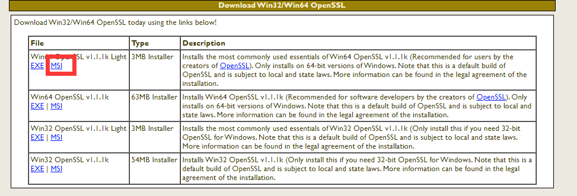

## 前言

在真实的环境下，我们一般会使用证书来确保通信的安全

如果是window环境，使用下面地址，进行自签证书

```bash
http://slproweb.com/products/Win32OpenSSL.html
```



下载完成后，开始进行证书的生成

## 生成步骤

首先进入 bin 目录下，执行

```bash
openssl
```

然后执行(会生成 servver.key 私钥文件)

```bash
genrsa-des3 -out server.key 2048
```

然后输入 123456

下面开始创建证书请求，会生成 **server.csr**

```bash
req-new-key server.key -out server.csr
```

其中，common  name 也是域名，可以填写 **jtthink.com**

删除密码

```bash
rsa -in server.key -out server_no_passwd.key
```

执行下面命令生成 server.crt

```bash
x509 -req -days 565 -in server.csr -signkey server_no_passwd.key -out server.crt
```

到此为止，自签证书完成

