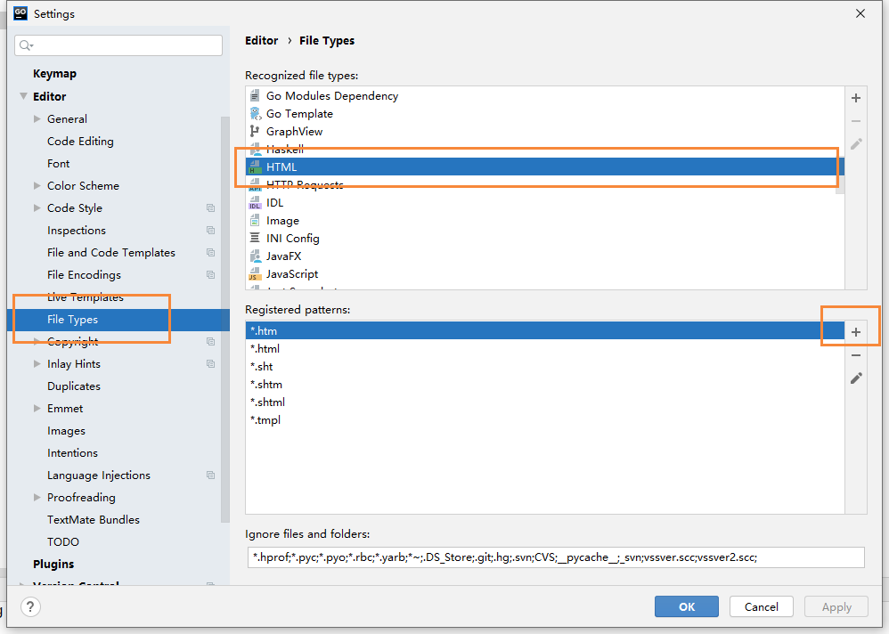
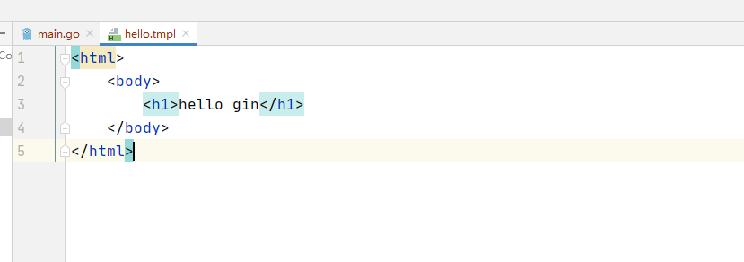

# Gin框架中让tmpl模板文件有语法提示

## 前言

在Gin中，我们要使用 `.tmpl` 结尾的模板文件，但是我们在new的时候，发现没有对应的文件，所以它就会被当成普通的文件来进行解析，因此也没有提示，这对我们使用goland来开发，是非常痛苦的事情

## 解决方法

其实 `.tmpl` 本质上，还是一个html文件，只是有部分的是有些区别的，比如在渲染数据的时候，我们使用的是这种方法

```bash
{{.data}}
```

因此，我们就完全可以使用.html模板来解析我们的 `.tmpl`，我们打开我们的goland settting页面



找到 File Types ，然后在找到 HTML，把 *.tmpl 添加进去即可，就能以html的方式来进行解析了



