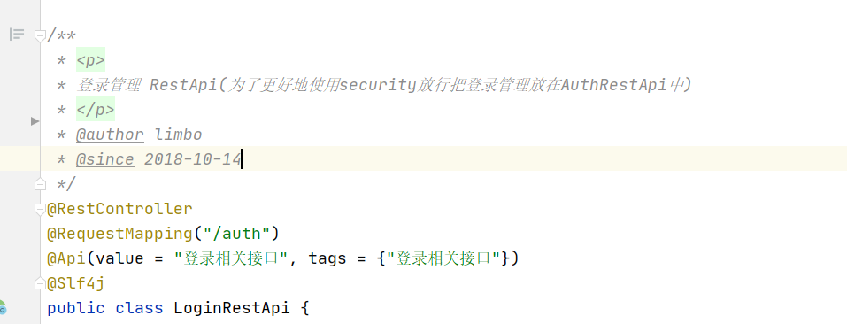
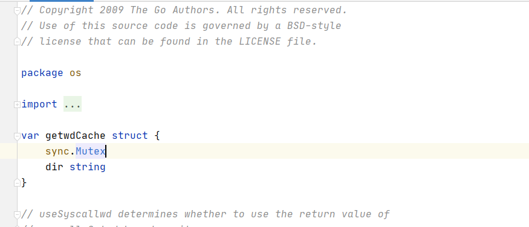
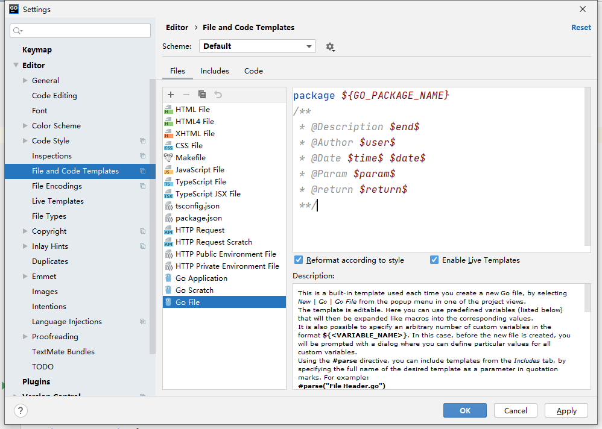
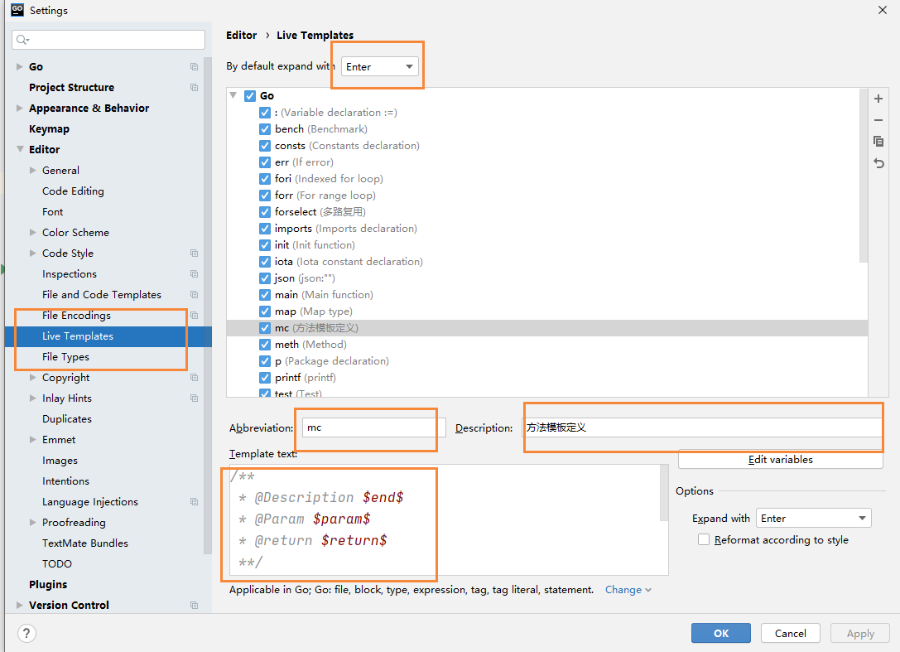
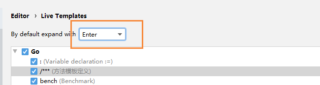
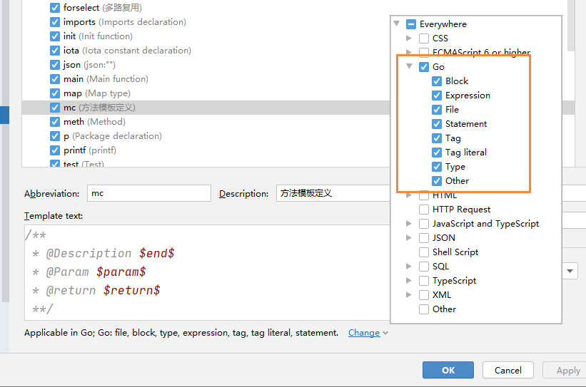
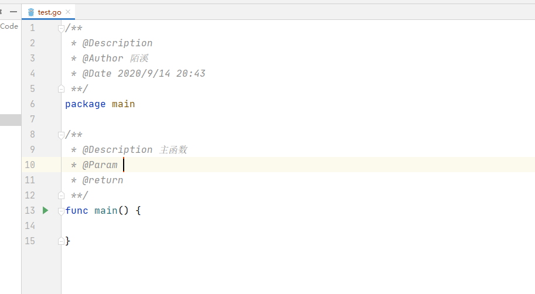

# Goland添加注释模板

## 前言

对于习惯了使用IDEA进行Java开发的人来说，Go里面的注释方式确实让我有些看不太下去了...

这是Java里面的场景注释



然后这是Go语言中的注释，都是使用// 来进行注释的，不像Java中的一样有条理和规范



因此，就想着通过定义注释模板，写出比较舒服的注释

## 类模板定义

Goland中也提供了我们注释模板的定义，到setting中配置即可，首先我们定义创建新文件的时候，生成的类注释



找到Go File即可，然后输入下面的信息保存即可

```bash
package ${GO_PACKAGE_NAME}
/**
 * @Description 
 * @Author 陌溪
 * @Date ${DATE} ${TIME}
 **/
func main() {
	
}
```

下面我们通过 new，创建一个go file文件进行测试


可以看到，刚刚添加的文件，就有了测试信息了~

## 方法模板定义

下面我们还需要做的就是类似于Java中的方法定义了，我们继续来到settings页面



填写上模板信息

```bash
/**
 * @Description $end$
 * @Param $param$
 * @return $return$
 **/
```

然后在设置触发条件，我们是回车的时候触发，所以选择Enter



然后在选择什么文件下触发，选择go文件



下面我们找到一个方法，输入mc  然后回车即可

