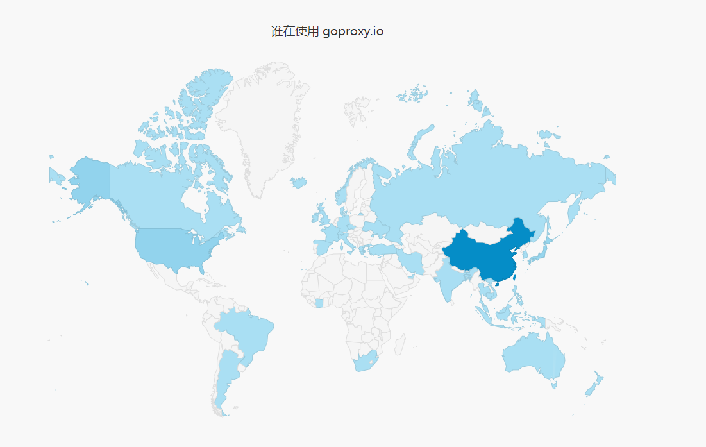

# 执行GoGet命令下载依赖失败的解决方法

## 前言

最近在学习go连接mysql数据库这块，需要下载mysql的驱动包，使用的是下面的命令

```bash
go get -u github.com/go-sql-driver/mysql
```

但是在执行的时候，总是出现如下的错误

```bash
go get github.com/go-sql-driver/mysql: module github.com/go-sql-driver/mysql: Get "https://proxy.golang.org/github.com/go-sql-driver/mysql/@v/list": dial tcp 172.217.160.81:443: connect
ex: A connection attempt failed because the connected party did not properly respond after a period of time, or established connection failed because connected host has failed to respond.
```

很显然上面的问题就是因为如果连接对应的下载服务器所引起的

## 解决方法

通过阅读博客，我发现了有专门一个 [Go模块代理网站](https://goproxy.io/zh/) ，提供了一下几种解决方案，使用的是国内的代理



### 如果您使用的 Go 版本是 1.13 及以上 （推荐）

```bash
go env -w GO111MODULE=on
go env -w GOPROXY=https://goproxy.io,direct

# 设置不走 proxy 的私有仓库，多个用逗号相隔（可选）
go env -w GOPRIVATE=*.corp.example.com

# 设置不走 proxy 的私有组织（可选）
go env -w GOPRIVATE=example.com/org_name
```

设置完上面几个环境变量后，您的 `go` 命令将从公共代理镜像中快速拉取您所需的依赖代码了。[私有库的支持请看这里](https://goproxy.io/zh/docs/goproxyio-private.html)。

### 如果您使用的 Go 版本是 1.12 及以下

**Bash (Linux or macOS)**

```shell
# 启用 Go Modules 功能
export GO111MODULE=on
# 配置 GOPROXY 环境变量
export GOPROXY=https://goproxy.io
```

或者，根据[文档](https://goproxy.io/zh/docs/getting-started.html)可以把上面的命令写到`.profile`或`.bash_profile`文件中长期生效。

**PowerShell (Windows)**

```shell
# 启用 Go Modules 功能
$env:GO111MODULE="on"
# 配置 GOPROXY 环境变量
$env:GOPROXY="https://goproxy.io"
```

现在，当你构建或运行你的应用时，Go 将会通过 goproxy.io 获取依赖

