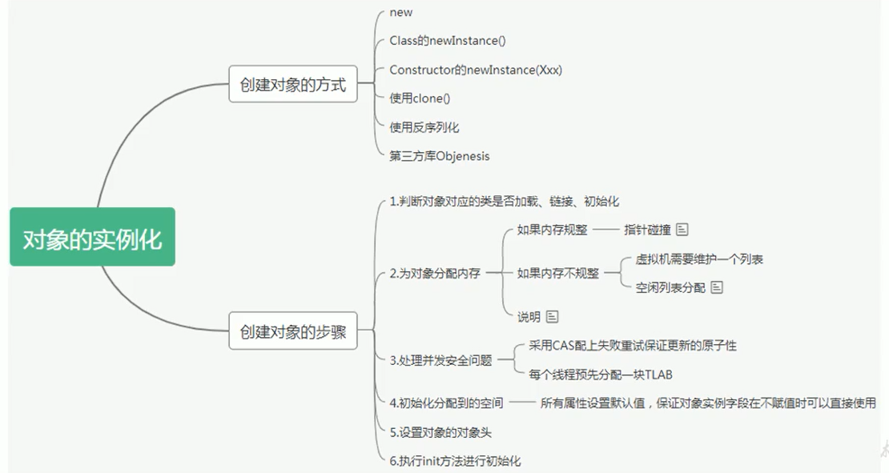
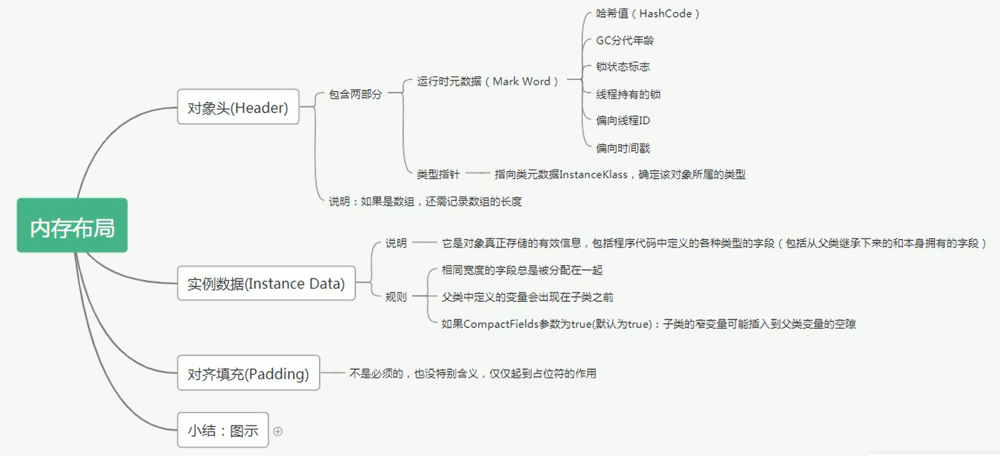
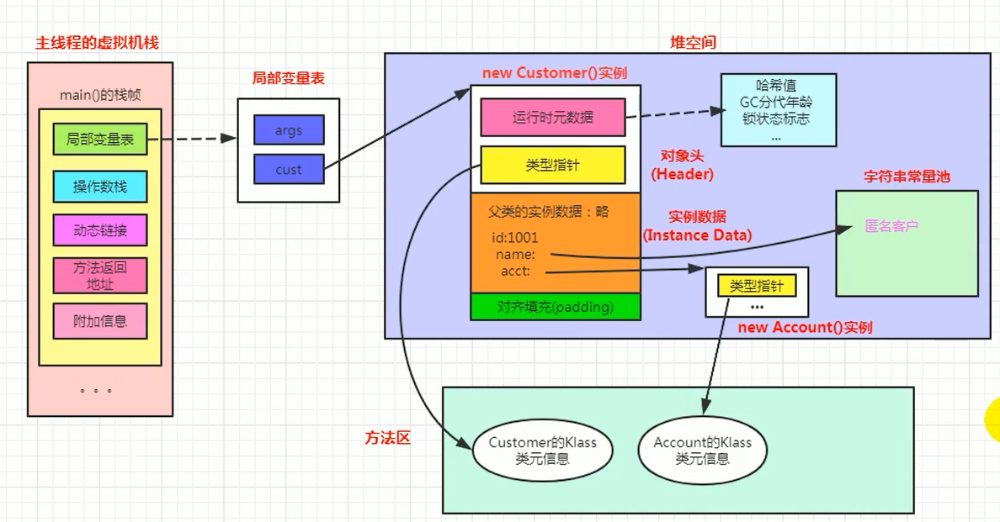
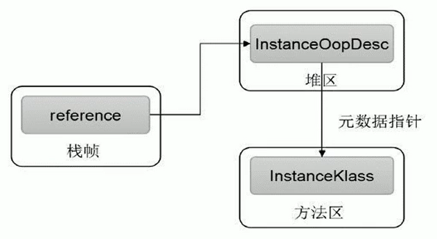
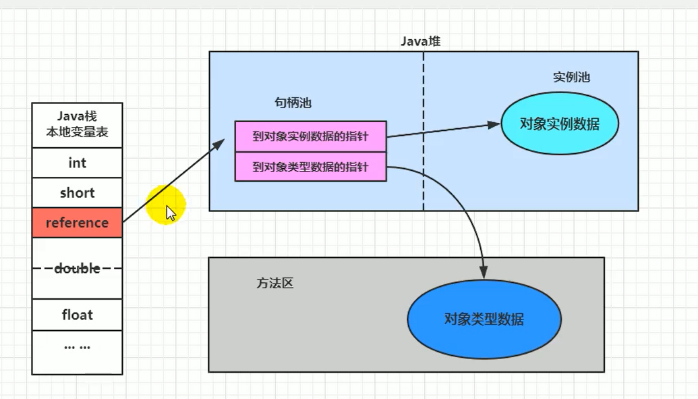
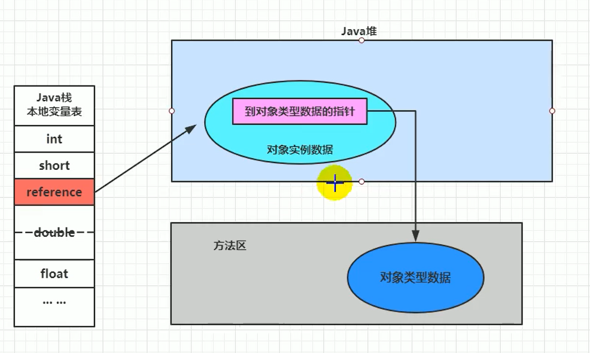

# 对象实例化内存布局与访问定位

## 对象实例化

### 面试题

- 对象在JVM中是怎么存储的？
- 对象头信息里面有哪些东西？
- Java对象头有什么？

从对象创建的方式 和 步骤开始说

### 对象创建方式

- new：最常见的方式、单例类中调用getInstance的静态类方法，XXXFactory的静态方法
- Class的newInstance方法：在JDK9里面被标记为过时的方法，因为只能调用空参构造器
- Constructor的newInstance(XXX)：反射的方式，可以调用空参的，或者带参的构造器
- 使用clone()：不调用任何的构造器，要求当前的类需要实现Cloneable接口中的clone接口
- 使用序列化：序列化一般用于Socket的网络传输
- 第三方库 Objenesis

### 创建对象的步骤

#### 判断对象对应的类是否加载、链接、初始化

虚拟机遇到一条new指令，首先去检查这个指令的参数能否在Metaspace的常量池中定位到一个类的符号引用，并且检查这个符号引用代表的类是否已经被加载，解析和初始化。（即判断类元信息是否存在）。如果没有，那么在双亲委派模式下，使用当前类加载器以ClassLoader + 包名 + 类名为key进行查找对应的 .class文件，如果没有找到文件，则抛出ClassNotFoundException异常，如果找到，则进行类加载，并生成对应的Class对象。

#### 为对象分配内存

首先计算对象占用空间的大小，接着在堆中划分一块内存给新对象。如果实例成员变量是引用变量，仅分配引用变量空间即可，即4个字节大小

- 如果内存规整：指针碰撞

- 如果内存不规整
  - 虚拟表需要维护一个列表
  - 空闲列表分配

如果内存是规整的，那么虚拟机将采用的是指针碰撞法（Bump The Point）来为对象分配内存。

意思是所有用过的内存在一边，空闲的内存放另外一边，中间放着一个指针作为分界点的指示器，分配内存就仅仅是把指针指向空闲那边挪动一段与对象大小相等的距离罢了。如果垃圾收集器选择的是Serial ，ParNew这种基于压缩算法的，虚拟机采用这种分配方式。一般使用带Compact（整理）过程的收集器时，使用指针碰撞。

如果内存不是规整的，已使用的内存和未使用的内存相互交错，那么虚拟机将采用的是空闲列表来为对象分配内存。意思是虚拟机维护了一个列表，记录上那些内存块是可用的，再分配的时候从列表中找到一块足够大的空间划分给对象实例，并更新列表上的内容。这种分配方式成为了 “空闲列表（Free List）”

选择哪种分配方式由Java堆是否规整所决定，而Java堆是否规整又由所采用的垃圾收集器是否带有压缩整理功能决定。

#### 处理并发问题

- 采用CAS配上失败重试保证更新的原子性
- 每个线程预先分配TLAB - 通过设置 -XX:+UseTLAB参数来设置（区域加锁机制）
  - 在Eden区给每个线程分配一块区域

### 初始化分配到的内存

给对象属性赋值的操作

- 属性的默认初始化
- 显示初始化
- 代码块中的初始化
- 构造器初始化

- 所有属性设置默认值，保证对象实例字段在不赋值可以直接使用

### 设置对象的对象头

将对象的所属类（即类的元数据信息）、对象的HashCode和对象的GC信息、锁信息等数据存储在对象的对象头中。这个过程的具体设置方式取决于JVM实现。

### 执行init方法进行初始化

在Java程序的视角看来，初始化才正式开始。初始化成员变量，执行实例化代码块，调用类的构造方法，并把堆内对象的首地址赋值给引用变量

因此一般来说（由字节码中跟随invokespecial指令所决定），new指令之后会接着就是执行方法，把对象按照程序员的意愿进行初始化，这样一个真正可用的对象才算完成创建出来。

### 对象实例化的过程

- 加载类元信息
- 为对象分配内存
- 处理并发问题
- 属性的默认初始化（零值初始化）
- 设置对象头信息
- 属性的显示初始化、代码块中初始化、构造器中初始化

## 对象内存布局

### 对象头

对象头包含了两部分，分别是 运行时元数据（Mark Word）和 类型指针

> 如果是数组，还需要记录数组的长度

#### 运行时元数据

- 哈希值（HashCode）
- GC分代年龄
- 锁状态标志
- 线程持有的锁
- 偏向线程ID
- 翩向时间戳

#### 类型指针

指向类元数据InstanceKlass，确定该对象所属的类型。指向的其实是方法区中存放的类元信息

### 实例数据（Instance Data）

#### 说明

不是必须的，也没有特别的含义，仅仅起到占位符的作用

### 小结

## 对象的访问定位

### 图示

JVM是如何通过栈帧中的对象引用访问到其内部的对象实例呢？

### 对象访问的两种方式

#### 句柄访问

句柄访问就是说栈的局部变量表中，记录的对象的引用，然后在堆空间中开辟了一块空间，也就是句柄池

#### 优点

reference中存储稳定句柄地址，对象被移动（垃圾收集时移动对象很普遍）时只会改变句柄中实例数据指针即可，reference本身不需要被修改

#### 直接指针（HotSpot采用）

直接指针是局部变量表中的引用，直接指向堆中的实例，在对象实例中有类型指针，指向的是方法区中的对象类型数据