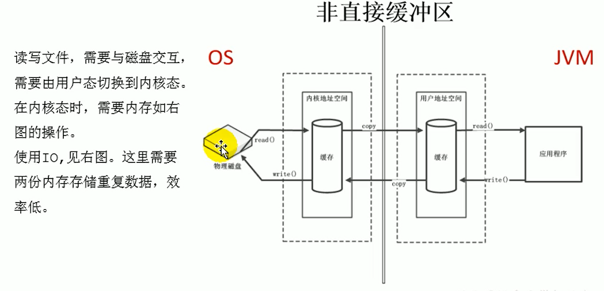
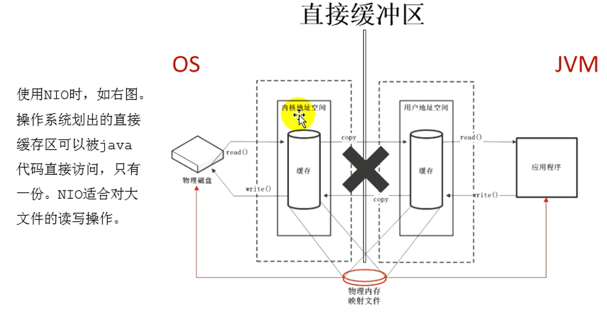
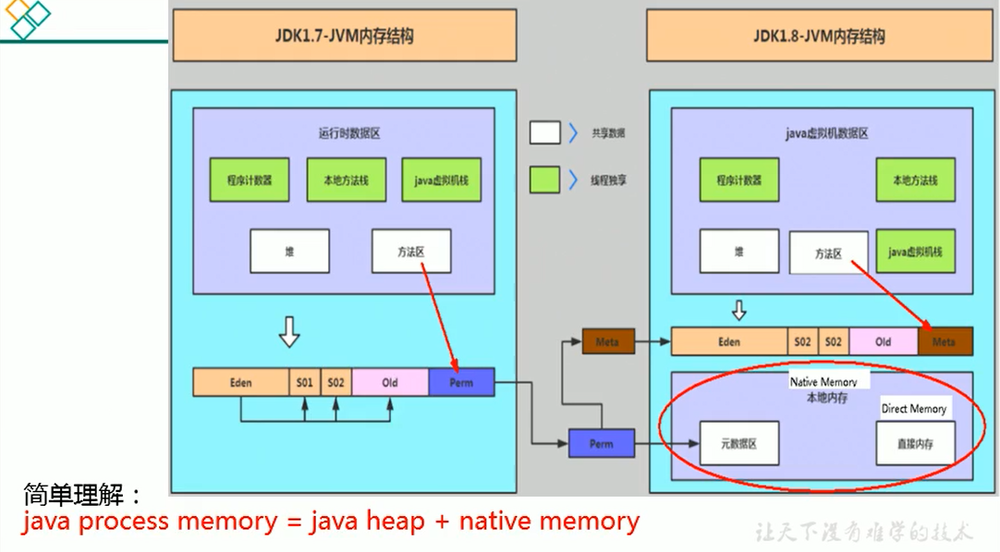

# 直接内存 Direct Memory

不是虚拟机运行时数据区的一部分，也不是《Java虚拟机规范》中定义的内存区域。

直接内存是在 Java 堆外的、直接向系统申请的内存区间。

来源于 NIO ，通过存在堆中的 DirectByteBuffer 操作 Native 内存

通常，访问直接内存的速度会优于 Java 堆。即读写性能高。

- 因此出于性能考虑，读写频繁的场合可能会考虑使用直接内存。
- Java 的 NIO 库允许 Java 程序使用直接内存，用于数据缓冲区

使用下列代码，直接分配本地内存空间

```java
int BUFFER = 1024*1024*1024; // 1GB
ByteBuffer byteBuffer = ByteBuffer.allocateDirect(BUFFER);
```

## 非直接缓存区和直接缓存区

原来采用 BIO 的架构，我们需要从用户态切换成内核态



NIO 的方式使用了直接缓存区的概念



## 存在的问题

也可能导致 OutOfMemoryError 异常

由于直接内存在 Java 堆外，因此它的大小不会直接受限于 -Xmx 指定的最大堆大小，但是系统内存是有限的，Java 堆和直接内存的总和依然受限于操作系统能给出的最大内存。

缺点

- 分配回收成本较高
- 不受 JVM 内存回收管理

直接内存大小可以通过 MaxDirectMemorySize 设置

如果不指定，默认与堆的最大值 -Xmx 参数值一致

