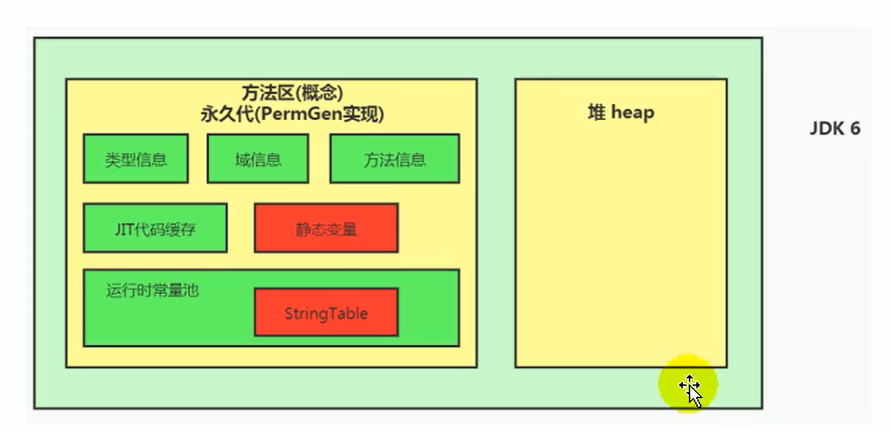
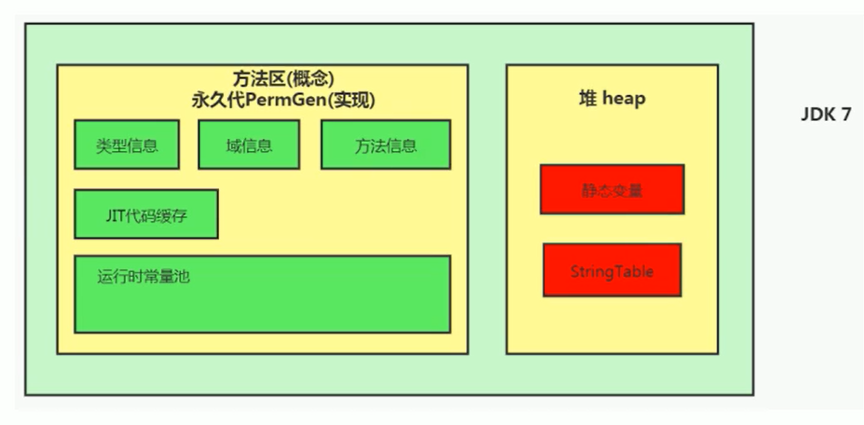
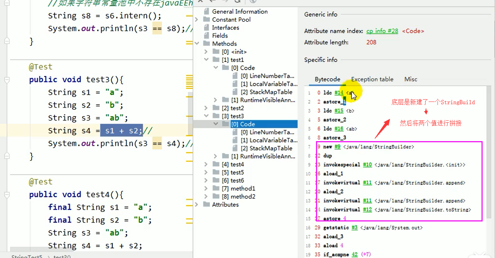
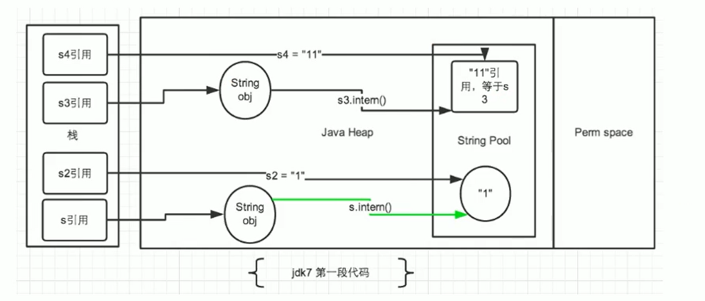
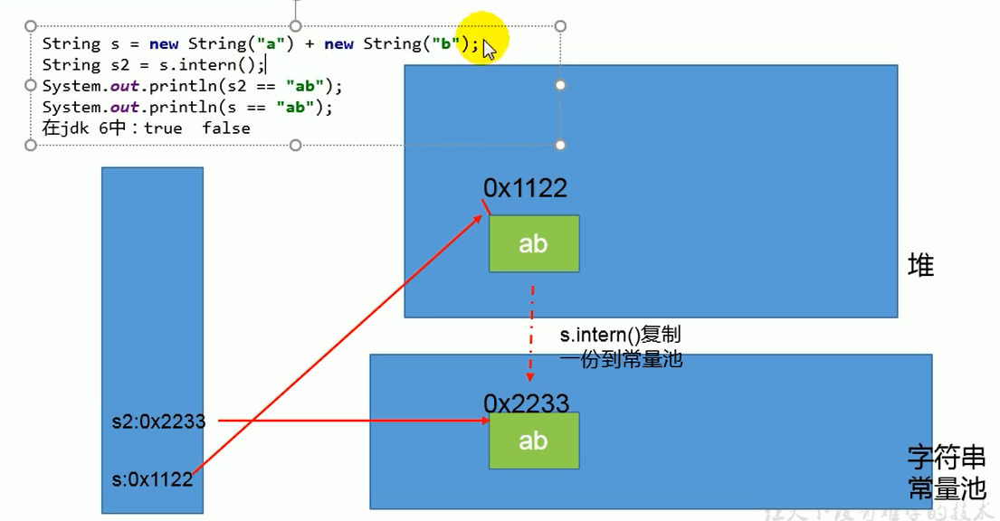
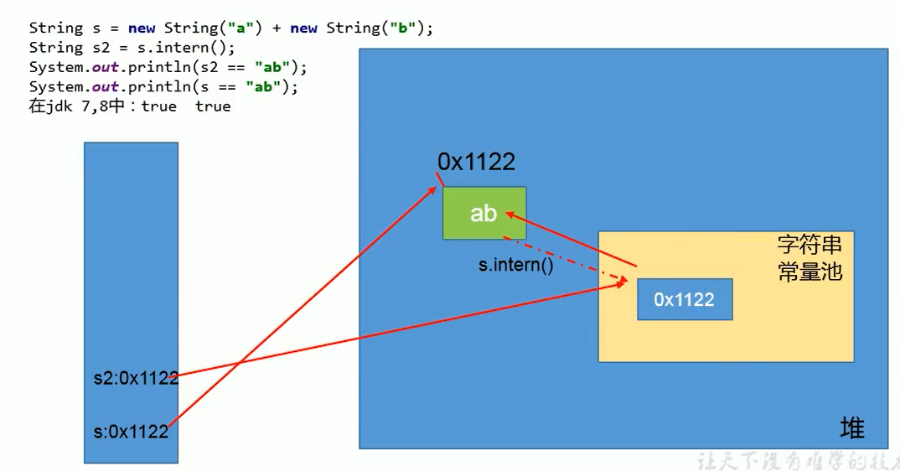

# StringTable

## String的基本特性

- String：字符串，使用一对 ”” 引起来表示
  - String s1 = "mogublog" ;   // 字面量的定义方式
  - String s2 =  new String("moxi"); 
- string声明为final的，不可被继承
- String实现了Serializable接口：表示字符串是支持序列化的。实现了Comparable接口：表示string可以比较大小
- string在jdk8及以前内部定义了final char[] value用于存储字符串数据。JDK9时改为byte[]

### 为什么JDK9改变了结构

String类的当前实现将字符存储在char数组中，每个字符使用两个字节(16位)。从许多不同的应用程序收集的数据表明，字符串是堆使用的主要组成部分，而且，大多数字符串对象只包含拉丁字符。这些字符只需要一个字节的存储空间，因此这些字符串对象的内部char数组中有一半的空间将不会使用。

我们建议改变字符串的内部表示clasš从utf - 16字符数组到字节数组+一个encoding-flag字段。新的String类将根据字符串的内容存储编码为ISO-8859-1/Latin-1(每个字符一个字节)或UTF-16(每个字符两个字节)的字符。编码标志将指示使用哪种编码。

结论：String再也不用char[] 来存储了，改成了byte [] 加上编码标记，节约了一些空间

```java
// 之前
private final char value[];
// 之后
private final byte[] value
```

同时基于String的数据结构，例如StringBuffer和StringBuilder也同样做了修改

### String的不可变性

String：代表不可变的字符序列。简称：不可变性。

>当对字符串重新赋值时，需要重写指定内存区域赋值，不能使用原有的value进行赋值。
>当对现有的字符串进行连接操作时，也需要重新指定内存区域赋值，不能使用原有的value进行赋值。
>当调用string的replace（）方法修改指定字符或字符串时，也需要重新指定内存区域赋值，不能使用原有的value进行赋值。
>通过字面量的方式（区别于new）给一个字符串赋值，此时的字符串值声明在字符串常量池中。

代码

```java
/**
 * String的不可变性
 *
 * @author: 陌溪
 * @create: 2020-07-11-8:57
 */
public class StringTest1 {

    public static void test1() {
        // 字面量定义的方式，“abc”存储在字符串常量池中
        String s1 = "abc";
        String s2 = "abc";
        System.out.println(s1 == s2);
        s1 = "hello";
        System.out.println(s1 == s2);
        System.out.println(s1);
        System.out.println(s2);
        System.out.println("----------------");
    }

    public static void test2() {
        String s1 = "abc";
        String s2 = "abc";
        // 只要进行了修改，就会重新创建一个对象，这就是不可变性
        s2 += "def";
        System.out.println(s1);
        System.out.println(s2);
        System.out.println("----------------");
    }

    public static void test3() {
        String s1 = "abc";
        String s2 = s1.replace('a', 'm');
        System.out.println(s1);
        System.out.println(s2);
    }

    public static void main(String[] args) {
        test1();
        test2();
        test3();
    }
}
```

运行结果

```
true
false
hello
abc
----------------
abc
abcdef
----------------
abc
mbc
```

### 面试题

```java
/**
 * 面试题
 *
 * @author: 陌溪
 * @create: 2020-07-11-9:05
 */
public class StringExer {
    String str = new String("good");
    char [] ch = {'t','e','s','t'};

    public void change(String str, char ch []) {
        str = "test ok";
        ch[0] = 'b';
    }

    public static void main(String[] args) {
        StringExer ex = new StringExer();
        ex.change(ex.str, ex.ch);
        System.out.println(ex.str);
        System.out.println(ex.ch);
    }
}
```

输出结果

```
good
best
```

### 注意

**字符串常量池是不会存储相同内容的字符串的**

String的string Pool是一个固定大小的Hashtable，默认值大小长度是1009。如果放进string Pool的string非常多，就会造成Hash冲突严重，从而导致链表会很长，而链表长了后直接会造成的影响就是当调用string.intern时性能会大幅下降。

使用-XX:StringTablesize可设置stringTab1e的长度

在jdk6中stringTable是固定的，就是1009的长度，所以如果常量池中的字符串过多就会导致效率下降很快。stringTablesize设置没有要求

在jdk7中，stringTable的长度默认值是60013，

在JDK8中，StringTable可以设置的最小值为1009

## String的内存分配

在Java语言中有8种基本数据类型和一种比较特殊的类型string。这些类型为了使它们在运行过程中速度更快、更节省内存，都提供了一种常量池的概念。

常量池就类似一个Java系统级别提供的缓存。8种基本数据类型的常量池都是系统协调的，string类型的常量池比较特殊。它的主要使用方法有两种。

直接使用双引号声明出来的String对象会直接存储在常量池中。

- 比如：string info="atguigu.com"；

如果不是用双引号声明的string对象，可以使用string提供的intern（）方法。

Java 6及以前，字符串常量池存放在永久代

Java 7中 oracle的工程师对字符串池的逻辑做了很大的改变，即将字符串常量池的位置调整到Java堆内

>所有的字符串都保存在堆（Heap）中，和其他普通对象一样，这样可以让你在进行调优应用时仅需要调整堆大小就可以了。
>
>字符串常量池概念原本使用得比较多，但是这个改动使得我们有足够的理由让我们重新考虑在Java 7中使用string.intern（）。

Java8元空间，字符串常量在堆





### 为什么StringTable从永久代调整到堆中

在JDK 7中，interned字符串不再在Java堆的永久生成中分配，而是在Java堆的主要部分(称为年轻代和年老代)中分配，与应用程序创建的其他对象一起分配。此更改将导致驻留在主Java堆中的数据更多，驻留在永久生成中的数据更少，因此可能需要调整堆大小。由于这一变化，大多数应用程序在堆使用方面只会看到相对较小的差异，但加载许多类或大量使用字符串的较大应用程序会出现这种差异。intern()方法会看到更显著的差异。

- 永久代的默认比较小
- 永久代垃圾回收频率低

## String的基本操作

Java语言规范里要求完全相同的字符串字面量，应该包含同样的Unicode字符序列（包含同一份码点序列的常量），并且必须是指向同一个String类实例。

## 字符串拼接操作

- 常量与常量的拼接结果在常量池，原理是编译期优化
- 常量池中不会存在相同内容的变量
- 只要其中有一个是变量，结果就在堆中。变量拼接的原理是StringBuilder
- 如果拼接的结果调用intern()方法，则主动将常量池中还没有的字符串对象放入池中，并返回此对象地址

```java
    public static void test1() {
        String s1 = "a" + "b" + "c";  // 得到 abc的常量池
        String s2 = "abc"; // abc存放在常量池，直接将常量池的地址返回
        /**
         * 最终java编译成.class，再执行.class
         */
        System.out.println(s1 == s2); // true，因为存放在字符串常量池
        System.out.println(s1.equals(s2)); // true
    }

	public static void test2() {
        String s1 = "javaEE";
        String s2 = "hadoop";
        String s3 = "javaEEhadoop";
        String s4 = "javaEE" + "hadoop";    
        String s5 = s1 + "hadoop";
        String s6 = "javaEE" + s2;
        String s7 = s1 + s2;

        System.out.println(s3 == s4); // true
        System.out.println(s3 == s5); // false
        System.out.println(s3 == s6); // false
        System.out.println(s3 == s7); // false
        System.out.println(s5 == s6); // false
        System.out.println(s5 == s7); // false
        System.out.println(s6 == s7); // false

        String s8 = s6.intern();
        System.out.println(s3 == s8); // true
    }
```

从上述的结果我们可以知道：

如果拼接符号的前后出现了变量，则相当于在堆空间中new String()，具体的内容为拼接的结果

而调用intern方法，则会判断字符串常量池中是否存在JavaEEhadoop值，如果存在则返回常量池中的值，否者就在常量池中创建

### 底层原理

拼接操作的底层其实使用了StringBuilder



s1 + s2的执行细节

- StringBuilder s = new StringBuilder();
- s.append(s1);
- s.append(s2);
- s.toString();  -> 类似于new String("ab");

在JDK5之后，使用的是StringBuilder，在JDK5之前使用的是StringBuffer

| String                                                       | StringBuffer                                                 | StringBuilder    |
| ------------------------------------------------------------ | ------------------------------------------------------------ | ---------------- |
| String的值是不可变的，这就导致每次对String的操作都会生成新的String对象，不仅效率低下，而且浪费大量优先的内存空间 | StringBuffer是可变类，和线程安全的字符串操作类，任何对它指向的字符串的操作都不会产生新的对象。每个StringBuffer对象都有一定的缓冲区容量，当字符串大小没有超过容量时，不会分配新的容量，当字符串大小超过容量时，会自动增加容量 | 可变类，速度更快 |
| 不可变                                                       | 可变                                                         | 可变             |
|                                                              | 线程安全                                                     | 线程不安全       |
|                                                              | 多线程操作字符串                                             | 单线程操作字符串 |

注意，我们左右两边如果是变量的话，就是需要new StringBuilder进行拼接，但是如果使用的是final修饰，则是从常量池中获取。所以说拼接符号左右两边都是字符串常量或常量引用 则仍然使用编译器优化。也就是说被final修饰的变量，将会变成常量，类和方法将不能被继承、

- 在开发中，能够使用final的时候，建议使用上

```java
public static void test4() {
    final String s1 = "a";
    final String s2 = "b";
    String s3 = "ab";
    String s4 = s1 + s2;
    System.out.println(s3 == s4);
}
```

运行结果

```
true
```

### 拼接操作和append性能对比

```java
    public static void method1(int highLevel) {
        String src = "";
        for (int i = 0; i < highLevel; i++) {
            src += "a"; // 每次循环都会创建一个StringBuilder对象
        }
    }

    public static void method2(int highLevel) {
        StringBuilder sb = new StringBuilder();
        for (int i = 0; i < highLevel; i++) {
            sb.append("a");
        }
    }
```

方法1耗费的时间：4005ms，方法2消耗时间：7ms

结论：

- 通过StringBuilder的append()方式添加字符串的效率，要远远高于String的字符串拼接方法

好处

- StringBuilder的append的方式，自始至终只创建一个StringBuilder的对象
- 对于字符串拼接的方式，还需要创建很多StringBuilder对象和 调用toString时候创建的String对象
- 内存中由于创建了较多的StringBuilder和String对象，内存占用过大，如果进行GC那么将会耗费更多的时间

改进的空间

- 我们使用的是StringBuilder的空参构造器，默认的字符串容量是16，然后将原来的字符串拷贝到新的字符串中， 我们也可以默认初始化更大的长度，减少扩容的次数
- 因此在实际开发中，我们能够确定，前前后后需要添加的字符串不高于某个限定值，那么建议使用构造器创建一个阈值的长度

## intern()的使用

intern是一个native方法，调用的是底层C的方法

字符串池最初是空的，由String类私有地维护。在调用intern方法时，如果池中已经包含了由equals(object)方法确定的与该字符串对象相等的字符串，则返回池中的字符串。否则，该字符串对象将被添加到池中，并返回对该字符串对象的引用。

如果不是用双引号声明的string对象，可以使用string提供的intern方法：intern方法会从字符串常量池中查询当前字符串是否存在，若不存在就会将当前字符串放入常量池中。

比如：

```
String myInfo = new string("I love atguigu").intern();
```

也就是说，如果在任意字符串上调用string.intern方法，那么其返回结果所指向的那个类实例，必须和直接以常量形式出现的字符串实例完全相同。因此，下列表达式的值必定是true

```java
（"a"+"b"+"c"）.intern（）=="abc"
```

通俗点讲，Interned string就是确保字符串在内存里只有一份拷贝，这样可以节约内存空间，加快字符串操作任务的执行速度。注意，这个值会被存放在字符串内部池（String Intern Pool）

### intern的空间效率测试

我们通过测试一下，使用了intern和不使用的时候，其实相差还挺多的

```
/**
 * 使用Intern() 测试执行效率
 * @author: 陌溪
 * @create: 2020-07-11-15:19
 */
public class StringIntern2 {
    static final int MAX_COUNT = 1000 * 10000;
    static final String[] arr = new String[MAX_COUNT];

    public static void main(String[] args) {
        Integer [] data = new Integer[]{1,2,3,4,5,6,7,8,9,10};
        long start = System.currentTimeMillis();
        for (int i = 0; i < MAX_COUNT; i++) {
            arr[i] = new String(String.valueOf(data[i%data.length])).intern();
        }
        long end = System.currentTimeMillis();
        System.out.println("花费的时间为：" + (end - start));

        try {
            Thread.sleep(1000000);
        } catch (Exception e) {
            e.getStackTrace();
        }
    }
}
```

**结论**：对于程序中大量使用存在的字符串时，尤其存在很多已经重复的字符串时，使用intern()方法能够节省内存空间。

大的网站平台，需要内存中存储大量的字符串。比如社交网站，很多人都存储：北京市、海淀区等信息。这时候如果字符串都调用intern() 方法，就会很明显降低内存的大小。

## 面试题

### new String("ab")会创建几个对象

```java
/**
 * new String("ab") 会创建几个对象？ 看字节码就知道是2个对象
 *
 * @author: 陌溪
 * @create: 2020-07-11-11:17
 */
public class StringNewTest {
    public static void main(String[] args) {
        String str = new String("ab");
    }
}
```

我们转换成字节码来查看

```
 0 new #2 <java/lang/String>
 3 dup
 4 ldc #3 <ab>
 6 invokespecial #4 <java/lang/String.<init>>
 9 astore_1
10 return
```

这里面就是两个对象

- 一个对象是：new关键字在堆空间中创建
- 另一个对象：字符串常量池中的对象

### new String("a") + new String("b") 会创建几个对象

```java
/**
 * new String("ab") 会创建几个对象？ 看字节码就知道是2个对象
 *
 * @author: 陌溪
 * @create: 2020-07-11-11:17
 */
public class StringNewTest {
    public static void main(String[] args) {
        String str = new String("a") + new String("b");
    }
}
```

字节码文件为

```
 0 new #2 <java/lang/StringBuilder>
 3 dup
 4 invokespecial #3 <java/lang/StringBuilder.<init>>
 7 new #4 <java/lang/String>
10 dup
11 ldc #5 <a>
13 invokespecial #6 <java/lang/String.<init>>
16 invokevirtual #7 <java/lang/StringBuilder.append>
19 new #4 <java/lang/String>
22 dup
23 ldc #8 <b>
25 invokespecial #6 <java/lang/String.<init>>
28 invokevirtual #7 <java/lang/StringBuilder.append>
31 invokevirtual #9 <java/lang/StringBuilder.toString>
34 astore_1
35 return
```

我们创建了6个对象

- 对象1：new StringBuilder()
- 对象2：new String("a")
- 对象3：常量池的 a
- 对象4：new String("b")
- 对象5：常量池的 b
- 对象6：toString中会创建一个 new String("ab")
  - 调用toString方法，不会在常量池中生成ab

### intern的使用：JDK6和JDK7

#### JDK6中

```java
String s = new String("1");  // 在常量池中已经有了
s.intern(); // 将该对象放入到常量池。但是调用此方法没有太多的区别，因为已经存在了1
String s2 = "1";
System.out.println(s == s2); // false

String s3 = new String("1") + new String("1");
s3.intern();
String s4 = "11";
System.out.println(s3 == s4); // false
```

输出结果

```
false
false
```

为什么对象会不一样呢？

- 一个是new创建的对象，一个是常量池中的对象，显然不是同一个

如果是下面这样的，那么就是true

```
String s = new String("1");
s = s.intern();
String s2 = "1";
System.out.println(s == s2); // true
```

而对于下面的来说，因为 s3变量记录的地址是  new String("11")，然后这段代码执行完以后，常量池中不存在 "11"，这是JDK6的关系，然后执行 s3.intern()后，就会在常量池中生成 "11"，最后 s4用的就是s3的地址

> 为什么最后输出的 s3 == s4  会为false呢？
>
> 这是因为在JDK6中创建了一个新的对象 "11"，也就是有了新的地址， s2 = 新地址
>
> 而在JDK7中，在JDK7中，并没有创新一个新对象，而是指向常量池中的新对象

#### JDK7中

```
String s = new String("1");
s.intern();
String s2 = "1";
System.out.println(s == s2); // false

String s3 = new String("1") + new String("1");
s3.intern();
String s4 = "11";
System.out.println(s3 == s4); // true
```



### 扩展

```java
String s3 = new String("1") + new String("1");
String s4 = "11";  // 在常量池中生成的字符串
s3.intern();  // 然后s3就会从常量池中找，发现有了，就什么事情都不做
System.out.println(s3 == s4);
```

我们将 s4的位置向上移动一行，发现变化就会很大，最后得到的是 false

### 总结

总结string的intern（）的使用：

JDK1.6中，将这个字符串对象尝试放入串池。

- 如果串池中有，则并不会放入。返回已有的串池中的对象的地址
- 如果没有，会把此**对象复制一份**，放入串池，并返回串池中的对象地址

JDK1.7起，将这个字符串对象尝试放入串池。

- 如果串池中有，则并不会放入。返回已有的串池中的对象的地址
- 如果没有，则会把**对象的引用地址**复制一份，放入串池，并返回串池中的引用地址

练习：



- 在JDK6中，在字符串常量池中创建一个字符串 “ab”
- 在JDK8中，在字符串常量池中没有创建 “ab”，而是将堆中的地址复制到 串池中。

所以上述结果，在JDK6中是：

```
true
false
```

在JDK8中是

```
false
true
```



针对下面这题，在JDK6和8中表现的是一样的


## StringTable的垃圾回收

```java
/**
 * String的垃圾回收
 * -Xms15m -Xmx15m -XX:+PrintStringTableStatistics -XX:+PrintGCDetails
 * @author: 陌溪
 * @create: 2020-07-11-16:55
 */
public class StringGCTest {
    public static void main(String[] args) {
        for (int i = 0; i < 100000; i++) {
            String.valueOf(i).intern();
        }
    }
}
```

## G1中的String去重操作

注意这里说的重复，指的是在堆中的数据，而不是常量池中的，因为常量池中的本身就不会重复

### 描述

背景：对许多Java应用（有大的也有小的）做的测试得出以下结果：
- 堆存活数据集合里面string对象占了25%
- 堆存活数据集合里面重复的string对象有13.5%

- string对象的平均长度是45

许多大规模的Java应用的瓶颈在于内存，测试表明，在这些类型的应用里面，Java堆中存活的数据集合差不多25%是string对象。更进一步，这里面差不多一半string对象是重复的，重复的意思是说：
stringl.equals（string2）= true。堆上存在重复的string对象必然是一种内存的浪费。这个项目将在G1垃圾收集器中实现自动持续对重复的string对象进行去重，这样就能避免浪费内存。

### 实现

- 当垃圾收集器工作的时候，会访问堆上存活的对象。对每一个访问的对象都会检查是否是候选的要去重的string对象。
- 如果是，把这个对象的一个引用插入到队列中等待后续的处理。一个去重的线程在后台运行，处理这个队列。处理队列的一个元素意味着从队列删除这个元素，然后尝试去重它引用的string对象。
- 使用一个hashtab1e来记录所有的被string对象使用的不重复的char数组。当去重的时候，会查这个hashtable，来看堆上是否已经存在一个一模一样的char数组。
- 如果存在，string对象会被调整引用那个数组，释放对原来的数组的引用，最终会被垃圾收集器回收掉。
- 如果查找失败，char数组会被插入到hashtable，这样以后的时候就可以共享这个数组了。

### 开启

命令行选项
>UsestringDeduplication（bool）：开启string去重，默认是不开启的，需要手动开启。
>Printstringbeduplicationstatistics（bool）：打印详细的去重统计信息
>stringpeduplicationAgeThreshold（uintx）：达到这个年龄的string对象被认为是去重的候选对象