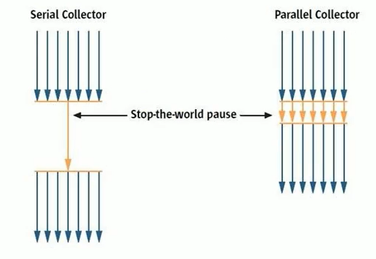
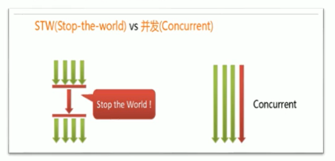
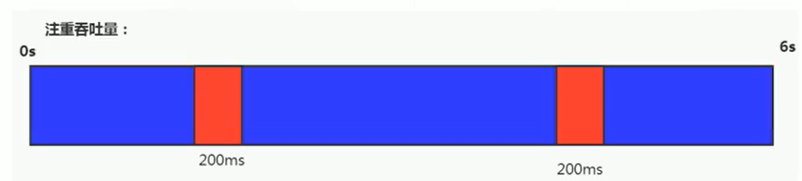
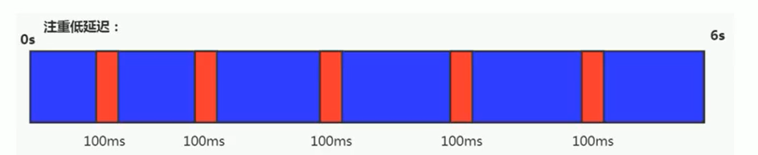
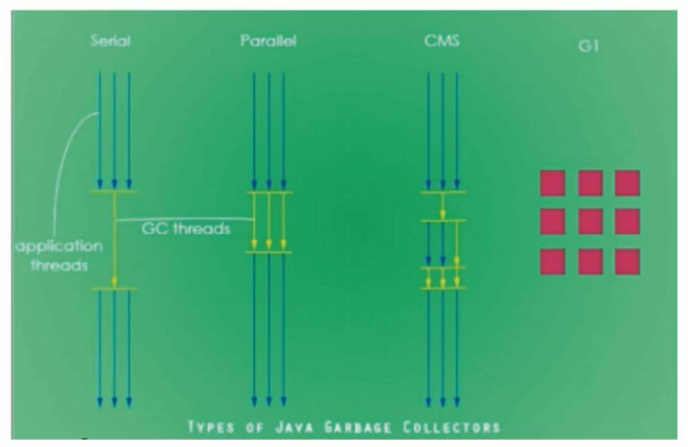
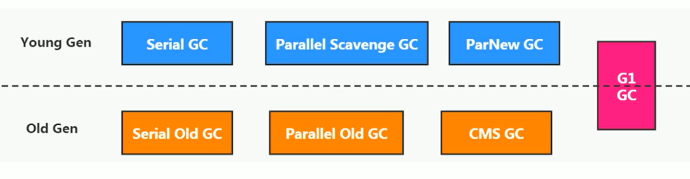

# 垃圾回收器

## GC分类与性能指标

垃圾收集器没有在规范中进行过多的规定，可以由不同的厂商、不同版本的JVM来实现。

由于JDK的版本处于高速迭代过程中，因此Java发展至今已经衍生了众多的GC版本。

从不同角度分析垃圾收集器，可以将GC分为不同的类型。

> Java不同版本新特性
>
> - 语法层面：Lambda表达式、switch、自动拆箱装箱、enum
> - API层面：Stream API、新的日期时间、Optional、String、集合框架
> - 底层优化：JVM优化、GC的变化、元空间、静态域、字符串常量池位置变化

### 垃圾收集器分类

#### **按线程数分**

**按线程数分**（垃圾回收线程数），可以分为串行垃圾回收器和并行垃圾回收器。

串行回收指的是在同一时间段内只允许有一个CPU用于执行垃圾回收操作，此时工作线程被暂停，直至垃圾收集工作结束。

- 在诸如单CPU处理器或者较小的应用内存等硬件平台不是特别优越的场合，串行回收器的性能表现可以超过并行回收器和并发回收器。所以，串行回收默认被应用在客户端的Client模式下的JVM中
- 在并发能力比较强的CPU上，并行回收器产生的停顿时间要短于串行回收器。

和串行回收相反，并行收集可以运用多个CPU同时执行垃圾回收，因此提升了应用的吞吐量，不过并行回收仍然与串行回收一样，采用独占式，使用了“stop-the-world”机制。

#### 按工作模式分

按照工作模式分，可以分为并发式垃圾回收器和独占式垃圾回收器。

- 并发式垃圾回收器与应用程序线程交替工作，以尽可能减少应用程序的停顿时间。
- 独占式垃圾回收器（Stop the world）一旦运行，就停止应用程序中的所有用户线程，直到垃圾回收过程完全结束。

#### 按碎片处理方式分

按碎片处理方式分，可分为压缩武垃圾回收器和非压缩式垃圾回收器。

- 压缩式垃圾回收器会在回收完成后，对存活对象进行压缩整理，消除回收后的碎片。
- 非压缩式的垃圾回收器不进行这步操作。

按工作的内存区间分，又可分为年轻代垃圾回收器和老年代垃圾回收器。

### 评估GC的性能指标

- **吞吐量**：运行用户代码的时间占总运行时间的比例（总运行时间 = 程序的运行时间 + 内存回收的时间）
- **垃圾收集开销**：吞吐量的补数，垃圾收集所用时间与总运行时间的比例。
- **暂停时间**：执行垃圾收集时，程序的工作线程被暂停的时间。
- **收集频率**：相对于应用程序的执行，收集操作发生的频率。
- **内存占用**：Java堆区所占的内存大小。
- **快速**：一个对象从诞生到被回收所经历的时间。

吞吐量、暂停时间、内存占用 这三者共同构成一个“不可能三角”。三者总体的表现会随着技术进步而越来越好。一款优秀的收集器通常最多同时满足其中的两项。
这三项里，暂停时间的重要性日益凸显。因为随着硬件发展，内存占用多些越来越能容忍，硬件性能的提升也有助于降低收集器运行时对应用程序的影响，即提高了吞吐量。而内存的扩大，对延迟反而带来负面效果。
简单来说，主要抓住两点：

这三项里，暂停时间的重要性日益凸显。因为随着硬件发展，内存占用多些越来越能容忍，硬件性能的提升也有助于降低收集器运行时对应用程序的影响，即提高了吞吐量。而内存的扩大，对延迟反而带来负面效果。
简单来说，主要抓住两点：

- 吞吐量
- 暂停时间

### 性能指标：吞吐量

吞吐量就是CPU用于运行用户代码的时间与CPU总消耗时间的比值，即吞吐量=运行用户代码时间 /（运行用户代码时间+垃圾收集时间）

>比如：虚拟机总共运行了100分钟，其中垃圾收集花掉1分钟，那吞吐量就是99%。

这种情况下，应用程序能容忍较高的暂停时间，因此，高吞吐量的应用程序有更长的时间基准，快速响应是不必考虑的

吞吐量优先，意味着在单位时间内，STW的时间最短：0.2+0.2=e.4

### 性能指标：暂停时间

“暂停时间”是指一个时间段内应用程序线程暂停，让Gc线程执行的状态

例如，GC期间1ee毫秒的暂停时间意味着在这1e0毫秒期间内没有应用程序线程是活动的。暂停时间优先，意味着尽可能让单次STW的时间最短：0.1+0.1 + 0.1+ 0.1+ 0.1=0.5

### 吞吐量vs暂停时间

高吞吐量较好因为这会让应用程序的最终用户感觉只有应用程序线程在做“生产性”工作。直觉上，吞吐量越高程序运行越快。

低暂停时间（低延迟）较好因为从最终用户的角度来看不管是GC还是其他原因导致一个应用被挂起始终是不好的。这取决于应用程序的类型，有时候甚至短暂的200毫秒暂停都可能打断终端用户体验。因此，具有低的较大暂停时间是非常重要的，特别是对于一个交互式应用程序。

不幸的是”高吞吐量”和”低暂停时间”是一对相互竞争的目标（矛盾）。

因为如果选择以吞吐量优先，那么必然需要降低内存回收的执行频率，但是这样会导致GC需要更长的暂停时间来执行内存回收。

相反的，如果选择以低延迟优先为原则，那么为了降低每次执行内存回收时的暂停时间，也只能频繁地执行内存回收，但这又引起了年轻代内存的缩减和导致程序吞吐量的下降。

在设计（或使用）GC算法时，我们必须确定我们的目标：一个GC算法只可能针对两个目标之一（即只专注于较大吞吐量或最小暂停时间），或尝试找到一个二者的折衷。

现在标准：**在最大吞吐量优先的情况下，降低停顿时间**

## 不同的垃圾回收器概述

垃圾收集机制是Java的招牌能力，极大地提高了开发效率。这当然也是面试的热点。

那么，Java常见的垃圾收集器有哪些？

> GC垃圾收集器是和JVM一脉相承的，它是和JVM进行搭配使用，在不同的使用场景对应的收集器也是有区别

### 垃圾回收器发展史

有了虚拟机，就一定需要收集垃圾的机制，这就是Garbage Collection，对应的产品我们称为Garbage Collector。

- 1999年随JDK1.3.1一起来的是串行方式的serialGc，它是第一款GC。ParNew垃圾收集器是Serial收集器的多线程版本
- 2002年2月26日，Parallel GC和Concurrent Mark Sweep GC跟随JDK1.4.2一起发布·
- Parallel GC在JDK6之后成为HotSpot默认GC。
- 2012年，在JDK1.7u4版本中，G1可用。
- 2017年，JDK9中G1变成默认的垃圾收集器，以替代CMS。
- 2018年3月，JDK10中G1垃圾回收器的并行完整垃圾回收，实现并行性来改善最坏情况下的延迟。
- 2018年9月，JDK11发布。引入Epsilon 垃圾回收器，又被称为 "No-Op(无操作)“ 回收器。同时，引入ZGC：可伸缩的低延迟垃圾回收器（Experimental）
- 2019年3月，JDK12发布。增强G1，自动返回未用堆内存给操作系统。同时，引入Shenandoah GC：低停顿时间的GC（Experimental）。·2019年9月，JDK13发布。增强zGC，自动返回未用堆内存给操作系统。
- 2020年3月，JDK14发布。删除cMs垃圾回收器。扩展zGC在macos和Windows上的应用

### 7种经典的垃圾收集器

- 串行回收器：Serial、Serial old
- 并行回收器：ParNew、Parallel Scavenge、Parallel old
- 并发回收器：CMS、G11

### 7款经典收集器与垃圾分代之间的关系

新生代收集器：Serial、ParNew、Paralle1 Scavenge；

老年代收集器：Serial old、Parallel old、CMS；

整堆收集器：G1；

### 垃圾收集器的组合关系

- 两个收集器间有连线，表明它们可以搭配使用：Serial/Serial old、Serial/CMS、ParNew/Serial old、ParNew/CMS、Parallel Scavenge/Serial 0ld、Parallel Scavenge/Parallel 01d、G1；
- 其中Serial o1d作为CMs出现"Concurrent Mode Failure"失败的后备预案。
- （红色虚线）由于维护和兼容性测试的成本，在JDK 8时将Serial+CMS、ParNew+Serial old这两个组合声明为废弃（JEP173），并在JDK9中完全取消了这些组合的支持（JEP214），即：移除。
- （绿色虚线）JDK14中：弃用Paralle1 Scavenge和Serialold GC组合（JEP366）
- （青色虚线）JDK14中：删除CMs垃圾回收器（JEP363）

为什么要有很多收集器，一个不够吗？因为Java的使用场景很多，移动端，服务器等。所以就需要针对不同的场景，提供不同的垃圾收集器，提高垃圾收集的性能。

虽然我们会对各个收集器进行比较，但并非为了挑选一个最好的收集器出来。没有一种放之四海皆准、任何场景下都适用的完美收集器存在，更加没有万能的收集器。所以我们选择的只是对具体应用最合适的收集器。

### 如何查看默认垃圾收集器

-XX:+PrintcommandLineFlags：查看命令行相关参数（包含使用的垃圾收集器）

使用命令行指令：jinfo -flag  相关垃圾回收器参数  进程ID

## Serial回收器：串行回收

Serial收集器是最基本、历史最悠久的垃圾收集器了。JDK1.3之前回收新生代唯一的选择。

Serial收集器作为HotSpot中client模式下的默认新生代垃圾收集器。

Serial收集器采用复制算法、串行回收和"stop-the-World"机制的方式执行内存回收。

除了年轻代之外，Serial收集器还提供用于执行老年代垃圾收集的Serial old收集器。Serial old收集器同样也采用了串行回收和"stop the World"机制，只不过内存回收算法使用的是标记-压缩算法。

- Serial old是运行在Client模式下默认的老年代的垃圾回收器
- Serial 0ld在Server模式下主要有两个用途：
  - 与新生代的Parallel scavenge配合使用
  - 作为老年代CMS收集器的后备垃圾收集方案

这个收集器是一个单线程的收集器，但它的“单线程”的意义并不仅仅说明它只会使用一个CPU或一条收集线程去完成垃圾收集工作，更重要的是在它进行垃圾收集时，必须暂停其他所有的工作线程，直到它收集结束（Stop The World）

优势：简单而高效（与其他收集器的单线程比），对于限定单个cPU的环境来说，Serial收集器由于没有线程交互的开销，专心做垃圾收集自然可以获得最高的单线程收集效率。

运行在client模式下的虚拟机是个不错的选择。

在用户的桌面应用场景中，可用内存一般不大（几十MB至一两百MB），可以在较短时间内完成垃圾收集（几十ms至一百多ms），只要不频繁发生，使用串行回收器是可以接受的。

在HotSpot虚拟机中，使用-XX：+UseSerialGC参数可以指定年轻代和老年代都使用串行收集器。

等价于新生代用Serial GC，且老年代用Serial old GC

### 总结

这种垃圾收集器大家了解，现在已经不用串行的了。而且在限定单核cpu才可以用。现在都不是单核的了。

对于交互较强的应用而言，这种垃圾收集器是不能接受的。一般在Java web应用程序中是不会采用串行垃圾收集器的。

## ParNew回收器：并行回收

如果说serialGC是年轻代中的单线程垃圾收集器，那么ParNew收集器则是serial收集器的多线程版本。

- Par是Parallel的缩写，New：只能处理的是新生代

ParNew 收集器除了采用并行回收的方式执行内存回收外，两款垃圾收集器之间几乎没有任何区别。ParNew收集器在年轻代中同样也是采用复制算法、"stop-the-World"机制。

ParNew 是很多JVM运行在Server模式下新生代的默认垃圾收集器。

- 对于新生代，回收次数频繁，使用并行方式高效。
- 对于老年代，回收次数少，使用串行方式节省资源。（CPU并行需要切换线程，串行可以省去切换线程的资源）

由于ParNew收集器是基于并行回收，那么是否可以断定ParNew收集器的回收效率在任何场景下都会比serial收集器更高效？

-  

因为除Serial外，目前只有ParNew GC能与CMS收集器配合工作

在程序中，开发人员可以通过选项"-XX：+UseParNewGC"手动指定使用ParNew收集器执行内存回收任务。它表示年轻代使用并行收集器，不影响老年代。

-XX:ParallelGCThreads限制线程数量，默认开启和CPU数据相同的线程数。

## Parallel回收器：吞吐量优先

HotSpot的年轻代中除了拥有ParNew收集器是基于并行回收的以外，Parallel Scavenge收集器同样也采用了复制算法、并行回收和"Stop the World"机制。

那么Parallel 收集器的出现是否多此一举？

- 和ParNew收集器不同，ParallelScavenge收集器的目标则是达到一个可控制的吞吐量（Throughput），它也被称为吞吐量优先的垃圾收集器。
- 自适应调节策略也是Paralle1 Scavenge与ParNew一个重要区别。

高吞吐量则可以高效率地利用CPU时间，尽快完成程序的运算任务，主要适合在后台运算而不需要太多交互的任务。因此，常见在服务器环境中使用。例如，那些执行批量处理、订单处理、工资支付、科学计算的应用程序。

Paralle1收集器在JDK1.6时提供了用于执行老年代垃圾收集的Paralle1o1d收集器，用来代替老年代的serialold收集器。

Parallel old收集器采用了标记-压缩算法，但同样也是基于并行回收和"stop-the-World"机制。

在程序吞吐量优先的应用场景中，IParalle1收集器和Parallel old收集器的组合，在server模式下的内存回收性能很不错。在Java8中，默认是此垃圾收集器。

### 参数配置

## CMS回收器：低延迟

## G1回收器：区域化分代式

## 垃圾回收器总结

## GC日志分析

## 垃圾回收器的新发展