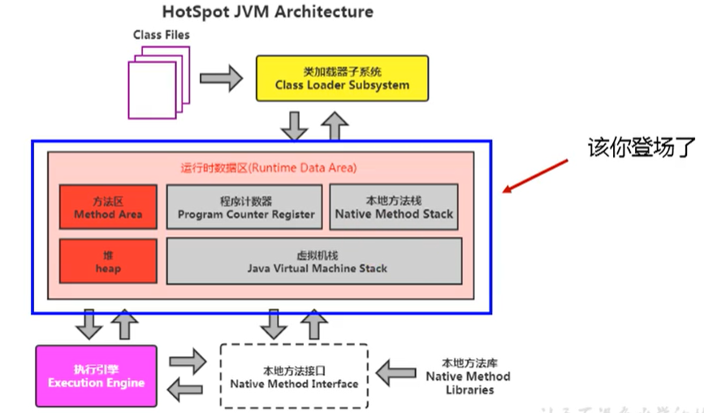
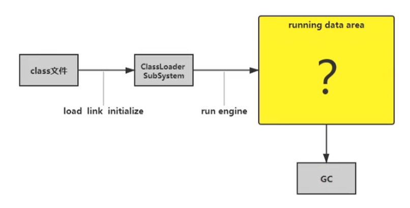
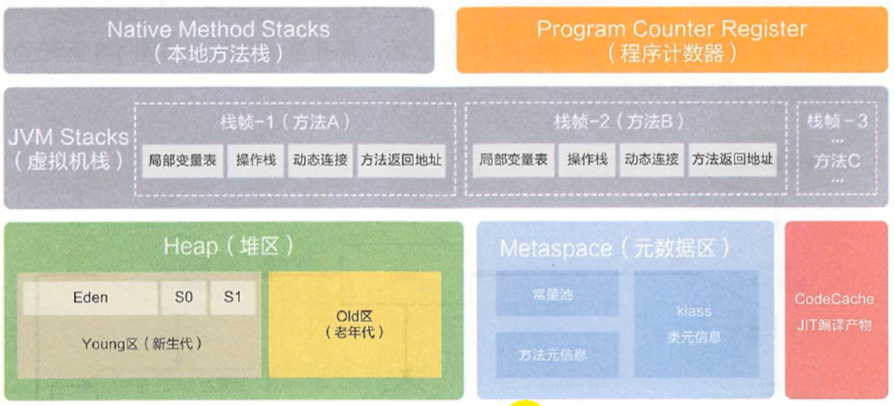

# 运行时数据区概述及线程

## 前言

本节主要讲的是运行时数据区，也就是下图这部分，它是在类加载完成后的阶段

当我们通过前面的：类的加载-> 验证 -> 准备 -> 解析 -> 初始化 这几个阶段完成后，就会用到执行引擎对我们的类进行使用，同时执行引擎将会使用到我们运行时数据区

也就是大厨做饭，我们把大厨后面的东西（切好的菜，刀，调料），比作是运行时数据区。而厨师可以类比于执行引擎，将通过准备的东西进行制作成精美的菜品

内存是非常重要的系统资源，是硬盘和CPU的中间仓库及桥梁，承载着操作系统和应用程序的实时运行JVM内存布局规定了Java在运行过程中内存申请、分配、管理的策略，保证了JVM的高效稳定运行。不同的JVM对于内存的划分方式和管理机制存在着部分差异。结合JVM虚拟机规范，来探讨一下经典的JVM内存布局。

> 我们通过磁盘或者网络IO得到的数据，都需要先加载到内存中，然后CPU从内存中获取数据进行读取，也就是说内存充当了CPU和磁盘之间的桥梁

运行时数据区的完整图

Java虚拟机定义了若干种程序运行期间会使用到的运行时数据区，其中有一些会随着虚拟机启动而创建，随着虚拟机退出而销毁。另外一些则是与线程一一对应的，这些与线程对应的数据区域会随着线程开始和结束而创建和销毁。

灰色的为单独线程私有的，红色的为多个线程共享的。即：
- 每个线程：独立包括程序计数器、栈、本地栈。
- 线程间共享：堆、堆外内存（永久代或元空间、代码缓存）

