# 方法区

## 前言

这次所讲述的是运行时数据区的最后一个部分——方法区

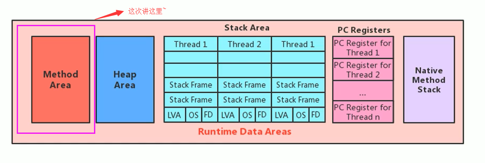

从线程共享与否的角度来看

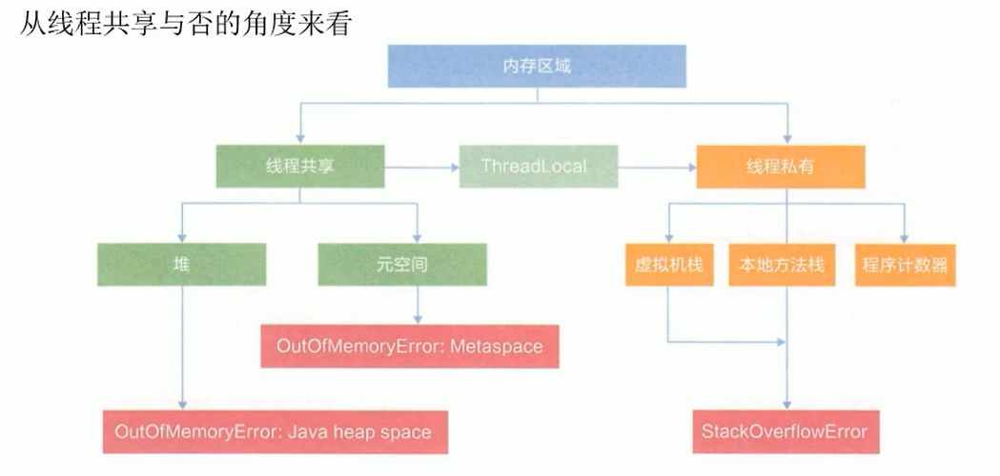

ThreadLocal：如何保证多个线程在并发环境下的安全性？典型应用就是数据库连接管理，以及会话管理

## 栈、堆、方法区的交互关系

下面就涉及了对象的访问定位

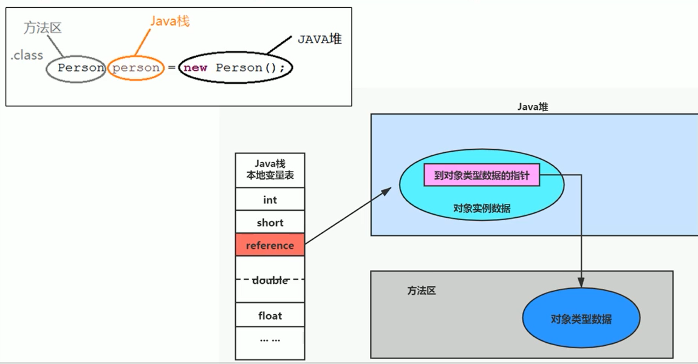

- Person：存放在元空间，也可以说方法区
- person：存放在 Java 栈的局部变量表中
- new Person()：存放在 Java 堆中

## 方法区的理解

《Java虚拟机规范》中明确说明：“尽管所有的方法区在逻辑上是属于堆的一部分，但一些简单的实现可能不会选择去进行垃圾收集或者进行压缩。”但对于 HotSpot JVM 而言，方法区还有一个别名叫做 Non-Heap（非堆），目的就是要和堆分开。 

所以，**方法区看作是一块独立于 Java 堆的内存空间。**

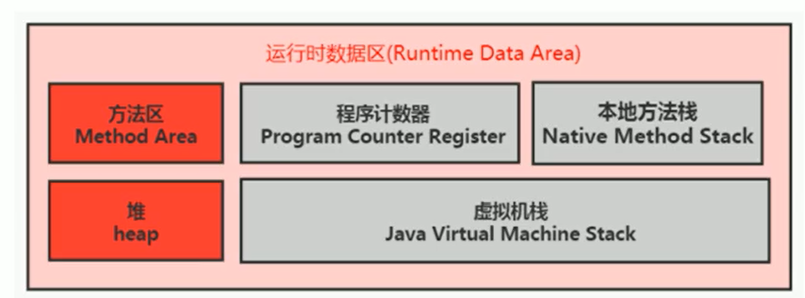

方法区主要存放的是 Class ，而堆中主要存放的是实例化的对象

- 方法区（Method Area）与 Java 堆一样，是各个线程共享的内存区域。
- 方法区在 JVM 启动的时候被创建，并且它的实际的物理内存空间中和 Java 堆区一样都可以是不连续的（逻辑上连续，物理上可以不连续）。
- 方法区的大小，跟堆空间一样，可以选择固定大小或者可扩展。
- 方法区的大小决定了系统可以保存多少个类，如果系统定义了太多的类，导致方法区溢出，虚拟机同样会抛出内存溢出错误：java.lang.OutOfMemoryError：**PermGen space** 或者java.lang.OutOfMemoryError：**Metaspace**
  - 加载大量的第三方的 jar 包
  - Tomcat 部署的工程过多（30~50个）
  - 大量动态的生成反射类
- 关闭 JVM 就会释放这个区域的内存。

### HotSpot中方法区的演进

在 JDK 7 及以前，习惯上把方法区，称为永久代。 JDK 8 开始，使用元空间取代了永久代。

- JDK 1.8 后，元空间存放在堆外内存中（In JDK 8, classes metadata is now stored in the **native heap** and this space is called **Metaspace**.）

本质上，方法区和永久代并不等价。仅是对 HotSpot 而言的。《Java虚拟机规范》对如何实现方法区，不做统一要求。例如：BEAJRockit / IBM J9 中不存在永久代的概念。            
>现在来看，当年使用永久代，不是好的idea。导致 Java 程序更容易 OOM （超过-XX:MaxPermsize上限）

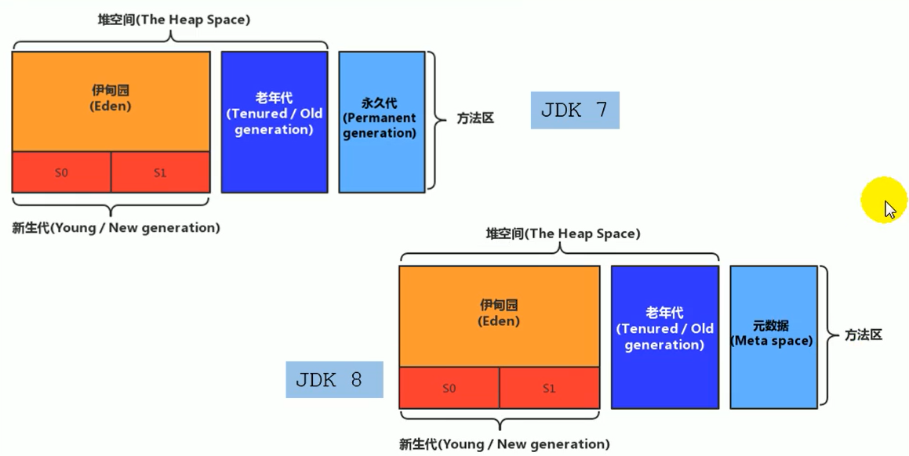

而到了 JDK 8 ，终于完全废弃了永久代的概念，改用与 JRockit、J9 一样在**本地内存**中实现的元空间（Metaspace）来代替

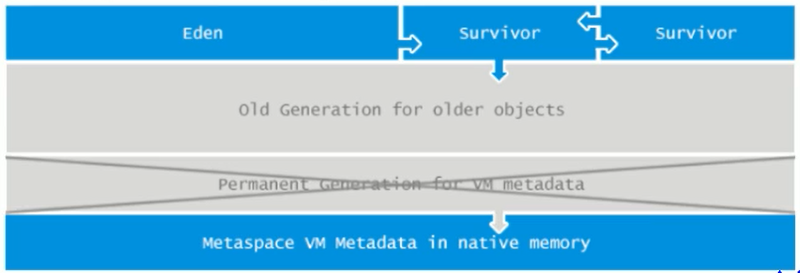

元空间的本质和永久代类似，都是对 JVM 规范中方法区的实现。不过元空间与永久代最大的区别在于：**元空间不在虚拟机设置的内存中，而是使用本地内存**

永久代、元空间二者并不只是名字变了，内部结构也调整了

根据《Java虚拟机规范》的规定，如果方法区无法满足新的内存分配需求时，将抛出 OOM 异常

## 设置方法区大小与OOM

方法区的大小不必是固定的， JVM 可以根据应用的需要动态调整。 

### JDK 7 及以前

- 通过 -XX:PermSize 来设置永久代初始分配空间。默认值是20.75M
-  -XX:MaxPermSize 来设定永久代最大可分配空间。32位机器默认是64M，64位机器模式是82M
- 当 JVM 加载的类信息容量超过了这个值，会报异常 OutOfMemoryError:PermGen space。

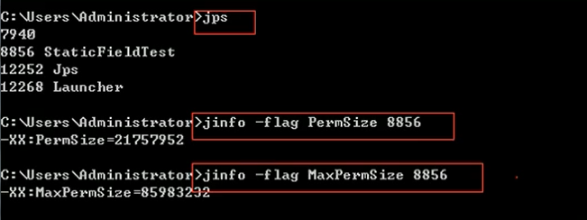

### JDK 8 以后

元数据区大小可以使用参数 -XX:MetaspaceSize 和 -XX:MaxMetaspaceSize 指定

默认值依赖于平台。*windows下，-XX:MetaspaceSize 是21M，-XX:MaxMetaspaceSize 的值是-1，即没有限制。*

与永久代不同，如果不指定大小，默认情况下，虚拟机会耗尽所有的可用系统内存。如果元数据区发生溢出，虚拟机一样会抛出异常 OutOfMemoryError:Metaspace

-XX:MetaspaceSize：设置初始的元空间大小。对于一个64位的服务器端 JVM 来说，其默认的 -XX:MetaspaceSize 值为21MB。这就是初始的高水位线，一旦触及这个水位线，Full GC 将会被触发并卸载没用的类（即这些类对应的类加载器不再存活）然后这个高水位线将会重置。新的高水位线的值取决于 GC 后释放了多少元空间。如果释放的空间不足，那么在不超过 MaxMetaspaceSize 时，适当提高该值。如果释放空间过多，则适当降低该值。

如果初始化的高水位线设置过低，上述高水位线调整情况会发生很多次。通过垃圾回收器的日志可以观察到 Full GC 多次调用。为了避免频繁地 GC ，建议将 -XX:MetaspaceSize 设置为一个相对较高的值。

### 如何解决这些OOM

- 要解决 OOM 异常或 Heap Space 的异常，一般的手段是首先通过内存映像分析工具（如Eclipse Memory Analyzer）对 dump 出来的堆转储快照进行分析，重点是确认内存中的对象是否是必要的，也就是要先分清楚到底是出现了内存泄漏（Memory Leak）还是内存溢出（Memory Overflow）
  - 内存泄漏就是有大量的引用指向某些对象，但是这些对象以后不会使用了，但是因为它们还和 GC ROOT 有关联，所以导致以后这些对象也不会被回收，这就是内存泄漏的问题
  - 内存泄漏得不到解决，从而占据满整个内存空间就会造成内存溢出
  
- 如果是内存泄漏，可进一步通过工具查看泄漏对象到 GC Roots 的引用链。于是就能找到泄漏对象是通过怎样的路径与 GC Roots 相关联并导致垃圾收集器无法自动回收它们的。掌握了泄漏对象的类型信息，以及 GC Roots 引用链的信息，就可以比较准确地定位出泄漏代码的位置。

- 如果不存在内存泄漏，换句话说就是内存中的对象确实都还必须存活着，那就应当检查虚拟机的堆参数（-Xmx 与 -Xms ），与机器物理内存对比看是否还可以调大，从代码上检查是否存在某些对象生命周期过长、持有状态时间过长的情况，尝试减少程序运行期的内存消耗。

## 方法区的内部结构

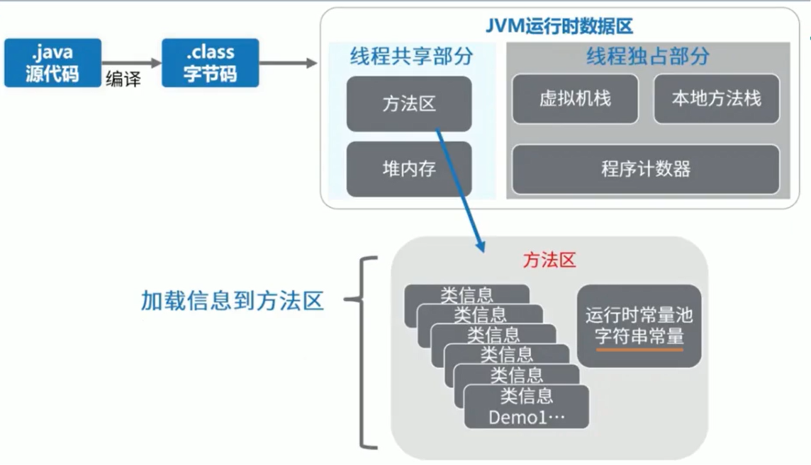

《深入理解Java虚拟机》书中对方法区（Method Area）存储内容描述如下：它用于存储已被虚拟机加载的**类型信息、常量、静态变量、即时编译器编译后的代码缓存等。**


### 类型信息

对每个加载的类型（类class、接口interface、枚举enum、注解annotation），JVM 必须在方法区中存储以下类型信息：

- 这个类型的完整有效名称（全名=包名.类名）
- 这个类型直接父类的完整有效名（对于interface或是java.lang.object，都没有父类）
- 这个类型的修饰符（public，abstract，final的某个子集）
- 这个类型直接接口的一个有序列表

### 域（Field）信息

JVM 必须在方法区中保存类型的所有域的相关信息以及域的声明顺序。

域的相关信息包括：域名称、域类型、域修饰符（public，private，protected，static，final，volatile，transient的某个子集）

### 方法（Method）信息

JVM 必须保存所有方法的以下信息，同域信息一样包括声明顺序：

- 方法名称
- 方法的返回类型（或 void ）
- 方法参数的数量和类型（按顺序）
- 方法的修饰符（public，private，protected，static，final，synchronized，native，abstract的一个子集）
- 方法的字节码（bytecodes）、操作数栈、局部变量表及大小（abstract和native方法除外）
- 异常表（abstract和native方法除外）
  - 每个异常处理的开始位置、结束位置、代码处理在程序计数器中的偏移地址、被捕获的异常类的常量池索引

### Non-Final 的类变量

静态变量和类关联在一起，随着类的加载而加载，他们成为类数据在逻辑上的一部分

类变量被类的所有实例共享，即使没有类实例时，你也可以访问它

```java
public class MethodAreaTest {
    public static void main(String[] args) {
        Order order = new Order();
        order.hello();
        System.out.println(order.count);
    }
}
 
class Order {
    public static int count = 1;
    public static final int number = 2;
    public static void hello() {
        System.out.println("hello!");
    }
}
```

如上代码所示，即使我们把 order 设置为 null ，也不会出现空指针异常

### 全局常量

全局常量就是使用 static final 进行修饰

被声明为 final 的类变量的处理方法则不同，每个全局常量在编译的时候就会被分配了。 

### 运行时常量池 VS 常量池

运行时常量池，就是运行时常量池

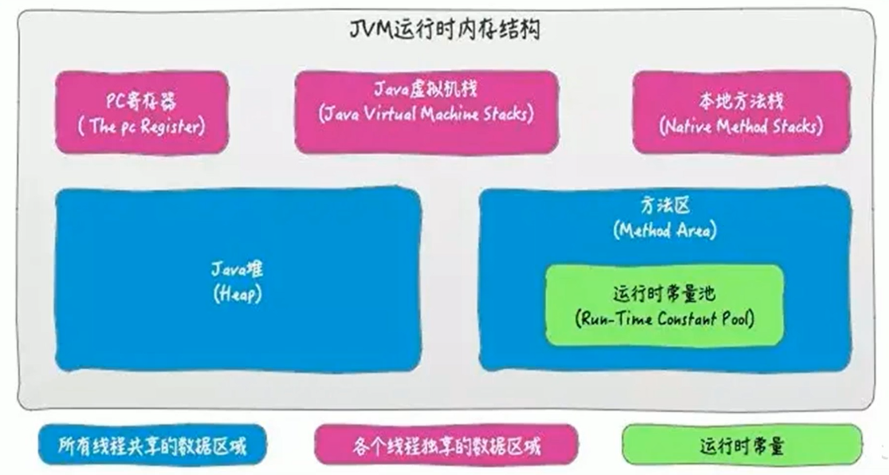

- 方法区，内部包含了运行时常量池
- 字节码文件，内部包含了常量池
- 要弄清楚方法区，需要理解清楚 ClassFile ，因为加载类的信息都在方法区。
- 要弄清楚方法区的运行时常量池，需要理解清楚 ClassFile 中的常量池。

### 常量池

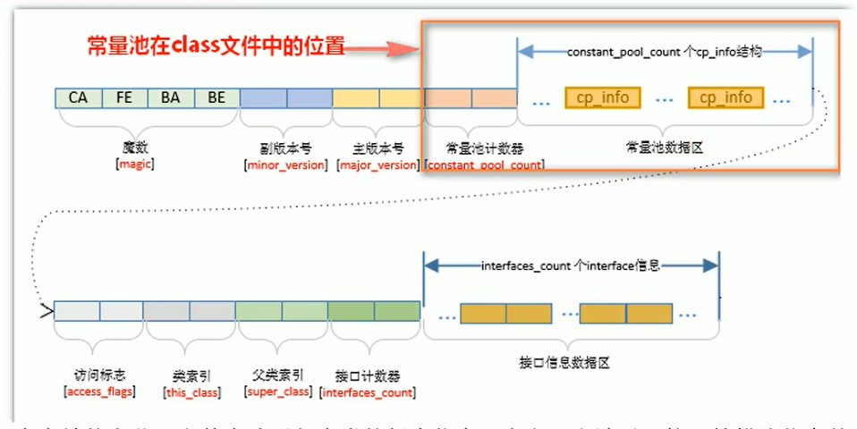

一个有效的字节码文件中除了包含类的版本信息、字段、方法以及接口等描述符信息外，还包含一项信息就是常量池表（Constant Pool Table），包括各种字面量和对类型、域和方法的符号引用

#### 为什么需要常量池

一个 Java 源文件中的类、接口，编译后产生一个字节码文件。而 Java 中的字节码需要数据支持，通常这种数据会很大以至于不能直接存到字节码里，换另一种方式，可以存到常量池，这个字节码包含了指向常量池的引用。r在动态链接的时候会用到运行时常量池，之前有介绍。

比如：如下的代码：

```java
public class SimpleClass {
    public void sayHello() {
        System.out.println("hello");
    }
}
```

虽然上述代码只有194字节，但是里面却使用了 String、System、PrintStream 及 Object 等结构。这里的代码量其实很少了，如果代码多的话，引用的结构将会更多，这里就需要用到常量池了。

#### 常量池中有什么

**几种在常量池内存存储的数据类型包括：**

- 数量值
- 字符串值
- 类引用
- 字段引用
- 方法引用

例如下面这段代码

```java
public class MethodAreaTest2 {
    public static void main(String args[]) {
        Object obj = new Object();
    }
}
```

`Object obj = new Object();`将会被翻译成如下字节码

```bash
new #2  
dup
invokespecial
```

#### 小结

常量池、可以看做是一张表，虚拟机指令根据这张常量表找到要执行的类名、方法名、参数类型、字面量等类型

### 运行时常量池

- 运行时常量池（Runtime Constant Pool）是方法区的一部分。

- 常量池表（Constant Pool Table）是 Class 文件的一部分，**用于存放编译期生成的各种字面量与符号引用，这部分内容将在类加载后存放到方法区的运行时常量池中。**

- 运行时常量池，在加载类和接口到虚拟机后，就会创建对应的运行时常量池。

- JVM 为每个已加载的类型（类或接口）都维护一个常量池。池中的数据项像数组项一样，是通过**索引访问**的。

- 运行时常量池中包含多种不同的常量，包括编译期就已经明确的数值字面量，也包括到运行期解析后才能够获得的方法或者字段引用。此时不再是常量池中的符号地址了，这里换为真实地址。
  - 运行时常量池，相对于Class文件常量池的另一重要特征是：**具备动态性**。
    - String.intern()

- 运行时常量池类似于传统编程语言中的符号表（symbol table），但是它所包含的数据却比符号表要更加丰富一些。

- 当创建类或接口的运行时常量池时，如果构造运行时常量池所需的内存空间超过了方法区所能提供的最大值，则 JVM 会抛 OutOfMemoryError 异常。

## 方法区使用举例

如下代码

```java
public class MethodAreaDemo {
    public static void main(String args[]) {
        int x = 500;
        int y = 100;
        int a = x / y;
        int b = 50;
        System.out.println(a+b);
    }
}
```

字节码执行过程展示

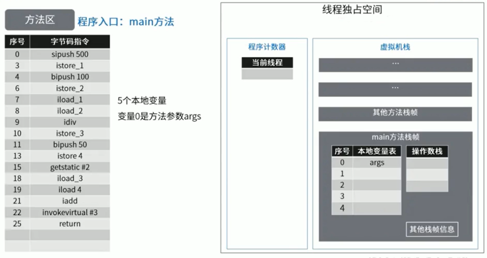

首先现将操作数500放入到操作数栈中

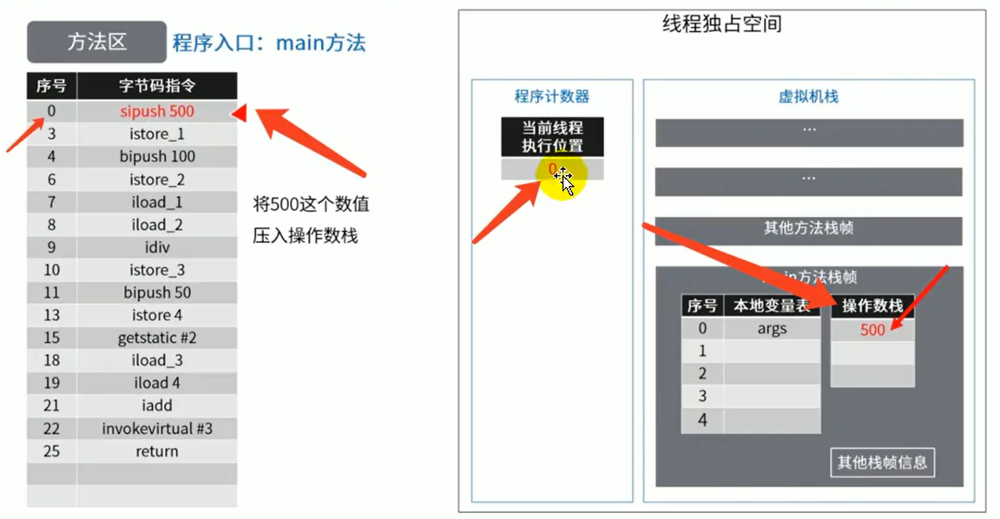

然后存储到局部变量表中

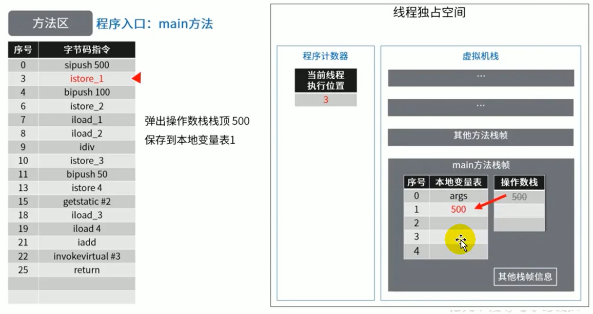

然后重复一次，把100放入局部变量表中，最后再将变量表中的500和100取出，进行操作

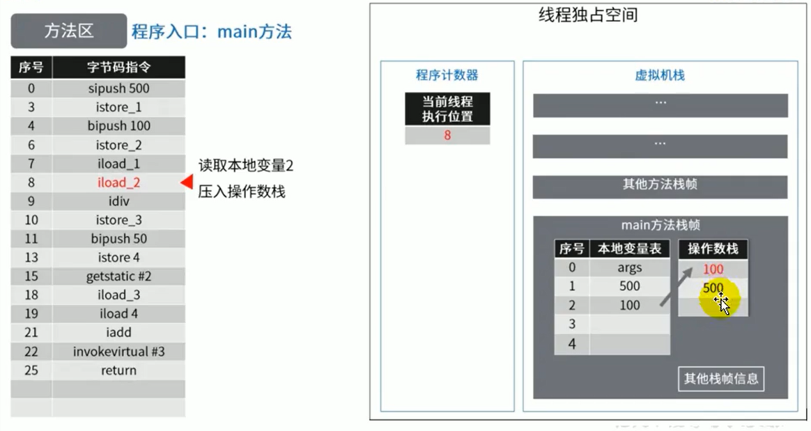

将500和100进行一个除法运算，在把结果入栈

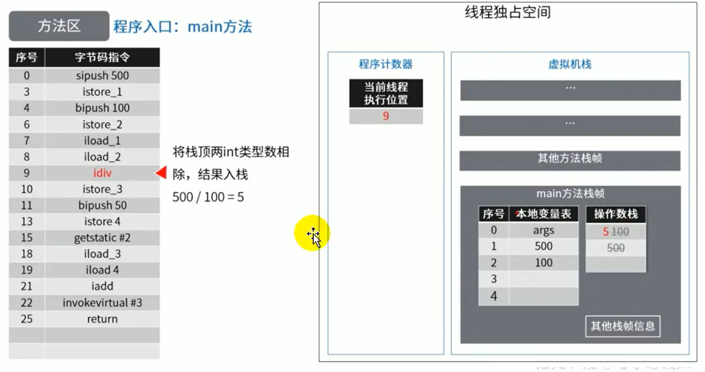

在最后就是输出流，需要调用运行时常量池的常量

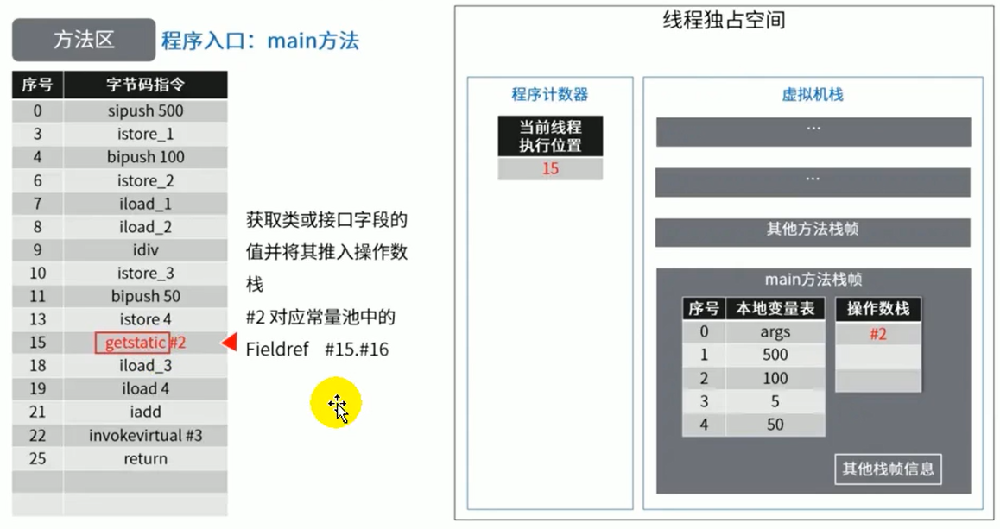

最后调用 invokevirtual（虚方法调用），然后返回

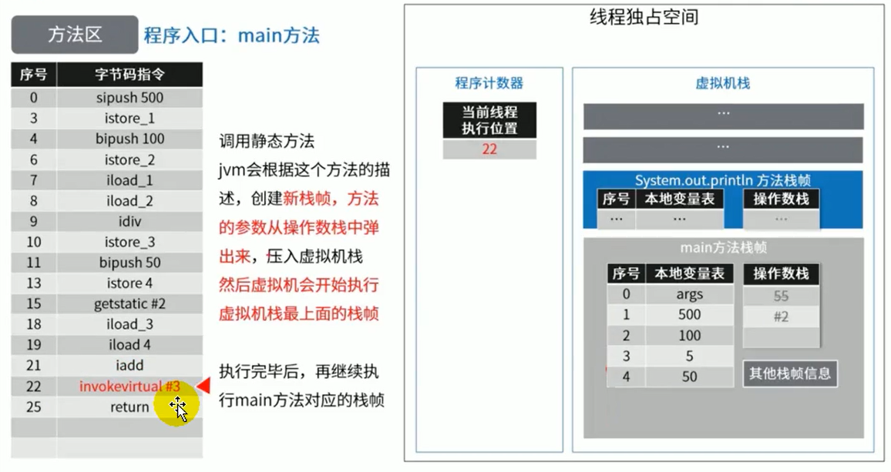

返回时


程序计数器始终计算的都是当前代码运行的位置，目的是为了方便记录方法调用后能够正常返回，或者是进行了CPU 切换后，也能回来到原来的代码进行执行。

## 方法区的演进细节

首先明确：只有 HotSpot 才有永久代。BEA JRockit、IBMJ9 等来说，是不存在永久代的概念的。原则上如何实现方法区属于虚拟机实现细节，不受《Java虚拟机规范》管束，并不要求统一

HotSpot 中方法区的变化：

| JDK1.6及以前 | 有永久代，静态变量存储在永久代上                             |
| :----------: | ------------------------------------------------------------ |
|  **JDK1.7**  | **有永久代，但已经逐步 “去永久代”，字符串常量池，静态变量移除，保存在堆中** |
|  **JDK1.8**  | **无永久代，类型信息，字段，方法，常量保存在本地内存的元空间，但字符串常量池、静态变量仍然在堆中。** |

JDK 6 的时候

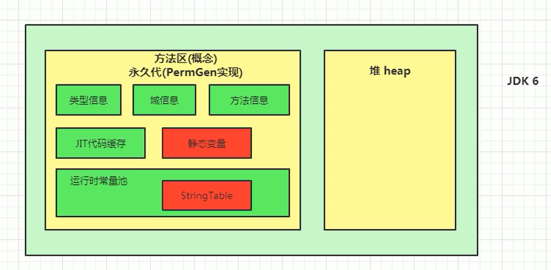

JDK 7 的时候

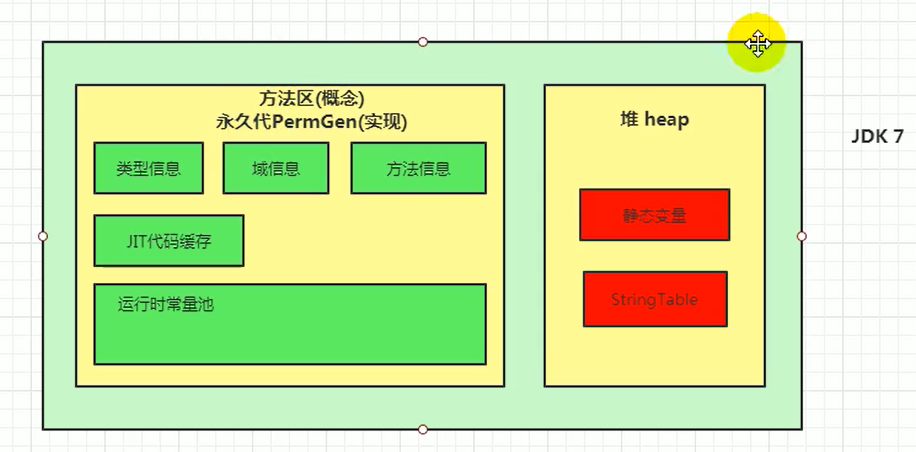

JDK 8 的时候，元空间大小只受物理内存影响

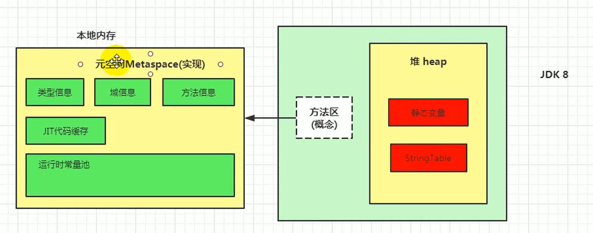

### 为什么永久代要被元空间替代？

JRockit 是和 HotSpot 融合后的结果，因为 JRockit 没有永久代，所以他们不需要配置永久代

随着 Java 8 的到来，HotSpot VM 中再也见不到永久代了。但是这并不意味着类的元数据信息也消失了。这些数据被移到了一个与堆不相连的本地内存区域，这个区域叫做元空间（Metaspace）。

由于类的元数据分配在本地内存中，元空间的最大可分配空间就是系统可用内存空间，这项改动是很有必要的，原因有：

- 为永久代设置空间大小是很难确定的。

在某些场景下，如果动态加载类过多，容易产生 Perm 区的 OOM 。比如某个实际 Web 工
程中，因为功能点比较多，在运行过程中，要不断动态加载很多类，经常出现致命错误。

“Exception in thread‘dubbo client x.x connector'java.lang.OutOfMemoryError:PermGen space”

而元空间和永久代之间最大的区别在于：元空间并不在虚拟机中，而是使用本地内存。
因此，默认情况下，元空间的大小仅受本地内存限制。

- 对永久代进行调优是很困难的。
  - 主要是为了降低 Full GC

有些人认为方法区（如 HotSpot 虚拟机中的元空间或者永久代）是没有垃圾收集行为的，其实不然。《Java虚拟机规范》对方法区的约束是非常宽松的，提到过可以不要求虚拟机在方法区中实现垃圾收集。事实上也确实有未实现或未能完整实现方法区类型卸载的收集器存在（如 JDK 11 时期的 ZGC 收集器就不支持类卸载）。
一般来说*这个区域的回收效果比较难令人满意，尤其是类型的卸载，条件相当苛刻*。但是这部分区域的回收有时又确实是必要的。以前 Sun 公司的 Bug 列表中，曾出现过的若干个严重的 Bug 就是由于低版本的 HotSpot 虚拟机对此区域未完全回收而导致内存泄漏

方法区的垃圾收集主要回收两部分内容：**常量池中废弃的常量和不在使用的类型**

### StringTable为什么要调整位置

JDK 7 中将 StringTable 放到了堆空间中。因为永久代的回收效率很低，在 Full GC 的时候才会触发。而 Full GC 是老年代的空间不足、永久代不足时才会触发。

这就导致 StringTable 回收效率不高。而我们开发中会有大量的字符串被创建，回收效率低，导致永久代内存不足。放到堆里，能及时回收内存。

### 静态变量存放在那里？

静态引用对应的对象实体始终都存在堆空间

可以使用 jhsdb.ext，需要在 JDK 9 的时候才引入的

```java
public class StaticObject {
    static class Test {
        static ObjectHolder staticObj = new ObjectHolder();
        ObjectHolder instanceObj = new ObjectHolder();
        
        void foo() {
            ObjectHolder localObj = new ObjectHolder();
            System.out.println("done");
        }
    }
    
    private static class ObjectHolder {
        
    }
    
    public static void main(String[] args) {
        Test test = new StaticObjTest.Test();
        test.foo();
    }
}
```

staticObj 随着 Test 的类型信息存放在方法区，instanceObj 随着 Test 的对象实例存放在 Java 堆，localObject则是存放在 foo（）方法栈帧的局部变量表中。 

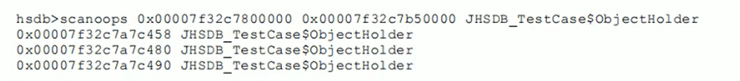

测试发现：三个对象的数据在内存中的地址都落在 Eden 区范围内，所以结论：只要是对象实例必然会在 Java 堆中分配。

接着，找到了一个引用该 staticObj 对象的地方，是在一个 java.lang.Class 的实例里，并且给出了这个实例的地址，通过Inspector查看该对象实例，可以清楚看到这确实是一个 java.lang.Class 类型的对象实例，里面有一个名为 staticObj 的实例字段：

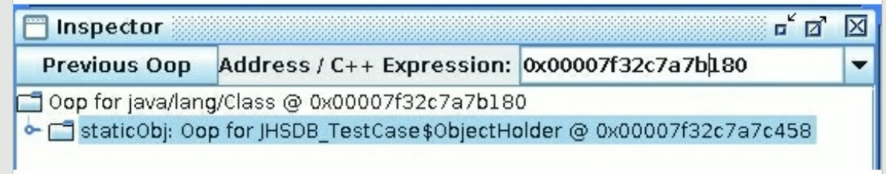

从《Java虚拟机规范》所定义的概念模型来看，所有 Class 相关的信息都应该存放在方法区之中，但方法区该如何实现，《Java虚拟机规范》并未做出规定，这就成了一件允许不同虚拟机自己灵活把握的事情。JDK 7 及其以后版本的 HotSpot 虚拟机选择把静态变量与类型在 Java 语言一端的映射 Class 对象存放在一起，存储于 Java 堆之中，从我们的实验中也明确验证了这一点

## 方法区的垃圾回收

有些人认为方法区（如 HotSpot 虚拟机中的元空间或者永久代）是没有垃圾收集行为的，其实不然。《Java虚拟机规范》对方法区的约束是非常宽松的，提到过可以不要求虚拟机在方法区中实现垃圾收集。事实上也确实有未实现或未能完整实现方法区类型卸载的收集器存在（如 JDK 11 时期的 ZGC 收集器就不支持类卸载）。

一般来说这个区域的回收效果比较难令人满意，尤其是类型的卸载，条件相当苛刻。但是这部分区域的回收有时又确实是必要的。以前 Sun 公司的 Bug 列表中，曾出现过的若干个严重的 Bug 就是由于低版本的 HotSpot 虚拟机对此区域未完全回收而导致内存泄漏。

**方法区的垃圾收集主要回收两部分内容：常量池中废弃的常量和不再使用的类型。**

先来说说方法区内常量池之中主要存放的两大类常量：**字面量和符号引用**。字面量比较接近 Java 语言层次的常量概念，如文本字符串、被声明为 final 的常量值等。而符号引用则属于编译原理方面的概念，包括下面三类常量：

- 类和接口的全限定名
- 字段的名称和描述符
- 方法的名称和描述符

HotSpot 虚拟机对常量池的回收策略是很明确的，**只要常量池中的常量没有被任何地方引用，就可以被回收**。

回收废弃常量与回收 Java 堆中的对象非常类似。（关于常量的回收比较简单，重点是类的回收）

判定一个常量是否“废弃”还是相对简单，而要判定一个类型是否属于“不再被使用的类”的条件就比较苛刻了。需要同时满足下面三个条件：

- 该类所有的实例都已经被回收，也就是Java堆中不存在该类及其任何派生子类的实例。
- 加载该类的类加载器已经被回收，这个条件除非是经过精心设计的可替换类加载器的场景，如 OSGi、JSP 的重加载等，否则通常是很难达成的。
- 该类对应的 java.lang.Class 对象没有在任何地方被引用，无法在任何地方通过反射访问该类的方法。

Java 虚拟机被允许对满足上述三个条件的无用类进行回收，这里说的仅仅是“被允许”，而并不是和对象一样，没有引用了就必然会回收。关于是否要对类型进行回收，HotSpot 虚拟机提供了 -Xnoclassgc 参数进行控制，还可以使用 -verbose:class 以及 -XX:+TraceClass-Loading、-XX:+TraceClassUnLoading 查看类加载和卸载信息

在大量使用反射、动态代理、CGLib 等字节码框架，动态生成 JSP 以及 OSGi 这类频繁自定义类加载器的场景中，通常都需要 Java 虚拟机具备类型卸载的能力，以保证不会对方法区造成过大的内存压力。

## 总结

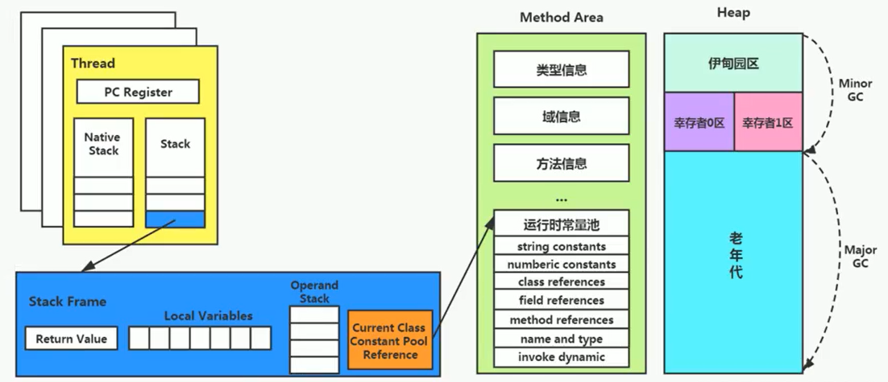

### 常见面试题

百度
三面：说一下 JVM 内存模型吧，有哪些区？分别干什么的？

蚂蚁金服：
Java 8 的内存分代改进
JVM 内存分哪几个区，每个区的作用是什么？
一面：JVM 内存分布/内存结构？栈和堆的区别？堆的结构？为什么两个 Survivor 区？
二面：Eden 和 Survior 的比例分配

小米：
JVM 内存分区，为什么要有新生代和老年代

字节跳动：
二面：Java 的内存分区
二面：讲讲 JVM 运行时数据库区
什么时候对象会进入老年代？

京东：
JVM 的内存结构，Eden 和 Survivor 比例。
JVM 内存为什么要分成新生代，老年代，持久代。新生代中为什么要分为 Eden 和 Survivor 。

天猫：
一面：JVM 内存模型以及分区，需要详细到每个区放什么。
一面：JVM 的内存模型，Java 8 做了什么改

拼多多：
JVM 内存分哪几个区，每个区的作用是什么？

美团：
Java 内存分配
JVM 的永久代中会发生垃圾回收吗？
一面：JVM 内存分区，为什么要有新生代和老年代？