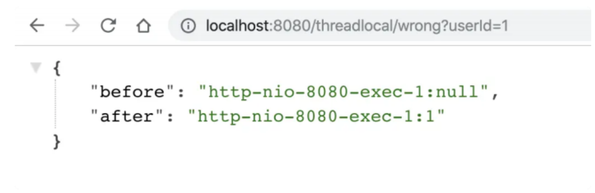
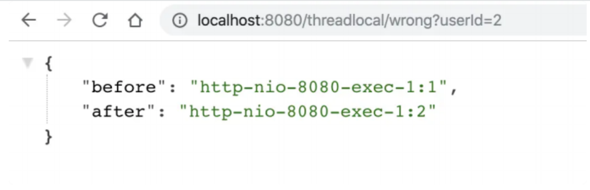
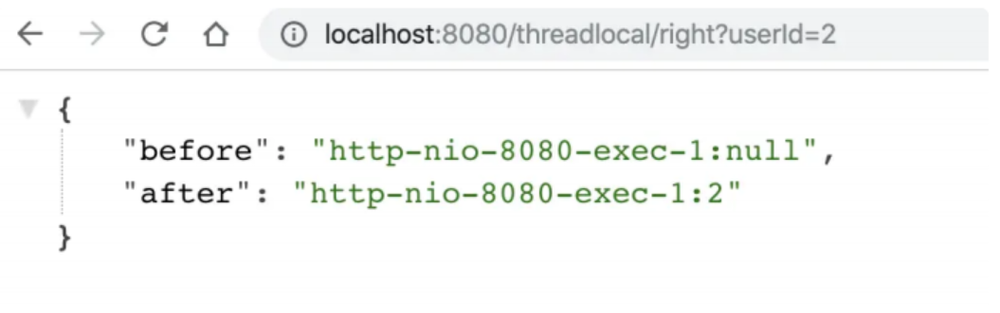
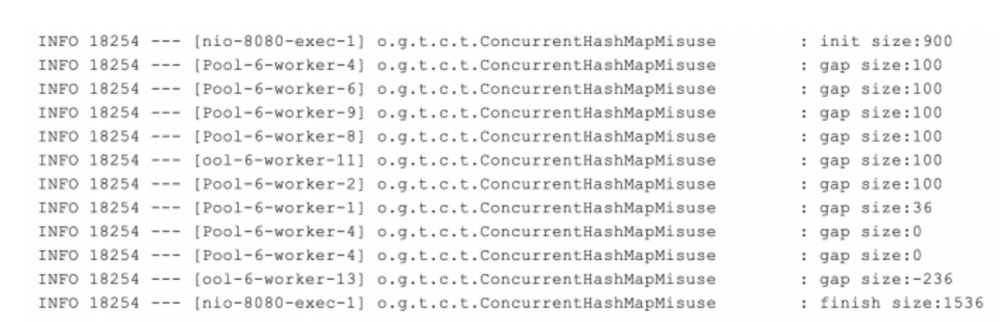
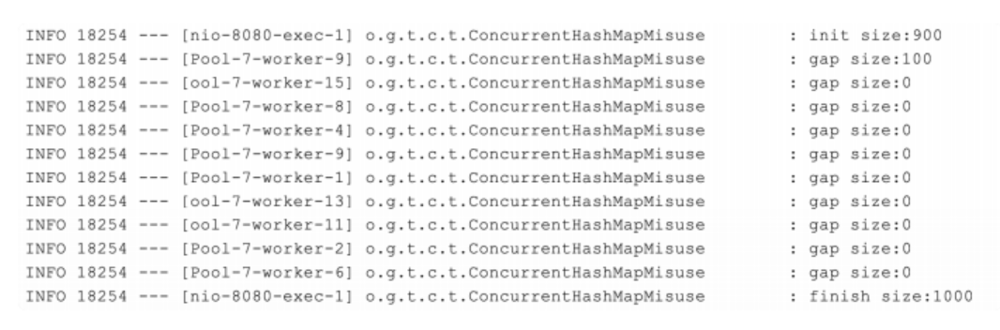
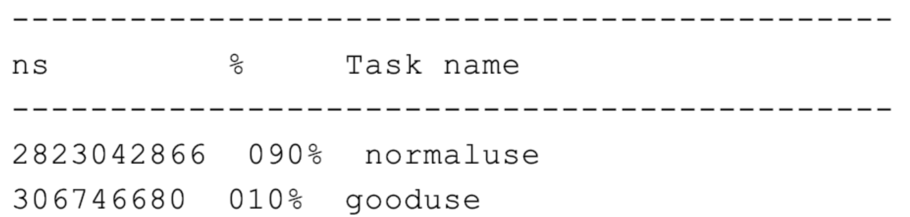
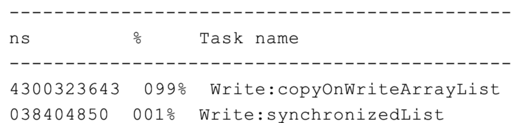
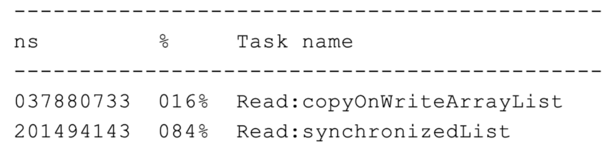

在代码审核讨论的时候，我们有时会听到有关线程安全和并发工具的一些片面的观点和结论，

比如“把 HashMap 改为 ConcurrentHashMap，就可以解决并发问题了呀”“要不我们试试无锁的 CopyOnWriteArrayList 吧，性能更好”。事实上，这些说法都不太准确。

的确，为了方便开发者进行多线程编程，现代编程语言会提供各种并发工具类。但如果我们没有充分了解它们的使用场景、解决的问题，以及最佳实践的话，盲目使用就可能会导致一些坑，小则损失性能，大则无法确保多线程情况下业务逻辑的正确性。

我需要先说明下，这里的并发工具类是指用来解决多线程环境下并发问题的工具类库。一般而言并发工具包括同步器和容器两大类，业务代码中使用并发容器的情况会多一些，我今天分享的例子也会侧重并发容器。

接下来，我们就看看在使用并发工具时，最常遇到哪些坑，以及如何解决、避免这些坑吧。

## **没有意识到线程重用导致用户信息错乱的**Bug

之前有业务同学和我反馈，在生产上遇到一个诡异的问题，有时获取到的用户信息是别人的。查看代码后，我发现他使用了 **ThreadLocal** 来缓存获取到的用户信息。

我们知道，**ThreadLocal** 适用于变量在线程间隔离，而在方法或类间共享的场景。如果用户信息的获取比较昂贵（比如从数据库查询用户信息），那么在 ThreadLocal 中缓存数据是比较合适的做法。但，这么做为什么会出现用户信息错乱的 **Bug** 呢？

我们看一个具体的案例吧。

使用 **Spring Boot** 创建一个 Web 应用程序，使用 **ThreadLocal** 存放一个 **Integer** 的值，来暂且代表需要在线程中保存的用户信息，这个值初始是 **null**。在业务逻辑中，我先从 **ThreadLocal** 获取一次值，然后把外部传入的参数设置到 **ThreadLocal** 中，来模拟从当前上

下文获取到用户信息的逻辑，随后再获取一次值，最后输出两次获得的值和线程名称。

```java
private static final ThreadLocal<Integer> currentUser = ThreadLocal.withInitial(())

@GetMapping("wrong") 
public Map wrong(@RequestParam("userId") Integer userId) {
    //设置用户信息之前先查询一次ThreadLocal中的用户信息
    String before = Thread.currentThread().getName() + ":" + currentUser.get();
    //设置用户信息到ThreadLocal 9 currentUser.set(userId); 10 //设置用户信息之后再查询一次ThreadLocal中的用户信息
    String after = Thread.currentThread().getName() + ":" + currentUser.get();
    //汇总输出两次查询结果
    Map result = new HashMap();
    result.put("before", before);
    result.put("after", after);
    return result;
}
```

按理说，在设置用户信息之前第一次获取的值始终应该是 null，但我们要意识到，程序运行在 **Tomcat** 中，执行程序的线程是 Tomcat 的工作线程，而 Tomcat 的工作线程是基于线程池的。

**顾名思义，线程池会重用固定的几个线程，一旦线程重用，那么很可能首次从 ThreadLocal获取的值是之前其他用户的请求遗留的值。这时，ThreadLocal 中的用户信息就是其他用户的信息。**

为了更快地重现这个问题，我在配置文件中设置一下 **Tomcat** 的参数，把工作线程池最大线程数设置为 1，这样始终是同一个线程在处理请求：

```bash
server.tomcat.max-threads=1
```

运行程序后先让 **用户1** 来请求接口，可以看到第一和第二次获取到用户 **ID** 分别是 **null** 和 **1**，符合预期：



随后 **用户 2** 来请求接口，这次就出现了 Bug，第一和第二次获取到用户 **ID** 分别是 **1** 和 **2**，显然第一次获取到了用户 **1** 的信息，原因就是 **Tomcat** 的线程池重用了线程。从图中可以看到，两次请求的线程都是同一个线程：**http-nio-8080-exec-1**。



这个例子告诉我们，在写业务代码时，首先要理解代码会跑在什么线程上：

- 我们可能会抱怨学多线程没用，因为代码里没有开启使用多线程。但其实，可能只是我们没有意识到，在 Tomcat 这种 Web 服务器下跑的业务代码，本来就运行在一个多线程环境（否则接口也不可能支持这么高的并发），**并不能认为没有显式开启多线程就不会有线程安全问题**。

- 因为线程的创建比较昂贵，所以 Web 服务器往往会使用线程池来处理请求，这就意味着线程会被重用。这时，**使用类似 ThreadLocal 工具来存放一些数据时，需要特别注意在代码运行完后，显式地去清空设置的数据**。如果在代码中使用了自定义的线程池，也同样会遇到这个问题。

理解了这个知识点后，我们修正这段代码的方案是，在代码的 **finally** 代码块中，显式清除 **ThreadLocal** 中的数据。这样一来，新的请求过来即使使用了之前的线程也不会获取到错误的用户信息了。修正后的代码如下：

```java
@GetMapping("right") public Map right(@RequestParam("userId") Integer userId){
    String before = Thread.currentThread().getName() + ":" + currentUser.get();
    currentUser.set(userId);
    try
    {
        String after = Thread.currentThread().getName() + ":" + currentUser.get() Map result = new HashMap();
        result.put("before", before);
        result.put("after", after);
        return result;
    }
    finally
    { //在finally代码块中删除ThreadLocal中的数据，确保数据不串
        currentUser.remove();
    }
}
```

重新运行程序可以验证，再也不会出现第一次查询用户信息查询到之前用户请求的 **Bug**：



**ThreadLocal** 是利用独占资源的方式，来解决线程安全问题，那如果我们确实需要有资源在线程之间共享，应该怎么办呢？这时，我们可能就需要用到线程安全的容器了。

## **使用了线程安全的并发工具，并不代表解决了所有线程安全问题**

**JDK 1.5** 后推出的 ConcurrentHashMap，是一个高性能的线程安全的哈希表容器。“线程安全”这四个字特别容易让人误解，因为 **ConcurrentHashMap 只能保证提供的原子性读写操作是线程安全的。**

我在相当多的业务代码中看到过这个误区，比如下面这个场景。有一个含 **900** 个元素的 **Map**，现在再补充 **100** 个元素进去，这个补充操作由 **10** 个线程并发进行。开发人员误以为使用了 **ConcurrentHashMap** 就不会有线程安全问题，于是不加思索地写出了下面的代码：

在每一个线程的代码逻辑中先通过 **size** 方法拿到当前元素数量，计算 **ConcurrentHashMap** 目前还需要补充多少元素，并在日志中输出了这个值，然后通过 **putAll** 方法把缺少的元素添加进去。

为方便观察问题，我们输出了这个 **Map** 一开始和最后的元素个数。

```java
//线程个数
private static int THREAD_COUNT = 10; 
//总元素数量
private static int ITEM_COUNT = 1000; 
//帮助方法，用来获得一个指定元素数量模拟数据的ConcurrentHashMap
private ConcurrentHashMap < String, Long > getData(int count){
    return LongStream.rangeClosed(1, count) 9. boxed() 10. collect(Collectors.toConcurrentMap(i - > UUID.randomUUID().toString() 			11(o1, o2) - > o1, ConcurrentHashMap::new));
}

@GetMapping("wrong") 15 public String wrong() throws InterruptedException
{
    ConcurrentHashMap < String, Long > concurrentHashMap = getData(ITEM_COUNT - 100) 17 //初始900个元素
    log.info("init size:{}", concurrentHashMap.size());
    ForkJoinPool forkJoinPool = new ForkJoinPool(THREAD_COUNT);
    //使用线程池并发处理逻辑
    forkJoinPool.execute(() - > IntStream.rangeClosed(1, 10).parallel().forEach(i
        //查询还需要补充多少个元素
        int gap = ITEM_COUNT - concurrentHashMap.size(); 
        log.info("gap size:{}", gap); 
        //补充元素
        concurrentHashMap.putAll(getData(gap));
    }));
	//等待所有任务完成
	forkJoinPool.shutdown();
	forkJoinPool.awaitTermination(1, TimeUnit.HOURS);
	//最后元素个数会是1000吗？
	log.info("finish size:{}", concurrentHashMap.size());
	return "OK";
}
```

访问接口后程序输出的日志内容如下：



从日志中可以看到：

- 初始大小 900 符合预期，还需要填充 100 个元素。
- worker1 线程查询到当前需要填充的元素为 36，竟然还不是 100 的倍数。
- worker13 线程查询到需要填充的元素数是负的，显然已经过度填充了。
- 最后 HashMap 的总项目数是 1536，显然不符合填充满 1000 的预期。

针对这个场景，我们可以举一个形象的例子。ConcurrentHashMap 就像是一个大篮子，现在这个篮子里有 900 个桔子，我们期望把这个篮子装满 1000 个桔子，也就是再装 100 个桔子。有 10 个工人来干这件事儿，大家先后到岗后会计算还需要补多少个桔子进去，最后把桔子装入篮子。

ConcurrentHashMap 这个篮子本身，可以确保多个工人在装东西进去时，不会相互影响干扰，但无法确保工人 A 看到还需要装 100 个桔子但是还未装的时候，工人 B 就看不到篮子中的桔子数量。更值得注意的是，你往这个篮子装 100 个桔子的操作不是原子性的，在别人看来可能会有一个瞬间篮子里有 964 个桔子，还需要补 36 个桔子。

回到 ConcurrentHashMap，我们需要注意 **ConcurrentHashMap 对外提供的方法或能力的限制**：

- 使用了 ConcurrentHashMap，不代表对它的多个操作之间的状态是一致的，是没有其他线程在操作它的，如果需要确保需要手动加锁。
- 诸如 size、isEmpty 和 containsValue 等聚合方法，在并发情况下可能会反映ConcurrentHashMap 的中间状态。因此在并发情况下，这些方法的返回值只能用作参考，而不能用于流程控制。显然，利用 size 方法计算差异值，是一个流程控制。
- 诸如 putAll 这样的聚合方法也不能确保原子性，在 putAll 的过程中去获取数据可能会获取到部分数据。

代码的修改方案很简单，整段逻辑加锁即可：

```java
@GetMapping("right")
publicStringright()throwsInterruptedException{
    ConcurrentHashMap<String,long>concurrentHashMap=getData(ITEM_COUNT-10log.info("initsize:{}",concurrentHashMap.size());
    ForkJoinPoolforkJoinPool=newForkJoinPool(THREAD_COUNT);
    forkJoinPool.execute(()->IntStream.rangeClosed(1,10).parallel().forEach
                         //下面的这段复合逻辑需要锁一下这个ConcurrentHashMap
        synchronized(concurrentHashMap){
            intgap=ITEM_COUNT-concurrentHashMap.size();
            log.info("gapsize:{}",gap);
            concurrentHashMap.putAll(getData(gap));
        }
    }));
    forkJoinPool.shutdown();
    forkJoinPool.awaitTermination(1,TimeUnit.HOURS);
    log.info("finishsize:{}",concurrentHashMap.size());
    return"OK";
}
```

重新调用接口，程序的日志输出结果符合预期：



可以看到，只有一个线程查询到了需要补 100 个元素，其他 9 个线程查询到不需要补元素，最后 Map 大小为 1000。

到了这里，你可能又要问了，使用 ConcurrentHashMap 全程加锁，还不如使用普通的HashMap 呢。

其实不完全是这样。

ConcurrentHashMap 提供了一些原子性的简单复合逻辑方法，用好这些方法就可以发挥其威力。这就引申出代码中常见的另一个问题：在使用一些类库提供的高级工具类时，开发人员可能还是按照旧的方式去使用这些新类，因为没有使用其特性，所以无法发挥其威力。

## 没有充分了解并发工具的特性，从而无法发挥其威力

- 我们来看一个使用 Map 来统计 Key 出现次数的场景吧，这个逻辑在业务代码中非常常见。

- 使用 ConcurrentHashMap 来统计，Key 的范围是 10。

- 使用最多 10 个并发，循环操作 1000 万次，每次操作累加随机的 Key。

- 如果 Key 不存在的话，首次设置值为 1。

代码如下：

```java
//循环次数
privatestaticintLOOP_COUNT=10000000;
//线程数量
privatestaticintTHREAD_COUNT=10;
//元素数量
privatestaticintITEM_COUNT=1000;
privateMap<String,long>normaluse()throwsInterruptedException{
    ConcurrentHashMap<String,long>freqs=newConcurrentHashMap<>(ITEM_COUNT)ForkJoinPoolforkJoinPool=newForkJoinPool(THREAD_COUNT);
    forkJoinPool.execute(()->IntStream.rangeClosed(1,LOOP_COUNT).parallel()
        //获得一个随机的Key
        Stringkey="item"+ThreadLocalRandom.current().nextint(ITEM_COUNT);
        synchronized(freqs){
            if(freqs.containsKey(key)){
                //Key存在则+1
                freqs.put(key,freqs.get(key)+1);
            } else{
                //Key不存在则初始化为1
                freqs.put(key,1L);
            }
        }
    }
    ));
    forkJoinPool.shutdown();
    forkJoinPool.awaitTermination(1,TimeUnit.HOURS);
    returnfreqs;
}
```

我们吸取之前的教训，直接通过锁的方式锁住 Map，然后做判断、读取现在的累计值、加1、保存累加后值的逻辑。这段代码在功能上没有问题，但无法充分发挥ConcurrentHashMap 的威力，改进后的代码如下：

```java
privateMap<String,long>gooduse()throwsInterruptedException{
    ConcurrentHashMap<String,LongAdder>freqs=newConcurrentHashMap<>(ITEM_CForkJoinPoolforkJoinPool=newForkJoinPool(THREAD_COUNT);
    forkJoinPool.execute(()->IntStream.rangeClosed(1,LOOP_COUNT).parallel()
        Stringkey="item"+ThreadLocalRandom.current().nextint(ITEM_COUNT);
            //利用computeIfAbsent()方法来实例化LongAdder，然后利用LongAdder来进行
            freqs.computeIfAbsent(key,k->newLongAdder()).increment();
        }
    ));
    forkJoinPool.shutdown();
    forkJoinPool.awaitTermination(1,TimeUnit.HOURS);
    //因为我们的Value是LongAdder而不是Long，所以需要做一次转换才能返回
    returnfreqs.entrySet().stream()
        .collect(Collectors.toMap(
            e->e.getKey(),
            e->e.getValue().longValue())
        );
}
```

在这段改进后的代码中，我们巧妙利用了下面两点：

使用 ConcurrentHashMap 的原子性方法 computeIfAbsent 来做复合逻辑操作，判断Key 是否存在 Value，如果不存在则把 Lambda 表达式运行后的结果放入 Map 作为Value，也就是新创建一个 LongAdder 对象，最后返回 Value。
由于 computeIfAbsent 方法返回的 Value 是 LongAdder，是一个线程安全的累加器，因此可以直接调用其 increment 方法进行累加。
这样在确保线程安全的情况下达到极致性能，把之前 7 行代码替换为了 1 行。

我们通过一个简单的测试比较一下修改前后两段代码的性能：


```java
@GetMapping("good")
publicStringgood()throwsInterruptedException{
    StopWatchstopWatch=newStopWatch();
    stopWatch.start("normaluse");
    Map<String,Long>normaluse=normaluse();
    stopWatch.stop();
    //校验元素数量
    Assert.isTrue(normaluse.size()==ITEM_COUNT,"normalusesizeerror");
    //校验累计总数
    Assert.isTrue(normaluse.entrySet().stream()
            .mapToLong(item->item.getValue()).reduce(0,Long::sum)==
        ,"normalusecounterror");
    stopWatch.start("gooduse");
    Map<String,Long>gooduse=gooduse();
    stopWatch.stop();
    Assert.isTrue(gooduse.size()==ITEM_COUNT,"goodusesizeerror");
    Assert.isTrue(gooduse.entrySet().stream()
            .mapToLong(item->item.getValue())
            .reduce(0,Long::sum)==LOOP_COUNT
        ,"goodusecounterror");
    log.info(stopWatch.prettyPrint());
    return"OK";
}
```

这段测试代码并无特殊之处，使用 StopWatch 来测试两段代码的性能，最后跟了一个断言判断 Map 中元素的个数以及所有 Value 的和，是否符合预期来校验代码的正确性。测试结果如下：



可以看到，优化后的代码，相比使用锁来操作 ConcurrentHashMap 的方式，性能提升了 10 倍。

你可能会问，computeIfAbsent 为什么如此高效呢？

答案就在源码最核心的部分，也就是 Java 自带的 Unsafe 实现的 CAS。它在虚拟机层面确保了写入数据的原子性，比加锁的效率高得多：

```java
staticfinal<K,V>booleancasTabAt(Node<K,V>[]tab,inti,
        Node<K,V>c,Node<K,V>v){
    returnU.compareAndSetObject(tab,((long)i<<ASHIFT)+ABASE,c,v);
}
```

像 ConcurrentHashMap 这样的高级并发工具的确提供了一些高级 API，只有充分了解其特性才能最大化其威力，而不能因为其足够高级、酷炫盲目使用。

## 没有认清并发工具的使用场景，因而导致性能问题

除了 ConcurrentHashMap 这样通用的并发工具类之外，我们的工具包中还有些针对特殊场景实现的生面孔。一般来说，针对通用场景的通用解决方案，在所有场景下性能都还可以，属于“万金油”；而针对特殊场景的特殊实现，会有比通用解决方案更高的性能，但一定要在它针对的场景下使用，否则可能会产生性能问题甚至是 Bug。

之前在排查一个生产性能问题时，我们发现一段简单的非数据库操作的业务逻辑，消耗了超出预期的时间，在修改数据时操作本地缓存比回写数据库慢许多。查看代码发现，开发同学使用了 CopyOnWriteArrayList 来缓存大量的数据，而数据变化又比较频繁。

CopyOnWrite 是一个时髦的技术，不管是 Linux 还是 Redis 都会用到。在 Java 中，CopyOnWriteArrayList 虽然是一个线程安全的 ArrayList，但因为其实现方式是，每次修改数据时都会复制一份数据出来，所以有明显的适用场景，即读多写少或者说希望无锁读的场景。

如果我们要使用 CopyOnWriteArrayList，那一定是因为场景需要而不是因为足够酷炫。如果读写比例均衡或者有大量写操作的话，使用 CopyOnWriteArrayList 的性能会非常糟糕。

我们写一段测试代码，来比较下使用 CopyOnWriteArrayList 和普通加锁方式 ArrayList的读写性能吧。在这段代码中我们针对并发读和并发写分别写了一个测试方法，测试两者一定次数的写或读操作的耗时。

```java
//测试并发写的性能
@GetMapping("write")
publicMaptestWrite(){
    List<Integer>copyOnWriteArrayList=newCopyOnWriteArrayList<>();List<Integer>synchronizedList=Collections.synchronizedList(newArrayListStopWatchstopWatch=newStopWatch();
    intloopCount=100000;
    stopWatch.start("Write:copyOnWriteArrayList");
    //循环100000次并发往CopyOnWriteArrayList写入随机元素
    IntStream.rangeClosed(1,loopCount).parallel().forEach(__->copyOnWriteAr
    stopWatch.stop();
    stopWatch.start("Write:synchronizedList");
    //循环100000次并发往加锁的ArrayList写入随机元素
    IntStream.rangeClosed(1,loopCount).parallel().forEach(__->synchronizedListopWatch.stop();
    log.info(stopWatch.prettyPrint());
    Mapresult=newHashMap();
    result.put("copyOnWriteArrayList",copyOnWriteArrayList.size());
    result.put("synchronizedList",synchronizedList.size());
    returnresult;
}
//帮助方法用来填充List
privatevoidaddAll(List<Integer>list){
    list.addAll(IntStream.rangeClosed(1,1000000).boxed().collect(Collectors.to
}
//测试并发读的性能
@GetMapping("read")
publicMaptestRead(){
    //创建两个测试对象
    List<Integer>copyOnWriteArrayList=newCopyOnWriteArrayList<>();List<Integer>synchronizedList=Collections.synchronizedList(newArrayList//填充数据
    addAll(copyOnWriteArrayList);
    addAll(synchronizedList);
    StopWatchstopWatch=newStopWatch();
    intloopCount=1000000;
    intcount=copyOnWriteArrayList.size();
    stopWatch.start("Read:copyOnWriteArrayList");
    //循环1000000次并发从CopyOnWriteArrayList随机查询元素
    IntStream.rangeClosed(1,loopCount).parallel().forEach(__->copyOnWriteArstopWatch.stop();
    stopWatch.start("Read:synchronizedList");
    //循环1000000次并发从加锁的ArrayList随机查询元素
    IntStream.range(0,loopCount).parallel().forEach(__->synchronizedList.getstopWatch.stop();
    log.info(stopWatch.prettyPrint());
    Mapresult=newHashMap();
    result.put("copyOnWriteArrayList",copyOnWriteArrayList.size());
    result.put("synchronizedList",synchronizedList.size());
    returnresult;
}
```

运行程序可以看到，**大量写的场景（10 万次 add 操作），CopyOnWriteArray 几乎比同步的 ArrayList 慢一百倍**：



而在大量读的场景下（100 万次 get 操作），CopyOnWriteArray 又比同步的 ArrayList快五倍以上：



你可能会问，为何在大量写的场景下，CopyOnWriteArrayList 会这么慢呢？

答案就在源码中。以 add 方法为例，每次 add 时，都会用 Arrays.copyOf 创建一个新数组，频繁 add 时内存的申请释放消耗会很大：

```java
/**
*Appendsthespecifiedelementtotheendofthislist.
*
*@parameelementtobeappendedtothislist
*@return{@codetrue}(asspecifiedby{@linkCollection#add})
*/
publicbooleanadd(Ee){
    synchronized(lock){
        Object[]elements=getArray();
        intlen=elements.length;
        Object[]newElements=Arrays.copyOf(elements,len+1);newElements[len]=e;
        setArray(newElements);
        returntrue;
    }
}
```

## 总结

本文主要分享了开发人员使用并发工具来解决线程安全问题时容易犯的四类错。

- 一是，只知道使用并发工具，但并不清楚当前线程的来龙去脉，解决多线程问题却不了解线程。比如，使用 ThreadLocal 来缓存数据，以为 ThreadLocal 在线程之间做了隔离不会有线程安全问题，没想到线程重用导致数据串了。请务必记得，在业务逻辑结束之前清理ThreadLocal 中的数据。

- 二是，误以为使用了并发工具就可以解决一切线程安全问题，期望通过把线程不安全的类替换为线程安全的类来一键解决问题。比如，认为使用了 ConcurrentHashMap 就可以解决线程安全问题，没对复合逻辑加锁导致业务逻辑错误。如果你希望在一整段业务逻辑中，对容器的操作都保持整体一致性的话，需要加锁处理。

- 三是，没有充分了解并发工具的特性，还是按照老方式使用新工具导致无法发挥其性能。比如，使用了 ConcurrentHashMap，但没有充分利用其提供的基于 CAS 安全的方法，还是使用锁的方式来实现逻辑。
  四是，没有了解清楚工具的适用场景，在不合适的场景下使用了错误的工具导致性能更差。比如，没有理解 CopyOnWriteArrayList 的适用场景，把它用在了读写均衡或者大量写操作的场景下，导致性能问题。对于这种场景，你可以考虑是用普通的 List。
  其实，这四类坑之所以容易踩到，原因可以归结为，我们在使用并发工具的时候，并没有充分理解其可能存在的问题、适用场景等。所以最后，我还要和你分享两点建议：

一定要认真阅读官方文档（比如 Oracle JDK 文档）。充分阅读官方文档，理解工具的适用场景及其 API 的用法，并做一些小实验。了解之后再去使用，就可以避免大部分坑。

如果你的代码运行在多线程环境下，那么就会有并发问题，并发问题不那么容易重现，可能需要使用压力测试模拟并发场景，来发现其中的 Bug 或性能问题。
