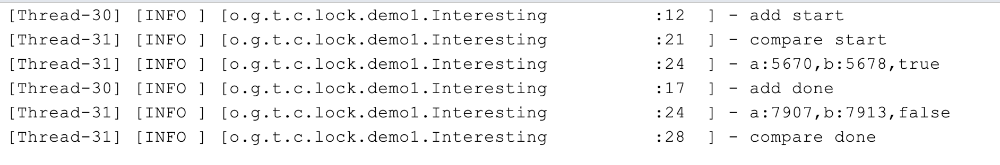
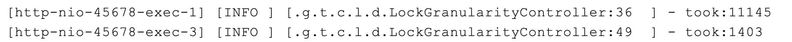
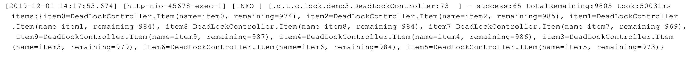
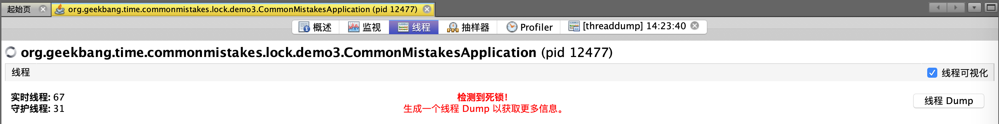
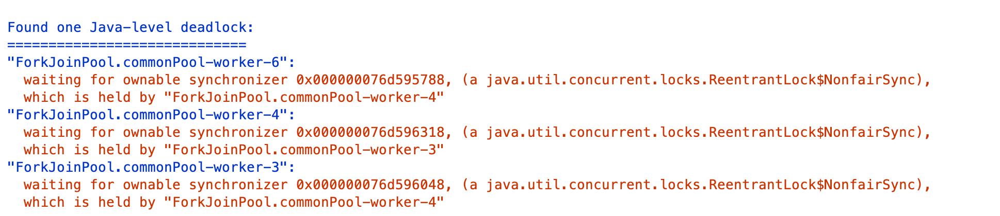
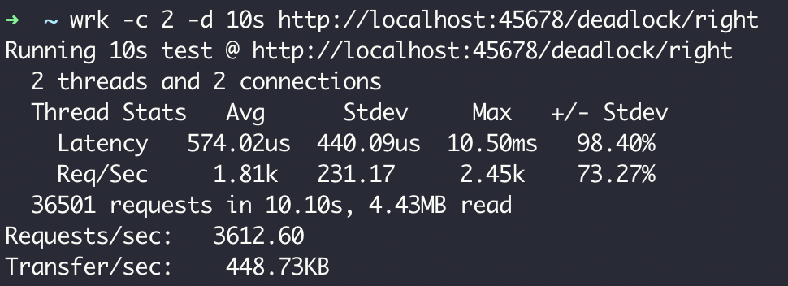

今天，我们来看看解决线程安全问题的另一种重要手段—**锁**，在使用上比较容易犯哪些错。

我先和你分享一个有趣的案例吧。有一天，一位同学在群里说“见鬼了，疑似遇到了一个 **JVM** 的 **Bug**”，我们都很好奇是什么 **Bug**。

于是，他贴出了这样一段代码：在一个类里有两个 **int** 类型的字段 a 和 **b**，有一个 add 方法循环 **1** 万次对 a 和 **b** 进行 ++ 操作，有另一个 compare 方法，同样循环 1 万次判断 a 是否小于 b，条件成立就打印 a 和 b 的值，并判断 a>b 是否成立。

```
@Slf4j
public class Interesting {
    volatile int a = 1;
    volatile int b = 1;
    public void add() {

        log.info("add start");
        for (int i = 0; i < 10000; i++) {
            a++;
            b++;
        }
        log.info("add done");
    }

    public void compare() {
        log.info("compare start");
        for (int i = 0; i < 10000; i++) {
            //a始终等于b吗？
            if (a < b) {
                log.info("a:{},b:{},{}", a, b, a > b);
                //最后的a>b应该始终是false吗？
            }
        }
        log.info("compare done");
    }
}
```

他起了两个线程来分别执行 add 和 compare 方法：

```
Interesting interesting = new Interesting();
new Thread(() -> interesting.add()).start();
new Thread(() -> interesting.compare()).start();
```

按道理，a 和 b 同样进行累加操作，应该始终相等，compare 中的第一次判断应该始终不会成立，不会输出任何日志。但，执行代码后发现不但输出了日志，而且更诡异的是，compare 方法在判断 a<b 成立的情况下还输出了 a>b 也成立：



群里一位同学看到这个问题笑了，说：“这哪是 JVM 的 Bug，分明是线程安全问题嘛。很明显，你这是在操作两个字段 a 和 b，有线程安全问题，应该为 add 方法加上锁，确保 a 和 b 的 ++ 是原子性的，就不会错乱了。”随后，他为 add 方法加上了锁：

```
public synchronized void add()
```

但，加锁后问题并没有解决。

我们来仔细想一下，为什么锁可以解决线程安全问题呢。因为只有一个线程可以拿到锁，所以加锁后的代码中的资源操作是线程安全的。但是，这个案例中的 add 方法始终只有一个线程在操作，显然只为 add 方法加锁是没用的。

之所以出现这种错乱，是因为两个线程是交错执行 add 和 compare 方法中的业务逻辑，而且这些业务逻辑不是原子性的：a++ 和 b++ 操作中可以穿插在 compare 方法的比较代码中；更需要注意的是，a<b 这种比较操作在字节码层面是加载 a、加载 b 和比较三步，代码虽然是一行但也不是原子性的。

所以，正确的做法应该是，为 add 和 compare 都加上方法锁，确保 add 方法执行时，compare 无法读取 a 和 b：

```
public synchronized void add()

public synchronized void compare()
```

所以，使用锁解决问题之前一定要理清楚，我们要保护的是什么逻辑，多线程执行的情况又是怎样的。

## 加锁前要清楚锁和被保护的对象是不是一个层面的

除了没有分析清线程、业务逻辑和锁三者之间的关系随意添加无效的方法锁外，还有一种比较常见的错误是，没有理清楚锁和要保护的对象是否是一个层面的。

我们知道静态字段属于类，类级别的锁才能保护；而非静态字段属于类实例，实例级别的锁就可以保护。

先看看这段代码有什么问题：在类 Data 中定义了一个静态的 int 字段 counter 和一个非静态的 wrong 方法，实现 counter 字段的累加操作。

```
class Data {

    @Getter
    private static int counter = 0;

    public static int reset() {
        counter = 0;
        return counter;
    }

    public synchronized void wrong() {
        counter++;
    }

}
```

写一段代码测试下：

```
@GetMapping("wrong")

public int wrong(@RequestParam(value = "count", defaultValue = "1000000") int count) {
    Data.reset();
    //多线程循环一定次数调用Data类不同实例的wrong方法
    IntStream.rangeClosed(1, count).parallel().forEach(i -> new Data().wrong());
    return Data.getCounter();

}
```

因为默认运行 100 万次，所以执行后应该输出 100 万，但页面输出的是 639242：


我们来分析下为什么会出现这个问题吧。

在非静态的 wrong 方法上加锁，只能确保多个线程无法执行同一个实例的 wrong 方法，却不能保证不会执行不同实例的 wrong 方法。而静态的 counter 在多个实例中共享，所以必然会出现线程安全问题。

理清思路后，修正方法就很清晰了：同样在类中定义一个 Object 类型的静态字段，在操作 counter 之前对这个字段加锁。

```
class Data {

    @Getter
    private static int counter = 0;
    private static Object locker = new Object();
    public void right() {
        synchronized (locker) {
            counter++;
        }
    }

}
```

你可能要问了，把 wrong 方法定义为静态不就可以了，这个时候锁是类级别的。可以是可以，但我们不可能为了解决线程安全问题改变代码结构，把实例方法改为静态方法。

感兴趣的同学还可以从字节码以及 JVM 的层面继续探索一下，代码块级别的 synchronized 和方法上标记 synchronized 关键字，在实现上有什么区别。

## 加锁要考虑锁的粒度和场景问题

在方法上加 synchronized 关键字实现加锁确实简单，也因此我曾看到一些业务代码中几乎所有方法都加了 synchronized，但这种滥用 synchronized 的做法：

一是，没必要。通常情况下 60% 的业务代码是三层架构，数据经过无状态的 Controller、Service、Repository 流转到数据库，没必要使用 synchronized 来保护什么数据。

二是，可能会极大地降低性能。使用 Spring 框架时，默认情况下 Controller、Service、Repository 是单例的，加上 synchronized 会导致整个程序几乎就只能支持单线程，造成极大的性能问题。

即使我们确实有一些共享资源需要保护，也要尽可能降低锁的粒度，仅对必要的代码块甚至是需要保护的资源本身加锁。

比如，在业务代码中，有一个 ArrayList 因为会被多个线程操作而需要保护，又有一段比较耗时的操作（代码中的 slow 方法）不涉及线程安全问题，应该如何加锁呢？

错误的做法是，给整段业务逻辑加锁，把 slow 方法和操作 ArrayList 的代码同时纳入 synchronized 代码块；更合适的做法是，把加锁的粒度降到最低，只在操作 ArrayList 的时候给这个 ArrayList 加锁。

```
private List<Integer> data = new ArrayList<>();

//不涉及共享资源的慢方法

private void slow() {

    try {
        TimeUnit.MILLISECONDS.sleep(10);
    } catch (InterruptedException e) {
    }

}

//错误的加锁方法

@GetMapping("wrong")
public int wrong() {
    long begin = System.currentTimeMillis();
    IntStream.rangeClosed(1, 1000).parallel().forEach(i -> {

        //加锁粒度太粗了
        synchronized (this) {
            slow();
            data.add(i);
        }
    });

    log.info("took:{}", System.currentTimeMillis() - begin);
    return data.size();

}

//正确的加锁方法

@GetMapping("right")
public int right() {
    long begin = System.currentTimeMillis();
    IntStream.rangeClosed(1, 1000).parallel().forEach(i -> {
        slow();
        //只对List加锁
        synchronized (data) {
            data.add(i);
        }
    });

    log.info("took:{}", System.currentTimeMillis() - begin);
    return data.size();

}
```

执行这段代码，同样是 1000 次业务操作，正确加锁的版本耗时 1.4 秒，而对整个业务逻辑加锁的话耗时 11 秒。



如果精细化考虑了锁应用范围后，性能还无法满足需求的话，我们就要考虑另一个维度的粒度问题了，即：区分读写场景以及资源的访问冲突，考虑使用悲观方式的锁还是乐观方式的锁。

一般业务代码中，很少需要进一步考虑这两种更细粒度的锁，所以我只和你分享几个大概的结论，你可以根据自己的需求来考虑是否有必要进一步优化：

对于读写比例差异明显的场景，考虑使用 ReentrantReadWriteLock 细化区分读写锁，来提高性能。

如果你的 JDK 版本高于 1.8、共享资源的冲突概率也没那么大的话，考虑使用 StampedLock 的乐观读的特性，进一步提高性能。

JDK 里 ReentrantLock 和 ReentrantReadWriteLock 都提供了公平锁的版本，在没有明确需求的情况下不要轻易开启公平锁特性，在任务很轻的情况下开启公平锁可能会让性能下降上百倍。

## 多把锁要小心死锁问题

刚才我们聊到锁的粒度够用就好，这就意味着我们的程序逻辑中有时会存在一些细粒度的锁。但一个业务逻辑如果涉及多把锁，容易产生死锁问题。

之前我遇到过这样一个案例：下单操作需要锁定订单中多个商品的库存，拿到所有商品的锁之后进行下单扣减库存操作，全部操作完成之后释放所有的锁。代码上线后发现，下单失败概率很高，失败后需要用户重新下单，极大影响了用户体验，还影响到了销量。

经排查发现是死锁引起的问题，背后原因是扣减库存的顺序不同，导致并发的情况下多个线程可能相互持有部分商品的锁，又等待其他线程释放另一部分商品的锁，于是出现了死锁问题。

接下来，我们剖析一下核心的业务代码。

首先，定义一个商品类型，包含商品名、库存剩余和商品的库存锁三个属性，每一种商品默认库存 1000 个；然后，初始化 10 个这样的商品对象来模拟商品清单：

```
@Data
@RequiredArgsConstructor
static class Item {

    final String name; //商品名
    int remaining = 1000; //库存剩余
    @ToString.Exclude //ToString不包含这个字段 
    ReentrantLock lock = new ReentrantLock();

}
```

随后，写一个方法模拟在购物车进行商品选购，每次从商品清单（items 字段）中随机选购三个商品（为了逻辑简单，我们不考虑每次选购多个同类商品的逻辑，购物车中不体现商品数量）：

```
private List<Item> createCart() {
    return IntStream.rangeClosed(1, 3)
            .mapToObj(i -> "item" + ThreadLocalRandom.current().nextInt(items.size()))
            .map(name -> items.get(name)).collect(Collectors.toList());

}
```

下单代码如下：先声明一个 List 来保存所有获得的锁，然后遍历购物车中的商品依次尝试获得商品的锁，最长等待 10 秒，获得全部锁之后再扣减库存；如果有无法获得锁的情况则解锁之前获得的所有锁，返回 false 下单失败。

```
private boolean createOrder(List<Item> order) {

    //存放所有获得的锁
    List<ReentrantLock> locks = new ArrayList<>();
    for (Item item : order) {
        try {
            //获得锁10秒超时
            if (item.lock.tryLock(10, TimeUnit.SECONDS)) {
                locks.add(item.lock);
            } else {
                locks.forEach(ReentrantLock::unlock);
                return false;
            }
        } catch (InterruptedException e) {

        }
    }

    //锁全部拿到之后执行扣减库存业务逻辑
    try {
        order.forEach(item -> item.remaining--);
    } finally {
        locks.forEach(ReentrantLock::unlock);
    }
    return true;
}
```

我们写一段代码测试这个下单操作。模拟在多线程情况下进行 100 次创建购物车和下单操作，最后通过日志输出成功的下单次数、总剩余的商品个数、100 次下单耗时，以及下单完成后的商品库存明细：

```
@GetMapping("wrong")
public long wrong() {
    long begin = System.currentTimeMillis();
    //并发进行100次下单操作，统计成功次数
    long success = IntStream.rangeClosed(1, 100).parallel()
            .mapToObj(i -> {
                List<Item> cart = createCart();
                return createOrder(cart);
            })

            .filter(result -> result)
            .count();

    log.info("success:{} totalRemaining:{} took:{}ms items:{}",
            success,
            items.entrySet().stream().map(item -> item.getValue().remaining).reduce(0, Integer::sum),
            System.currentTimeMillis() - begin, items);
    return success;

}
```

运行程序，输出如下日志：



可以看到，100 次下单操作成功了 65 次，10 种商品总计 10000 件，库存总计为 9805，消耗了 195 件符合预期（65 次下单成功，每次下单包含三件商品），总耗时 50 秒。

为什么会这样呢？

使用 JDK 自带的 VisualVM 工具来跟踪一下，重新执行方法后不久就可以看到，线程 Tab 中提示了死锁问题，根据提示点击右侧线程 Dump 按钮进行线程抓取操作：



查看抓取出的线程栈，在页面中部可以看到如下日志：



显然，是出现了死锁，线程 4 在等待的一个锁被线程 3 持有，线程 3 在等待的另一把锁被线程 4 持有。

那为什么会有死锁问题呢？

我们仔细回忆一下购物车添加商品的逻辑，随机添加了三种商品，假设一个购物车中的商品是 item1 和 item2，另一个购物车中的商品是 item2 和 item1，一个线程先获取到了 item1 的锁，同时另一个线程获取到了 item2 的锁，然后两个线程接下来要分别获取 item2 和 item1 的锁，这个时候锁已经被对方获取了，只能相互等待一直到 10 秒超时。

其实，避免死锁的方案很简单，为购物车中的商品排一下序，让所有的线程一定是先获取 item1 的锁然后获取 item2 的锁，就不会有问题了。所以，我只需要修改一行代码，对 createCart 获得的购物车按照商品名进行排序即可：

```
@GetMapping("right")
public long right() {
    ...
    long success = IntStream.rangeClosed(1, 100).parallel()
            .mapToObj(i -> {
                List<Item> cart = createCart().stream()
                        .sorted(Comparator.comparing(Item::getName))
                        .collect(Collectors.toList());
                return createOrder(cart);
            })
            .filter(result -> result)
            .count();
    ...
    return success;

}
```

测试一下 right 方法，不管执行多少次都是 100 次成功下单，而且性能相当高，达到了 3000 以上的 TPS：



这个案例中，虽然产生了死锁问题，但因为尝试获取锁的操作并不是无限阻塞的，所以没有造成永久死锁，之后的改进就是避免循环等待，通过对购物车的商品进行排序来实现有顺序的加锁，避免循环等待。

## 重点回顾

我们一起总结回顾下，使用锁来解决多线程情况下线程安全问题的坑吧。

第一，使用 synchronized 加锁虽然简单，但我们首先要弄清楚共享资源是类还是实例级别的、会被哪些线程操作，synchronized 关联的锁对象或方法又是什么范围的。

第二，加锁尽可能要考虑粒度和场景，锁保护的代码意味着无法进行多线程操作。对于 Web 类型的天然多线程项目，对方法进行大范围加锁会显著降级并发能力，要考虑尽可能地只为必要的代码块加锁，降低锁的粒度；而对于要求超高性能的业务，还要细化考虑锁的读写场景，以及悲观优先还是乐观优先，尽可能针对明确场景精细化加锁方案，可以在适当的场景下考虑使用 ReentrantReadWriteLock、StampedLock 等高级的锁工具类。

第三，业务逻辑中有多把锁时要考虑死锁问题，通常的规避方案是，避免无限等待和循环等待。

此外，如果业务逻辑中锁的实现比较复杂的话，要仔细看看加锁和释放是否配对，是否有遗漏释放或重复释放的可能性；并且对于分布式锁要考虑锁自动超时释放了，而业务逻辑却还在进行的情况下，如果别的线线程或进程拿到了相同的锁，可能会导致重复执行。

为演示方便，今天的案例是在 Controller 的逻辑中开新的线程或使用线程池进行并发模拟，我们当然可以意识到哪些对象是并发操作的。但对于 Web 应用程序的天然多线程场景，你可能更容易忽略这点，并且也可能因为误用锁降低应用整体的吞吐量。如果你的业务代码涉及复杂的锁操作，强烈建议 Mock 相关外部接口或数据库操作后对应用代码进行压测，通过压测排除锁误用带来的性能问题和死锁问题。

今天用到的代码，我都放在了 GitHub 上，你可以点击这个链接查看。

## 思考与讨论

本文开头的例子里，变量 a、b 都使用了 volatile 关键字，你知道原因吗？我之前遇到过这样一个坑：我们开启了一个线程无限循环来跑一些任务，有一个 bool 类型的变量来控制循环的退出，默认为 true 代表执行，一段时间后主线程将这个变量设置为了 false。如果这个变量不是 volatile 修饰的，子线程可以退出吗？你能否解释其中的原因呢？

文末我们又提了两个坑，一是加锁和释放没有配对的问题，二是锁自动释放导致的重复逻辑执行的问题。你有什么方法来发现和解决这两种问题吗？

在使用锁的过程中，你还遇到过其他坑吗？我是朱晔，欢迎在评论区与我留言分享你的想法，也欢迎你把这篇文章分享给你的朋友或同事，一起交流。