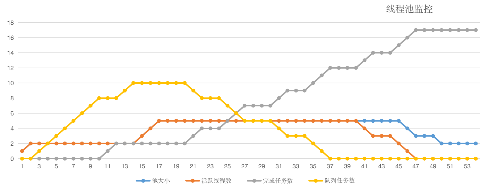
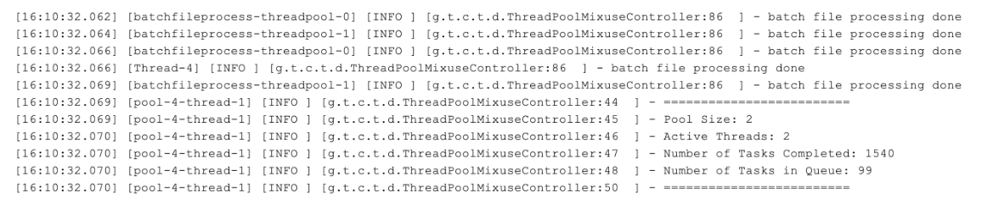
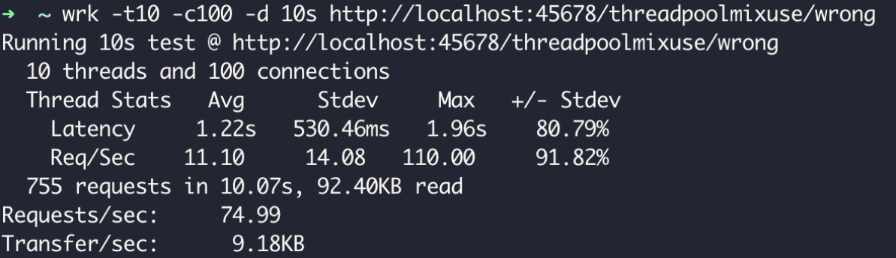
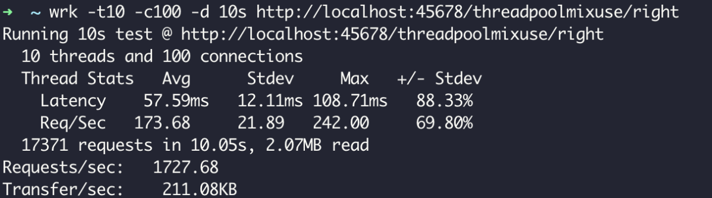

程序中，我们会用各种池化技术来缓存创建昂贵的对象，比如线程池、连接池、内存池。一般是预先创建一些对象放入池中，使用的时候直接取出使用，用完归还以便复用，还会通过一定的策略调整池中缓存对象的数量，实现池的动态伸缩。

由于线程的创建比较昂贵，随意、没有控制地创建大量线程会造成性能问题，因此短平快的任务一般考虑使用线程池来处理，而不是直接创建线程。

今天，我们就针对线程池这个话题展开讨论，通过三个生产事故，来看看使用线程池应该注意些什么。

## 线程池的声明需要手动进行

**Java** 中的 **Executors** 类定义了一些快捷的工具方法，来帮助我们快速创建线程池。《阿里巴巴Java开发手册》中提到，禁止使用这些方法来创建线程池，而应该手动 **new ThreadPoolExecutor** 来创建线程池。这一条规则的背后，是大量血淋淋的生产事故，最典型的就是 **newFixedThreadPool** 和**newCachedThreadPool** ，可能因为资源耗尽导致 **OOM** 问题。

首先，我们来看一下 **newFixedThreadPool** 为什么可能会出现 **OOM** 的问题。

我们写一段测试代码，来初始化一个单线程的 **FixedThreadPool** ，循环1亿次向线程池提交任务，每个任务都会创建一个比较大的字符串然后休眠一小时：

```java
@GetMapping("oom1")
public void oom1() throws InterruptedException {
ThreadPoolExecutor threadPool = (ThreadPoolExecutor) Executors.newFixedThreadPool(1);
//打印线程池的信息，稍后我会解释这段代码
printStats(threadPool); 
for (int i = 0; i < 100000000; i++) {
    threadPool.execute(() -> {
        String payload = IntStream.rangeClosed(1, 1000000)
                .mapToObj(__ -> "a")
                .collect(Collectors.joining("")) + UUID.randomUUID().toString();
        try {
            TimeUnit.HOURS.sleep(1);
        } catch (InterruptedException e) {
        }
        log.info(payload);
    });
}
 
threadPool.shutdown();
threadPool.awaitTermination(1, TimeUnit.HOURS);
 
}
```

执行程序后不久，日志中就出现了如下 **OOM** ：

```bash
Exception in thread "http-nio-45678-ClientPoller" java.lang.OutOfMemoryError: GC overhead limit exceeded
```

翻看 **newFixedThreadPool** 方法的源码不难发现，线程池的工作队列直接 **new** 了一个 **LinkedBlockingQueue**，而默认构造方法的 **LinkedBlockingQueue** 是一个 **Integer.MAX_VALUE** 长度的队列，可以认为是无界的：

```java
public static ExecutorService newFixedThreadPool(int nThreads) {
return new ThreadPoolExecutor(nThreads, nThreads,
0L, TimeUnit.MILLISECONDS,
new LinkedBlockingQueue<Runnable>());
}
public class LinkedBlockingQueue<E> extends AbstractQueue<E>
implements BlockingQueue<E>, java.io.Serializable {
...
/**
 * Creates a {@code LinkedBlockingQueue} with a capacity of
 * {@link Integer#MAX_VALUE}.
 */
public LinkedBlockingQueue() {
    this(Integer.MAX_VALUE);
}
 
...
}
```

虽然使用 **newFixedThreadPool** 可以把工作线程控制在固定的数量上，但任务队列是无界的。如果任务较多并且执行较慢的话，队列可能会快速积压，撑爆内存导致OOM。

我们再把刚才的例子稍微改一下，改为使用 **newCachedThreadPool** 方法来获得线程池。程序运行不久后，同样看到了如下 **OOM** 异常：

```bash
[11:30:30.487] [http-nio-45678-exec-1] [ERROR] [.a.c.c.C.[.[.[/].[dispatcherServlet]:175 ] - Servlet.service() for servlet [dispatcherServlet] in context with path [] threw exception [Handler dispatch failed; nested exception is java.lang.OutOfMemoryError: unable to create new native thread] with root cause
java.lang.OutOfMemoryError: unable to create new native thread
```

从日志中可以看到，这次 **OOM** 的原因是无法创建线程，翻看 **newCachedThreadPool** 的源码可以看到，这种线程池的最大线程数是**Integer.MAX_VALUE**，可以认为是没有上限的，而其工作队列 **SynchronousQueue** 是一个没有存储空间的阻塞队列。这意味着，只要有请求到来，就必须找到一条工作线程来处理，如果当前没有空闲的线程就再创建一条新的。

由于我们的任务需要 **1** 小时才能执行完成，大量的任务进来后会创建大量的线程。我们知道线程是需要分配一定的内存空间作为线程栈的，比如 **1MB**，因此无限制创建线程必然会导致 **OOM**：

```java
public static ExecutorService newCachedThreadPool() {
	return new ThreadPoolExecutor(0, Integer.MAX_VALUE, 60L, TimeUnit.SECONDS, new SynchronousQueue<Runnable>());
}
```

其实，大部分 **Java** 开发同学知道这两种线程池的特性，只是抱有侥幸心理，觉得只是使用线程池做一些轻量级的任务，不可能造成队列积压或开启大量线程。

但，现实往往是残酷的。我之前就遇到过这么一个事故：用户注册后，我们调用一个外部服务去发送短信，发送短信接口正常时可以在 **100** 毫秒内响应，TPS **100**的注册量，**CachedThreadPool** 能稳定在占用 **10** 个左右线程的情况下满足需求。在某个时间点，外部短信服务不可用了，我们调用这个服务的超时又特别长，比如1分钟，1分钟可能就进来了 **6000** 用户，产生 **6000** 个发送短信的任务，需要 **6000** 个线程，没多久就因为无法创建线程导致了 **OOM**，整个应用程序崩溃。

因此，我同样不建议使用 **Executors** 提供的两种快捷的线程池，原因如下：

我们需要根据自己的场景、并发情况来评估线程池的几个核心参数，包括核心线程数、最大线程数、线程回收策略、工作队列的类型，以及拒绝策略，确保线程池的工作行为符合需求，一般都需要设置有界的工作队列和可控的线程数。

任何时候，都应该为自定义线程池指定有意义的名称，以方便排查问题。当出现线程数量暴增、线程死锁、线程占用大量CPU、线程执行出现异常等问题时，我们往往会抓取线程栈。此时，有意义的线程名称，就可以方便我们定位问题。

除了建议手动声明线程池以外，我还建议用一些监控手段来观察线程池的状态。线程池这个组件往往会表现得任劳任怨、默默无闻，除非是出现了拒绝策略，否则压力再大都不会抛出一个异常。如果我们能提前观察到线程池队列的积压，或者线程数量的快速膨胀，往往可以提早发现并解决问题。

## 线程池线程管理策略详解

在之前的 **Demo** 中，我们用一个 **printStats** 方法实现了最简陋的监控，每秒输出一次线程池的基本内部信息，包括线程数、活跃线程数、完成了多少任务，以及队列中还有多少积压任务等信息：

```java
private void printStats(ThreadPoolExecutor threadPool) {
   Executors.newSingleThreadScheduledExecutor().scheduleAtFixedRate(() -> {
        log.info("=========================");
        log.info("Pool Size: {}", threadPool.getPoolSize());
        log.info("Active Threads: {}", threadPool.getActiveCount());
        log.info("Number of Tasks Completed: {}", threadPool.getCompletedTaskCount());
        log.info("Number of Tasks in Queue: {}", threadPool.getQueue().size());
		log.info("=========================");
	}, 0, 1, TimeUnit.SECONDS);
}
```

接下来，我们就利用这个方法来观察一下线程池的基本特性吧。

首先，自定义一个线程池。这个线程池具有 **2** 个核心线程、**5** 个最大线程、使用容量为 **10** 的 **ArrayBlockingQueue** 阻塞队列作为工作队列，使用默认的**AbortPolicy** 拒绝策略，也就是任务添加到线程池失败会抛出 **RejectedExecutionException** 。此外，我们借助了 **Jodd** 类库的 **ThreadFactoryBuilder** 方法来构造一个线程工厂，实现线程池线程的自定义命名。

然后，我们写一段测试代码来观察线程池管理线程的策略。测试代码的逻辑为，每次间隔 **1** 秒向线程池提交任务，循环 **20** 次，每个任务需要 **10** 秒才能执行完成，代码如下：

```java
@GetMapping("right")
public int right() throws InterruptedException {
//使用一个计数器跟踪完成的任务数
AtomicInteger atomicInteger = new AtomicInteger();
//创建一个具有2个核心线程、5个最大线程，使用容量为10的ArrayBlockingQueue阻塞队列作为工作队列的线程池，使用默认的AbortPolicy拒绝策略
ThreadPoolExecutor threadPool = new ThreadPoolExecutor(
2, 5,
5, TimeUnit.SECONDS,
new ArrayBlockingQueue<>(10),
new ThreadFactoryBuilder().setNameFormat("demo-threadpool-%d").get(),
new ThreadPoolExecutor.AbortPolicy());
printStats(threadPool);
//每隔1秒提交一次，一共提交20次任务
IntStream.rangeClosed(1, 20).forEach(i -> {
    try {
        TimeUnit.SECONDS.sleep(1);
    } catch (InterruptedException e) {
        e.printStackTrace();
    }
    int id = atomicInteger.incrementAndGet();
    try {
        threadPool.submit(() -> {
            log.info("{} started", id);
            //每个任务耗时10秒
            try {
                TimeUnit.SECONDS.sleep(10);
            } catch (InterruptedException e) {
            }
            log.info("{} finished", id);
        });
    } catch (Exception ex) {
        //提交出现异常的话，打印出错信息并为计数器减一
        log.error("error submitting task {}", id, ex);
        atomicInteger.decrementAndGet();
    }
});
 
TimeUnit.SECONDS.sleep(60);
return atomicInteger.intValue();
 
}
```

**60** 秒后页面输出了 **17**，有3次提交失败了：


并且日志中也出现了 **3** 次类似的错误信息：

```java
[14:24:52.879] [http-nio-45678-exec-1] [ERROR] [.t.c.t.demo1.ThreadPoolOOMController:103 ] - error submitting task 18
java.util.concurrent.RejectedExecutionException: Task java.util.concurrent.FutureTask@163a2dec rejected from java.util.concurrent.ThreadPoolExecutor@18061ad2[Running, pool size = 5, active threads = 5, queued tasks = 10, completed tasks = 2]
```

我们把 **printStats** 方法打印出的日志绘制成图表，得出如下曲线：



至此，我们可以总结出线程池默认的工作行为：

不会初始化 **corePoolSize** 个线程，有任务来了才创建工作线程；

- 当核心线程满了之后不会立即扩容线程池，而是把任务堆积到工作队列中；
- 当工作队列满了后扩容线程池，一直到线程个数达到 **maximumPoolSize** 为止；
- 如果队列已满且达到了最大线程后还有任务进来，按照拒绝策略处理；
- 当线程数大于核心线程数时，线程等待 **keepAliveTime** 后还是没有任务需要处理的话，收缩线程到核心线程数。

了解这个策略，有助于我们根据实际的容量规划需求，为线程池设置合适的初始化参数。当然，我们也可以通过一些手段来改变这些默认工作行为，比如：

- 声明线程池后立即调用 **prestartAllCoreThreads** 方法，来启动所有核心线程；
- 传入 **true** 给 **allowCoreThreadTimeOut** 方法，来让线程池在空闲的时候同样回收核心线程。

不知道你有没有想过：**Java** 线程池是先用工作队列来存放来不及处理的任务，满了之后再扩容线程池。当我们的工作队列设置得很大时，最大线程数这个参数显得没有意义，因为队列很难满，或者到满的时候再去扩容线程池已经于事无补了。

那么，我们有没有办法让线程池更激进一点，优先开启更多的线程，而把队列当成一个后备方案呢？比如我们这个例子，任务执行得很慢，需要10秒，如果线程池可以优先扩容到 **5** 个最大线程，那么这些任务最终都可以完成，而不会因为线程池扩容过晚导致慢任务来不及处理。

限于篇幅，这里我只给你一个大致思路：

- 由于线程池在工作队列满了无法入队的情况下会扩容线程池，那么我们是否可以重写队列的offer方法，造成这个队列已满的假象呢？
- 由于我们 **Hack** 了队列，在达到了最大线程后势必会触发拒绝策略，那么能否实现一个自定义的拒绝策略处理程序，这个时候再把任务真正插入队列呢？
  接下来，就请你动手试试看如何实现这样一个“弹性”线程池吧。**Tomcat** 线程池也实现了类似的效果，可供你借鉴。

## 务必确认清楚线程池本身是不是复用的

不久之前我遇到了这样一个事故：某项目生产环境时不时有报警提示线程数过多，超过 **2000** 个，收到报警后查看监控发现，瞬时线程数比较多但过一会儿又会降下来，线程数抖动很厉害，而应用的访问量变化不大。

为了定位问题，我们在线程数比较高的时候进行线程栈抓取，抓取后发现内存中有 **1000** 多个自定义线程池。一般而言，线程池肯定是复用的，有5个以内的线程池都可以认为正常，而 **1000** 多个线程池肯定不正常。

在项目代码里，我们没有搜到声明线程池的地方，搜索execute关键字后定位到，原来是业务代码调用了一个类库来获得线程池，类似如下的业务代码：调用**ThreadPoolHelper** 的 **getThreadPool** 方法来获得线程池，然后提交数个任务到线程池处理，看不出什么异常。

```java
@GetMapping("wrong")
public String wrong() throws InterruptedException {
    ThreadPoolExecutor threadPool = ThreadPoolHelper.getThreadPool();
    IntStream.rangeClosed(1, 10).forEach(i -> {
        threadPool.execute(() -> {
            ...
            try {
                TimeUnit.SECONDS.sleep(1);
            } catch (InterruptedException e) {
            }
        });
    });
    return "OK";
}
```

但是，来到 **ThreadPoolHelper** 的实现让人大跌眼镜，**getThreadPool** 方法居然是每次都使用 **Executors.newCachedThreadPool** 来创建一个线程池。

```java
class ThreadPoolHelper {
    public static ThreadPoolExecutor getThreadPool() {
        //线程池没有复用
        return (ThreadPoolExecutor) Executors.newCachedThreadPool();
    }
}
```

通过上一小节的学习，我们可以想到 **newCachedThreadPool** 会在需要时创建必要多的线程，业务代码的一次业务操作会向线程池提交多个慢任务，这样执行一次业务操作就会开启多个线程。如果业务操作并发量较大的话，的确有可能一下子开启几千个线程。

那，为什么我们能在监控中看到线程数量会下降，而不会撑爆内存呢？

回到 **newCachedThreadPool** 的定义就会发现，它的核心线程数是0，而 **keepAliveTime** 是60秒，也就是在 **60** 秒之后所有的线程都是可以回收的。好吧，就因为这个特性，我们的业务程序死得没太难看。

要修复这个Bug也很简单，使用一个静态字段来存放线程池的引用，返回线程池的代码直接返回这个静态字段即可。这里一定要记得我们的最佳实践，手动创建线程池。修复后的 **ThreadPoolHelper** 类如下：

```java
class ThreadPoolHelper {

  private static ThreadPoolExecutor threadPoolExecutor = new ThreadPoolExecutor(
    10, 50,
    2, TimeUnit.SECONDS,
    new ArrayBlockingQueue<>(1000),
    new ThreadFactoryBuilder().setNameFormat("demo-threadpool-%d").get());
  	
    public static ThreadPoolExecutor getRightThreadPool() {
   	  return threadPoolExecutor;
  	}
}

```

## 需要仔细斟酌线程池的混用策略

线程池的意义在于复用，那这是不是意味着程序应该始终使用一个线程池呢？

当然不是。通过第一小节的学习我们知道，要根据任务的“轻重缓急”来指定线程池的核心参数，包括线程数、回收策略和任务队列：

对于执行比较慢、数量不大的IO任务，或许要考虑更多的线程数，而不需要太大的队列。
而对于吞吐量较大的计算型任务，线程数量不宜过多，可以是CPU核数或核数*2（理由是，线程一定调度到某个CPU进行执行，如果任务本身是CPU绑定的任务，那么过多的线程只会增加线程切换的开销，并不能提升吞吐量），但可能需要较长的队列来做缓冲。
之前我也遇到过这么一个问题，业务代码使用了线程池异步处理一些内存中的数据，但通过监控发现处理得非常慢，整个处理过程都是内存中的计算不涉及IO操作，也需要数秒的处理时间，应用程序CPU占用也不是特别高，有点不可思议。

经排查发现，业务代码使用的线程池，还被一个后台的文件批处理任务用到了。

或许是够用就好的原则，这个线程池只有 **2** 个核心线程，最大线程也是 **2** ，使用了容量为 **100** 的 **ArrayBlockingQueue** 作为工作队列，使用了 **CallerRunsPolicy** 拒绝策略：

```java
private static ThreadPoolExecutor threadPool = new ThreadPoolExecutor(
        2, 2,
        1, TimeUnit.HOURS,
        new ArrayBlockingQueue<>(100),
        new ThreadFactoryBuilder().setNameFormat("batchfileprocess-threadpool-%d").get(),
        new ThreadPoolExecutor.CallerRunsPolicy());
```

这里，我们模拟一下文件批处理的代码，在程序启动后通过一个线程开启死循环逻辑，不断向线程池提交任务，任务的逻辑是向一个文件中写入大量的数据：

```java
@PostConstruct
public void init() {
    printStats(threadPool);
new Thread(() -> {
    //模拟需要写入的大量数据
    String payload = IntStream.rangeClosed(1, 1_000_000)
            .mapToObj(__ -> "a")
            .collect(Collectors.joining(""));
    while (true) {
        threadPool.execute(() -> {
            try {
                //每次都是创建并写入相同的数据到相同的文件
                Files.write(Paths.get("demo.txt"), Collections.singletonList(LocalTime.now().toString() + ":" + payload), UTF_8, CREATE, TRUNCATE_EXISTING);
            } catch (IOException e) {
                e.printStackTrace();
            }
            log.info("batch file processing done");
        });
    }
}).start();

}
```

可以想象到，这个线程池中的2个线程任务是相当重的。通过printStats方法打印出的日志，我们观察下线程池的负担：



可以看到，线程池的2个线程始终处于活跃状态，队列也基本处于打满状态。因为开启了CallerRunsPolicy拒绝处理策略，所以当线程满载队列也满的情况下，任务会在提交任务的线程，或者说调用execute方法的线程执行，也就是说不能认为提交到线程池的任务就一定是异步处理的。如果使用了CallerRunsPolicy策略，那么有可能异步任务变为同步执行。从日志的第四行也可以看到这点。这也是这个拒绝策略比较特别的原因。

不知道写代码的同学为什么设置这个策略，或许是测试时发现线程池因为任务处理不过来出现了异常，而又不希望线程池丢弃任务，所以最终选择了这样的拒绝策略。不管怎样，这些日志足以说明线程池是饱和状态。

可以想象到，业务代码复用这样的线程池来做内存计算，命运一定是悲惨的。我们写一段代码测试下，向线程池提交一个简单的任务，这个任务只是休眠10毫秒没有其他逻辑：

```java
private Callable<Integer> calcTask() {

    return () -> {
        TimeUnit.MILLISECONDS.sleep(10);
        return 1;
    };

}

@GetMapping("wrong")
public int wrong() throws ExecutionException, InterruptedException {
    return threadPool.submit(calcTask()).get();
}

```

我们使用 **wrk** 工具对这个接口进行一个简单的压测，可以看到 **TPS** 为 75，性能的确非常差。



细想一下，问题其实没有这么简单。因为原来执行IO任务的线程池使用的是CallerRunsPolicy策略，所以直接使用这个线程池进行异步计算的话，当线程池饱和的时候，计算任务会在执行Web请求的Tomcat线程执行，这时就会进一步影响到其他同步处理的线程，甚至造成整个应用程序崩溃。

解决方案很简单，使用独立的线程池来做这样的“计算任务”即可。计算任务打了双引号，是因为我们的模拟代码执行的是休眠操作，并不属于CPU绑定的操作，更类似IO绑定的操作，如果线程池线程数设置太小会限制吞吐能力：

```java
private static ThreadPoolExecutor asyncCalcThreadPool = new ThreadPoolExecutor(
	200, 200,
	1, TimeUnit.HOURS,
	new ArrayBlockingQueue<>(1000),
	new ThreadFactoryBuilder().setNameFormat("asynccalc-threadpool-%d").get());

@GetMapping("right")
public int right() throws ExecutionException, InterruptedException {
	return asyncCalcThreadPool.submit(calcTask()).get();
}
```

使用单独的线程池改造代码后再来测试一下性能，TPS提高到了1727：



可以看到，盲目复用线程池混用线程的问题在于，别人定义的线程池属性不一定适合你的任务，而且混用会相互干扰。这就好比，我们往往会用虚拟化技术来实现资源的隔离，而不是让所有应用程序都直接使用物理机。

就线程池混用问题，我想再和你补充一个坑：Java 8的parallel stream功能，可以让我们很方便地并行处理集合中的元素，其背后是共享同一个ForkJoinPool，默认并行度是CPU核数-1。对于CPU绑定的任务来说，使用这样的配置比较合适，但如果集合操作涉及同步IO操作的话（比如数据库操作、外部服务调用等），建议自定义一个ForkJoinPool（或普通线程池）。你可以参考第一讲的相关Demo。

## 重点回顾

线程池管理着线程，线程又属于宝贵的资源，有许多应用程序的性能问题都来自线程池的配置和使用不当。在今天的学习中，我通过三个和线程池相关的生产事故，和你分享了使用线程池的几个最佳实践。

第一，Executors 类提供的一些快捷声明线程池的方法虽然简单，但隐藏了线程池的参数细节。因此，使用线程池时，我们一定要根据场景和需求配置合理的线程数、任务队列、拒绝策略、线程回收策略，并对线程进行明确的命名方便排查问题。

第二，既然使用了线程池就需要确保线程池是在复用的，每次 new 一个线程池出来可能比不用线程池还糟糕。如果你没有直接声明线程池而是使用其他同学提供的类库来获得一个线程池，请务必查看源码，以确认线程池的实例化方式和配置是符合预期的。

第三，复用线程池不代表应用程序始终使用同一个线程池，我们应该根据任务的性质来选用不同的线程池。特别注意 IO 绑定的任务和 CPU 绑定的任务对于线程池属性的偏好，如果希望减少任务间的相互干扰，考虑按需使用隔离的线程池。

最后我想强调的是，线程池作为应用程序内部的核心组件往往缺乏监控（如果你使用类似 RabbitMQ 这样的 MQ 中间件，运维同学一般会帮我们做好中间件监控），往往到程序崩溃后才发现线程池的问题，很被动。在设计篇中我们会重新谈及这个问题及其解决方案。