# 连接池：别让连接池帮了倒忙

今天，我们来聊聊使用连接池需要注意的问题。

在上一讲，我们学习了使用线程池需要注意的问题。今天，我再与你说说另一种很重要的池化技术，即连接池。

我先和你说说连接池的结构。连接池一般对外提供获得连接、归还连接的接口给客户端使用，并暴露最小空闲连接数、最大连接数等可配置参数，在内部则实现连接建立、连接心跳保持、连接管理、空闲连接回收、连接可用性检测等功能。连接池的结构示意图，如下所示：

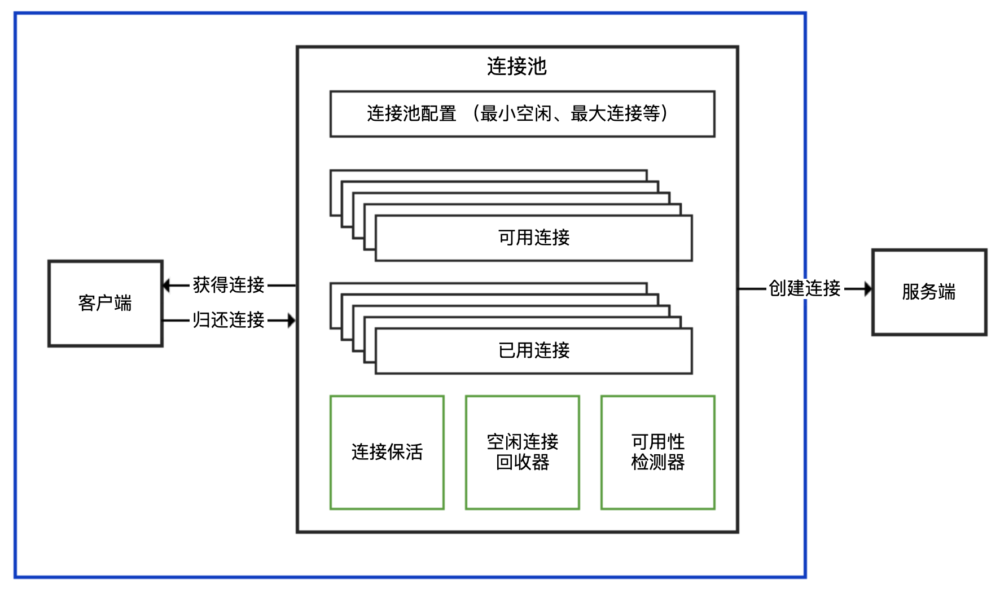

业务项目中经常会用到的连接池，主要是数据库连接池、Redis 连接池和 HTTP 连接池。所以，今天我就以这三种连接池为例，和你聊聊使用和配置连接池容易出错的地方。

## 注意鉴别客户端 SDK 是否基于连接池

在使用三方客户端进行网络通信时，我们首先要确定客户端 SDK 是否是基于连接池技术实现的。我们知道，TCP 是面向连接的基于字节流的协议：

面向连接，意味着连接需要先创建再使用，创建连接的三次握手有一定开销；

基于字节流，意味着字节是发送数据的最小单元，TCP 协议本身无法区分哪几个字节是完整的消息体，也无法感知是否有多个客户端在使用同一个 TCP 连接，TCP 只是一个读写数据的管道。

如果客户端 SDK 没有使用连接池，而直接是 TCP 连接，那么就需要考虑每次建立 TCP 连接的开销，并且因为 TCP 基于字节流，在多线程的情况下对同一连接进行复用，可能会产生线程安全问题。

我们先看一下涉及 TCP 连接的客户端 SDK，对外提供 API 的三种方式。在面对各种三方客户端的时候，只有先识别出其属于哪一种，才能理清楚使用方式。

连接池和连接分离的 API：有一个 XXXPool 类负责连接池实现，先从其获得连接 XXXConnection，然后用获得的连接进行服务端请求，完成后使用者需要归还连接。通常，XXXPool 是线程安全的，可以并发获取和归还连接，而 XXXConnection 是非线程安全的。对应到连接池的结构示意图中，XXXPool 就是右边连接池那个框，左边的客户端是我们自己的代码。

内部带有连接池的 API：对外提供一个 XXXClient 类，通过这个类可以直接进行服务端请求；这个类内部维护了连接池，SDK 使用者无需考虑连接的获取和归还问题。一般而言，XXXClient 是线程安全的。对应到连接池的结构示意图中，整个 API 就是蓝色框包裹的部分。

非连接池的 API：一般命名为 XXXConnection，以区分其是基于连接池还是单连接的，而不建议命名为 XXXClient 或直接是 XXX。直接连接方式的 API 基于单一连接，每次使用都需要创建和断开连接，性能一般，且通常不是线程安全的。对应到连接池的结构示意图中，这种形式相当于没有右边连接池那个框，客户端直接连接服务端创建连接。

虽然上面提到了 SDK 一般的命名习惯，但不排除有一些客户端特立独行，因此在使用三方 SDK 时，一定要先查看官方文档了解其最佳实践，或是在类似 Stackoverflow 的网站搜索 XXX threadsafe/singleton 字样看看大家的回复，也可以一层一层往下看源码，直到定位到原始 Socket 来判断 Socket 和客户端 API 的对应关系。

明确了 SDK 连接池的实现方式后，我们就大概知道了使用 SDK 的最佳实践：

如果是分离方式，那么连接池本身一般是线程安全的，可以复用。每次使用需要从连接池获取连接，使用后归还，归还的工作由使用者负责。

如果是内置连接池，SDK 会负责连接的获取和归还，使用的时候直接复用客户端。

如果 SDK 没有实现连接池（大多数中间件、数据库的客户端 SDK 都会支持连接池），那通常不是线程安全的，而且短连接的方式性能不会很高，使用的时候需要考虑是否自己封装一个连接池。

接下来，我就以 Java 中用于操作 Redis 最常见的库 Jedis 为例，从源码角度分析下 Jedis 类到底属于哪种类型的 API，直接在多线程环境下复用一个连接会产生什么问题，以及如何用最佳实践来修复这个问题。

首先，向 Redis 初始化 2 组数据，Key=a、Value=1，Key=b、Value=2：

```
@PostConstruct

public void init() {

    try (Jedis jedis = new Jedis("127.0.0.1", 6379)) {

        Assert.isTrue("OK".equals(jedis.set("a", "1")), "set a = 1 return OK");

        Assert.isTrue("OK".equals(jedis.set("b", "2")), "set b = 2 return OK");

    }

}
```

然后，启动两个线程，共享操作同一个 Jedis 实例，每一个线程循环 1000 次，分别读取 Key 为 a 和 b 的 Value，判断是否分别为 1 和 2：

```
Jedis jedis = new Jedis("127.0.0.1", 6379);
new Thread(() -> {
    for (int i = 0; i < 1000; i++) {
        String result = jedis.get("a");
        if (!result.equals("1")) {
            log.warn("Expect a to be 1 but found {}", result);
            return;
        }
    }
}).start();

new Thread(() -> {
    for (int i = 0; i < 1000; i++) {
        String result = jedis.get("b");
        if (!result.equals("2")) {
            log.warn("Expect b to be 2 but found {}", result);
            return;
        }
    }
}).start();
TimeUnit.SECONDS.sleep(5);
```

执行程序多次，可以看到日志中出现了各种奇怪的异常信息，有的是读取 Key 为 b 的 Value 读取到了 1，有的是流非正常结束，还有的是连接关闭异常：

```
//错误1

[14:56:19.069] [Thread-28] [WARN ] [.t.c.c.redis.JedisMisreuseController:45  ] - Expect b to be 2 but found 1

//错误2

redis.clients.jedis.exceptions.JedisConnectionException: Unexpected end of stream.
  at redis.clients.jedis.util.RedisInputStream.ensureFill(RedisInputStream.java:202)
  at redis.clients.jedis.util.RedisInputStream.readLine(RedisInputStream.java:50)
  at redis.clients.jedis.Protocol.processError(Protocol.java:114)
  at redis.clients.jedis.Protocol.process(Protocol.java:166)
  at redis.clients.jedis.Protocol.read(Protocol.java:220)
  at redis.clients.jedis.Connection.readProtocolWithCheckingBroken(Connection.java:318)
  at redis.clients.jedis.Connection.getBinaryBulkReply(Connection.java:255)
  at redis.clients.jedis.Connection.getBulkReply(Connection.java:245)
  at redis.clients.jedis.Jedis.get(Jedis.java:181)
  at org.geekbang.time.commonmistakes.connectionpool.redis.JedisMisreuseController.lambda$wrong$1(JedisMisreuseController.java:43)
  at java.lang.Thread.run(Thread.java:748)

//错误3
java.io.IOException: Socket Closed
  at java.net.AbstractPlainSocketImpl.getOutputStream(AbstractPlainSocketImpl.java:440)
  at java.net.Socket$3.run(Socket.java:954)
  at java.net.Socket$3.run(Socket.java:952)
  at java.security.AccessController.doPrivileged(Native Method)
  at java.net.Socket.getOutputStream(Socket.java:951)
  at redis.clients.jedis.Connection.connect(Connection.java:200)
  ... 7 more
```

让我们分析一下 Jedis 类的源码，搞清楚其中缘由吧。

```
public class Jedis extends BinaryJedis implements JedisCommands, MultiKeyCommands,
    AdvancedJedisCommands, ScriptingCommands, BasicCommands, ClusterCommands, SentinelCommands, ModuleCommands {
}

public class BinaryJedis implements BasicCommands, BinaryJedisCommands, MultiKeyBinaryCommands,
    AdvancedBinaryJedisCommands, BinaryScriptingCommands, Closeable {
  protected Client client = null;
      ...
}

public class Client extends BinaryClient implements Commands {

}

public class BinaryClient extends Connection {

}

public class Connection implements Closeable {

  private Socket socket;
  private RedisOutputStream outputStream;
  private RedisInputStream inputStream;

}
```

可以看到，Jedis 继承了 BinaryJedis，BinaryJedis 中保存了单个 Client 的实例，Client 最终继承了 Connection，Connection 中保存了单个 Socket 的实例，和 Socket 对应的两个读写流。因此，一个 Jedis 对应一个 Socket 连接。类图如下：

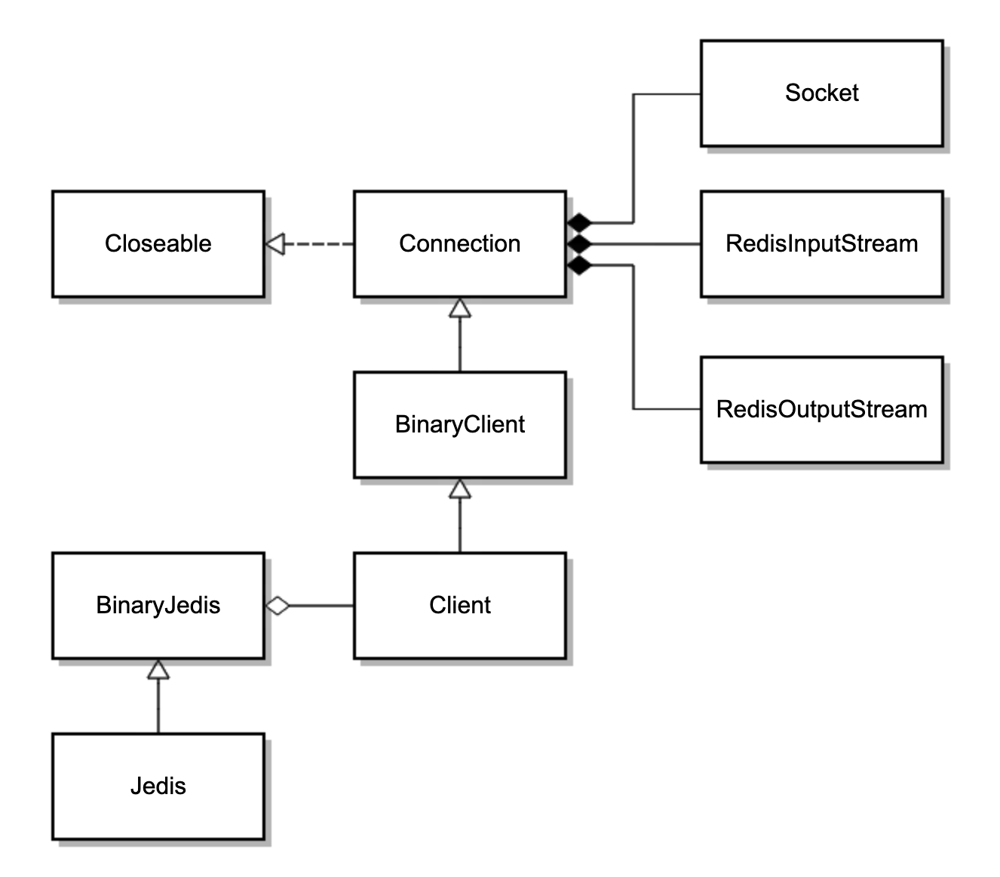

BinaryClient 封装了各种 Redis 命令，其最终会调用基类 Connection 的方法，使用 Protocol 类发送命令。看一下 Protocol 类的 sendCommand 方法的源码，可以发现其发送命令时是直接操作 RedisOutputStream 写入字节。

我们在多线程环境下复用 Jedis 对象，其实就是在复用 RedisOutputStream。如果多个线程在执行操作，那么既无法确保整条命令以一个原子操作写入 Socket，也无法确保写入后、读取前没有其他数据写到远端：

```
private static void sendCommand(final RedisOutputStream os, final byte[] command,

    final byte[]... args) {

  try {
    os.write(ASTERISK_BYTE);
    os.writeIntCrLf(args.length + 1);
    os.write(DOLLAR_BYTE);
    os.writeIntCrLf(command.length);
    os.write(command);
    os.writeCrLf();

    for (final byte[] arg : args) {
      os.write(DOLLAR_BYTE);
      os.writeIntCrLf(arg.length);
      os.write(arg);
      os.writeCrLf();
    }

  } catch (IOException e) {
    throw new JedisConnectionException(e);
  }

}
```

看到这里我们也可以理解了，为啥多线程情况下使用 Jedis 对象操作 Redis 会出现各种奇怪的问题。

比如，写操作互相干扰，多条命令相互穿插的话，必然不是合法的 Redis 命令，那么 Redis 会关闭客户端连接，导致连接断开；又比如，线程 1 和 2 先后写入了 get a 和 get b 操作的请求，Redis 也返回了值 1 和 2，但是线程 2 先读取了数据 1 就会出现数据错乱的问题。

修复方式是，使用 Jedis 提供的另一个线程安全的类 JedisPool 来获得 Jedis 的实例。JedisPool 可以声明为 static 在多个线程之间共享，扮演连接池的角色。使用时，按需使用 try-with-resources 模式从 JedisPool 获得和归还 Jedis 实例。

```
private static JedisPool jedisPool = new JedisPool("127.0.0.1", 6379);

new Thread(() -> {

    try (Jedis jedis = jedisPool.getResource()) {
        for (int i = 0; i < 1000; i++) {
            String result = jedis.get("a");
            if (!result.equals("1")) {
                log.warn("Expect a to be 1 but found {}", result);
                return;
            }
        }
    }

}).start();

new Thread(() -> {
    try (Jedis jedis = jedisPool.getResource()) {
        for (int i = 0; i < 1000; i++) {
            String result = jedis.get("b");
            if (!result.equals("2")) {
                log.warn("Expect b to be 2 but found {}", result);
                return;
            }
        }
    }

}).start();
```

这样修复后，代码不再有线程安全问题了。此外，我们最好通过 shutdownhook，在程序退出之前关闭 JedisPool：

```
@PostConstruct
public void init() {
    Runtime.getRuntime().addShutdownHook(new Thread(() -> {
        jedisPool.close();
    }));

}
```

看一下 Jedis 类 close 方法的实现可以发现，如果 Jedis 是从连接池获取的话，那么 close 方法会调用连接池的 return 方法归还连接：

```
public class Jedis extends BinaryJedis implements JedisCommands, MultiKeyCommands,
    AdvancedJedisCommands, ScriptingCommands, BasicCommands, ClusterCommands, SentinelCommands, ModuleCommands {
  protected JedisPoolAbstract dataSource = null;

  @Override
  public void close() {
    if (dataSource != null) {
      JedisPoolAbstract pool = this.dataSource;
      this.dataSource = null;
      if (client.isBroken()) {
        pool.returnBrokenResource(this);
      } else {
        pool.returnResource(this);
      }
    } else {
      super.close();
    }
  }
}
```

如果不是，则直接关闭连接，其最终调用 Connection 类的 disconnect 方法来关闭 TCP 连接：

```
public void disconnect() {

  if (isConnected()) {
    try {
      outputStream.flush();
      socket.close();
    } catch (IOException ex) {
      broken = true;
      throw new JedisConnectionException(ex);
    } finally {
      IOUtils.closeQuietly(socket);
    }
  }
}
```

可以看到，Jedis 可以独立使用，也可以配合连接池使用，这个连接池就是 JedisPool。我们再看看 JedisPool 的实现。

```
public class JedisPool extends JedisPoolAbstract {

@Override
  public Jedis getResource() {
    Jedis jedis = super.getResource();
    jedis.setDataSource(this);
    return jedis;
  }

  @Override
  protected void returnResource(final Jedis resource) {
    if (resource != null) {
      try {
        resource.resetState();
        returnResourceObject(resource);
      } catch (Exception e) {
        returnBrokenResource(resource);
        throw new JedisException("Resource is returned to the pool as broken", e);
      }
    }
  }
}

public class JedisPoolAbstract extends Pool<Jedis> {

}

public abstract class Pool<T> implements Closeable {
  protected GenericObjectPool<T> internalPool;
}
```

JedisPool 的 getResource 方法在拿到 Jedis 对象后，将自己设置为了连接池。连接池 JedisPool，继承了 JedisPoolAbstract，而后者继承了抽象类 Pool，Pool 内部维护了 Apache Common 的通用池 GenericObjectPool。JedisPool 的连接池就是基于 GenericObjectPool 的。

看到这里我们了解了，Jedis 的 API 实现是我们说的三种类型中的第一种，也就是连接池和连接分离的 API，JedisPool 是线程安全的连接池，Jedis 是非线程安全的单一连接。知道了原理之后，我们再使用 Jedis 就胸有成竹了。

## 使用连接池务必确保复用

在介绍线程池的时候我们强调过，池一定是用来复用的，否则其使用代价会比每次创建单一对象更大。对连接池来说更是如此，原因如下：

创建连接池的时候很可能一次性创建了多个连接，大多数连接池考虑到性能，会在初始化的时候维护一定数量的最小连接（毕竟初始化连接池的过程一般是一次性的），可以直接使用。如果每次使用连接池都按需创建连接池，那么很可能你只用到一个连接，但是创建了 N 个连接。

连接池一般会有一些管理模块，也就是连接池的结构示意图中的绿色部分。举个例子，大多数的连接池都有闲置超时的概念。连接池会检测连接的闲置时间，定期回收闲置的连接，把活跃连接数降到最低（闲置）连接的配置值，减轻服务端的压力。一般情况下，闲置连接由独立线程管理，启动了空闲检测的连接池相当于还会启动一个线程。此外，有些连接池还需要独立线程负责连接保活等功能。因此，启动一个连接池相当于启动了 N 个线程。

除了使用代价，连接池不释放，还可能会引起线程泄露。接下来，我就以 Apache HttpClient 为例，和你说说连接池不复用的问题。

首先，创建一个 CloseableHttpClient，设置使用 PoolingHttpClientConnectionManager 连接池并启用空闲连接驱逐策略，最大空闲时间为 60 秒，然后使用这个连接来请求一个会返回 OK 字符串的服务端接口：

```
@GetMapping("wrong1")
public String wrong1() {
    CloseableHttpClient client = HttpClients.custom()
            .setConnectionManager(new PoolingHttpClientConnectionManager())
            .evictIdleConnections(60, TimeUnit.SECONDS).build();
    try (CloseableHttpResponse response = client.execute(new HttpGet("http://127.0.0.1:45678/httpclientnotreuse/test"))) {
        return EntityUtils.toString(response.getEntity());
    } catch (Exception ex) {
        ex.printStackTrace();
    }
    return null;
}
```

访问这个接口几次后查看应用线程情况，可以看到有大量叫作 Connection evictor 的线程，且这些线程不会销毁：

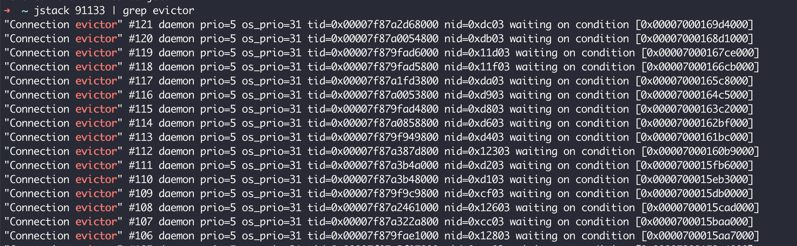

对这个接口进行几秒的压测（压测使用 wrk，1 个并发 1 个连接）可以看到，已经建立了三千多个 TCP 连接到 45678 端口（其中有 1 个是压测客户端到 Tomcat 的连接，大部分都是 HttpClient 到 Tomcat 的连接）：

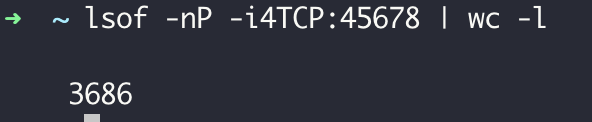

好在有了空闲连接回收的策略，60 秒之后连接处于 CLOSE_WAIT 状态，最终彻底关闭。

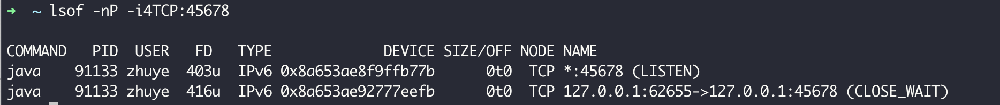

这 2 点证明，CloseableHttpClient 属于第二种模式，即内部带有连接池的 API，其背后是连接池，最佳实践一定是复用。

复用方式很简单，你可以把 CloseableHttpClient 声明为 static，只创建一次，并且在 JVM 关闭之前通过 addShutdownHook 钩子关闭连接池，在使用的时候直接使用 CloseableHttpClient 即可，无需每次都创建。

首先，定义一个 right 接口来实现服务端接口调用：

```
private static CloseableHttpClient httpClient = null;

static {
    //当然，也可以把CloseableHttpClient定义为Bean，然后在@PreDestroy标记的方法内close这个HttpClient
    httpClient = HttpClients.custom().setMaxConnPerRoute(1).setMaxConnTotal(1).evictIdleConnections(60, TimeUnit.SECONDS).build();

    Runtime.getRuntime().addShutdownHook(new Thread(() -> {
        try {
            httpClient.close();
        } catch (IOException ignored) {
        
        }
    }));

}

@GetMapping("right")
public String right() {
    try (CloseableHttpResponse response = httpClient.execute(new HttpGet("http://127.0.0.1:45678/httpclientnotreuse/test"))) {
        return EntityUtils.toString(response.getEntity());
    } catch (Exception ex) {
        ex.printStackTrace();
    }
    return null;
}
```

然后，重新定义一个 wrong2 接口，修复之前按需创建 CloseableHttpClient 的代码，每次用完之后确保连接池可以关闭：

```
@GetMapping("wrong2")
public String wrong2() {
    try (CloseableHttpClient client = HttpClients.custom()
            .setConnectionManager(new PoolingHttpClientConnectionManager())
            .evictIdleConnections(60, TimeUnit.SECONDS).build();
         CloseableHttpResponse response = client.execute(new HttpGet("http://127.0.0.1:45678/httpclientnotreuse/test"))) {
            return EntityUtils.toString(response.getEntity());
        } catch (Exception ex) {
        ex.printStackTrace();
    }
    return null;
}
```

使用 wrk 对 wrong2 和 right 两个接口分别压测 60 秒，可以看到两种使用方式性能上的差异，每次创建连接池的 QPS 是 337，而复用连接池的 QPS 是 2022：

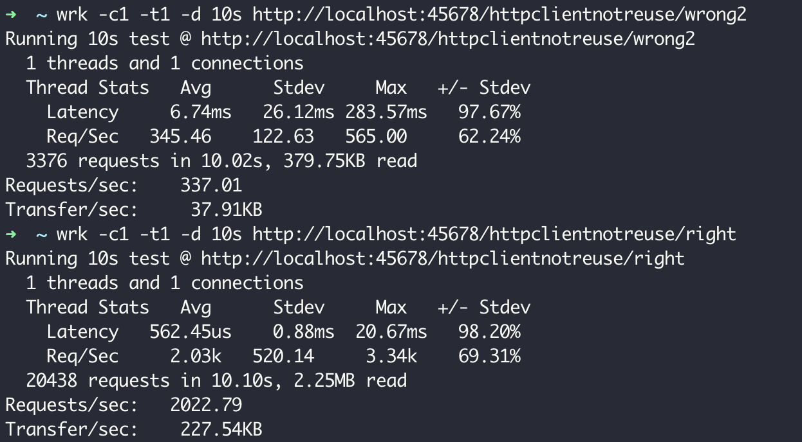

如此大的性能差异显然是因为 TCP 连接的复用。你可能注意到了，刚才定义连接池时，我将最大连接数设置为 1。所以，复用连接池方式复用的始终应该是同一个连接，而新建连接池方式应该是每次都会创建新的 TCP 连接。

接下来，我们通过网络抓包工具 Wireshark 来证实这一点。

如果调用 wrong2 接口每次创建新的连接池来发起 HTTP 请求，从 Wireshark 可以看到，每次请求服务端 45678 的客户端端口都是新的。这里我发起了三次请求，程序通过 HttpClient 访问服务端 45678 的客户端端口号，分别是 51677、51679 和 51681：

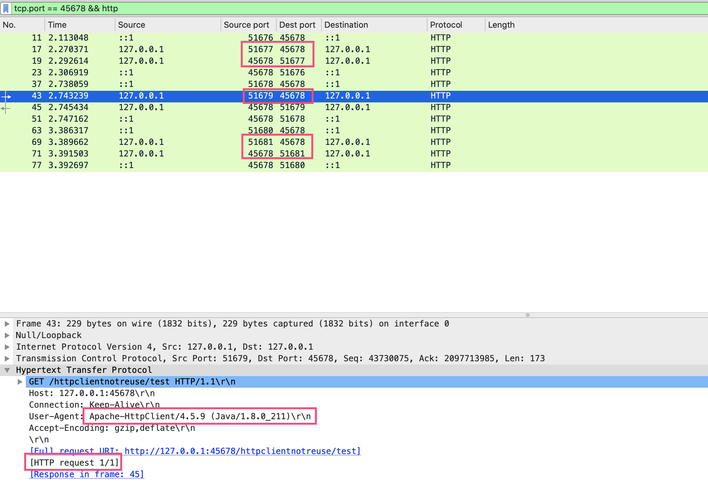

也就是说，每次都是新的 TCP 连接，放开 HTTP 这个过滤条件也可以看到完整的 TCP 握手、挥手的过程：

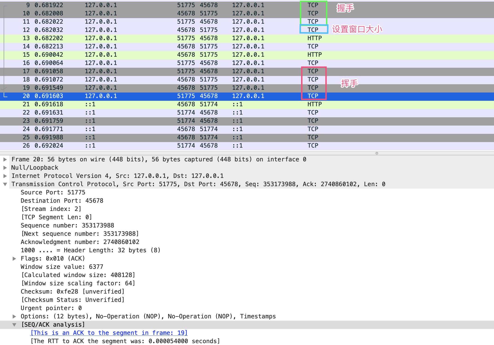

而复用连接池方式的接口 right 的表现就完全不同了。可以看到，第二次 HTTP 请求 #41 的客户端端口 61468 和第一次连接 #23 的端口是一样的，Wireshark 也提示了整个 TCP 会话中，当前 #41 请求是第二次请求，前一次是 #23，后面一次是 #75：

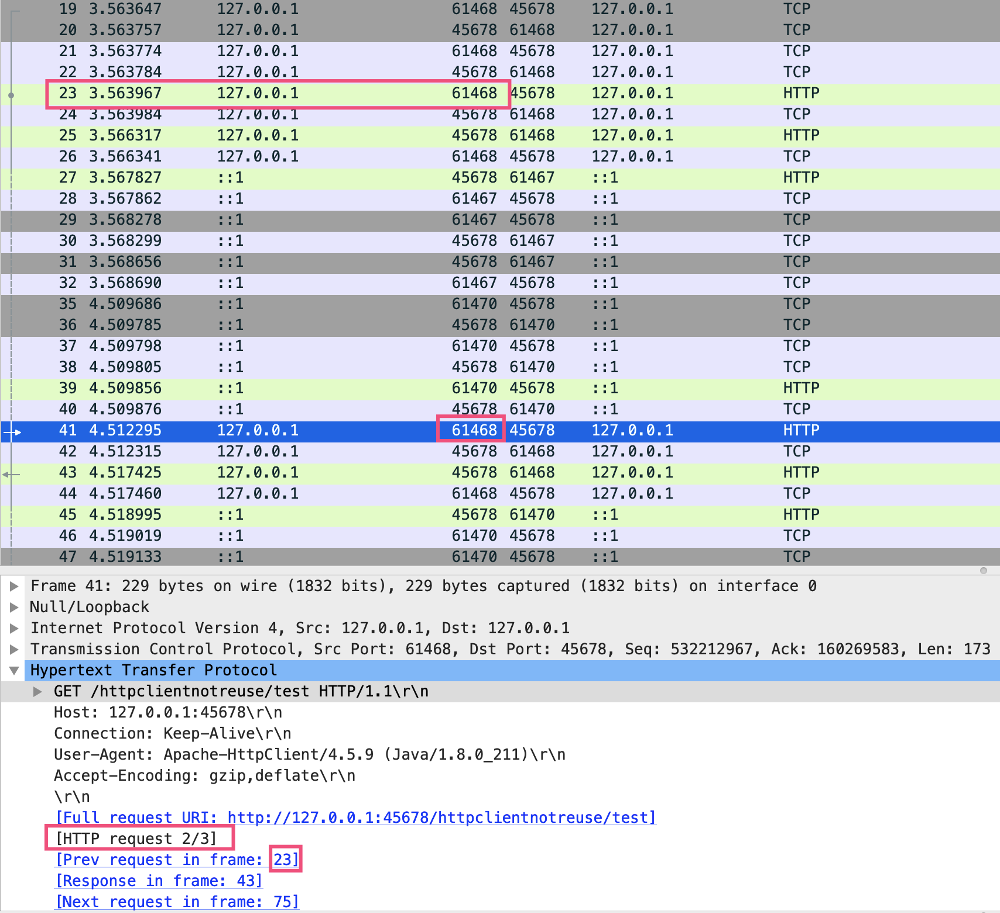

只有 TCP 连接闲置超过 60 秒后才会断开，连接池会新建连接。你可以尝试通过 Wireshark 观察这一过程。

接下来，我们就继续聊聊连接池的配置问题。

## 连接池的配置不是一成不变的

为方便根据容量规划设置连接处的属性，连接池提供了许多参数，包括最小（闲置）连接、最大连接、闲置连接生存时间、连接生存时间等。其中，最重要的参数是最大连接数，它决定了连接池能使用的连接数量上限，达到上限后，新来的请求需要等待其他请求释放连接。

但，最大连接数不是设置得越大越好。如果设置得太大，不仅仅是客户端需要耗费过多的资源维护连接，更重要的是由于服务端对应的是多个客户端，每一个客户端都保持大量的连接，会给服务端带来更大的压力。这个压力又不仅仅是内存压力，可以想一下如果服务端的网络模型是一个 TCP 连接一个线程，那么几千个连接意味着几千个线程，如此多的线程会造成大量的线程切换开销。

当然，连接池最大连接数设置得太小，很可能会因为获取连接的等待时间太长，导致吞吐量低下，甚至超时无法获取连接。

接下来，我们就模拟下压力增大导致数据库连接池打满的情况，来实践下如何确认连接池的使用情况，以及有针对性地进行参数优化。

首先，定义一个用户注册方法，通过 @Transactional 注解为方法开启事务。其中包含了 500 毫秒的休眠，一个数据库事务对应一个 TCP 连接，所以 500 多毫秒的时间都会占用数据库连接：

```
@Transactional

public User register(){
    User user=new User();
    user.setName("new-user-"+System.currentTimeMillis());
    userRepository.save(user);
    try {
        TimeUnit.MILLISECONDS.sleep(500);
    } catch (InterruptedException e) {
        e.printStackTrace();
    }
    return user;
}
```

随后，修改配置文件启用 register-mbeans，使 Hikari 连接池能通过 JMX MBean 注册连接池相关统计信息，方便观察连接池：

```
spring.datasource.hikari.register-mbeans=true
```

启动程序并通过 JConsole 连接进程后，可以看到默认情况下最大连接数为 10：

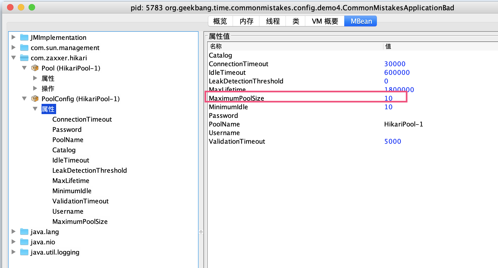

使用 wrk 对应用进行压测，可以看到连接数一下子从 0 到了 10，有 20 个线程在等待获取连接：

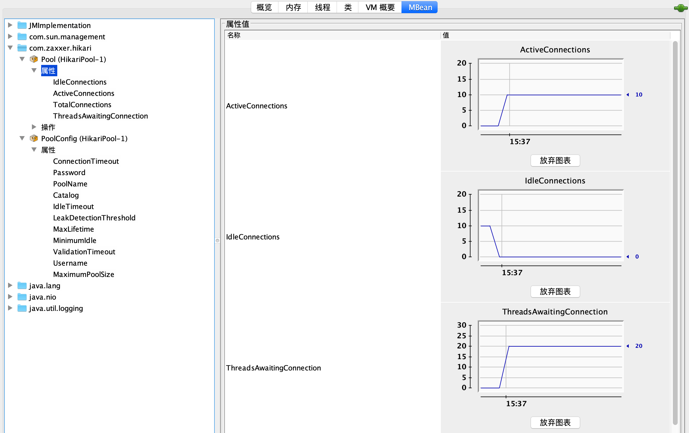

不久就出现了无法获取数据库连接的异常，如下所示：

```
[15:37:56.156] [http-nio-45678-exec-15] [ERROR] [.a.c.c.C.[.[.[/].[dispatcherServlet]:175 ] - Servlet.service() for servlet [dispatcherServlet] in context with path [] threw exception [Request processing failed; nested exception is org.springframework.dao.DataAccessResourceFailureException: unable to obtain isolated JDBC connection; nested exception is org.hibernate.exception.JDBCConnectionException: unable to obtain isolated JDBC connection] with root cause

java.sql.SQLTransientConnectionException: HikariPool-1 - Connection is not available, request timed out after 30000ms.
```

从异常信息中可以看到，数据库连接池是 HikariPool，解决方式很简单，修改一下配置文件，调整数据库连接池最大连接参数到 50 即可。

```
spring.datasource.hikari.maximum-pool-size=50
```

然后，再观察一下这个参数是否适合当前压力，满足需求的同时也不占用过多资源。从监控来看这个调整是合理的，有一半的富余资源，再也没有线程需要等待连接了：

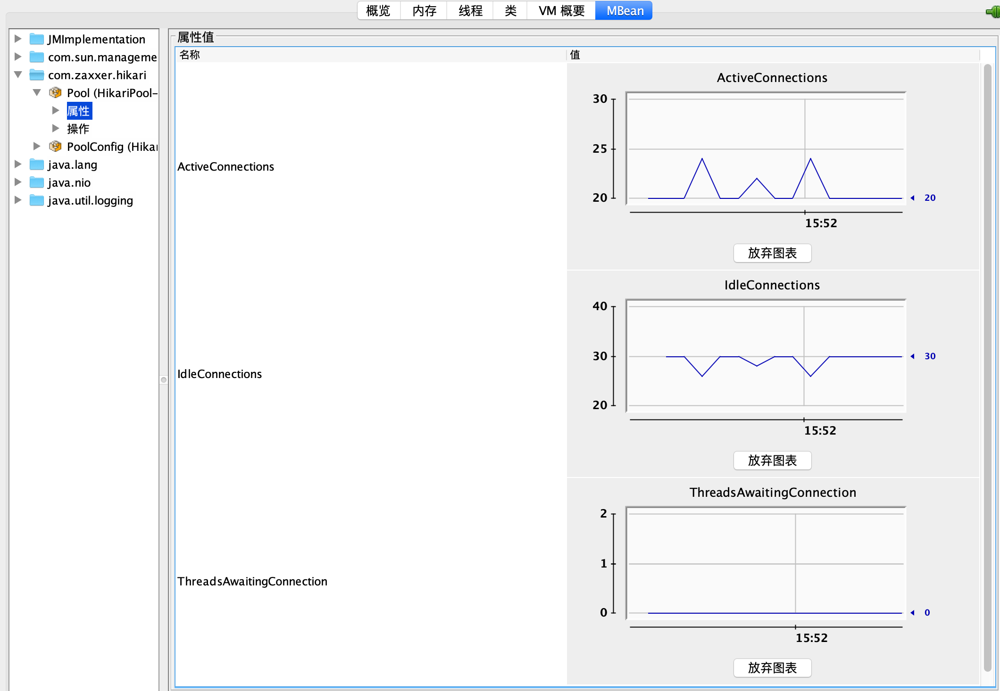

在这个 Demo 里，我知道压测大概能对应使用 25 左右的并发连接，所以直接把连接池最大连接设置为了 50。在真实情况下，只要数据库可以承受，你可以选择在遇到连接超限的时候先设置一个足够大的连接数，然后观察最终应用的并发，再按照实际并发数留出一半的余量来设置最终的最大连接。

其实，看到错误日志后再调整已经有点儿晚了。更合适的做法是，对类似数据库连接池的重要资源进行持续检测，并设置一半的使用量作为报警阈值，出现预警后及时扩容。

在这里我是为了演示，才通过 JConsole 查看参数配置后的效果，生产上需要把相关数据对接到指标监控体系中持续监测。

这里要强调的是，修改配置参数务必验证是否生效，并且在监控系统中确认参数是否生效、是否合理。之所以要“强调”，是因为这里有坑。

我之前就遇到过这样一个事故。应用准备针对大促活动进行扩容，把数据库配置文件中 Druid 连接池最大连接数 maxActive 从 50 提高到了 100，修改后并没有通过监控验证，结果大促当天应用因为连接池连接数不够爆了。

经排查发现，当时修改的连接数并没有生效。原因是，应用虽然一开始使用的是 Druid 连接池，但后来框架升级了，把连接池替换为了 Hikari 实现，原来的那些配置其实都是无效的，修改后的参数配置当然也不会生效。

所以说，对连接池进行调参，一定要眼见为实。

## 重点回顾

今天，我以三种业务代码最常用的 Redis 连接池、HTTP 连接池、数据库连接池为例，和你探讨了有关连接池实现方式、使用姿势和参数配置的三大问题。

客户端 SDK 实现连接池的方式，包括池和连接分离、内部带有连接池和非连接池三种。要正确使用连接池，就必须首先鉴别连接池的实现方式。比如，Jedis 的 API 实现的是池和连接分离的方式，而 Apache HttpClient 是内置连接池的 API。

对于使用姿势其实就是两点，一是确保连接池是复用的，二是尽可能在程序退出之前显式关闭连接池释放资源。连接池设计的初衷就是为了保持一定量的连接，这样连接可以随取随用。从连接池获取连接虽然很快，但连接池的初始化会比较慢，需要做一些管理模块的初始化以及初始最小闲置连接。一旦连接池不是复用的，那么其性能会比随时创建单一连接更差。

最后，连接池参数配置中，最重要的是最大连接数，许多高并发应用往往因为最大连接数不够导致性能问题。但，最大连接数不是设置得越大越好，够用就好。需要注意的是，针对数据库连接池、HTTP 连接池、Redis 连接池等重要连接池，务必建立完善的监控和报警机制，根据容量规划及时调整参数配置。

今天用到的代码，我都放在了 GitHub 上，你可以点击这个链接查看。

## 思考与讨论

有了连接池之后，获取连接是从连接池获取，没有足够连接时连接池会创建连接。这时，获取连接操作往往有两个超时时间：一个是从连接池获取连接的最长等待时间，通常叫作请求连接超时 connectRequestTimeout 或连接等待超时 connectWaitTimeout；一个是连接池新建 TCP 连接三次握手的连接超时，通常叫作连接超时 connectTimeout。针对 JedisPool、Apache HttpClient 和 Hikari 数据库连接池，你知道如何设置这 2 个参数吗？

对于带有连接池的 SDK 的使用姿势，最主要的是鉴别其内部是否实现了连接池，如果实现了连接池要尽量复用 Client。对于 NoSQL 中的 MongoDB 来说，使用 MongoDB Java 驱动时，MongoClient 类应该是每次都创建还是复用呢？你能否在官方文档中找到答案呢？
