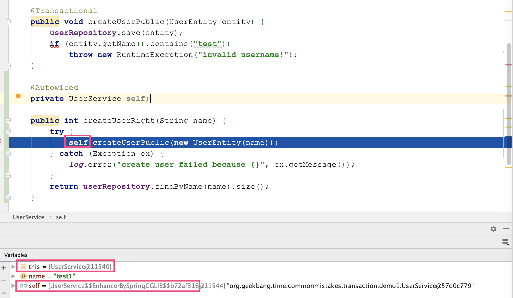
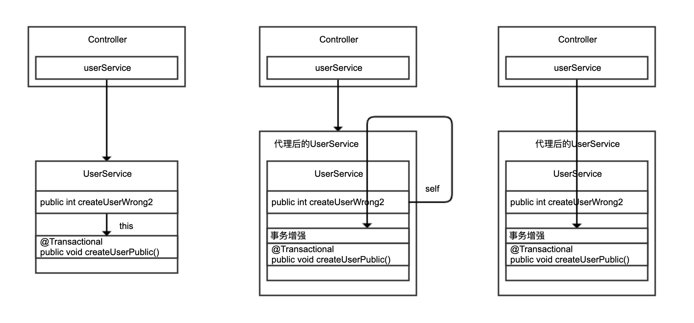
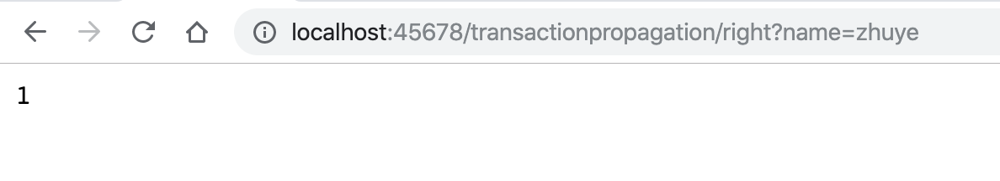

今天，我来和你聊聊业务代码中与数据库事务相关的坑。

**Spring** 针对 **Java** **Transaction API** (**JTA**)、**JDBC**、**Hibernate** 和 **Java Persistence API (JPA)** 等事务 **API**，实现了一致的编程模型，而 **Spring** 的声明式事务功能更是提供了极其方便的事务配置方式，配合 **Spring Boot** 的自动配置，大多数 **Spring Boot** 项目只需要在方法上标记 **@Transactional** 注解，即可一键开启方法的事务性配置。

据我观察，大多数业务开发同学都有事务的概念，也知道如果整体考虑多个数据库操作要么成功要么失败时，需要通过数据库事务来实现多个操作的一致性和原子性。但，在使用上大多仅限于为方法标记 **@Transactional**，不会去关注事务是否有效、出错后事务是否正确回滚，也不会考虑复杂的业务代码中涉及多个子业务逻辑时，怎么正确处理事务。

事务没有被正确处理，一般来说不会过于影响正常流程，也不容易在测试阶段被发现。但当系统越来越复杂、压力越来越大之后，就会带来大量的数据不一致问题，随后就是大量的人工介入查看和修复数据。

所以说，一个成熟的业务系统和一个基本可用能完成功能的业务系统，在事务处理细节上的差异非常大。要确保事务的配置符合业务功能的需求，往往不仅仅是技术问题，还涉及产品流程和架构设计的问题。今天这一讲的标题“ **20% 的业务代码的 Spring 声明式事务，可能都没处理正确** ”中，20% 这个数字在我看来还是比较保守的。

我今天要分享的内容，就是帮助你在技术问题上理清思路，避免因为事务处理不当让业务逻辑的实现产生大量偶发 Bug。

## 小心 Spring 的事务可能没有生效

在使用 **@Transactional** 注解开启声明式事务时， 第一个最容易忽略的问题是，很可能事务并没有生效。

实现下面的 **Demo** 需要一些基础类，首先定义一个具有 ID 和姓名属性的 **UserEntity**，也就是一个包含两个字段的用户表：

```
@Entity
@Data
public class UserEntity {

    @Id
    @GeneratedValue(strategy = AUTO)
    private Long id;

    private String name;

    public UserEntity() { }

    public UserEntity(String name) {
        this.name = name;
    }

}
```

为了方便理解，我使用 **Spring JPA** 做数据库访问，实现这样一个 **Repository**，新增一个根据用户名查询所有数据的方法：

```
@Repository
public interface UserRepository extends JpaRepository<UserEntity, Long> {
    List<UserEntity> findByName(String name);
}
```

定义一个 **UserService** 类，负责业务逻辑处理。如果不清楚 **@Transactional** 的实现方式，只考虑代码逻辑的话，这段代码看起来没有问题。

定义一个入口方法 **createUserWrong1** 来调用另一个私有方法 **createUserPrivate**，私有方法上标记了 **@Transactional** 注解。当传入的用户名包含 **test** 关键字时判断为用户名不合法，抛出异常，让用户创建操作失败，期望事务可以回滚：

```java
@Service
@Slf4j
public class UserService {

    @Autowired
    private UserRepository userRepository;

    //一个公共方法供Controller调用，内部调用事务性的私有方法

    public int createUserWrong1(String name) {
        try {
            this.createUserPrivate(new UserEntity(name));
        } catch (Exception ex) {
            log.error("create user failed because {}", ex.getMessage());
        }
        return userRepository.findByName(name).size();
    }

    //标记了@Transactional的private方法

    @Transactional
    private void createUserPrivate(UserEntity entity) {
        userRepository.save(entity);
        if (entity.getName().contains("test"))
            throw new RuntimeException("invalid username!");
    }

    //根据用户名查询用户数

    public int getUserCount(String name) {
        return userRepository.findByName(name).size();
    }

}
```

下面是 **Controller** 的实现，只是调用一下刚才定义的 **UserService** 中的入口方法 **createUserWrong1**。

```java
@Autowired
private UserService userService;

@GetMapping("wrong1")
public int wrong1(@RequestParam("name") String name) {
    return userService.createUserWrong1(name);

}
```

调用接口后发现，即便用户名不合法，用户也能创建成功。刷新浏览器，多次发现有十几个的非法用户注册。

这里给出 **@Transactional** 生效原则 1，除非特殊配置（比如使用 **AspectJ** 静态织入实现 **AOP**），否则只有定义在 **public** 方法上的 **@Transactional** 才能生效。原因是，**Spring** 默认通过动态代理的方式实现 **AOP**，对目标方法进行增强，**private** 方法无法代理到，**Spring** 自然也无法动态增强事务处理逻辑。

你可能会说，修复方式很简单，把标记了事务注解的 **createUserPrivate** 方法改为 **public** 即可。在 **UserService** 中再建一个入口方法 **createUserWrong2**，来调用这个 **public** 方法再次尝试：

```java
public int createUserWrong2(String name) {
    try {
        this.createUserPublic(new UserEntity(name));
    } catch (Exception ex) {
        log.error("create user failed because {}", ex.getMessage());
    }
  return userRepository.findByName(name).size();
}

//标记了@Transactional的public方法
@Transactional
public void createUserPublic(UserEntity entity) {
    userRepository.save(entity);
    if (entity.getName().contains("test"))
        throw new RuntimeException("invalid username!");
}
```

测试发现，调用新的 **createUserWrong2** 方法事务同样不生效。这里，我给出 **@Transactional** 生效原则 2，必须通过代理过的类从外部调用目标方法才能生效。

**Spring** 通过 AOP 技术对方法进行增强，要调用增强过的方法必然是调用代理后的对象。我们尝试修改下 **UserService** 的代码，注入一个 **self**，然后再通过 self 实例调用标记有 **@Transactional** 注解的 **createUserPublic** 方法。设置断点可以看到，**self** 是由 Spring 通过 **CGLIB** 方式增强过的类：

**CGLIB** 通过继承方式实现代理类，**private** 方法在子类不可见，自然也就无法进行事务增强；

this 指针代表对象自己，Spring 不可能注入 this，所以通过 this 访问方法必然不是代理。



把 this 改为 self 后测试发现，在 Controller 中调用 createUserRight 方法可以验证事务是生效的，非法的用户注册操作可以回滚。

虽然在 UserService 内部注入自己调用自己的 createUserPublic 可以正确实现事务，但更合理的实现方式是，让 Controller 直接调用之前定义的 UserService 的 createUserPublic 方法，因为注入自己调用自己很奇怪，也不符合分层实现的规范：

```
@GetMapping("right2")
public int right2(@RequestParam("name") String name) {
    try {
        userService.createUserPublic(new UserEntity(name));
    } catch (Exception ex) {
        log.error("create user failed because {}", ex.getMessage());
    }
    return userService.getUserCount(name);
}
```

我们再通过一张图来回顾下 this 自调用、通过 self 调用，以及在 Controller 中调用 UserService 三种实现的区别：



通过 this 自调用，没有机会走到 Spring 的代理类；后两种改进方案调用的是 Spring 注入的 UserService，通过代理调用才有机会对 createUserPublic 方法进行动态增强。

这里，我还有一个小技巧，强烈建议你在开发时打开相关的 Debug 日志，以方便了解 Spring 事务实现的细节，并及时判断事务的执行情况。

我们的 Demo 代码使用 JPA 进行数据库访问，可以这么开启 Debug 日志：

```
logging.level.org.springframework.orm.jpa=DEBUG
```

开启日志后，我们再比较下在 UserService 中通过 this 调用和在 Controller 中通过注入的 UserService Bean 调用 createUserPublic 区别。很明显，this 调用因为没有走代理，事务没有在 createUserPublic 方法上生效，只在 Repository 的 save 方法层面生效：

```
//在UserService中通过this调用public的createUserPublic

[10:10:19.913] [http-nio-45678-exec-1] [DEBUG] [o.s.orm.jpa.JpaTransactionManager       :370 ] - Creating new transaction with name [org.springframework.data.jpa.repository.support.SimpleJpaRepository.save]: PROPAGATION_REQUIRED,ISOLATION_DEFAULT

//在Controller中通过注入的UserService Bean调用createUserPublic

[10:10:47.750] [http-nio-45678-exec-6] [DEBUG] [o.s.orm.jpa.JpaTransactionManager       :370 ] - Creating new transaction with name [org.geekbang.time.commonmistakes.transaction.demo1.UserService.createUserPublic]: PROPAGATION_REQUIRED,ISOLATION_DEFAULT
```

你可能还会考虑一个问题，这种实现在 Controller 里处理了异常显得有点繁琐，还不如直接把 createUserWrong2 方法加上 @Transactional 注解，然后在 Controller 中直接调用这个方法。这样一来，既能从外部（Controller 中）调用 UserService 中的方法，方法又是 public 的能够被动态代理 AOP 增强。

你可以试一下这种方法，但很容易就会踩第二个坑，即因为没有正确处理异常，导致事务即便生效也不一定能回滚。

## 事务即便生效也不一定能回滚

通过 AOP 实现事务处理可以理解为，使用 try…catch…来包裹标记了 @Transactional 注解的方法，当方法出现了异常并且满足一定条件的时候，在 catch 里面我们可以设置事务回滚，没有异常则直接提交事务。

这里的“一定条件”，主要包括两点。

第一，只有异常传播出了标记了 @Transactional 注解的方法，事务才能回滚。在 Spring 的 TransactionAspectSupport 里有个 invokeWithinTransaction 方法，里面就是处理事务的逻辑。可以看到，只有捕获到异常才能进行后续事务处理：

```
try {
   // This is an around advice: Invoke the next interceptor in the chain.
   // This will normally result in a target object being invoked.
   retVal = invocation.proceedWithInvocation();
}

catch (Throwable ex) {
   // target invocation exception
   completeTransactionAfterThrowing(txInfo, ex);
   throw ex;
}

finally {
   cleanupTransactionInfo(txInfo);
}
```

第二，默认情况下，出现 RuntimeException（非受检异常）或 Error 的时候，Spring 才会回滚事务。

打开 Spring 的 DefaultTransactionAttribute 类能看到如下代码块，可以发现相关证据，通过注释也能看到 Spring 这么做的原因，大概的意思是受检异常一般是业务异常，或者说是类似另一种方法的返回值，出现这样的异常可能业务还能完成，所以不会主动回滚；而 Error 或 RuntimeException 代表了非预期的结果，应该回滚：

```
/**
 * The default behavior is as with EJB: rollback on unchecked exception
 * ({@link RuntimeException}), assuming an unexpected outcome outside of any
 * business rules. Additionally, we also attempt to rollback on {@link Error} which
 * is clearly an unexpected outcome as well. By contrast, a checked exception is
 * considered a business exception and therefore a regular expected outcome of the
 * transactional business method, i.e. a kind of alternative return value which
 * still allows for regular completion of resource operations.
 * <p>This is largely consistent with TransactionTemplate's default behavior,
 * except that TransactionTemplate also rolls back on undeclared checked exceptions
 * (a corner case). For declarative transactions, we expect checked exceptions to be
 * intentionally declared as business exceptions, leading to a commit by default.
 * @see org.springframework.transaction.support.TransactionTemplate#execute
 */
@Override
public boolean rollbackOn(Throwable ex) {

   return (ex instanceof RuntimeException || ex instanceof Error);

}
```

接下来，我和你分享 2 个反例。

重新实现一下 UserService 中的注册用户操作：

在 createUserWrong1 方法中会抛出一个 RuntimeException，但由于方法内 catch 了所有异常，异常无法从方法传播出去，事务自然无法回滚。

在 createUserWrong2 方法中，注册用户的同时会有一次 otherTask 文件读取操作，如果文件读取失败，我们希望用户注册的数据库操作回滚。虽然这里没有捕获异常，但因为 otherTask 方法抛出的是受检异常，createUserWrong2 传播出去的也是受检异常，事务同样不会回滚。

```
@Service
@Slf4j
public class UserService {

    @Autowired
    private UserRepository userRepository;

    //异常无法传播出方法，导致事务无法回滚

    @Transactional
    public void createUserWrong1(String name) {
        try {
            userRepository.save(new UserEntity(name));
            throw new RuntimeException("error");
        } catch (Exception ex) {
            log.error("create user failed", ex);
        }
    }

    //即使出了受检异常也无法让事务回滚
    @Transactional
    public void createUserWrong2(String name) throws IOException {
        userRepository.save(new UserEntity(name));
        otherTask();
    }

    //因为文件不存在，一定会抛出一个IOException
    private void otherTask() throws IOException {
        Files.readAllLines(Paths.get("file-that-not-exist"));
    }

}
```

Controller 中的实现，仅仅是调用 UserService 的 createUserWrong1 和 createUserWrong2 方法，这里就贴出实现了。这 2 个方法的实现和调用，虽然完全避开了事务不生效的坑，但因为异常处理不当，导致程序没有如我们期望的文件操作出现异常时回滚事务。

现在，我们来看下修复方式，以及如何通过日志来验证是否修复成功。针对这 2 种情况，对应的修复方法如下。

第一，如果你希望自己捕获异常进行处理的话，也没关系，可以手动设置让当前事务处于回滚状态：

```
@Transactional
public void createUserRight1(String name) {
    try {
        userRepository.save(new UserEntity(name));
        throw new RuntimeException("error");
    } catch (Exception ex) {
        log.error("create user failed", ex);
        TransactionAspectSupport.currentTransactionStatus().setRollbackOnly();
    }

}
```

运行后可以在日志中看到 Rolling back 字样，确认事务回滚了。同时，我们还注意到“Transactional code has requested rollback”的提示，表明手动请求回滚：

```
[22:14:49.352] [http-nio-45678-exec-4] [DEBUG] [o.s.orm.jpa.JpaTransactionManager       :698 ] - Transactional code has requested rollback

[22:14:49.353] [http-nio-45678-exec-4] [DEBUG] [o.s.orm.jpa.JpaTransactionManager       :834 ] - Initiating transaction rollback

[22:14:49.353] [http-nio-45678-exec-4] [DEBUG] [o.s.orm.jpa.JpaTransactionManager       :555 ] - Rolling back JPA transaction on EntityManager [SessionImpl(1906719643<open>)]
```

第二，在注解中声明，期望遇到所有的 Exception 都回滚事务（来突破默认不回滚受检异常的限制）：

```
@Transactional(rollbackFor = Exception.class)
public void createUserRight2(String name) throws IOException {
    userRepository.save(new UserEntity(name));
    otherTask();
}
```

运行后，同样可以在日志中看到回滚的提示：

```
[22:10:47.980] [http-nio-45678-exec-4] [DEBUG] [o.s.orm.jpa.JpaTransactionManager       :834 ] - Initiating transaction rollback

[22:10:47.981] [http-nio-45678-exec-4] [DEBUG] [o.s.orm.jpa.JpaTransactionManager       :555 ] - Rolling back JPA transaction on EntityManager [SessionImpl(1419329213<open>)]
```

在这个例子中，我们展现的是一个复杂的业务逻辑，其中有数据库操作、IO 操作，在 IO 操作出现问题时希望让数据库事务也回滚，以确保逻辑的一致性。在有些业务逻辑中，可能会包含多次数据库操作，我们不一定希望将两次操作作为一个事务来处理，这时候就需要仔细考虑事务传播的配置了，否则也可能踩坑。

## 请确认事务传播配置是否符合自己的业务逻辑

有这么一个场景：一个用户注册的操作，会插入一个主用户到用户表，还会注册一个关联的子用户。我们希望将子用户注册的数据库操作作为一个独立事务来处理，即使失败也不会影响主流程，即不影响主用户的注册。

接下来，我们模拟一个实现类似业务逻辑的 UserService：

```
@Autowired
private UserRepository userRepository;

@Autowired
private SubUserService subUserService;

@Transactional
public void createUserWrong(UserEntity entity) {

    createMainUser(entity);
    subUserService.createSubUserWithExceptionWrong(entity);

}

private void createMainUser(UserEntity entity) {
    userRepository.save(entity);
    log.info("createMainUser finish");

}
```

SubUserService 的 createSubUserWithExceptionWrong 实现正如其名，因为最后我们抛出了一个运行时异常，错误原因是用户状态无效，所以子用户的注册肯定是失败的。我们期望子用户的注册作为一个事务单独回滚，不影响主用户的注册，这样的逻辑可以实现吗？

```
@Service
@Slf4j
public class SubUserService {

    @Autowired
    private UserRepository userRepository;

    @Transactional
    public void createSubUserWithExceptionWrong(UserEntity entity) {
        log.info("createSubUserWithExceptionWrong start");
        userRepository.save(entity);
        throw new RuntimeException("invalid status");
    }
}
```

我们在 Controller 里实现一段测试代码，调用 UserService：

```
@GetMapping("wrong")
public int wrong(@RequestParam("name") String name) {

    try {
        userService.createUserWrong(new UserEntity(name));
    } catch (Exception ex) {
        log.error("createUserWrong failed, reason:{}", ex.getMessage());
    }

    return userService.getUserCount(name);

}
```

调用后可以在日志中发现如下信息，很明显事务回滚了，最后 Controller 打出了创建子用户抛出的运行时异常：

```
[22:50:42.866] [http-nio-45678-exec-8] [DEBUG] [o.s.orm.jpa.JpaTransactionManager       :555 ] - Rolling back JPA transaction on EntityManager [SessionImpl(103972212<open>)]

[22:50:42.869] [http-nio-45678-exec-8] [DEBUG] [o.s.orm.jpa.JpaTransactionManager       :620 ] - Closing JPA EntityManager [SessionImpl(103972212<open>)] after transaction

[22:50:42.869] [http-nio-45678-exec-8] [ERROR] [t.d.TransactionPropagationController:23  ] - createUserWrong failed, reason:invalid status
```

你马上就会意识到，不对呀，因为运行时异常逃出了 @Transactional 注解标记的 createUserWrong 方法，Spring 当然会回滚事务了。如果我们希望主方法不回滚，应该把子方法抛出的异常捕获了。

也就是这么改，把 subUserService.createSubUserWithExceptionWrong 包裹上 catch，这样外层主方法就不会出现异常了：

```
@Transactional
public void createUserWrong2(UserEntity entity) {

    createMainUser(entity);
    try{
        subUserService.createSubUserWithExceptionWrong(entity);
    } catch (Exception ex) {
        // 虽然捕获了异常，但是因为没有开启新事务，而当前事务因为异常已经被标记为rollback了，所以最终还是会回滚。
        log.error("create sub user error:{}", ex.getMessage());
    }

}
```

运行程序后可以看到如下日志：

```
[22:57:21.722] [http-nio-45678-exec-3] [DEBUG] [o.s.orm.jpa.JpaTransactionManager       :370 ] - Creating new transaction with name [org.geekbang.time.commonmistakes.transaction.demo3.UserService.createUserWrong2]: PROPAGATION_REQUIRED,ISOLATION_DEFAULT

[22:57:21.739] [http-nio-45678-exec-3] [INFO ] [t.c.transaction.demo3.SubUserService:19  ] - createSubUserWithExceptionWrong start

[22:57:21.739] [http-nio-45678-exec-3] [DEBUG] [o.s.orm.jpa.JpaTransactionManager       :356 ] - Found thread-bound EntityManager [SessionImpl(1794007607<open>)] for JPA transaction

[22:57:21.739] [http-nio-45678-exec-3] [DEBUG] [o.s.orm.jpa.JpaTransactionManager       :471 ] - Participating in existing transaction

[22:57:21.740] [http-nio-45678-exec-3] [DEBUG] [o.s.orm.jpa.JpaTransactionManager       :843 ] - Participating transaction failed - marking existing transaction as rollback-only

[22:57:21.740] [http-nio-45678-exec-3] [DEBUG] [o.s.orm.jpa.JpaTransactionManager       :580 ] - Setting JPA transaction on EntityManager [SessionImpl(1794007607<open>)] rollback-only

[22:57:21.740] [http-nio-45678-exec-3] [ERROR] [.g.t.c.transaction.demo3.UserService:37  ] - create sub user error:invalid status

[22:57:21.740] [http-nio-45678-exec-3] [DEBUG] [o.s.orm.jpa.JpaTransactionManager       :741 ] - Initiating transaction commit

[22:57:21.740] [http-nio-45678-exec-3] [DEBUG] [o.s.orm.jpa.JpaTransactionManager       :529 ] - Committing JPA transaction on EntityManager [SessionImpl(1794007607<open>)]

[22:57:21.743] [http-nio-45678-exec-3] [DEBUG] [o.s.orm.jpa.JpaTransactionManager       :620 ] - Closing JPA EntityManager [SessionImpl(1794007607<open>)] after transaction

[22:57:21.743] [http-nio-45678-exec-3] [ERROR] [t.d.TransactionPropagationController:33  ] - createUserWrong2 failed, reason:Transaction silently rolled back because it has been marked as rollback-only

org.springframework.transaction.UnexpectedRollbackException: Transaction silently rolled back because it has been marked as rollback-only

...
```

需要注意以下几点：

如第 1 行所示，对 createUserWrong2 方法开启了异常处理；

如第 5 行所示，子方法因为出现了运行时异常，标记当前事务为回滚；

如第 7 行所示，主方法的确捕获了异常打印出了 create sub user error 字样；

如第 9 行所示，主方法提交了事务；

奇怪的是，如第 11 行和 12 行所示，Controller 里出现了一个 UnexpectedRollbackException，异常描述提示最终这个事务回滚了，而且是静默回滚的。之所以说是静默，是因为 createUserWrong2 方法本身并没有出异常，只不过提交后发现子方法已经把当前事务设置为了回滚，无法完成提交。

这挺反直觉的。我们之前说，出了异常事务不一定回滚，这里说的却是不出异常，事务也不一定可以提交。原因是，主方法注册主用户的逻辑和子方法注册子用户的逻辑是同一个事务，子逻辑标记了事务需要回滚，主逻辑自然也不能提交了。

看到这里，修复方式就很明确了，想办法让子逻辑在独立事务中运行，也就是改一下 SubUserService 注册子用户的方法，为注解加上 propagation = Propagation.REQUIRES_NEW 来设置 REQUIRES_NEW 方式的事务传播策略，也就是执行到这个方法时需要开启新的事务，并挂起当前事务：

```
@Transactional(propagation = Propagation.REQUIRES_NEW)
public void createSubUserWithExceptionRight(UserEntity entity) {
    log.info("createSubUserWithExceptionRight start");
    userRepository.save(entity);
    throw new RuntimeException("invalid status");

}
```

主方法没什么变化，同样需要捕获异常，防止异常漏出去导致主事务回滚，重新命名为 createUserRight：

```
@Transactional
public void createUserRight(UserEntity entity) {
    createMainUser(entity);
    try{
        subUserService.createSubUserWithExceptionRight(entity);
    } catch (Exception ex) {
        // 捕获异常，防止主方法回滚
        log.error("create sub user error:{}", ex.getMessage());
    }
}
```

改造后，重新运行程序可以看到如下的关键日志：

第 1 行日志提示我们针对 createUserRight 方法开启了主方法的事务；

第 2 行日志提示创建主用户完成；

第 3 行日志可以看到主事务挂起了，开启了一个新的事务，针对 createSubUserWithExceptionRight 方案，也就是我们的创建子用户的逻辑；

第 4 行日志提示子方法事务回滚；

第 5 行日志提示子方法事务完成，继续主方法之前挂起的事务；

第 6 行日志提示主方法捕获到了子方法的异常；

第 8 行日志提示主方法的事务提交了，随后我们在 Controller 里没看到静默回滚的异常。

```
[23:17:20.935] [http-nio-45678-exec-1] [DEBUG] [o.s.orm.jpa.JpaTransactionManager       :370 ] - Creating new transaction with name [org.geekbang.time.commonmistakes.transaction.demo3.UserService.createUserRight]: PROPAGATION_REQUIRED,ISOLATION_DEFAULT

[23:17:21.079] [http-nio-45678-exec-1] [INFO ] [.g.t.c.transaction.demo3.UserService:55  ] - createMainUser finish

[23:17:21.082] [http-nio-45678-exec-1] [DEBUG] [o.s.orm.jpa.JpaTransactionManager       :420 ] - Suspending current transaction, creating new transaction with name [org.geekbang.time.commonmistakes.transaction.demo3.SubUserService.createSubUserWithExceptionRight]

[23:17:21.153] [http-nio-45678-exec-1] [DEBUG] [o.s.orm.jpa.JpaTransactionManager       :834 ] - Initiating transaction rollback

[23:17:21.160] [http-nio-45678-exec-1] [DEBUG] [o.s.orm.jpa.JpaTransactionManager       :1009] - Resuming suspended transaction after completion of inner transaction

[23:17:21.161] [http-nio-45678-exec-1] [ERROR] [.g.t.c.transaction.demo3.UserService:49  ] - create sub user error:invalid status

[23:17:21.161] [http-nio-45678-exec-1] [DEBUG] [o.s.orm.jpa.JpaTransactionManager       :741 ] - Initiating transaction commit

[23:17:21.161] [http-nio-45678-exec-1] [DEBUG] [o.s.orm.jpa.JpaTransactionManager       :529 ] - Committing JPA transaction on EntityManager [SessionImpl(396441411<open>)]
```

运行测试程序看到如下结果，getUserCount 得到的用户数量为 1，代表只有一个用户也就是主用户注册完成了，符合预期：



## 重点回顾

今天，我针对业务代码中最常见的使用数据库事务的方式，即 Spring 声明式事务，与你总结了使用上可能遇到的三类坑，包括：

第一，因为配置不正确，导致方法上的事务没生效。我们务必确认调用 @Transactional 注解标记的方法是 public 的，并且是通过 Spring 注入的 Bean 进行调用的。

第二，因为异常处理不正确，导致事务虽然生效但出现异常时没回滚。Spring 默认只会对标记 @Transactional 注解的方法出现了 RuntimeException 和 Error 的时候回滚，如果我们的方法捕获了异常，那么需要通过手动编码处理事务回滚。如果希望 Spring 针对其他异常也可以回滚，那么可以相应配置 @Transactional 注解的 rollbackFor 和 noRollbackFor 属性来覆盖其默认设置。

第三，如果方法涉及多次数据库操作，并希望将它们作为独立的事务进行提交或回滚，那么我们需要考虑进一步细化配置事务传播方式，也就是 @Transactional 注解的 Propagation 属性。

可见，正确配置事务可以提高业务项目的健壮性。但，又因为健壮性问题往往体现在异常情况或一些细节处理上，很难在主流程的运行和测试中发现，导致业务代码的事务处理逻辑往往容易被忽略，因此我在代码审查环节一直很关注事务是否正确处理。

如果你无法确认事务是否真正生效，是否按照预期的逻辑进行，可以尝试打开 Spring 的部分 Debug 日志，通过事务的运作细节来验证。也建议你在单元测试时尽量覆盖多的异常场景，这样在重构时，也能及时发现因为方法的调用方式、异常处理逻辑的调整，导致的事务失效问题。

今天用到的代码，我都放在了 GitHub 上，你可以点击这个链接查看。

## 思考与讨论

考虑到 Demo 的简洁，文中所有数据访问使用的都是 Spring Data JPA。国内大多数互联网业务项目是使用 MyBatis 进行数据访问的，使用 MyBatis 配合 Spring 的声明式事务也同样需要注意文中提到的这些点。你可以尝试把今天的 Demo 改为 MyBatis 做数据访问实现，看看日志中是否可以体现出这些坑。

在第一节中我们提到，如果要针对 private 方法启用事务，动态代理方式的 AOP 不可行，需要使用静态织入方式的 AOP，也就是在编译期间织入事务增强代码，可以配置 Spring 框架使用 AspectJ 来实现 AOP。你能否参阅 Spring 的文档“Using @Transactional with AspectJ”试试呢？注意：AspectJ 配合 lombok 使用，还可能会踩一些坑。