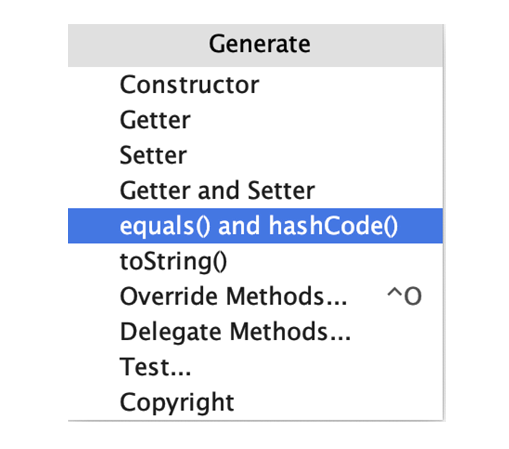
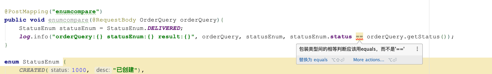

今天，我来和你聊聊程序里的判等问题。

你可能会说，判等不就是一行代码的事情吗，有什么好说的。但，这一行代码如果处理不当，不仅会出现 Bug，还可能会引起内存泄露等问题。涉及判等的 Bug，即使是使用 == 这种错误的判等方式，也不是所有时候都会出问题。所以类似的判等问题不太容易发现，可能会被隐藏很久。

今天，我就 equals、compareTo 和 Java 的数值缓存、字符串驻留等问题展开讨论，希望你可以理解其原理，彻底消除业务代码中的相关 Bug。

## 注意 equals 和 == 的区别

在业务代码中，我们通常使用 equals 或 == 进行判等操作。equals 是方法而 == 是操作符，它们的使用是有区别的：

对基本类型，比如 int、long，进行判等，只能使用 ==，比较的是直接值。因为基本类型的值就是其数值。

对引用类型，比如 Integer、Long 和 String，进行判等，需要使用 equals 进行内容判等。因为引用类型的直接值是指针，使用 == 的话，比较的是指针，也就是两个对象在内存中的地址，即比较它们是不是同一个对象，而不是比较对象的内容。

这就引出了我们必须必须要知道的第一个结论：比较值的内容，除了基本类型只能使用 == 外，其他类型都需要使用 equals。

在开篇我提到了，即使使用 == 对 Integer 或 String 进行判等，有些时候也能得到正确结果。这又是为什么呢？

我们用下面的测试用例深入研究下：

使用 == 对两个值为 127 的直接赋值的 Integer 对象判等；

使用 == 对两个值为 128 的直接赋值的 Integer 对象判等；

使用 == 对一个值为 127 的直接赋值的 Integer 和另一个通过 new Integer 声明的值为 127 的对象判等；

使用 == 对两个通过 new Integer 声明的值为 127 的对象判等；

使用 == 对一个值为 128 的直接赋值的 Integer 对象和另一个值为 128 的 int 基本类型判等。

```java
Integer a = 127; //Integer.valueOf(127)
Integer b = 127; //Integer.valueOf(127)
log.info("\nInteger a = 127;\n" +
        "Integer b = 127;\n" +
        "a == b ? {}",a == b);    // true
Integer c = 128; //Integer.valueOf(128)
Integer d = 128; //Integer.valueOf(128)
log.info("\nInteger c = 128;\n" +
        "Integer d = 128;\n" +
        "c == d ? {}", c == d);   //false
Integer e = 127; //Integer.valueOf(127)
Integer f = new Integer(127); //new instance
log.info("\nInteger e = 127;\n" +
        "Integer f = new Integer(127);\n" +
        "e == f ? {}", e == f);   //false
Integer g = new Integer(127); //new instance
Integer h = new Integer(127); //new instance
log.info("\nInteger g = new Integer(127);\n" +
        "Integer h = new Integer(127);\n" +
        "g == h ? {}", g == h);  //false
Integer i = 128; //unbox
int j = 128;

log.info("\nInteger i = 128;\n" +
        "int j = 128;\n" +
        "i == j ? {}", i == j); //true
```

通过运行结果可以看到，虽然看起来永远是在对 127 和 127、128 和 128 判等，但 == 却没有永远给我们 true 的答复。原因是什么呢？

第一个案例中，编译器会把 Integer a = 127 转换为 Integer.valueOf(127)。查看源码可以发现，这个转换在内部其实做了缓存，使得两个 Integer 指向同一个对象，所以 == 返回 true。

```java
public static Integer valueOf(int i) {

    if (i >= IntegerCache.low && i <= IntegerCache.high)
        return IntegerCache.cache[i + (-IntegerCache.low)];
    return new Integer(i);
}
```

第二个案例中，之所以同样的代码 128 就返回 false 的原因是，默认情况下会缓存[-128, 127]的数值，而 128 处于这个区间之外。设置 JVM 参数加上 -XX:AutoBoxCacheMax=1000 再试试，是不是就返回 true 了呢？

```java
private static class IntegerCache {

    static final int low = -128;
    static final int high;

    static {
        // high value may be configured by property
        int h = 127;
        String integerCacheHighPropValue =
            sun.misc.VM.getSavedProperty("java.lang.Integer.IntegerCache.high");
        if (integerCacheHighPropValue != null) {
            try {
                int i = parseInt(integerCacheHighPropValue);
                i = Math.max(i, 127);
                // Maximum array size is Integer.MAX_VALUE
                h = Math.min(i, Integer.MAX_VALUE - (-low) -1);
            } catch( NumberFormatException nfe) {
                // If the property cannot be parsed into an int, ignore it.
            }
        }
        high = h;

        cache = new Integer[(high - low) + 1];
        int j = low;
        for(int k = 0; k < cache.length; k++)
            cache[k] = new Integer(j++);

        // range [-128, 127] must be interned (JLS7 5.1.7)
        assert IntegerCache.high >= 127;
    }
}
```

第三和第四个案例中，New 出来的 Integer 始终是不走缓存的新对象。比较两个新对象，或者比较一个新对象和一个来自缓存的对象，结果肯定不是相同的对象，因此返回 false。

第五个案例中，我们把装箱的 Integer 和基本类型 int 比较，前者会先拆箱再比较，比较的肯定是数值而不是引用，因此返回 true。

看到这里，对于 Integer 什么时候是相同对象什么时候是不同对象，就很清楚了吧。但知道这些其实意义不大，因为在大多数时候，我们并不关心 Integer 对象是否是同一个，只需要记得比较 Integer 的值请使用 equals，而不是 ==（对于基本类型 int 的比较当然只能使用 ==）。

其实，我们应该都知道这个原则，只是有的时候特别容易忽略。以我之前遇到过的一个生产事故为例，有这么一个枚举定义了订单状态和对于状态的描述：

```java
enum StatusEnum {

    CREATED(1000, "已创建"),
    PAID(1001, "已支付"),
    DELIVERED(1002, "已送到"),
    FINISHED(1003, "已完成");

    private final Integer status; //注意这里的Integer

    private final String desc;

    StatusEnum(Integer status, String desc) {
        this.status = status;
        this.desc = desc;
    }
}
```

在业务代码中，开发同学使用了 == 对枚举和入参 OrderQuery 中的 status 属性进行判等：

```java
@Data
public class OrderQuery {

    private Integer status;
    private String name;

}

@PostMapping("enumcompare")
public void enumcompare(@RequestBody OrderQuery orderQuery){

    StatusEnum statusEnum = StatusEnum.DELIVERED;

    log.info("orderQuery:{} statusEnum:{} result:{}", orderQuery, statusEnum, statusEnum.status == orderQuery.getStatus());

}
```

因为枚举和入参 OrderQuery 中的 status 都是包装类型，所以通过 == 判等肯定是有问题的。只是这个问题比较隐晦，究其原因在于：

只看枚举的定义 CREATED(1000, “已创建”)，容易让人误解 status 值是基本类型；

因为有 Integer 缓存机制的存在，所以使用 == 判等并不是所有情况下都有问题。在这次事故中，订单状态的值从 100 开始增长，程序一开始不出问题，直到订单状态超过 127 后才出现 Bug。

在了解清楚为什么 Integer 使用 == 判等有时候也有效的原因之后，我们再来看看为什么 String 也有这个问题。我们使用几个用例来测试下：

对两个直接声明的值都为 1 的 String 使用 == 判等；

对两个 new 出来的值都为 2 的 String 使用 == 判等；

对两个 new 出来的值都为 3 的 String 先进行 intern 操作，再使用 == 判等；

对两个 new 出来的值都为 4 的 String 通过 equals 判等。

```java
String a = "1";
String b = "1";
log.info("\nString a = \"1\";\n" +
        "String b = \"1\";\n" +
        "a == b ? {}", a == b); //true

String c = new String("2");
String d = new String("2");

log.info("\nString c = new String(\"2\");\n" +
        "String d = new String(\"2\");" +
        "c == d ? {}", c == d); //false

String e = new String("3").intern();
String f = new String("3").intern();
log.info("\nString e = new String(\"3\").intern();\n" +
        "String f = new String(\"3\").intern();\n" +
        "e == f ? {}", e == f); //true

String g = new String("4");
String h = new String("4");
log.info("\nString g = new String(\"4\");\n" +
        "String h = new String(\"4\");\n" +
        "g == h ? {}", g.equals(h)); //true
```

在分析这个结果之前，我先和你说说 Java 的字符串常量池机制。首先要明确的是其设计初衷是节省内存。当代码中出现双引号形式创建字符串对象时，JVM 会先对这个字符串进行检查，如果字符串常量池中存在相同内容的字符串对象的引用，则将这个引用返回；否则，创建新的字符串对象，然后将这个引用放入字符串常量池，并返回该引用。这种机制，就是字符串驻留或池化。

再回到刚才的例子，再来分析一下运行结果：

第一个案例返回 true，因为 Java 的字符串驻留机制，直接使用双引号声明出来的两个 String 对象指向常量池中的相同字符串。

第二个案例，new 出来的两个 String 是不同对象，引用当然不同，所以得到 false 的结果。

第三个案例，使用 String 提供的 intern 方法也会走常量池机制，所以同样能得到 true。

第四个案例，通过 equals 对值内容判等，是正确的处理方式，当然会得到 true。

虽然使用 new 声明的字符串调用 intern 方法，也可以让字符串进行驻留，但在业务代码中滥用 intern，可能会产生性能问题。

写代码测试一下，通过循环把 1 到 1000 万之间的数字以字符串形式 intern 后，存入一个 List：

```java
List<String> list = new ArrayList<>();

@GetMapping("internperformance")
public int internperformance(@RequestParam(value = "size", defaultValue = "10000000")int size) {

    //-XX:+PrintStringTableStatistics
    //-XX:StringTableSize=10000000
    long begin = System.currentTimeMillis();
    list = IntStream.rangeClosed(1, size)
            .mapToObj(i-> String.valueOf(i).intern())
            .collect(Collectors.toList());

    log.info("size:{} took:{}", size, System.currentTimeMillis() - begin);
    return list.size();
}
```

在启动程序时设置 JVM 参数 -XX:+PrintStringTableStatistic，程序退出时可以打印出字符串常量表的统计信息。调用接口后关闭程序，输出如下：

```java
[11:01:57.770] [http-nio-45678-exec-2] [INFO ] [.t.c.e.d.IntAndStringEqualController:54  ] - size:10000000 took:44907
StringTable statistics:
Number of buckets       :     60013 =    480104 bytes, avg   8.000
Number of entries       :  10030230 = 240725520 bytes, avg  24.000
Number of literals      :  10030230 = 563005568 bytes, avg  56.131
Total footprint         :           = 804211192 bytes
Average bucket size     :   167.134
Variance of bucket size :    55.808
Std. dev. of bucket size:     7.471
Maximum bucket size     :       198
```

可以看到，1000 万次 intern 操作耗时居然超过了 44 秒。

其实，原因在于字符串常量池是一个固定容量的 Map。如果容量太小（Number of buckets=60013）、字符串太多（1000 万个字符串），那么每一个桶中的字符串数量会非常多，所以搜索起来就很慢。输出结果中的 Average bucket size=167，代表了 Map 中桶的平均长度是 167。

解决方式是，设置 JVM 参数 -XX:StringTableSize，指定更多的桶。设置 -XX:StringTableSize=10000000 后，重启应用：

```java
[11:09:04.475] [http-nio-45678-exec-1] [INFO ] [.t.c.e.d.IntAndStringEqualController:54  ] - size:10000000 took:5557
StringTable statistics:
Number of buckets       :  10000000 =  80000000 bytes, avg   8.000
Number of entries       :  10030156 = 240723744 bytes, avg  24.000
Number of literals      :  10030156 = 562999472 bytes, avg  56.131
Total footprint         :           = 883723216 bytes
Average bucket size     :     1.003
Variance of bucket size :     1.587
Std. dev. of bucket size:     1.260
Maximum bucket size     :        10
```

可以看到，1000 万次调用耗时只有 5.5 秒，Average bucket size 降到了 1，效果明显。

好了，是时候给出第二原则了：没事别轻易用 intern，如果要用一定要注意控制驻留的字符串的数量，并留意常量表的各项指标。

## 实现一个 equals 没有这么简单

如果看过 Object 类源码，你可能就知道，equals 的实现其实是比较对象引用：

```java
public boolean equals(Object obj) {
    return (this == obj);
}
```

之所以 Integer 或 String 能通过 equals 实现内容判等，是因为它们都重写了这个方法。比如，String 的 equals 的实现：

```java
public boolean equals(Object anObject) {

    if (this == anObject) {
        return true;
    }

    if (anObject instanceof String) {
        String anotherString = (String)anObject;
        int n = value.length;
        if (n == anotherString.value.length) {
            char v1[] = value;
            char v2[] = anotherString.value;
            int i = 0;
            while (n-- != 0) {
                if (v1[i] != v2[i])
                    return false;
                i++;
            }
            return true;
        }
    }
    return false;
}
```

对于自定义类型，如果不重写 equals 的话，默认就是使用 Object 基类的按引用的比较方式。我们写一个自定义类测试一下。

假设有这样一个描述点的类 Point，有 x、y 和描述三个属性：

```java
class Point {

    private int x;
    private int y;
    private final String desc;

    public Point(int x, int y, String desc) {
        this.x = x;
        this.y = y;
        this.desc = desc;
    }
}
```

定义三个点 p1、p2 和 p3，其中 p1 和 p2 的描述属性不同，p1 和 p3 的三个属性完全相同，并写一段代码测试一下默认行为：

```java
Point p1 = new Point(1, 2, "a");
Point p2 = new Point(1, 2, "b");
Point p3 = new Point(1, 2, "a");

log.info("p1.equals(p2) ? {}", p1.equals(p2));
log.info("p1.equals(p3) ? {}", p1.equals(p3));
```

通过 equals 方法比较 p1 和 p2、p1 和 p3 均得到 false，原因正如刚才所说，我们并没有为 Point 类实现自定义的 equals 方法，Object 超类中的 equals 默认使用 == 判等，比较的是对象的引用。

我们期望的逻辑是，只要 x 和 y 这 2 个属性一致就代表是同一个点，所以写出了如下的改进代码，重写 equals 方法，把参数中的 Object 转换为 Point 比较其 x 和 y 属性：

```java
class PointWrong {

    private int x;
    private int y;

    private final String desc;

    public PointWrong(int x, int y, String desc) {
        this.x = x;
        this.y = y;
        this.desc = desc;
    }

    @Override
    public boolean equals(Object o) {
        PointWrong that = (PointWrong) o;
        return x == that.x && y == that.y;
    }
}
```

为测试改进后的 Point 是否可以满足需求，我们定义了三个用例：

比较一个 Point 对象和 null；

比较一个 Object 对象和一个 Point 对象；

比较两个 x 和 y 属性值相同的 Point 对象。

```java
PointWrong p1 = new PointWrong(1, 2, "a");
try {
    log.info("p1.equals(null) ? {}", p1.equals(null));
} catch (Exception ex) {
    log.error(ex.getMessage());
}

Object o = new Object();

try {
    log.info("p1.equals(expression) ? {}", p1.equals(o));
} catch (Exception ex) {
    log.error(ex.getMessage());
}

PointWrong p2 = new PointWrong(1, 2, "b");
log.info("p1.equals(p2) ? {}", p1.equals(p2));
```

通过日志中的结果可以看到，第一次比较出现了空指针异常，第二次比较出现了类型转换异常，第三次比较符合预期输出了 true。

```log
[17:54:39.120] [http-nio-45678-exec-1] [ERROR] [t.c.e.demo1.EqualityMethodController:32  ] - java.lang.NullPointerException
[17:54:39.120] [http-nio-45678-exec-1] [ERROR] [t.c.e.demo1.EqualityMethodController:39  ] - java.lang.ClassCastException: java.lang.Object cannot be cast to org.geekbang.time.commonmistakes.equals.demo1.EqualityMethodController$PointWrong
[17:54:39.120] [http-nio-45678-exec-1] [INFO ] [t.c.e.demo1.EqualityMethodController:43  ] - p1.equals(p2) ? true
```

通过这些失效的用例，我们大概可以总结出实现一个更好的 equals 应该注意的点：

考虑到性能，可以先进行指针判等，如果对象是同一个那么直接返回 true；

需要对另一方进行判空，空对象和自身进行比较，结果一定是 fasle；

需要判断两个对象的类型，如果类型都不同，那么直接返回 false；

确保类型相同的情况下再进行类型强制转换，然后逐一判断所有字段。

修复和改进后的 equals 方法如下：

```java
@Override
public boolean equals(Object o) {

    if (this == o) return true;
    if (o == null || getClass() != o.getClass()) return false;
    PointRight that = (PointRight) o;
    return x == that.x && y == that.y;
}
```

改进后的 equals 看起来完美了，但还没完。我们继续往下看。

## hashCode 和 equals 要配对实现

我们来试试下面这个用例，定义两个 x 和 y 属性值完全一致的 Point 对象 p1 和 p2，把 p1 加入 HashSet，然后判断这个 Set 中是否存在 p2：

```java
PointWrong p1 = new PointWrong(1, 2, "a");
PointWrong p2 = new PointWrong(1, 2, "b");

HashSet<PointWrong> points = new HashSet<>();
points.add(p1);
log.info("points.contains(p2) ? {}", points.contains(p2));
```

按照改进后的 equals 方法，这 2 个对象可以认为是同一个，Set 中已经存在了 p1 就应该包含 p2，但结果却是 false。

出现这个 Bug 的原因是，散列表需要使用 hashCode 来定位元素放到哪个桶。如果自定义对象没有实现自定义的 hashCode 方法，就会使用 Object 超类的默认实现，得到的两个 hashCode 是不同的，导致无法满足需求。

要自定义 hashCode，我们可以直接使用 Objects.hash 方法来实现，改进后的 Point 类如下：

```java
class PointRight {

    private final int x;
    private final int y;
    private final String desc;

    ...

    @Override
    public boolean equals(Object o) {
        ...
    }

    @Override
    public int hashCode() {
        return Objects.hash(x, y);
    }
}
```

改进 equals 和 hashCode 后，再测试下之前的四个用例，结果全部符合预期。

```log
[18:25:23.091] [http-nio-45678-exec-4] [INFO ] [t.c.e.demo1.EqualityMethodController:54  ] - p1.equals(null) ? false
[18:25:23.093] [http-nio-45678-exec-4] [INFO ] [t.c.e.demo1.EqualityMethodController:61  ] - p1.equals(expression) ? false
[18:25:23.094] [http-nio-45678-exec-4] [INFO ] [t.c.e.demo1.EqualityMethodController:67  ] - p1.equals(p2) ? true
[18:25:23.094] [http-nio-45678-exec-4] [INFO ] [t.c.e.demo1.EqualityMethodController:71  ] - points.contains(p2) ? true
```

看到这里，你可能会觉得自己实现 equals 和 hashCode 很麻烦，实现 equals 有很多注意点而且代码量很大。不过，实现这两个方法也有简单的方式，一是后面要讲到的 Lombok 方法，二是使用 IDE 的代码生成功能。IDEA 的类代码快捷生成菜单支持的功能如下：



## 注意 compareTo 和 equals 的逻辑一致性

除了自定义类型需要确保 equals 和 hashCode 要逻辑一致外，还有一个更容易被忽略的问题，即 compareTo 同样需要和 equals 确保逻辑一致性。

我之前遇到过这么一个问题，代码里本来使用了 ArrayList 的 indexOf 方法进行元素搜索，但是一位好心的开发同学觉得逐一比较的时间复杂度是 O(n)，效率太低了，于是改为了排序后通过 Collections.binarySearch 方法进行搜索，实现了 O(log n) 的时间复杂度。没想到，这么一改却出现了 Bug。

我们来重现下这个问题。首先，定义一个 Student 类，有 id 和 name 两个属性，并实现了一个 Comparable 接口来返回两个 id 的值：

```java
@Data
@AllArgsConstructor
class Student implements Comparable<Student>{

    private int id;
    private String name;
    
    @Override
    public int compareTo(Student other) {

        int result = Integer.compare(other.id, id);
        if (result==0)
            log.info("this {} == other {}", this, other);
        return result;
    }
}
```

然后，写一段测试代码分别通过 indexOf 方法和 Collections.binarySearch 方法进行搜索。列表中我们存放了两个学生，第一个学生 id 是 1 叫 zhang，第二个学生 id 是 2 叫 wang，搜索这个列表是否存在一个 id 是 2 叫 li 的学生：

```java
@GetMapping("wrong")
public void wrong(){

    List<Student> list = new ArrayList<>();
    list.add(new Student(1, "zhang"));
    list.add(new Student(2, "wang"));
    
    Student student = new Student(2, "li");
    log.info("ArrayList.indexOf");
    
    int index1 = list.indexOf(student);
    Collections.sort(list);
    log.info("Collections.binarySearch");
    
    int index2 = Collections.binarySearch(list, student);
    log.info("index1 = " + index1);
    log.info("index2 = " + index2);
}
```

代码输出的日志如下：

```log
[18:46:50.226] [http-nio-45678-exec-1] [INFO ] [t.c.equals.demo2.CompareToController:28  ] - ArrayList.indexOf
[18:46:50.226] [http-nio-45678-exec-1] [INFO ] [t.c.equals.demo2.CompareToController:31  ] - Collections.binarySearch
[18:46:50.227] [http-nio-45678-exec-1] [INFO ] [t.c.equals.demo2.CompareToController:67  ] - this CompareToController.Student(id=2, name=wang) == other CompareToController.Student(id=2, name=li)
[18:46:50.227] [http-nio-45678-exec-1] [INFO ] [t.c.equals.demo2.CompareToController:34  ] - index1 = -1
[18:46:50.227] [http-nio-45678-exec-1] [INFO ] [t.c.equals.demo2.CompareToController:35  ] - index2 = 1
```

我们注意到如下几点：

binarySearch 方法内部调用了元素的 compareTo 方法进行比较；

indexOf 的结果没问题，列表中搜索不到 id 为 2、name 是 li 的学生；

binarySearch 返回了索引 1，代表搜索到的结果是 id 为 2，name 是 wang 的学生。

修复方式很简单，确保 compareTo 的比较逻辑和 equals 的实现一致即可。重新实现一下 Student 类，通过 Comparator.comparing 这个便捷的方法来实现两个字段的比较：

```java
@Data
@AllArgsConstructor
class StudentRight implements Comparable<StudentRight>{

    private int id;
    private String name;

    @Override
    public int compareTo(StudentRight other) {
        return Comparator.comparing(StudentRight::getName)
                .thenComparingInt(StudentRight::getId)
                .compare(this, other);
    }
}
```

其实，这个问题容易被忽略的原因在于两方面：

一是，我们使用了 Lombok 的 @Data 标记了 Student，@Data 注解（详见这里）其实包含了 @EqualsAndHashCode 注解（详见这里）的作用，也就是默认情况下使用类型所有的字段（不包括 static 和 transient 字段）参与到 equals 和 hashCode 方法的实现中。因为这两个方法的实现不是我们自己实现的，所以容易忽略其逻辑。

二是，compareTo 方法需要返回数值，作为排序的依据，容易让人使用数值类型的字段随意实现。

我再强调下，对于自定义的类型，如果要实现 Comparable，请记得 equals、hashCode、compareTo 三者逻辑一致。

## 小心 Lombok 生成代码的“坑”

Lombok 的 @Data 注解会帮我们实现 equals 和 hashcode 方法，但是有继承关系时，Lombok 自动生成的方法可能就不是我们期望的了。

我们先来研究一下其实现：定义一个 Person 类型，包含姓名和身份证两个字段：

```java
@Data
class Person {

    private String name;
    private String identity;

    public Person(String name, String identity) {
        this.name = name;
        this.identity = identity;
    }
}
```

对于身份证相同、姓名不同的两个 Person 对象：

```java
Person person1 = new Person("zhuye","001");
Person person2 = new Person("Joseph","001");
log.info("person1.equals(person2) ? {}", person1.equals(person2));
```

使用 equals 判等会得到 false。如果你希望只要身份证一致就认为是同一个人的话，可以使用 @EqualsAndHashCode.Exclude 注解来修饰 name 字段，从 equals 和 hashCode 的实现中排除 name 字段：

```java
@EqualsAndHashCode.Exclude
private String name;
```

修改后得到 true。打开编译后的代码可以看到，Lombok 为 Person 生成的 equals 方法的实现，确实只包含了 identity 属性：

```java
public boolean equals(final Object o) {

    if (o == this) {
        return true;
    } else if (!(o instanceof LombokEquealsController.Person)) {
        return false;
    } else {
        LombokEquealsController.Person other = (LombokEquealsController.Person)o;
        if (!other.canEqual(this)) {
            return false;
        } else {
            Object this$identity = this.getIdentity();
            Object other$identity = other.getIdentity();
            if (this$identity == null) {
                if (other$identity != null) {
                    return false;
                }
            } else if (!this$identity.equals(other$identity)) {
                return false;
            }
            return true;
        }
    }
}
```

但到这里还没完，如果类型之间有继承，Lombok 会怎么处理子类的 equals 和 hashCode 呢？我们来测试一下，写一个 Employee 类继承 Person，并新定义一个公司属性：

```java
@Data
class Employee extends Person {

    private String company;

    public Employee(String name, String identity, String company) {
        super(name, identity);
        this.company = company;
    }
}
```

在如下的测试代码中，声明两个 Employee 实例，它们具有相同的公司名称，但姓名和身份证均不同：

```java
Employee employee1 = new Employee("zhuye","001", "bkjk.com");
Employee employee2 = new Employee("Joseph","002", "bkjk.com");

log.info("employee1.equals(employee2) ? {}", employee1.equals(employee2));  
```

很遗憾，结果是 true，显然是没有考虑父类的属性，而认为这两个员工是同一人，说明 @EqualsAndHashCode 默认实现没有使用父类属性。

为解决这个问题，我们可以手动设置 callSuper 开关为 true，来覆盖这种默认行为：

```java
@Data
@EqualsAndHashCode(callSuper = true)
class Employee extends Person {
```

修改后的代码，实现了同时以子类的属性 company 加上父类中的属性 identity，作为 equals 和 hashCode 方法的实现条件（实现上其实是调用了父类的 equals 和 hashCode）。

## 重点回顾

现在，我们来回顾下对象判等和比较的重点内容吧。

首先，我们要注意 equals 和 == 的区别。业务代码中进行内容的比较，针对基本类型只能使用 ==，针对 Integer、String 在内的引用类型，需要使用 equals。Integer 和 String 的坑在于，使用 == 判等有时也能获得正确结果。

其次，对于自定义类型，如果类型需要参与判等，那么务必同时实现 equals 和 hashCode 方法，并确保逻辑一致。如果希望快速实现 equals、hashCode 方法，我们可以借助 IDE 的代码生成功能，或使用 Lombok 来生成。如果类型也要参与比较，那么 compareTo 方法的逻辑同样需要和 equals、hashCode 方法一致。

最后，Lombok 的 @EqualsAndHashCode 注解实现 equals 和 hashCode 的时候，默认使用类型所有非 static、非 transient 的字段，且不考虑父类。如果希望改变这种默认行为，可以使用 @EqualsAndHashCode.Exclude 排除一些字段，并设置 callSuper = true 来让子类的 equals 和 hashCode 调用父类的相应方法。

在比较枚举值和 POJO 参数值的例子中，我们还可以注意到，使用 == 来判断两个包装类型的低级错误，确实容易被忽略。所以，我建议你在 IDE 中安装阿里巴巴的 Java 规约插件（详见这里），来及时提示我们这类低级错误：



今天用到的代码，我都放在了 GitHub 上，你可以点击这个链接查看。

## 思考与讨论

在实现 equals 时，我是先通过 getClass 方法判断两个对象的类型，你可能会想到还可以使用 instanceof 来判断。你能说说这两种实现方式的区别吗？

在第三节的例子中，我演示了可以通过 HashSet 的 contains 方法判断元素是否在 HashSet 中，同样是 Set 的 TreeSet 其 contains 方法和 HashSet 有什么区别吗？

有关对象判等、比较，你还遇到过其他坑吗？