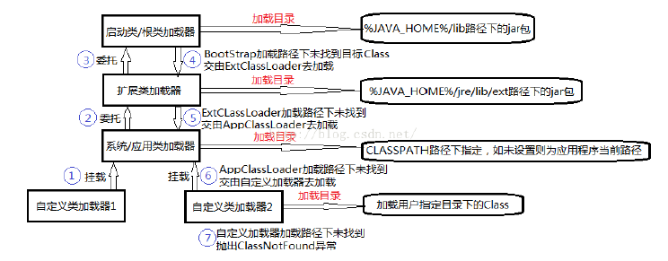
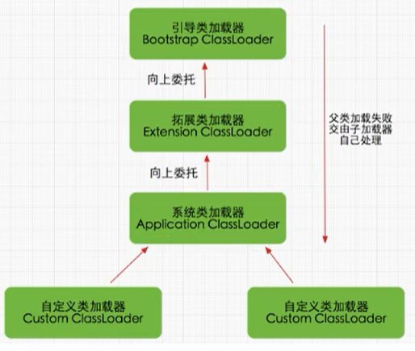
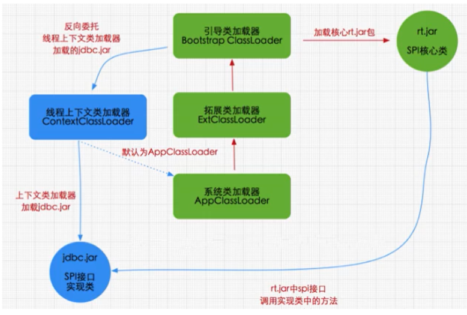
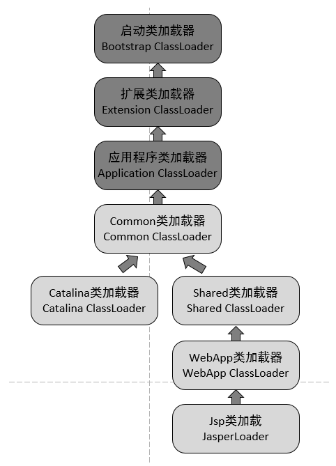
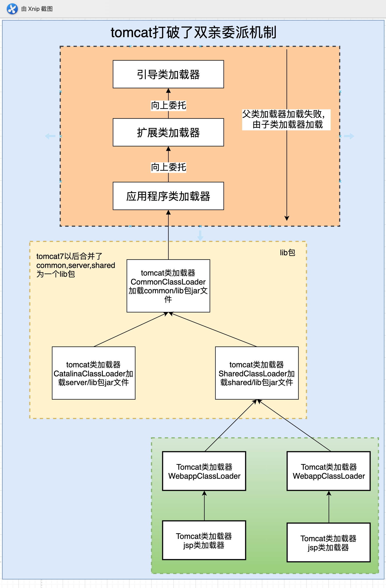
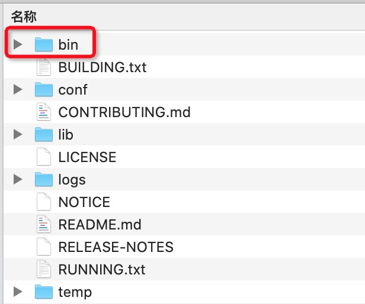
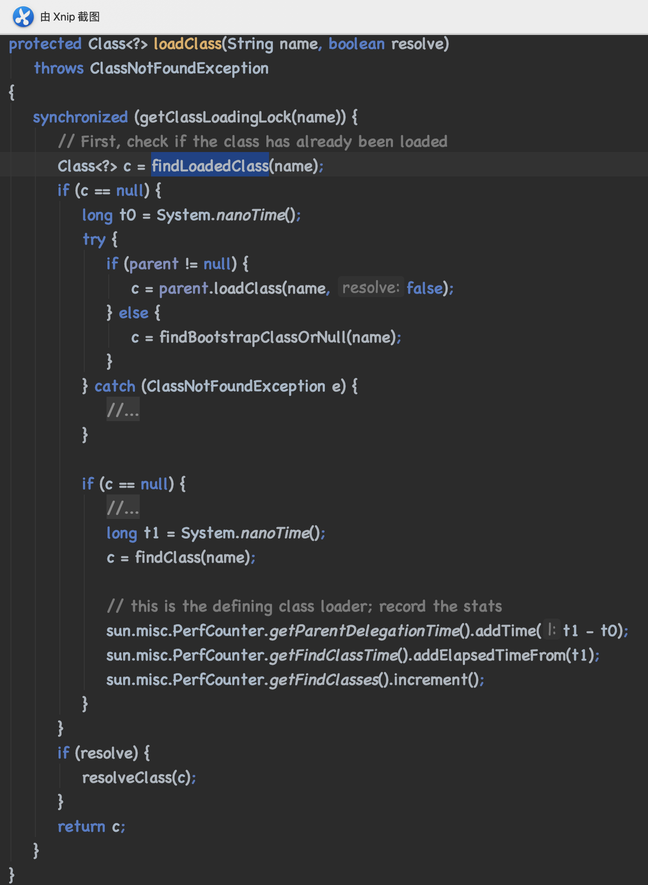
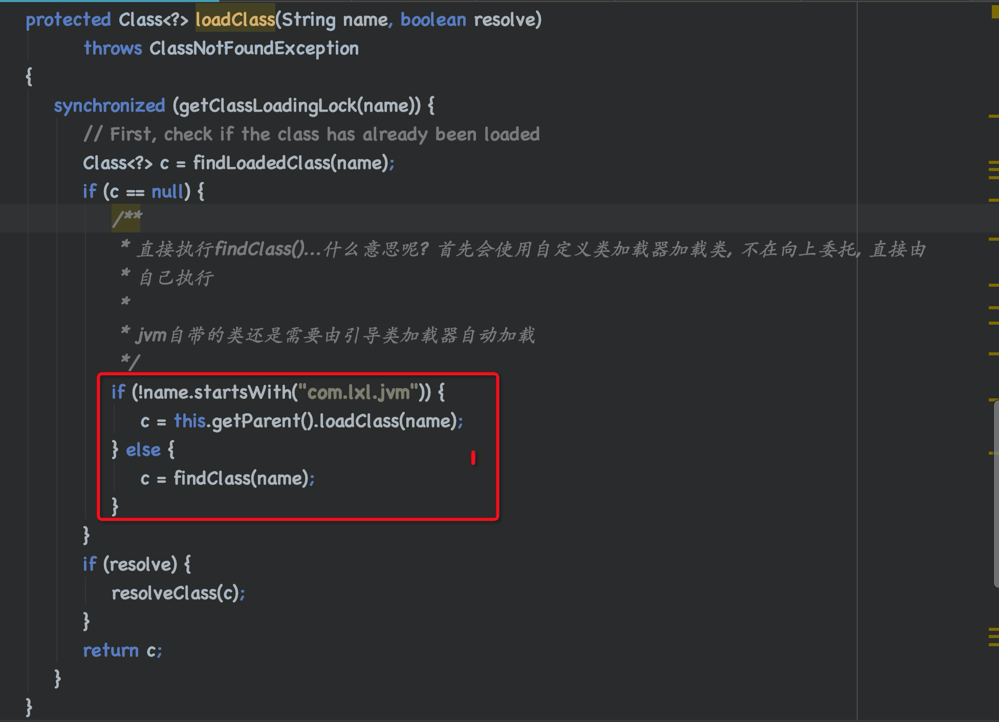

# Java中的双亲委派机制以及如何打破

## 什么是双亲委派机制

当一个类收到了类的加载请求，他首先不会尝试自己去加载这个类，而是把这个请求委派给父类去完成，每一层的类加载器都是如此，因此所有的加载请求都应该传送到启动类加载其中，只有当父类加载器反馈自己无法完成这个请求的时候（在它的加载路径下没有找到所需加载的Class），子类加载器才会尝试自己去加载。

采用双亲委派机制的一个好处是比如加载位于 rt.jar 包中的类 java.lang.Object，不管是哪个加载器加载这个类，最终都是委托顶层的启动类加载器进行加载，这样保证了使用不同的类加载器最终得到的都是同一个Object对象。



## 工作原理

- 如果一个类加载器收到了类加载请求，它并不会自己先去加载，而是把这个请求委托给父类的加载器去执行；
- 如果父类加载器还存在其父类加载器，则进一步向上委托，依次递归，请求最终将到达顶层的启动类加载器；
- 如果父类加载器可以完成类加载任务，就成功返回，倘若父类加载器无法完成此加载任务，子加载器才会尝试自己去加载，这就是双亲委派模式。



## Java类加载器

Java的类加载器有四种

- Bootstrap ClassLoader：根类加载器，负责加载Java的核心类，它不是java.lang.ClassLoader的子类，而是由JVM自身实现
- Extension ClassLoader：扩展类加载器，扩展类加载器的加载路径是JDK目录下 jre/lib/ext，通过扩展类加载器的getParent() 方法返回的是null，实际上扩展类加载器的父类是根加载器
- System ClassLoader：系统（应用）类加载器，它负责在JVM启动时加载来自java 命令的 -classpath选项，或者通过CLASSPATH环境变量所指定的jar包和类路径。
- User ClassLoader：自定义类加载器，加载用户创建的自定义类

## 双亲委派机制举例

当我们加载jdbc.jar 用于实现数据库连接的时候，首先我们需要知道的是 jdbc.jar是基于SPI接口进行实现的，所以在加载的时候，会进行双亲委派，最终从根加载器中加载 SPI核心类，然后在加载SPI接口类，接着在进行反向委派，通过线程上下文类加载器进行实现类 jdbc.jar的加载。



## 沙箱机制

我们创建一个自定义string类，但是在加载自定义String类的时候会率先使用引导类加载器加载，而引导类加载器在加载的过程中会先加载jdk自带的文件（rt.jar包中java\lang\String.class），报错信息说没有main方法，就是因为加载的是rt.jar包中的string类。这样可以保证对java核心源代码的保护，这就是沙箱安全机制。

## 双亲委派机制的优势

通过上面的例子，我们可以知道，双亲机制可以

- 避免类的重复加载
- 保护程序安全，防止核心API被随意篡改
  - 自定义类：java.lang.String
  - 自定义类：java.lang.ShkStart（报错：阻止创建 java.lang开头的类）

## 为什么要打破双亲委派机制？

打破双亲委派机制的场景有很多：JDBC、JNDI、Tomcat等，我们以Tomcat为例来说明

### Tomcat为什么要打破双亲委派机制

首先tomcat是一个web容器，主要是需要解决以下问题

- 一个web容器可能要部署两个或多个应用程序，不同的应用程序之间可能会依赖同一个第三方类库的不同版本，因此要保证每个应用程序的类库都是独立的、相互隔离的
- 部署在同一个web容器中的相同类库的相同版本可以共享，否则，会有重复的类库被加载进JVM中
- web容器也有自己的类库，不能和应用程序的类库混淆，需要相互隔离
- web容器支持jssp文件修改后不用重启，jsp文件也要编译成.class文件的，支持HotSwap功能

### Tomcat使用Java默认加载器的问题

默认的类加载器无法加载两个相同类库的不同版本，它只在乎类的全限定类名，并且只有一份，所以无法解决上面的问题1和问题3，也就是相关隔离的问题。

同时在修改jsp文件后，因为类名一样，默认的类加载器不会重新加载，而是使用方法区中已经存在的类，所以需要每个jsp对应一个唯一的类加载器，当修改jsp的时候，直接卸载唯一的类加载器，然后重新创建类加载器，并加载jsp文件。

### Tomcat的类加载机制



tomcat有多个自定义类加载器

- CommonClassLoader：tomcat最基本的类加载器，加载路径中class可以被tomcat和各个webapp访问
- CatalinaClassLoader：tomcat私有类加载器，webapp不能访问其加载路径下的class，即对webapp不可见
- SharedClassLoader：各个webapp共享的类加载器，对tomcat不可见
- WebappClassLoader：webapp私有的类加载器，只对当前webapp可见
- JasperClassLoader：JSP的类加载器

每个web应用程序都对应一个WebappClassLoader，每一个jsp文件对应一个JasperClassLoader，所以这两个类加载器有多个实例。

### 工作原理

- CommonClassLoader能加载的类都可以被CatalinaClassLoader使用，从而实现了公有类库的共用。
- CatalinaClassLoader  和 SharedClassLoader 自己能加载的类则与对方相互隔离
- WebappClassLoader可以使用SharedClassLoader加载到的类，但各个WebAppClassLoader实例之间相互隔离，多个WebAppClassLoader是同级关系。
- JspClassLoader的加载范围仅仅是这个JSP文件所编译出来的那一个.class文件，它出现的目的就是为了被丢弃；当web容器检测到JSP文件被修改时，会替换掉目前的JasperClassLoader实例，并通过在创建一个Jsp类加载器来实现JSP文件的HotSwap功能
- tomcat目录结构，与上面的类加载器对应
  - /common/*
  - /server/*
  - /shared/*
  - WEB-INF/*
- 默认情况下，conf目录下的catalina.properties文件，没有指定server.loader以及shared.loader，所以tomcat没有建立CatalinaClassLoader和SharedClassLoader实例，这两个都会使用CommonClassLoader来代替。Tomcat6之后，把common、shared、server目录合成一个lib目录，所以我们服务器里看不到common、shared、server目录。

### Tomcat应用的默认加载顺序

- 先从JVM的BootStrapClassLoader中加载。
- 加载Web应用下`/WEB-INF/classes`中的类。
- 加载Web应用下`/WEB-INF/lib/*.jap`中的jar包中的类。
- 加载上面定义的System路径下面的类。
- 加载上面定义的Common路径下面的类。

### Tomcat类加载过程

- 先在本地缓存中查找是否已经加载过该类（对于一些已经加载了的类，会被缓存在resourceEntries这个数据结构中），如果已经加载即返回，否则继续下一步
- 让系统类加载器（ApplicationClassLoader）尝试加载该类，主要是为了防止一些基础类会被web中的类覆盖，如果加载到即返回，返回继续
- 前两步均没有加载到目标列，主要是为了防止一些基础类会被web中的类覆盖，如果加载到即返回，返回继续
- 前两步均没加载到目标类，那么web应用的类加载器将自行加载，如果加载到则返回，否则继续下一步
- 最后还是加载不到的话，则委托父类父类加载器（Common ClassLoader）去加载

## Tomcat打破双亲委派



如上图所示，上面的橙色部分还是和原来一样，采用的双亲委派机制，

黄色部分是tomcat第一部分自定义的类加载器，这部分主要是加载tomcat包中的类，这一部分依然采用的是双亲委派机制

而绿色部分是tomcat第二部分自定义类加载器，正是这一部分，**打破了类的双亲委派机制**

### Tomcat第一部分自定义类加载器（黄色部分）

这部分类加载器，在tomcat7及以前是tomcat自定义的三个类加载器，分别在不同文件加载的jar包，而到了tomcat8及以后，tomcat将这三个文件夹合并了，合并成一个lib包，也就是我们现在看到的lib包



我们来看看这三个类加载器 的主要作用

- CommonClassLoader：tomcat最基本的类加载器，加载路径中的class可以被tomcat容器本身和各个webapp访问
- CatalinaClassLoader：tomcat容器中私有的类加载器，加载路径中的class对webapp不可见
- SharedClassLoader：各个webapps共享的类加载器，加载路径中的class对所有的webapp都课件，但是对tomcat容器不可见

这一部分类加载器，依然采用的是双亲委派机制，原因是它只有一份，如果有重复那也是以这一份为准

### Tomcat第二部分自定义类加载器（绿色部分）

绿色是Java项目在打war包的时候，tomcat自动生成的类加载器，也就是说，每一个项目打成war包，tomcat都会自动生成一个类加载器，专门用来加载这个war包，而这个类加载器打破了双亲委派机制，我们可以想象一下，加入这个webapp类没有打破双亲委派机制会怎么样？

如果没有打破，它就会委托父类加载器去加载，一旦加载到了，紫烈加载器就没有机会加载了，那么Spring4和Spring5的项目就没有可能共存了。

所以，这一部分它打破了双亲委派机制，这样一来webapp类加载器就不需要在让上级类去加载，它自己就可以加载对应的war里的class文件，当然了，其它的项目文件还是要委托上级加载的。

### 举例

我们首先列举一个场景，比如现在我有一个自定义类加载器，加载的是 /com/lxl/jvm/User1.class类，而在应用程序的target目录下也有一个 com/lxl/jvm/User1.class，那么最终User1.class这个类将被哪个类加载器加载呢？根据双亲委派机制，我们知道它一定是被应用程序类加载器AppClassLoader加载，而不是我们自定义的类加载器，为什么呢？因为他要向上寻找，向下委托，当找到以后，便不再向后执行了。

而我们要打破双亲委派机制，就是要让自定义类加载器来加载我们的User1.class，而不是应用程序类加载器来加载。

接下来分析，如何打破双亲委派机制？双亲委派机制是在那里实现的呢？

双亲委派机制是在ClassLoader类的loadClass()中实现的，如果我们不想使用系统自带的双亲委派模型，只需要重新实现ClassLoader的loadClass()方法即可，下面是ClassLoader中定义的loadClass()方法，里面实现了双亲委派机制



下面给DefinedClassLoaderTest.java增加一个loadClass方法, 拷贝上面的代码即可. 删除掉中间实现双亲委派机制的部分



这里需要注意的是，com.lxl.jvm是自定义的雷暴，只有我们自己定义的类才可以从这里加载，如果是系统类，依然使用双亲委派机制来加载，下面来看看运行结果

```bash
# 调用user1的sout方法
com.lxl.jvm.DefinedClassLoaderTest
```

现在User1方法确实是由自定义类加载器加载的了，源码如下

```java
package com.lxl.jvm;

import java.io.FileInputStream;
import java.lang.reflect.Method;

/**
 * 自定义的类加载器
 */
public class DefinedClassLoaderTest extends ClassLoader{

    private String classPath;

    public DefinedClassLoaderTest(String classPath) {
        this.classPath = classPath;
    }

    /**
     * 重写findClass方法
     *
     * 如果不会写, 可以参考URLClassLoader中是如何加载AppClassLoader和ExtClassLoader的
     * @param name
     * @return
     * @throws ClassNotFoundException
     */
    @Override
    protected Class<?> findClass(String name) throws ClassNotFoundException {
        try {
            byte[] data = loadBytes(name);
            return defineClass(name, data, 0, data.length);
        } catch (Exception e) {
            e.printStackTrace();
        }
        return null;
    }


    private byte[] loadBytes(String name) throws Exception {
        // 我们需要读取类的路径
        String path = name.replace('.', '/').concat(".class");
        //String path = "";
        // 去路径下查找这个类
        FileInputStream fileInputStream = new FileInputStream(classPath + "/"  + path);
        int len = fileInputStream.available();

        byte[] data = new byte[len];
        fileInputStream.read(data);
        fileInputStream.close();

        return data;
    }

    protected Class<?> loadClass(String name, boolean resolve)
            throws ClassNotFoundException
    {
        synchronized (getClassLoadingLock(name)) {
            // First, check if the class has already been loaded
            Class<?> c = findLoadedClass(name);
            if (c == null) {
                /**
                 * 直接执行findClass()...什么意思呢? 首先会使用自定义类加载器加载类, 不在向上委托, 直接由
                 * 自己执行
                 *
                 * jvm自带的类还是需要由引导类加载器自动加载
                 */
                if (!name.startsWith("com.lxl.jvm")) {
                    c = this.getParent().loadClass(name);
                } else {
                    c = findClass(name);
                }
            }
            if (resolve) {
                resolveClass(c);
            }
            return c;
        }
    }

    public static void main(String[] args) throws Exception {
        DefinedClassLoaderTest classLoader = new DefinedClassLoaderTest("/Users/luoxiaoli");
        Class<?> clazz = classLoader.loadClass("com.lxl.jvm.User1");
        Object obj = clazz.newInstance();
        Method sout = clazz.getDeclaredMethod("sout", null);
        sout.invoke(obj, null);
        System.out.println(clazz.getClassLoader().getClass().getName());
    }

}
```


## 参考

-  [打破双亲委派机制](https://www.cnblogs.com/ITPower/p/13211490.html)
-  [tomcat是如何打破双亲委派机制的?](https://www.cnblogs.com/ITPower/p/13217145.html)
- 

