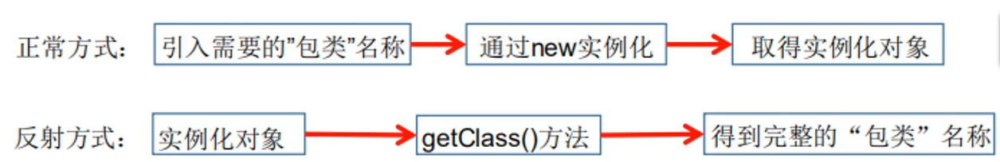
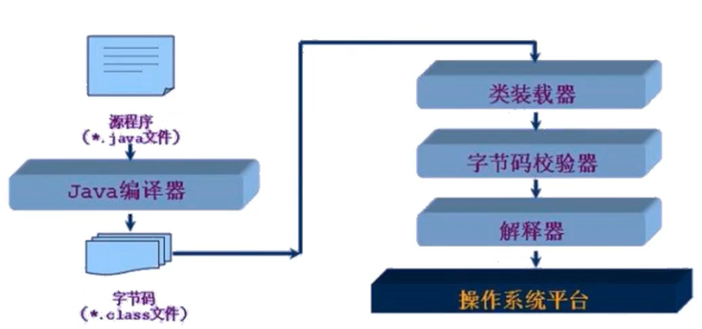
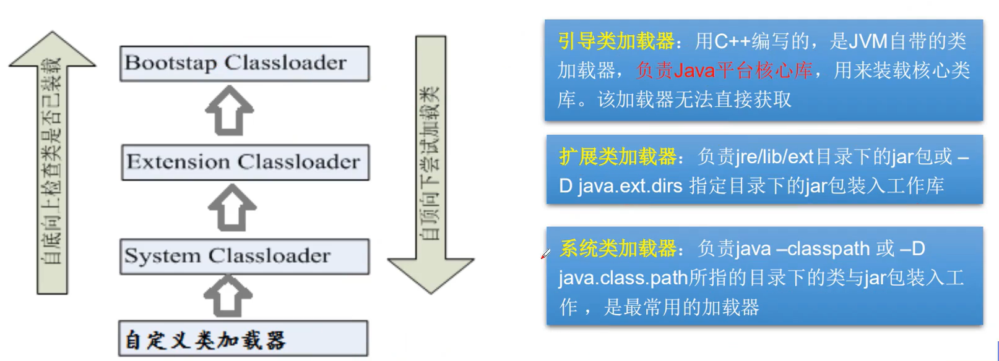
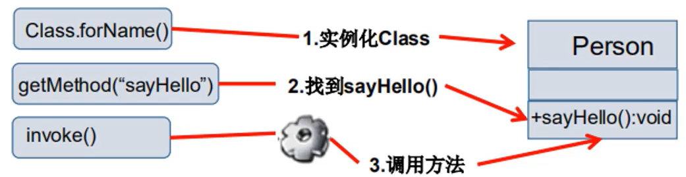

# Java注解和反射

## 什么是注解

- Annotation是JDK5.0开始引入的新技术
- Annotation的作用
  - 不是程序本身，可以对程序做出解释（这一点和注释没有什么区别）
  - 可以被其它程序，比如编译器读取
- Annotation的格式
  - 注解以 `@注释名` 在代码中存在的，还可以添加一些参数值
  - 例如：`@SuppressWarnings(value = "unchecked")`
- Annotation在那里使用？
  - 可以附加在package、class、method、field等上面，相当于给他们添加了额外的辅助信息
  - 通过反射机制变成实现对这些元数据的控制


## 内置注解

- @Override：定义在 `java.lang.Override`中，此注释只适用于修饰方法，表示一个方法声明打算重写超类中的另一个方法声明
- @Deprecated：定义在`java.lang.Deprecated`中，此注释可以用于修饰方法，属性，类，表示不鼓励程序员使用这样的元素，通常是因为它很危险，或者存在更好的选择
- @SuppressWarnings：定义在`java.lang.SuppressWarnings`中，用来抑制编译时的警告信息，与前面的两个注释不同，你需要额外添加一个参数才能正确使用，这些参数都是已经定义好了的，我们选择性的使用就好了。
  - @SuppressWarnings("all")
  - @SuppressWarnings("unchecked")
  - @SuppressWarnings(value={"unchecked", "deprecation"})
  - ...

## 元注解

元注解的作用就是负责注解其它注解，Java定义了4个标准的meta-annotation类型，他们被用来提供对其它annotation类型作说明。

这些类型和它们所支持的类在 `java.lang.annotation`包可以找到 `@Target ` 、`@Retention`、`@Documented`、`@Inherited`

- @Target：用于描述注解的使用范围，即：被描述的注解可以在什么地方使用
- @Retention：表示需要什么保存该注释信息，用于描述注解的生命周期
  - 级别范围：Source < Class < Runtime
- @Document：说明该注解被包含在java doc中
- @Inherited：说明子类可以集成父类中的注解

示例

```
/**
 * 元注解
 *
 * @author: 陌溪
 * @create: 2020-03-28-22:57
 */
@MyAnnotation
public class MateAnnotationDemo {

}

/**
 * 定义一个注解
 */
@Target(value={ElementType.METHOD, ElementType.TYPE})  // target表示我们注解应用的范围，在方法上，和类上有效
@Retention(RetentionPolicy.RUNTIME)   // Retention：表示我们的注解在什么时候还有效，运行时候有效
@Documented   // 表示说我们的注解是否生成在java doc中
@Inherited   // 表示子类可以继承父类的注解
@interface MyAnnotation {

}
```

## 自定义注解

使用 `@interface`自定义注解时，自动继承了 `java.lang.annotation.Annotation`接口

- @interface 用来声明一个注解，格式：public @interface 注解名 {定义内容
- 其中的每个方法实际上是申明了一个配置参数
- 方法的名称j就是参数的类型
- 返回值类型就是参数的类型（返回值只能是基本数据类型，Class，String，enum）
- 通过default来申明参数的默认值
- 如果只有一个参数成员，一般参数名为 value
- 注解元素必须要有值，我们定义元素时，经常使用空字符串或者0作为默认值

```
/**
 * 自定义注解
 *
 * @author: 陌溪
 * @create: 2020-03-28-22:57
 */
public class MateAnnotationDemo {

    // 注解可以显示赋值，如果没有默认值，我们就必须给注解赋值
    @MyAnnotation(schools = {"大学"})
    public void test(){

    }

}

/**
 * 定义一个注解
 */
@Target(value={ElementType.METHOD, ElementType.TYPE})  // target表示我们注解应用的范围，在方法上，和类上有效
@Retention(RetentionPolicy.RUNTIME)   // Retention：表示我们的注解在什么时候还有效，运行时候有效
@Documented   // 表示说我们的注解是否生成在java doc中
@Inherited   // 表示子类可以继承父类的注解
@interface MyAnnotation {

    // 注解的参数：参数类型 + 参数名()
    String name() default "";

    int age() default 0;

    // 如果默认值为-1，代表不存在
    int id() default -1;

    String[] schools();
}
```

## 反射机制

### 动态语言与静态语言

#### 动态语言

动态语言是一类在运行时可以改变其结构的语言：例如新的函数，对象，甚至代码可以被引进，已有的函数可以被删除或是其它结构上的变化。通俗点说就是在运行时代码可以根据某些条件改变自身结构

主要的动态语言有：Object-c、C#、JavaScript、PHP、Python等

#### 静态语言

与动态语言相比，运行时结构不可变的语言就是静态语言。例如Java、C、C++

Java不是动态语言，但是Java可以称为“准动态语言”。即Java有一定的动态性，我们可以利用反射机制来获取类似于动态语言的 特性，Java的动态性让编程的时候更加灵活。

### Java反射机制概述

#### 什么是反射

Java Reflection：Java反射是Java被视为动态语言的关键，反射机制运行程序在执行期借助于Reflection API 去的任何类内部的信息，并能直接操作任意对象的内部属性及方法。

```
Class c = Class.forName("java.lang.String")
```

在加载完类后，在堆内存的方法区就产生了一个Class类型的对象（一个类只有一个Class对象），这个对象就包含了完整的类的结构信息，我们可以通过这个对象看到类的结构，这个对象就像一面镜子，透过这个镜子看到类的结构，所以我们形象的称之为：反射



tip：反射可以获取到private修饰的成员变量和方法

#### 反射的应用

- 在运行时判断任意一个对象所属类
- 在运行时构造任意一个类的对象
- 在运行时判断任意一个类所具有的成员变量和方法
- 在运行时获取泛型信息
- 在运行时调用任意一个对象的成员变量和方法
- 在运行时候处理注解
- 生成动态代理
- .....

#### Java反射的优缺点

- 优点：可以实现动态创建对象和编译，体现出很大的灵活性
- 缺点：对性能有影响。使用反射基本上是一种解释操作，我们可以告诉JVM，我们希望做什么并且它满足我们的要求，这类操作总是慢于直接执行相同的操作。也就是说new创建和对象，比反射性能更高

#### 反射相关的主要API

- java.lang.Class：代表一个类
- java.lang.reflect.Method：代表类的方法
- java.lang.reflect.Field：代表类的成员变量
- java.lang.reflect.Constructor：代表类的构造器
- ........

## 理解Class类并获取Class实例

### Class类

我们下面通过Class.forName来获取一个实例对象

```
/**
 * 反射Demo
 *
 * @author: 陌溪
 * @create: 2020-03-29-8:21
 */
public class ReflectionDemo {
    public static void main(String[] args) throws ClassNotFoundException {
        // 通过反射获取类的Class对象
        Class c1 = Class.forName("com.moxi.interview.study.annotation.User");
        Class c2 = Class.forName("com.moxi.interview.study.annotation.User");
        Class c3 = Class.forName("com.moxi.interview.study.annotation.User");
        System.out.println(c1.hashCode());
        System.out.println(c2.hashCode());
        System.out.println(c3.hashCode());


    }
}

/**
 * 实体类：pojo，entity
 */
class User {
    private String name;
    private int id;
    private int age;

    public User() {

    }

    public String getName() {
        return name;
    }

    public void setName(String name) {
        this.name = name;
    }

    public int getId() {
        return id;
    }

    public void setId(int id) {
        this.id = id;
    }

    public int getAge() {
        return age;
    }

    public void setAge(int age) {
        this.age = age;
    }

    @Override
    public String toString() {
        return "User{" +
                "name='" + name + '\'' +
                ", id=" + id +
                ", age=" + age +
                '}';
    }
}
```

上面我们通过反射获取了三个对象，我们输出对应对象的hashcode码，会发现

```
1173230247
1173230247
1173230247
```

它们的hashcode码是一样的，这就说明了：

- 一个类在内存中只有一个Class对象
- 一个类被加载后，类的整体结构都会被封装在Class对象中

在Object类中定义了以下的方法，此方法将被所有子类继承

```
public final Class getClass()
```

以上方法的返回值的类型是一个Class类，此类是Java反射的源头，实际上所谓反射从程序的运行结果来看也很好理解，即：可以通过对象反射求出类的名称。


也就是说，我们通过对象来获取到它的Class，相当于逆过程

通过对照镜子我们可以得到的信息：某个类的属性，方法和构造器，某个类到底实现了那些接口。对于每个类而言，JRE都为其保留一个不变的Class类型对象，一个CLass对象包含了特定某个结构的有关信息

- Class本身也是一个类
- Class对象只能由系统建立对象
- 一个加载的类在JVM中只会有一个Class实例
- 一个Class对象对应的是一个加载到JVM中的一个.class文件
- 每个类的实例都会记得自己是由哪个Class实例所生成
- 通过Class可以完整地得到一个类中所有被加载的结构
- Class类是Reflection的根源，针对任何你想动态加载、运行的类、唯有先获得相应的Class对象

### Class类常用的方法

- ClassforName(String name)：返回指定类name的Class对象
- newInstance()：调用缺省构造函数，返回Class对象的一个实例
- getName()：返回此Class对象所表示的实体（类，接口，数组或void）的名称
- getSuperClass()：返回当前Class对象的父类Class对象
- getinterfaces()：返回当前对象的接口
- getClassLoader()：返回该类的类加载器
- getConstructors()：返回一个包含某些Constructor对象的数组
- getMethod(String name, Class.. T)：返回一个Method对象，此对象的形参类型为paramsType
- getDeclaredFields()：返回Field对象的一个数组

### 获取对象实例的方法

- 若已知具体的类，通过类的class属性获取，该方法最为安全可靠，程序性能最高
  - Class clazz = Person.class;
- 已知某个类的实例，调用该实例的getClass()方法获取Class对象
  - Class clazz = person.getClass()
- 已经一个类的全类名，且该类在类路径下，可以通过Class类的静态方法forName()获取，HIA可能抛出ClassNotFoundException
  - Class clazz = Class.forName("demo01.Sutdent")
- 内置数据类型可以直接通过 类名.Type
- 还可以利用ClassLoader

```
/**
 * Class类创建的方式
 *
 * @author: 陌溪
 * @create: 2020-03-29-9:56
 */
class Person {
    public String name;
    public Person() {
    }
    public Person(String name) {
        this.name = name;
    }
    @Override
    public String toString() {
        return "Person{" +
                "name='" + name + '\'' +
                '}';
    }
}

class Student extends Person{
    public Student() {
        this.name = "学生";
    }
}

class Teacher extends Person {
    public Teacher() {
        this.name = "老师";
    }
}


public class ClassCreateDemo {
    public static void main(String[] args) throws ClassNotFoundException {

        Person person = new Student();
        System.out.println("这个人是：" + person.name);

        // 方式1：通过对象获得
        Class c1 = person.getClass();
        System.out.println("c1:" + c1.hashCode());

        //方式2：通过forName获得
        Class c2 = Class.forName("com.moxi.interview.study.annotation.Student");
        System.out.println("c2:" + c2.hashCode());

        // 方式3：通过类名获取（最为高效）
        Class c3 = Student.class;
        System.out.println("c3:" + c3.hashCode());

        // 方式4：基本内置类型的包装类，都有一个Type属性
        Class c4 = Integer.TYPE;
        System.out.println(c4.getName());

        // 方式5：获取父类类型
        Class c5 = c1.getSuperclass();
    }
}
```

### 哪些类型可以有Class对象

class：外部类，成员（成员内部类，静态内部类），局部内部类，匿名内部类

interface：接口

[]：数组

enum：枚举

annotation：注解@interface

primitive type：基本数据类型

void

```
/**
 * 获取Class的方式
 *
 * @author: 陌溪
 * @create: 2020-03-29-10:16
 */
public class GetClassDemo {
    public static void main(String[] args) {
        Class c1 = Object.class; // 类
        Class c2 = Comparable.class; // 接口
        Class c3 = String[].class; // 数组
        Class c4 = int[][].class; // 二维数组
        Class c5 = Override.class; // 注解
        Class c6 = ElementType.class; // 枚举
        Class c7 = Integer.class; // 基本数据类型
        Class c8 = void.class; // void，空数据类型
        Class c9 = Class.class; // Class

        System.out.println(c1);
        System.out.println(c2);
        System.out.println(c3);
        System.out.println(c4);
        System.out.println(c5);
        System.out.println(c6);
        System.out.println(c7);
        System.out.println(c8);
        System.out.println(c9);
    }
}
```

最后运行结果为：

```
class java.lang.Object
interface java.lang.Comparable
class [Ljava.lang.String;
class [[I
interface java.lang.Override
class java.lang.annotation.ElementType
class java.lang.Integer
void
class java.lang.Class
```

同时需要注意，只要类型和维度一样，那就是同一个Class对象

```
int [] a = new int[10];
int [] b = new int[10];
System.out.println(a.getClass().hashCode());
System.out.println(b.getClass().hashCode());
```

这两个的hashcode是一样的


### Java内存分析

java内存分为以下三部分

- 堆
  - 存放new的对象和数组
  - 可以被所有的线程共享，不会存放别的对象引用
- 栈
  - 存放基本变量（会包含这个基本类型的具体数值）
  - 引用对象的变量（会存放这个引用在对堆里面的具体地址）
- 方法区
  - 可以被所有线程共享
  - 包含了所有的class和static变量

## 类的加载与ClassLoader的理解

### 类加载过程

当程序主动使用某个类时，如果该类还未被加载到内存中，则系统会通过如下三个步骤对该类进行初始化：


- 加载：将class文件字节码内容加载到内存，并将这些静态数据转换成方法区的运行时数据结构，然后生成一个代表这个类的 `java.lang.Class` 对象。
- 链接：将Java类的二进制代码合并到JVM的运行状态之中的过程。
  - 验证：确保加载的类信息符合JVM规范，没有安全方面的问题
  - 准备：正式为类变量(static)分配内存并设置类变量默认初始值的阶段，这些内存都将在方法区中进行分配。
  - 解析：虚拟机常量池的符号引用(常量名)替换为直接引用(地址)的过程
- 初始化：
  - 执行类构造器<clinit>方法的过程，类构造器<clinit> 方法是由编译期自动收集类中所有类变量的赋值动作和静态代码块中的语句合并产生的。（类构造器是构造类信息的，不是构造该类对象的构造器）
  - 当初始化一个类的时候，如果发现其父类还没有初始化完成，则需要先触发其父类的初始化
  - 虚拟机会保证一个类的<clinit>方法在多相差环境中被正确的加锁和同步

下面一段代码，分别说明了static代码块，以及子类和父类构造方法的执行流程

```
/**
 * 类加载流程
 *
 * @author: 陌溪
 * @create: 2020-03-29-11:02
 */
class SuperA {

    static {
        System.out.println("父类静态代码块初始化");
    }

    public SuperA() {
        System.out.println("父类构造函数初始化");
    }
}
class A extends SuperA{
    static {
        System.out.println("静态代码块初始化");
        m = 300;
    }

    static int m = 100;

    public A() {
        System.out.println("A类的无参构造方法");
    }

}
public class ClassLoaderDemo {

    public static void main(String[] args) {
        A a = new A();
        System.out.println(a.m);
    }
}
```

最后的结果为：

```
父类静态代码块初始化
静态代码块初始化
父类构造函数初始化
A类的无参构造方法
100
```

说明静态代码块都是执行的，并且父类优先


### 类加载步骤

- 加载到内存，会产生一个类对应Class对象

- 链接，链接结束 m = 0

- 初始化：

  - ```
    <clinit>() {
    	syso("A类静态方法")
    	m = 300;
    	m = 100;
    }
    
    ```


### 什么时候发生类初始化

#### 类的主动引用（一定发生初始化）

- 当虚拟机启动，先初始化main方法所有在类
- new 一个类的对象
- 调用类的静态成员（除了 final常量）和静态方法
- 使用 java.lang.reflect包的方法对类进行反射调用
- 当初始化一个类，如果其父类没有被初始化，则会先初始化它的父类

#### 类的被动引用（不会发生初始化）

- 当访问一个静态域时，只有真正的申明这个域的类才会被初始化，如：当通过子类引用父类的静态变量，不会导致子类初始化
- 通过数组定义类引用，不会触发此类的初始化
- 引用常量不会触发此类的初始化（常量在链接阶段就存入调用类的常量池了）

### 类加载器的作用

- 类加载的作用：将class文件字节码内容加载到内存中，并将这些静态数据转换成方法区的运行时数据结构，然后在堆中生成了一个代表这个类的 `java.lang.Class`对象，作为方法区中类数据的访问入口。
- 类缓存：标准的JavaSE类加载器可以按要求查找类，但是一旦某个类被加载到类加载器中，它将维持加载（缓存）一段时间。不过JVM垃圾回收机制可以回收这些Class对象



类加载器作用是用来把类（Class）装载进内存的，JVM规范定义了如下类型的类的加载器



代码如下：

```
/**
 * 类加载器的种类
 *
 * @author: 陌溪
 * @create: 2020-03-29-11:51
 */
public class ClassLoaderTypeDemo {
    public static void main(String[] args) {

        //当前类是哪个加载器
        ClassLoader loader = ClassLoaderTypeDemo.class.getClassLoader();
        System.out.println(loader);

        // 获取系统类加载器
        ClassLoader classLoader = ClassLoader.getSystemClassLoader();
        System.out.println(classLoader);

        // 获取系统类加载器的父类加载器 -> 扩展类加载器
        ClassLoader parentClassLoader = classLoader.getParent();
        System.out.println(parentClassLoader);

        // 获取扩展类加载器的父类加载器 -> 根加载器（C、C++）
        ClassLoader superParentClassLoader = parentClassLoader.getParent();
        System.out.println(superParentClassLoader);

        // 测试JDK内置类是谁加载的
        ClassLoader loader2 = Object.class.getClassLoader();
        System.out.println(loader2);
    }
}

```

运行结果：我们发现，根加载器我们无法获取到

```
sun.misc.Launcher$AppClassLoader@18b4aac2
sun.misc.Launcher$AppClassLoader@18b4aac2
sun.misc.Launcher$ExtClassLoader@45ee12a7
null
null
```


获取类加载器能够加载的路径

```
// 如何获取类加载器可以加载的路径
System.out.println(System.getProperty("java.class.path"));
```

最后输出结果为：

```
        // 如何获取类加载器可以加载的路径
        System.out.println(System.getProperty("java.class.path"));

        /*
        E:\Software\JDK1.8\Java\jre\lib\charsets.jar;
        E:\Software\JDK1.8\Java\jre\lib\deploy.jar;
        E:\Software\JDK1.8\Java\jre\lib\ext\access-bridge-64.jar;
        E:\Software\JDK1.8\Java\jre\lib\ext\cldrdata.jar;
        E:\Software\JDK1.8\Java\jre\lib\ext\dnsns.jar;
        E:\Software\JDK1.8\Java\jre\lib\ext\jaccess.jar;
        E:\Software\JDK1.8\Java\jre\lib\ext\jfxrt.jar;
        E:\Software\JDK1.8\Java\jre\lib\ext\localedata.jar;
        E:\Software\JDK1.8\Java\jre\lib\ext\nashorn.jar;
        E:\Software\JDK1.8\Java\jre\lib\ext\sunec.jar;
        E:\Software\JDK1.8\Java\jre\lib\ext\sunjce_provider.jar;
        E:\Software\JDK1.8\Java\jre\lib\ext\sunmscapi.jar;
        E:\Software\JDK1.8\Java\jre\lib\ext\sunpkcs11.jar;
        E:\Software\JDK1.8\Java\jre\lib\ext\zipfs.jar;
        E:\Software\JDK1.8\Java\jre\lib\javaws.jar;
        E:\Software\JDK1.8\Java\jre\lib\jce.jar;
        E:\Software\JDK1.8\Java\jre\lib\jfr.jar;
        E:\Software\JDK1.8\Java\jre\lib\jfxswt.jar;
        E:\Software\JDK1.8\Java\jre\lib\jsse.jar;
        E:\Software\JDK1.8\Java\jre\lib\management-agent.jar;
        E:\Software\JDK1.8\Java\jre\lib\plugin.jar;
        E:\Software\JDK1.8\Java\jre\lib\resources.jar;
        E:\Software\JDK1.8\Java\jre\lib\rt.jar;
        C:\Users\Administrator\Desktop\LearningNotes\校招面试\JUC\Code\target\classes;
        C:\Users\Administrator\.m2\repository\org\projectlombok\lombok\1.18.10\lombok-1.18.10.jar;
        C:\Users\Administrator\.m2\repository\cglib\cglib\3.3.0\cglib-3.3.0.jar;
        C:\Users\Administrator\.m2\repository\org\ow2\asm\asm\7.1\asm-7.1.jar;
        E:\Software\IntelliJ IDEA\IntelliJ IDEA 2019.1.2\lib\idea_rt.jar
         */
```

我们能够发现，类在加载的时候，都是有自己的加载区域的，而不是任何地方的类都能够被加载

### 获取运行时候类的完整结构

通过反射能够获取运行时类的完整结构

- 实现的全部接口
- 所继承的父类
- 全部的构造器
- 全部的方法
- 全部的Field
- 注解

```
/**
 * 获取运行时类信息
 * @author: 陌溪
 * @create: 2020-03-29-12:13
 */
public class GetClassInfo {
    public static void main(String[] args) throws ClassNotFoundException, NoSuchFieldException, NoSuchMethodException {
        Class clazz = Class.forName("com.moxi.interview.study.annotation.User");

        // 获取类名字
        System.out.println(clazz.getName()); // 包名 + 类名
        System.out.println(clazz.getSimpleName()); // 类名

        // 获取类属性
        System.out.println("================");
        // 只能找到public属性
        Field [] fields = clazz.getFields();

        // 找到全部的属性
        Field [] fieldAll = clazz.getDeclaredFields();

        for (int i = 0; i < fieldAll.length; i++) {
            System.out.println(fieldAll[i]);
        }

        // 获取指定属性的值
        Field name = clazz.getDeclaredField("name");

        // 获取方法
        Method [] methods = clazz.getDeclaredMethods(); // 获取本类和父类的所有public方法
        Method [] methods2 = clazz.getMethods(); // 获取本类所有方法

        // 获得指定方法
        Method method = clazz.getDeclaredMethod("getName", null);

        // 获取方法的时候，可以把参数也丢进去，这样因为避免方法重载，而造成不知道加载那个方法
        Method method2 = clazz.getDeclaredMethod("setName", String.class);

    }
}
```

## 双亲委派机制

如果我们想定义一个：java.lang.string 包，我们会发现无法创建

因为类在加载的时候，会逐级往上

也就是说当前的系统加载器，不会马上的创建该类，而是将该类委派给 扩展类加载器，扩展类加载器在委派为根加载器，然后引导类加载器去看这个类在不在能访问的路径下，发现 sring包已经存在了，所以就无法进行，也就是我们无法使用自己自定义的string类，而是使用初始化的stirng类

当一个类收到了类加载请求，他首先不会尝试自己去加载这个类，而是把这个请求委派给父类去完成，每一个层次类加载器都是如此，因此所有的加载请求都应该传送到启动类加载其中，只有当父类加载器反馈自己无法完成这个请求的时候（在它的加载路径下没有找到所需加载的Class），子类加载器才会尝试自己去加载。

采用双亲委派的一个好处是比如加载位于rt.jar 包中的类java.lang.Object，不管是哪个加载器加载这个类，最终都是委托给顶层的启动类加载器进行加载，这样就保证了使用不同的类加载器最终得到的都是同样一个Object 对象


## 有了Class对象，我们能够做什么？

创建类的对象：通过调用Class对象的newInstance()方法

- 类必须有一个无参数的构造器
- 类的构造器的权限需要足够

如果没有无参构造器就不能创建对象？

只要在操作的时候明确的调用类中的构造器，并将参数传递进去之后，才可以实例化操作。

步骤如下：

- 通过Class类的getDeclaredConstructor(Class ... parameterTypes)取得本类的指定形参类型的构造器
- 向构造器的形参中，传递一个对象数组进去，里面包含了构造器中所需的各个参数
- 通过Constructor实例化对象

#### 调用指定方法

通过反射，调用类中的方法，通过Method类完成。

- 通过Class类的getMethod方法取得一个Method对象，并设置此方法操作是所需要的参数类型
- 之后使用Object invoke进行调用，并向方法中传递要设置的obj对象的参数信息

#### Invoke方法

- Object invoke(Object obj， Object ... args)
- Object对应原方法的返回值，若原方法无返回值，此时返回null
- 若原方法为静态方法，此时形参Object 可以为null
- 若原方法形参列表为空，则Object[] args 为 null
- 若原方法声明private，则需要在调用此invoke() 方法前，显示调用方法对象的setAccessible(true)方法，将可访问private的方法

#### setAccessible方法

- Method和Field、Constructor对象都有setAccessible()方法
- setAccessible作用是启动和禁用访问安全检查的开关
- 参数值为true则指示反射对象再使用时应该取消Java语言访问检查
  - 提高反射效率，如果代码中必须使用反射，而这句代码需要频繁被嗲用，那么设置成true
  - 使得原本无法访问的私有成员也可以访问
- 参数值为false则指示反射的对象应该实行Java语言访问检查



完整代码：

```
/**
 * 通过反射获取对象
 *
 * @author: 陌溪
 * @create: 2020-03-29-12:43
 */
public class GetObjectByReflectionDemo {
    public static void main(String[] args) throws ClassNotFoundException, IllegalAccessException, InstantiationException, NoSuchMethodException, InvocationTargetException, NoSuchFieldException {

        // 获取Class
        Class clazz = Class.forName("com.moxi.interview.study.annotation.User");

        // 构造一个对象，newInstance调用的是无参构造器，如果没有无参构造器的话，本方法会出错
//        User user = (User)clazz.newInstance();

        // 获取class的有参构造器
        Constructor constructor = clazz.getDeclaredConstructor(String.class, int.class, int.class);
        User user2 = (User) constructor.newInstance("小溪", 10, 10);
        System.out.println(user2);


        // 通过反射调用普通构造方法
        User user3 = (User)clazz.newInstance();
        // 获取setName 方法
        Method setName = clazz.getDeclaredMethod("setName", String.class);
        // 执行setName方法，传入对象 和 参数
        setName.invoke(user3, "小白");
        System.out.println(user3);

        System.out.println("============");
        Field age = clazz.getDeclaredField("age");
        // 关闭权限检测,这样才能直接修改字段，因为 set方法不能直接操作私有变量
        age.setAccessible(true);
        age.set(user3, 10);
        System.out.println(user3);

    }
}
```

运行结果

```
User{name='小溪', id=10, age=10}
User{name='小白', id=0, age=0}
============
User{name='小白', id=0, age=10}
```


## 反射性能对比

下面我们编写代码来具体试一试，使用反射的时候和不适用反射，在执行方法时的性能对比

```
/**
 * 反射性能
 *
 * @author: 陌溪
 * @create: 2020-03-29-14:55
 */
public class ReflectionPerformance {

    /**
     * 普通方式调用
     */
    public static void test01() {
        User user = new User();
        long startTime = System.currentTimeMillis();
        for (int i = 0; i < 1000000000; i++) {
            user.getName();
        }
        long endTime = System.currentTimeMillis();

        System.out.println("普通方式执行10亿次getName的时间:" + (endTime - startTime) + " ms");
    }

    /**
     * 反射方式调用
     */
    public static void test02() throws Exception {
        Class clazz = Class.forName("com.moxi.interview.study.annotation.User");
        Method getName = clazz.getDeclaredMethod("getName", null);
        User user = (User) clazz.newInstance();
        long startTime = System.currentTimeMillis();
        for (int i = 0; i < 1000000000; i++) {
            getName.invoke(user, null);
        }
        long endTime = System.currentTimeMillis();

        System.out.println("反射方式执行10亿次getName的时间:" + (endTime - startTime) + " ms");
    }

    /**
     * 反射方式调用，关闭权限检查
     */
    public static void test03() throws Exception {
        Class clazz = Class.forName("com.moxi.interview.study.annotation.User");
        Method getName = clazz.getDeclaredMethod("getName", null);
        User user = (User) clazz.newInstance();
        long startTime = System.currentTimeMillis();
        getName.setAccessible(true);
        for (int i = 0; i < 1000000000; i++) {
            getName.invoke(user, null);
        }
        long endTime = System.currentTimeMillis();

        System.out.println("反射方式执行10亿次getName的时间:" + (endTime - startTime) + " ms");
    }
    public static void main(String[] args) throws Exception {
        test01();
        test02();
        test03();
    }
}
```

运行结果：

```
普通方式执行10亿次getName的时间:3 ms
反射方式执行10亿次getName的时间:2554 ms
反射方式执行10亿次getName的时间:1365 ms
```

我们上面分别是执行了 10亿次 getName的方法，从里面可以看出，通过直接实例化对象后，调用getName耗时最短，同时关闭了 权限检查后的比不关闭能提高一倍的性能。

## 反射操作泛型

Java采用泛型擦除机制来引入泛型，Java中的泛型仅仅是给编译器Java才使用的，确保数据的安全性和免去强制类型转换的问题，但是一旦编译完成后，所有的泛型有关的类型全部被擦除

为了通过反射操作这些类型，Java新增了ParameterizedType，GenericArrayType，TypeVariable和WildcardType几种类型来代表不能被归一到Class类中的类型但是有何原始类型齐名的类型。

- ParameterizedType：表示一种参数化类型，比如Collection<String>
- GenericArrayType：表示一种元素类型是参数化类型或者类型变量的数组类型
- TypeVariable：是各种类型变量的公共父接口
- WildcardType：代表一种通配符类型的表达式

下面我们通过代码来获取方法上的泛型，包括参数泛型，以及返回值泛型

```
/**
 * 通过反射获取泛型
 *
 * @author: 陌溪
 * @create: 2020-03-29-15:15
 */
public class GenericityDemo {

    public void test01(Map<String, User> map, List<User> list) {
        System.out.println("test01");
    }

    public Map<String, User> test02() {
        System.out.println("test02");
        return null;
    }

    public static void main(String[] args) throws Exception{

        Method method = GenericityDemo.class.getMethod("test01", Map.class, List.class);

        // 获取所有的泛型，也就是参数泛型
        Type[] genericParameterTypes = method.getGenericParameterTypes();

        // 遍历打印全部泛型
        for (Type genericParameterType : genericParameterTypes) {
            System.out.println(" # " +genericParameterType);
            if(genericParameterType instanceof ParameterizedType) {
                Type[] actualTypeArguments = ((ParameterizedType) genericParameterType).getActualTypeArguments();
                for (Type actualTypeArgument : actualTypeArguments) {
                    System.out.println(actualTypeArgument);
                }
            }
        }

        // 获取返回值泛型
        Method method2 = GenericityDemo.class.getMethod("test02", null);
        Type returnGenericParameterTypes = method2.getGenericReturnType();

        // 遍历打印全部泛型
        if(returnGenericParameterTypes instanceof ParameterizedType) {
            Type[] actualTypeArguments = ((ParameterizedType) returnGenericParameterTypes).getActualTypeArguments();
            for (Type actualTypeArgument : actualTypeArguments) {
                System.out.println(actualTypeArgument);
            }
        }

    }
}
```

得到的结果

```
 # java.util.Map<java.lang.String, com.moxi.interview.study.annotation.User>
class java.lang.String
class com.moxi.interview.study.annotation.User
 # java.util.List<com.moxi.interview.study.annotation.User>
class com.moxi.interview.study.annotation.User
###################
class java.lang.String
class com.moxi.interview.study.annotation.User
```


## 反射操作注解

通过反射能够获取到 类、方法、字段。。。等上的注解

- getAnnotation
- getAnnotations

### ORM对象关系映射

ORM即为：Object relationship Mapping，对象关系映射

- 类和表结构对应
- 属性和字段对应
- 对象和记录对应


下面使用代码，模拟ORM框架的简单使用

```
/**
 * ORMDemo
 *
 * @author: 陌溪
 * @create: 2020-03-29-15:33
 */
@TableKuang("db_student")
class Student2 {
    @FieldKuang(columnName = "db_id", type="int", length = 10)
    private int id;

    @FieldKuang(columnName = "db_age", type="int", length = 10)
    private int age;

    @FieldKuang(columnName = "db_name", type="varchar", length = 10)
    private String name;

    public Student2() {
    }

    public Student2(int id, int age, String name) {
        this.id = id;
        this.age = age;
        this.name = name;
    }

    public int getId() {
        return id;
    }

    public void setId(int id) {
        this.id = id;
    }

    public int getAge() {
        return age;
    }

    public void setAge(int age) {
        this.age = age;
    }

    public String getName() {
        return name;
    }

    public void setName(String name) {
        this.name = name;
    }

    @Override
    public String toString() {
        return "Student2{" +
                "id=" + id +
                ", age=" + age +
                ", name='" + name + '\'' +
                '}';
    }
}

/**
 * 自定义注解：类名的注解
 */
@Target(ElementType.TYPE)
@Retention(RetentionPolicy.RUNTIME)
@interface TableKuang {
    String value();
}

/**
 * 自定义注解：属性的注解
 */
@Target(ElementType.FIELD)
@Retention(RetentionPolicy.RUNTIME)
@interface FieldKuang {
    String columnName();
    String type();
    int length() default 0;
}
public class ORMDemo {

    public static void main(String[] args) throws Exception{
        // 获取Student 的 Class对象
        Class c1 = Class.forName("com.moxi.interview.study.annotation.Student2");

        // 通过反射，获取到全部注解
        Annotation [] annotations = c1.getAnnotations();

        for (Annotation annotation : annotations) {
            System.out.println(annotation);
        }

        // 获取注解的value值
        TableKuang tableKuang = (TableKuang)c1.getAnnotation(TableKuang.class);
        String value = tableKuang.value();
        System.out.println(value);

        // 获得类指定的注解
        Field f = c1.getDeclaredField("name");
        FieldKuang fieldKuang = f.getAnnotation(FieldKuang.class);
        System.out.println(fieldKuang.columnName());
        System.out.println(fieldKuang.type());
        System.out.println(fieldKuang.length());
    }
}
```


