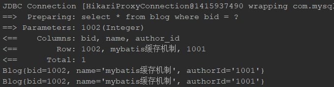

# MyBatis 缓存机制

## 来源

转载于 博客园  [吴振照](https://home.cnblogs.com/u/wuzhenzhao/) 的博客：https://www.cnblogs.com/wuzhenzhao/p/11103043.html

## 前言

　　缓存是一般的ORM 框架都会提供的功能，目的就是提升查询的效率和减少数据库的压力。跟Hibernate 一样，MyBatis 也有一级缓存和二级缓存，并且预留了集成第三方缓存的接口。

　　缓存体系结构：


MyBatis 跟缓存相关的类都在cache 包里面，其中有一个Cache 接口，只有一个默认的实现类 PerpetualCache，它是用HashMap 实现的。我们可以通过 以下类找到这个缓存的庐山真面目

**DefaultSqlSession**

　　-> **BaseExecutor**

　　　　-> **PerpetualCache** localCache

　　　　　　->**private Map cache = new HashMap();**

　　除此之外，还有很多的装饰器，通过这些装饰器可以额外实现很多的功能：回收策略、日志记录、定时刷新等等。但是无论怎么装饰，经过多少层装饰，最后使用的还是基本的实现类（默认PerpetualCache）。可以通过 CachingExecutor 类 Debug 去查看。


　　所有的缓存实现类总体上可分为三类：基本缓存、淘汰算法缓存、装饰器缓存。


## 一级缓存（本地缓存）

　　一级缓存也叫本地缓存，MyBatis 的一级缓存是在会话（SqlSession）层面进行缓存的。MyBatis 的一级缓存是默认开启的，不需要任何的配置。首先我们必须去弄清楚一个问题，在MyBatis 执行的流程里面，涉及到这么多的对象，那么缓存PerpetualCache 应该放在哪个对象里面去维护？如果要在同一个会话里面共享一级缓存，这个对象肯定是在SqlSession 里面创建的，作为SqlSession 的一个属性。

　　DefaultSqlSession 里面只有两个属性，Configuration 是全局的，所以缓存只可能放在Executor 里面维护——SimpleExecutor/ReuseExecutor/BatchExecutor 的父类BaseExecutor 的构造函数中持有了PerpetualCache。在同一个会话里面，多次执行相同的SQL 语句，会直接从内存取到缓存的结果，不会再发送SQL 到数据库。但是不同的会话里面，即使执行的SQL 一模一样（通过一个Mapper 的同一个方法的相同参数调用），也不能使用到一级缓存。

　　每当我们使用MyBatis开启一次和数据库的会话，MyBatis会创建出一个SqlSession对象表示一次数据库会话。

　　在对数据库的一次会话中，我们有可能会反复地执行完全相同的查询语句，如果不采取一些措施的话，每一次查询都会查询一次数据库,而我们在极短的时间内做了完全相同的查询，那么它们的结果极有可能完全相同，由于查询一次数据库的代价很大，这有可能造成很大的资源浪费。

　　为了解决这一问题，减少资源的浪费，MyBatis会在表示会话的SqlSession对象中建立一个简单的缓存，将每次查询到的结果结果缓存起来，当下次查询的时候，如果判断先前有个完全一样的查询，会直接从缓存中直接将结果取出，返回给用户，不需要再进行一次数据库查询了。

　　如下图所示，MyBatis会在一次会话的表示----一个SqlSession对象中创建一个本地缓存(local cache)，对于每一次查询，都会尝试根据查询的条件去本地缓存中查找是否在缓存中，如果在缓存中，就直接从缓存中取出，然后返回给用户；否则，从数据库读取数据，将查询结果存入缓存并返回给用户。


一级缓存的生命周期有多长？

1. MyBatis在开启一个数据库会话时，会 创建一个新的SqlSession对象，SqlSession对象中会有一个新的Executor对象，Executor对象中持有一个新的PerpetualCache对象；当会话结束时，SqlSession对象及其内部的Executor对象还有PerpetualCache对象也一并释放掉。
2. 如果SqlSession调用了close()方法，会释放掉一级缓存PerpetualCache对象，一级缓存将不可用；
3. 如果SqlSession调用了clearCache()，会清空PerpetualCache对象中的数据，但是该对象仍可使用；
4. SqlSession中执行了任何一个update操作(update()、delete()、insert()) ，都会清空PerpetualCache对象的数据，但是该对象可以继续使用；

SqlSession 一级缓存的工作流程：

1. 对于某个查询，根据statementId,params,rowBounds来构建一个key值，根据这个key值去缓存Cache中取出对应的key值存储的缓存结果
2. 判断从Cache中根据特定的key值取的数据数据是否为空，即是否命中；
3. 如果命中，则直接将缓存结果返回；
4. 如果没命中：

1. 1. 去数据库中查询数据，得到查询结果；
   2. 将key和查询到的结果分别作为key,value对存储到Cache中；
   3. 将查询结果返回；

　　接下来我们来验证一下，MyBatis 的一级缓存到底是不是只能在一个会话里面共享，以及跨会话（不同session）操作相同的数据会产生什么问题。判断是否命中缓存：如果再次发送SQL 到数据库执行，说明没有命中缓存；如果直接打印对象，说明是从内存缓存中取到了结果。

1、在同一个session 中共享（不同session 不能共享）

```
//同Session
SqlSession session1 = sqlSessionFactory.openSession();
BlogMapper mapper1 = session1.getMapper(BlogMapper.class);
System.out.println(mapper1.selectBlogById(1002));
System.out.println(mapper1.selectBlogById(1002));
```

　　执行以上sql我们可以看到控制台打印如下信息（需配置mybatis.configuration.log-impl=org.apache.ibatis.logging.stdout.StdOutImpl），会发现我们两次的查询就发送了一次查询数据库的操作，这说明了缓存在发生作用：

**

　　PS：一级缓存在BaseExecutor 的query()——queryFromDatabase()中存入。在queryFromDatabase()之前会get()。

```
public <E> List<E> query(MappedStatement ms, Object parameter, RowBounds rowBounds, ResultHandler resultHandler, CacheKey key, BoundSql boundSql) throws SQLException {
        ErrorContext.instance().resource(ms.getResource()).activity("executing a query").object(ms.getId());
　　　　。。。。。。try {
                ++this.queryStack;//从缓存中获取
                list = resultHandler == null ? (List)this.localCache.getObject(key) : null;
                if (list != null) {
                    this.handleLocallyCachedOutputParameters(ms, key, parameter, boundSql);
                } else {//缓存中获取不到，查询数据库
                    list = this.queryFromDatabase(ms, parameter, rowBounds, resultHandler, key, boundSql);
                }
　　　　。。。。。。
    }
```

2.同一个会话中，update（包括delete）会导致一级缓存被清空

```
//同Session
SqlSession session1 = sqlSessionFactory.openSession();
BlogMapper mapper1 = session1.getMapper(BlogMapper.class);
System.out.println(mapper1.selectBlogById(1002));
Blog blog3 = new Blog();
blog3.setBid(1002);
blog3.setName("mybatis缓存机制修改");
mapper1.updateBlog(blog3);
session1.commit();// 注意要提交事务，否则不会清除缓存
System.out.println(mapper1.selectBlogById(1002));
```

　　一级缓存是在BaseExecutor 中的update()方法中调用clearLocalCache()清空的（无条件），query 中会判断。

```
public int update(MappedStatement ms, Object parameter) throws SQLException {
        ErrorContext.instance().resource(ms.getResource()).activity("executing an update").object(ms.getId());
        if (this.closed) {
            throw new ExecutorException("Executor was closed.");
        } else {　　　　　　  //清除本地缓存
            this.clearLocalCache();
            return this.doUpdate(ms, parameter);
        }
}
```

3.其他会话更新了数据，导致读取到脏数据（一级缓存不能跨会话共享）

```
SqlSession session1 = sqlSessionFactory.openSession();
BlogMapper mapper1 = session1.getMapper(BlogMapper.class);
SqlSession session2 = sqlSessionFactory.openSession();
BlogMapper mapper2 = session2.getMapper(BlogMapper.class);
System.out.println(mapper2.selectBlogById(1002));
Blog blog3 = new Blog();
blog3.setBid(1002);
blog3.setName("mybatis缓存机制1");
mapper1.updateBlog(blog3);
session1.commit();
System.out.println(mapper2.selectBlogById(1002));
```

一级缓存的不足：

　　使用一级缓存的时候，因为缓存不能跨会话共享，不同的会话之间对于相同的数据可能有不一样的缓存。在有多个会话或者分布式环境下，会存在脏数据的问题。如果要解决这个问题，就要用到二级缓存。MyBatis 一级缓存（MyBaits 称其为 Local Cache）无法关闭，但是有两种级别可选：

1. session 级别的缓存，在同一个 sqlSession 内，对同样的查询将不再查询数据库，直接从缓存中。
2. statement 级别的缓存，避坑： 为了避免这个问题，可以将一级缓存的级别设为 statement 级别的，这样每次查询结束都会清掉一级缓存。

## 二级缓存：

　　二级缓存是用来解决一级缓存不能跨会话共享的问题的，范围是namespace 级别的，可以被多个SqlSession 共享（只要是同一个接口里面的相同方法，都可以共享），生命周期和应用同步。如果你的MyBatis使用了二级缓存，并且你的Mapper和select语句也配置使用了二级缓存，那么在执行select查询的时候，MyBatis会先从二级缓存中取输入，其次才是一级缓存，即MyBatis查询数据的顺序是：二级缓存  —> 一级缓存 —> 数据库。

　　作为一个作用范围更广的缓存，它肯定是在SqlSession 的外层，否则不可能被多个SqlSession 共享。而一级缓存是在SqlSession 内部的，所以第一个问题，肯定是工作在一级缓存之前，也就是只有取不到二级缓存的情况下才到一个会话中去取一级缓存。第二个问题，二级缓存放在哪个对象中维护呢？ 要跨会话共享的话，SqlSession 本身和它里面的BaseExecutor 已经满足不了需求了，那我们应该在BaseExecutor 之外创建一个对象。

　　实际上MyBatis 用了一个装饰器的类来维护，就是CachingExecutor。如果启用了二级缓存，MyBatis 在创建Executor 对象的时候会对Executor 进行装饰。CachingExecutor 对于查询请求，会判断二级缓存是否有缓存结果，如果有就直接返回，如果没有委派交给真正的查询器Executor 实现类，比如SimpleExecutor 来执行查询，再走到一级缓存的流程。最后会把结果缓存起来，并且返回给用户。


　　开启二级缓存的方法

第一步：配置 mybatis.configuration.cache-enabled=true，只要没有显式地设置cacheEnabled=false，都会用CachingExecutor 装饰基本的执行器。

第二步：在Mapper.xml 中配置<cache/>标签：

```
<cache type="org.apache.ibatis.cache.impl.PerpetualCache"
    size="1024"
eviction="LRU"
flushInterval="120000"
readOnly="false"/>
```

基本上就是这样。这个简单语句的效果如下:

- 映射语句文件中的所有 select 语句的结果将会被缓存。
- 映射语句文件中的所有 insert、update 和 delete 语句会刷新缓存。
- 缓存会使用最近最少使用算法（LRU, Least Recently Used）算法来清除不需要的缓存。
- 缓存不会定时进行刷新（也就是说，没有刷新间隔）。
- 缓存会保存列表或对象（无论查询方法返回哪种）的 1024 个引用。
- 缓存会被视为读/写缓存，这意味着获取到的对象并不是共享的，可以安全地被调用者修改，而不干扰其他调用者或线程所做的潜在修改。

这个更高级的配置创建了一个 FIFO 缓存，每隔 60 秒刷新，最多可以存储结果对象或列表的 512 个引用，而且返回的对象被认为是只读的，因此对它们进行修改可能会在不同线程中的调用者产生冲突。可用的清除策略有：

- `LRU` – 最近最少使用：移除最长时间不被使用的对象。
- `FIFO` – 先进先出：按对象进入缓存的顺序来移除它们。
- `SOFT` – 软引用：基于垃圾回收器状态和软引用规则移除对象。
- `WEAK` – 弱引用：更积极地基于垃圾收集器状态和弱引用规则移除对象。

默认的清除策略是 LRU。

flushInterval（刷新间隔）属性可以被设置为任意的正整数，设置的值应该是一个以毫秒为单位的合理时间量。 默认情况是不设置，也就是没有刷新间隔，缓存仅仅会在调用语句时刷新。

size（引用数目）属性可以被设置为任意正整数，要注意欲缓存对象的大小和运行环境中可用的内存资源。默认值是 1024。

readOnly（只读）属性可以被设置为 true 或 false。只读的缓存会给所有调用者返回缓存对象的相同实例。 因此这些对象不能被修改。这就提供了可观的性能提升。而可读写的缓存会（通过序列化）返回缓存对象的拷贝。 速度上会慢一些，但是更安全，因此默认值是 false。

　　注：二级缓存是事务性的。这意味着，当 SqlSession 完成并提交时，或是完成并回滚，但没有执行 flushCache=true 的 insert/delete/update 语句时，缓存会获得更新。

　　Mapper.xml 配置了<cache>之后，select()会被缓存。update()、delete()、insert()会刷新缓存。：如果cacheEnabled=true，Mapper.xml 没有配置标签，还有二级缓存吗？（没有）还会出现CachingExecutor 包装对象吗？（会）

　　只要cacheEnabled=true 基本执行器就会被装饰。有没有配置<cache>，决定了在启动的时候会不会创建这个mapper 的Cache 对象，只是最终会影响到CachingExecutorquery 方法里面的判断。如果某些查询方法对数据的实时性要求很高，不需要二级缓存，怎么办？我们可以在单个Statement ID 上显式关闭二级缓存（默认是true）：

```
<select id="selectBlog" resultMap="BaseResultMap" useCache="false">
```

　　二级缓存验证（验证二级缓存需要先开启二级缓存）

 1、事务不提交，二级缓存不存在

```
System.out.println(mapper1.selectBlogById(1002));
// 事务不提交的情况下，二级缓存不会写入
// session1.commit();
System.out.println(mapper2.selectBlogById(1002));
```

　　为什么事务不提交，二级缓存不生效？因为二级缓存使用TransactionalCacheManager（TCM）来管理，最后又调用了TransactionalCache 的getObject()、putObject 和commit()方法，TransactionalCache里面又持有了真正的Cache 对象，比如是经过层层装饰的PerpetualCache。在putObject 的时候，只是添加到了entriesToAddOnCommit 里面，只有它的commit()方法被调用的时候才会调用flushPendingEntries()真正写入缓存。它就是在DefaultSqlSession 调用commit()的时候被调用的。

2、使用不同的session 和mapper，验证二级缓存可以跨session 存在取消以上commit()的注释

3、在其他的session 中执行增删改操作，验证缓存会被刷新

```
System.out.println(mapper1.selectBlogById(1002));
//主键自增返回测试
Blog blog3 = new Blog();
blog3.setBid(1002);
blog3.setName("mybatis缓存机制");
mapper1.updateBlog(blog3);
session1.commit();
System.out.println(mapper2.selectBlogById(1002));
```

　　为什么增删改操作会清空缓存？在CachingExecutor 的update()方法里面会调用flushCacheIfRequired(ms)，isFlushCacheRequired 就是从标签里面渠道的flushCache 的值。而增删改操作的flushCache 属性默认为true。

什么时候开启二级缓存？

一级缓存默认是打开的，二级缓存需要配置才可以开启。那么我们必须思考一个问题，在什么情况下才有必要去开启二级缓存？

1. 因为所有的增删改都会刷新二级缓存，导致二级缓存失效，所以适合在查询为主的应用中使用，比如历史交易、历史订单的查询。否则缓存就失去了意义。
2. 如果多个namespace 中有针对于同一个表的操作，比如Blog 表，如果在一个namespace 中刷新了缓存，另一个namespace 中没有刷新，就会出现读到脏数据的情况。所以，推荐在一个Mapper 里面只操作单表的情况使用。

　　如果要让多个namespace 共享一个二级缓存，应该怎么做？跨namespace 的缓存共享的问题，可以使用<cache-ref>来解决：

```
<cache-ref namespace="com.wuzz.crud.dao.DepartmentMapper" />
```

　　cache-ref 代表引用别的命名空间的Cache 配置，两个命名空间的操作使用的是同一个Cache。在关联的表比较少，或者按照业务可以对表进行分组的时候可以使用。

　　注意：在这种情况下，多个Mapper 的操作都会引起缓存刷新，缓存的意义已经不大了.

第三方缓存做二级缓存

　　除了MyBatis 自带的二级缓存之外，我们也可以通过实现Cache 接口来自定义二级缓存。MyBatis 官方提供了一些第三方缓存集成方式，比如ehcache 和redis：https://github.com/mybatis/redis-cache ,这里就不过多介绍了。当然，我们也可以使用独立的缓存服务，不使用MyBatis 自带的二级缓存。

自定义缓存：

　　除了上述自定义缓存的方式，你也可以通过实现你自己的缓存，或为其他第三方缓存方案创建适配器，来完全覆盖缓存行为。

```
<cache type="com.domain.something.MyCustomCache"/>
```

　　这个示例展示了如何使用一个自定义的缓存实现。type 属性指定的类必须实现 org.mybatis.cache.Cache 接口，且提供一个接受 String 参数作为 id 的构造器。 这个接口是 MyBatis 框架中许多复杂的接口之一，但是行为却非常简单。

```
public interface Cache {
  String getId();
  int getSize();
  void putObject(Object key, Object value);
  Object getObject(Object key);
  boolean hasKey(Object key);
  Object removeObject(Object key);
  void clear();
}
```

　　为了对你的缓存进行配置，只需要简单地在你的缓存实现中添加公有的 JavaBean 属性，然后通过 cache 元素传递属性值，例如，下面的例子将在你的缓存实现上调用一个名为 `setCacheFile(String file)` 的方法：

```
<cache type="com.domain.something.MyCustomCache">
  <property name="cacheFile" value="/tmp/my-custom-cache.tmp"/>
</cache>
```

　　你可以使用所有简单类型作为 JavaBean 属性的类型，MyBatis 会进行转换。 你也可以使用占位符（如 `${cache.file}`），以便替换成在配置文件属性中定义的值。从版本 3.4.2 开始，MyBatis 已经支持在所有属性设置完毕之后，调用一个初始化方法。 如果想要使用这个特性，请在你的自定义缓存类里实现 `org.apache.ibatis.builder.InitializingObject` 接口。

```
public interface InitializingObject {
  void initialize() throws Exception;
}
```

　　请注意，缓存的配置和缓存实例会被绑定到 SQL 映射文件的命名空间中。 因此，同一命名空间中的所有语句和缓存将通过命名空间绑定在一起。 每条语句可以自定义与缓存交互的方式，或将它们完全排除于缓存之外，这可以通过在每条语句上使用两个简单属性来达成。 默认情况下，语句会这样来配置：

```
<select ... flushCache="false" useCache="true"/>
<insert ... flushCache="true"/>
<update ... flushCache="true"/>
<delete ... flushCache="true"/>
```

　　鉴于这是默认行为，显然你永远不应该以这样的方式显式配置一条语句。但如果你想改变默认的行为，只需要设置 flushCache 和 useCache 属性。比如，某些情况下你可能希望特定 select 语句的结果排除于缓存之外，或希望一条 select 语句清空缓存。类似地，你可能希望某些 update 语句执行时不要刷新缓存。