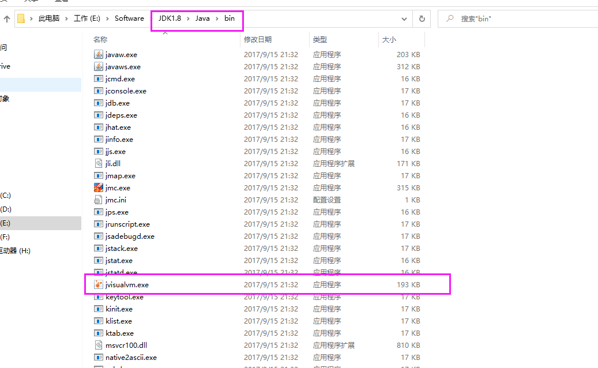
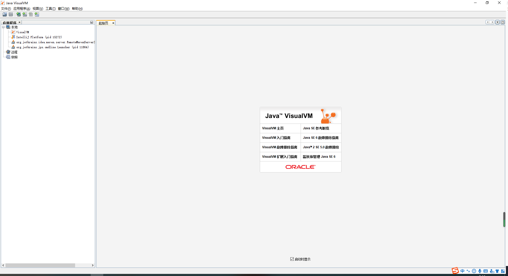
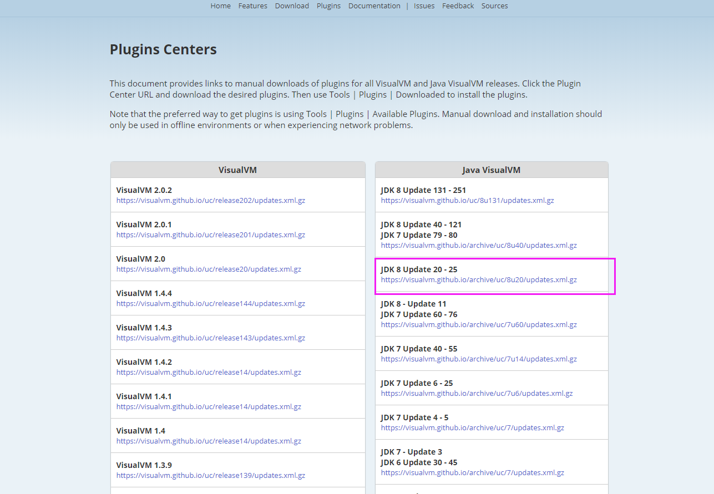
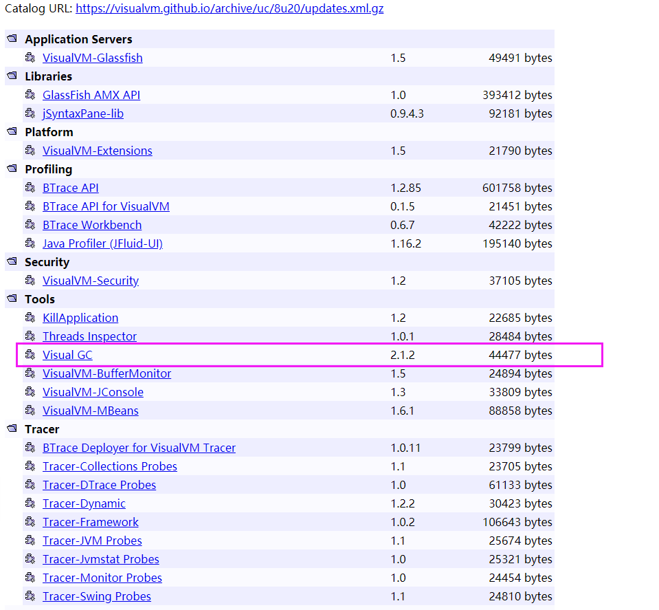
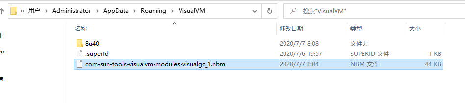
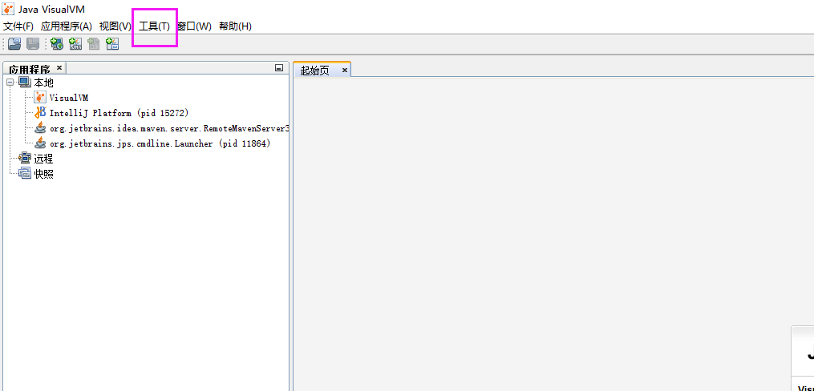
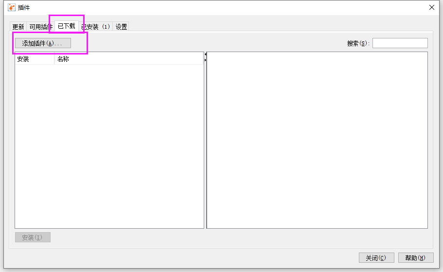
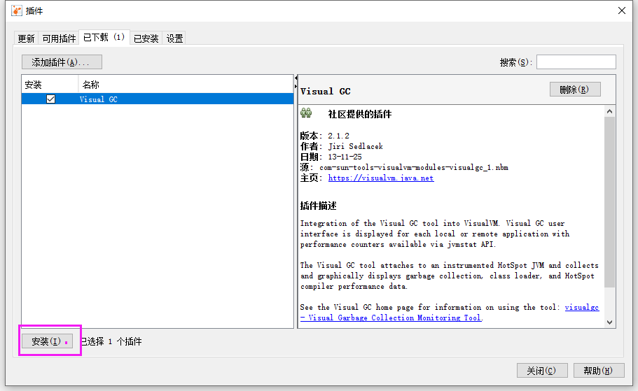
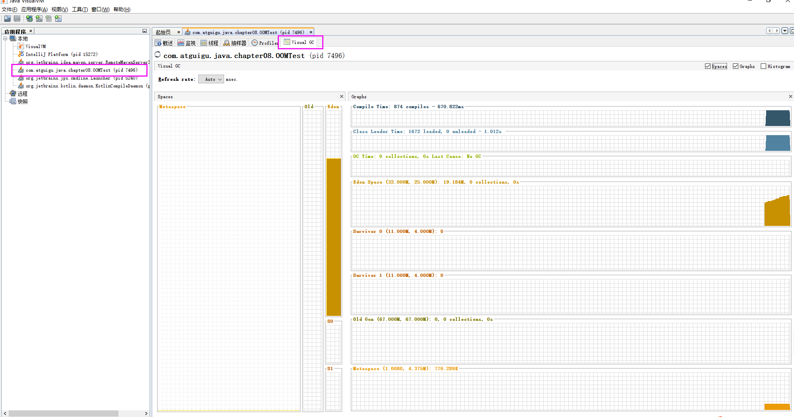
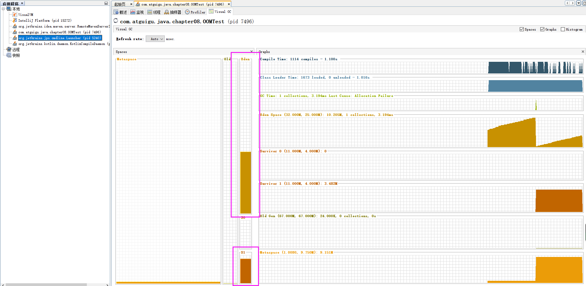

# VisualVM安装VisualGC插件

## 前言

在我们安装的JDK中，提供了一个很棒的JVM调优工具，也就是 Java VisualVM，通过它我们能够看到很多关于我们Java程序的信息，比如查看 Eden，Survivor From, Survivor To区的空间使用情况，以及排查程序中那些对象造成OOM。

##  VisualVM位置

我们可以通过找到安装JDK的目录



或者使用cmd命令来打开图形化界面

```bash
jvisualvm
```

启动完成后，会有这样一个界面



这就代表Java VisualVM启动成功

## 安装VisualGC插件

VIsualGC插件，是能够让我们通过图形化的页面，来查看我们的堆内存，以及各区使用情况

### 下载插件

首先我们需要到Visual的 [插件官网](https://visualvm.github.io/pluginscenters.html) 下载，我们需要找到自己的JDK版本

比如我的是JDK1.8，那么我就选择这里



然后在找到VisualGC插件



下载完成后，我们把插件放在下面目录下

```bash
C:\Users\Administrator\AppData\Roaming\VisualVM
```



### 安装

然后在到我们刚刚打开的Visual VM图形化页面，点击工具 -> 插件



然后在点击已下载 -> 添加插件



找到刚刚我们的这个文件，然后选择安装



安装成功后，我们通过写一个代码来进行检测

```java
/**
 * OOM测试
 *
 * @author: 陌溪
 * @create: 2020-07-06-21:11
 */
public class OOMTest {
    public static void main(String[] args) throws InterruptedException {
        List<Integer> list = new ArrayList<>();
        while(true) {
            Thread.sleep(1);
            list.add(999999999);
        }
    }
}
```

设置启动的JVM参数

```bash
-Xms100m  -Xmx100m
```

最后点击Visual GC查看我们的堆内存情况



等待一会后，我们发现S1区中，有了对象，说明JVM已经进行了第一次垃圾收集

