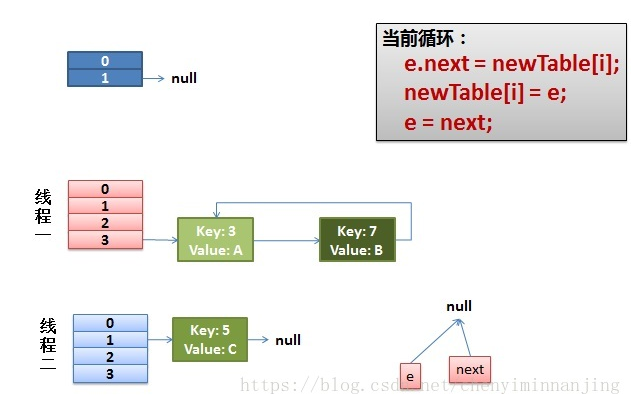
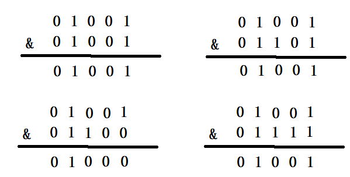

# 主要特性

- Lambda表达式
- 函数式接口
- 方法引用与构造器引用
- Stream API
- 接口中默认方法与静态方法
- 新时间日期API
- 最大化减少空指针异常（Optional）
- 。。。。

## HashMap优化

### HashMap1.7

在JDK1.7 到 JDK1.8的时候，对HashMap做了优化

首先JDK1.7的HashMap当出现Hash碰撞的时候，最后插入的元素会放在前面，这个称为 “头插法”

> JDK7用头插是考虑到了一个所谓的热点数据的点(新插入的数据可能会更早用到)，但这其实是个伪命题,因为JDK7中rehash的时候，旧链表迁移新链表的时候，如果在新表的数组索引位置相同，则链表元素会倒置(就是因为头插) 所以最后的结果 还是打乱了插入的顺序 所以总的来看支撑JDK7使用头插的这点原因也不足以支撑下去了 所以就干脆换成尾插 一举多得


### HashMap1.7存在死链问题

参考：[hashmap扩容时死循环问题](https://blog.csdn.net/chenyiminnanjing/article/details/82706942)

在JDK1.8以后，由头插法改成了尾插法，因为头插法还存在一个死链的问题

在说死链问题时，我们先从Hashmap存储数据说起，下面这个是HashMap的put方法

```
public V put(K key, V value)
{
    ......
    //计算Hash值
    int hash = hash(key.hashCode());
    int i = indexFor(hash, table.length);
    //各种校验吧
    for (Entry<K,V> e = table[i]; e != null; e = e.next) {
        Object k;
        if (e.hash == hash && ((k = e.key) == key || key.equals(k))) {
            V oldValue = e.value;
            e.value = value;
            e.recordAccess(this);
            return oldValue;
        }
    }
    modCount++;
    //该key不存在，需要增加一个结点
    addEntry(hash, key, value, i);
    return null;
}
```

这里添加一个节点需要检查是否超出容量，出现一个负载因子

```
void addEntry(int hash, K key, V value, int bucketIndex)
{
    Entry<K,V> e = table[bucketIndex];
    table[bucketIndex] = new Entry<K,V>(hash, key, value, e);
    //查看当前的size是否超过了我们设定的阈值threshold，如果超过，需要resize
    if (size++ >= threshold)
        resize(2 * table.length);//扩容都是2倍2倍的来的，
}
```

> HashMap有 负载因子：0.75，以及 初始容量：16，扩容阈值：16*0.75 = 12，当HashMap达到扩容的条件时候，会把HashMap中的每个元素，重新进行运算Hash值，打入到扩容后的数组中。

既然新建了一个更大尺寸的hash表，然后把数据从老的Hash表中迁移到新的Hash表中。

```
void resize(int newCapacity)
{
    Entry[] oldTable = table;
    int oldCapacity = oldTable.length;
    ......
    //创建一个新的Hash Table
    Entry[] newTable = new Entry[newCapacity];

    //将Old Hash Table上的数据迁移到New Hash Table上
    transfer(newTable);
    table = newTable;
    threshold = (int)(newCapacity * loadFactor);
}
```

重点在这个transfer()方法

```
void transfer(Entry[] newTable)
{
    Entry[] src = table;
    int newCapacity = newTable.length;
    //下面这段代码的意思是：
    //  从OldTable里摘一个元素出来，然后放到NewTable中
    for (int j = 0; j < src.length; j++) {
        Entry<K,V> e = src[j];
        if (e != null) {
            src[j] = null;
            do {
                Entry<K,V> next = e.next;
                int i = indexFor(e.hash, newCapacity);
                e.next = newTable[i];
                newTable[i] = e;
                e = next;
            } while (e != null);
        }
    }
}
```

do循环里面的是最能说明问题的，当只有一个线程的时候：


最上面的是old hash 表，其中的Hash表的size=2, 所以key = 3, 7, 5，在mod 2以后都冲突在table[1]这里了。接下来的三个步骤是Hash表 扩容变成4，然后在把所有的元素放入新表

```
do {
    Entry<K,V> next = e.next; // <--假设线程一执行到这里就被调度挂起了
    int i = indexFor(e.hash, newCapacity);
    e.next = newTable[i];
    newTable[i] = e;
    e = next;
} while (e != null);
```

而我们的线程二执行完成了。于是我们有下面的这个样子


注意，因为Thread1的 e 指向了key(3)，而next指向了key(7)，其在线程二rehash后，指向了线程二重组后的链表。我们可以看到链表的顺序被反转后。 这里的意思是线程1这会还没有完全开始扩容，但e和next已经指向了，线程2是正常的扩容的，那这会在3这个位置上，就是7->3这个顺序。 然后线程一被调度回来执行：

先是执行 newTalbe[i] = e; 然后是e = next，导致了e指向了key(7)， 而下一次循环的next = e.next导致了next指向了key(3) 注意看图里面的线，线程1指向线程2里面的key3.


线程一接着工作。把key(7)摘下来，放到newTable[i]的第一个，然后把e和next往下移。


这时候，原来的线程2里面的key7的e和key3的next没了，e=key3,next=null。

当继续执行，需要将key3加回到key7的前面。 e.next = newTable[i] 导致 key(3).next 指向了 key(7)

注意：此时的key(7).next 已经指向了key(3)， 环形链表就这样出现了。



线程2生成的e和next的关系影响到了线程1里面的情况。从而打乱了正常的e和next的链。于是，当我们的线程一调用到，HashTable.get(11)时，即又到了3这个位置，需要插入新的，那这会就e 和next就乱了

### HashMap每次扩容为什么是2倍

参考：[HashMap初始容量为什么是2的n次幂](https://blog.csdn.net/apeopl/article/details/88935422)

首先看向HashMap中添加元素是怎么存放的


第一个截图是向HashMap中添加元素putVal()方法的部分源码，可以看出，向集合中添加元素时，会使用(n - 1) & hash的计算方法来得出该元素在集合中的位置；而第二个截图是HashMap扩容时调用resize()方法中的部分源码，可以看出会新建一个tab，然后遍历旧的tab，将旧的元素进过e.hash & (newCap - 1)的计算添加进新的tab中，也就是(n - 1) & hash的计算方法，其中n是集合的容量，hash是添加的元素进过hash函数计算出来的hash值

HashMap的容量为什么是2的n次幂，和这个(n - 1) & hash的计算方法有着千丝万缕的关系，符号&是按位与的计算，这是位运算，计算机能直接运算，特别高效，按位与&的计算方法是，只有当对应位置的数据都为1时，运算结果也为1，当HashMap的容量是2的n次幂时，(n-1)的2进制也就是1111111***111这样形式的，这样与添加元素的hash值进行位运算时，能够充分的散列，使得添加的元素均匀分布在HashMap的每个位置上，减少hash碰撞，下面举例进行说明。

当HashMap的容量是16时，它的二进制是10000，(n-1)的二进制是01111，与hash值得计算结果如下:


上面四种情况我们可以看出，不同的hash值，和(n-1)进行位运算后，能够得出不同的值，使得添加的元素能够均匀分布在集合中不同的位置上，避免hash碰撞，下面就来看一下HashMap的容量不是2的n次幂的情况，当容量为10时，二进制为01010，(n-1)的二进制是01001，向里面添加同样的元素，结果为：



可以看出，有三个不同的元素进过&运算得出了同样的结果，严重的hash碰撞了。

终上所述，HashMap计算添加元素的位置时，使用的位运算，这是特别高效的运算；另外，HashMap的初始容量是2的n次幂，扩容也是2倍的形式进行扩容，是因为容量是2的n次幂，可以使得添加的元素均匀分布在HashMap中的数组上，减少hash碰撞，避免形成链表的结构，使得查询效率降低

### JDK1.8结构变化

由JDK1.7的，数组 + 链表

JDK1.8变为：数组 + 链表 + 红黑树

具体触发条件为：某个链表连接的个数大于8，并且总的容量大于64的时候，那么会把原来的链表转换成红黑树

这么做的好处是什么：除了添加元素外，查询和删除效率比链表快

红黑树查询、增加和删除的时间复杂度：O(log2n)

链表的查询和删除的时间复杂度： O(n)，插入为：O(1)

### ConcurrentHashMap变化

#### 为何JDK8要放弃分段锁？

由原来的分段锁，变成了CAS，也就是通过无锁化设计替代了阻塞同步的加锁操作，性能得到了提高。

通过分段锁的方式提高了并发度。分段是一开始就确定的了，后期不能再进行扩容的，其中的段Segment继承了重入锁ReentrantLock，有了锁的功能，同时含有类似HashMap中的数组加链表结构（这里没有使用红黑树），虽然Segment的个数是不能扩容的，但是单个Segment里面的数组是可以扩容的。

JDK1.8的ConcurrentHashMap摒弃了1.7的segment设计，而是JDK1.8版本的HashMap的基础上实现了线程安全的版本，即也是采用**数组+链表+红黑树**的形式，虽然ConcurrentHashMap的读不需要锁，但是需要保证能读到最新数据，所以必须加volatile。即数组的引用需要加volatile，同时一个Node节点中的val和next属性也必须要加volatile。

至于为什么抛弃Segment的设计，是因为分段锁的这个段不太好评定，如果我们的Segment设置的过大，那么隔离级别也就过高，那么就有很多空间被浪费了，也就是会让某些段里面没有元素，如果太小容易造成冲突

## 内存结构优化

取消永久区，把方法区 放在 元空间中

> 方法区主要用于存储一些类模板


OOM错误发生概率降低

同时相关JVM调优命令变为：

> MetaspaceSize
>
> MaxMetaspaceSize