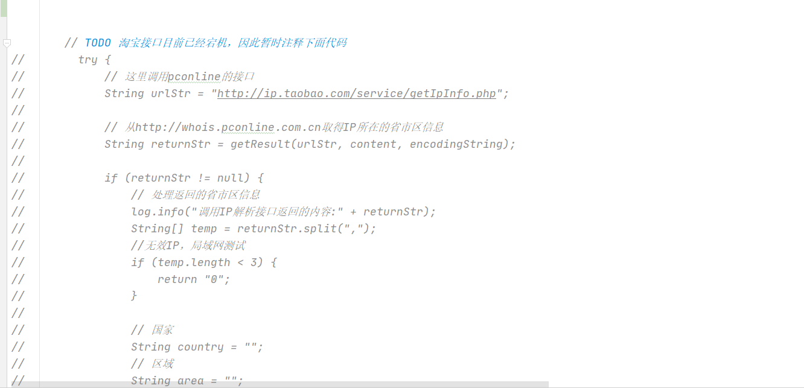
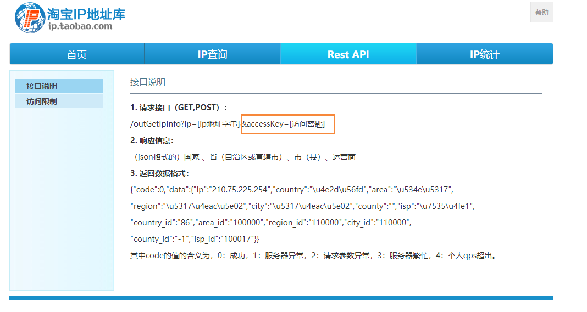
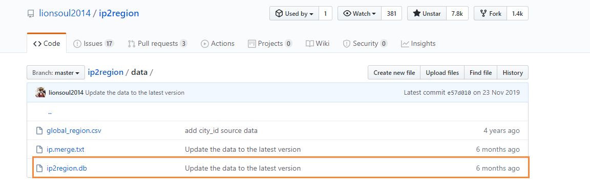
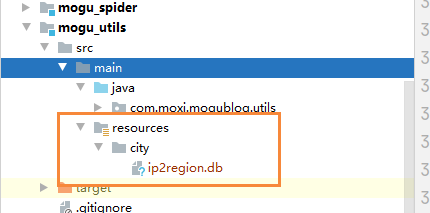
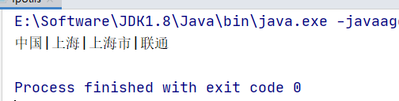
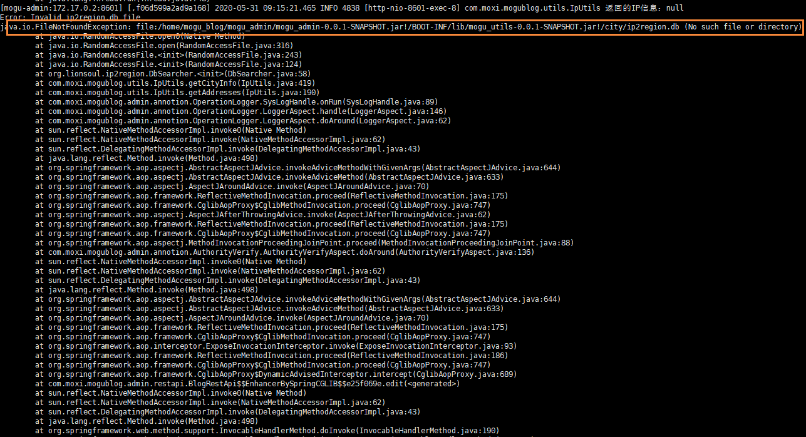
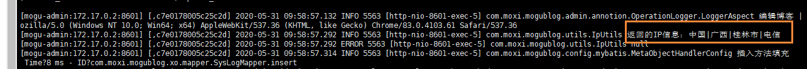

# Java使用Ip2region替代淘宝IP接口

## 前言

前段时间淘宝的IP接口宕机，导致无法直接获取到IP信息，同时调用淘宝的ip也返回缓慢，直接拖慢了系统的运行效率，导致我只能注释掉原来通过淘宝获取ip的接口。



这段时间貌似淘宝的IP接口又悄悄的上线了



但是通过观察我发现，貌似需要通过accessKey才能够继续访问了，然后我找了一段时间，也没有看到哪里能够申请访问的密钥，故此打算放弃淘宝IP接口了。

后面通过Github发现一款非常不错的IP转换工具：[Ip2region](https://github.com/lionsoul2014/ip2region)，它能够让原来IP转换成城市信息直接离线计算，而不需要通过网络请求的方式，这样大大降低了我们的网络开销。

## 介绍

ip2region - 准确率99.9%的离线IP地址定位库，0.0x毫秒级查询，ip2region.db数据库只有数MB。

全部的查询客户端单次查询都在0.x毫秒级别，内置了三种查询算法

- memory算法：整个数据库全部载入内存，单次查询都在0.1x毫秒内，C语言的客户端单次查询在0.00x毫秒级别。
- binary算法：基于二分查找，基于ip2region.db文件，不需要载入内存，单次查询在0.x毫秒级别。
- b-tree算法：基于btree算法，基于ip2region.db文件，不需要载入内存，单词查询在0.x毫秒级别，比binary算法更快。

## 引入

首先我们需要引入对应的Maven依赖

```
<dependency>
    <groupId>org.lionsoul</groupId>
    <artifactId>ip2region</artifactId>
    <version>1.7.2</version>
</dependency>
```

然后我们再去[ip2region的官网](https://github.com/lionsoul2014/ip2region/tree/master/data)下载到ip数据库，也就是这个文件



然后我们放在我们工具类的resource目录下，创建一个city文件夹存放



然后在原来的IP工具类中，添加下面方法

```
    public static String getCityInfo(String ip) {

        //db
        String dbPath = IpUtils.class.getResource("/city/ip2region.db").getPath();

        File file = new File(dbPath);
        if (file.exists() == false) {
            System.out.println("Error: Invalid ip2region.db file");
        }

        //查询算法
        //B-tree, B树搜索（更快）
        int algorithm = DbSearcher.BTREE_ALGORITHM;

        //Binary,使用二分搜索
        //DbSearcher.BINARY_ALGORITHM

        //Memory,加载内存（最快）
        //DbSearcher.MEMORY_ALGORITYM
        try {
            DbConfig config = new DbConfig();
            DbSearcher searcher = new DbSearcher(config, dbPath);

            //define the method
            Method method = null;
            switch (algorithm) {
                case DbSearcher.BTREE_ALGORITHM:
                    method = searcher.getClass().getMethod("btreeSearch", String.class);
                    break;
                case DbSearcher.BINARY_ALGORITHM:
                    method = searcher.getClass().getMethod("binarySearch", String.class);
                    break;
                case DbSearcher.MEMORY_ALGORITYM:
                    method = searcher.getClass().getMethod("memorySearch", String.class);
                    break;
            }

            DataBlock dataBlock = null;
            if (Util.isIpAddress(ip) == false) {
                System.out.println("Error: Invalid ip address");
            }

            dataBlock = (DataBlock) method.invoke(searcher, ip);
            String ipInfo = dataBlock.getRegion();
            if (!StringUtils.isEmpty(ipInfo)) {
                ipInfo = ipInfo.replace("|0", "");
            }
            return ipInfo;

        } catch (Exception e) {
            e.printStackTrace();
        }

        return null;
    }
```

最后通过main方法进行测试

```
    public static void main(String args[]) {
        String ip="220.248.12.158";
        String cityIpString = getCityInfo(ip);
        System.out.println(cityIpString);
    }
```

运行结果



在上述方法中，还提供了三种查询的策略，具体介绍在上文已经说过

```
//查询算法
//B-tree, B树搜索（更快）
int algorithm = DbSearcher.BTREE_ALGORITHM;

//Binary,使用二分搜索
//DbSearcher.BINARY_ALGORITHM

//Memory,加载内存（最快）
//DbSearcher.MEMORY_ALGORITYM
```

我目前采用的是B树进行查找，然后将查询出来的IP存储在redis中，同时设置过期时间为1天，这样能够降低我们的内存消耗，虽然可能就是第一次查询的时候稍微慢一些。

```
        //从Redis中获取IP来源
        String jsonResult = redisUtil.get(SysConf.IP_SOURCE + BaseSysConf.REDIS_SEGMENTATION + ip);
        if (StringUtils.isEmpty(jsonResult)) {
            String addresses = IpUtils.getAddresses(SysConf.IP + SysConf.EQUAL_TO + ip, SysConf.UTF_8);
            if (StringUtils.isNotEmpty(addresses)) {
                exception.setIpSource(addresses);
                redisUtil.setEx(SysConf.IP_SOURCE + BaseSysConf.REDIS_SEGMENTATION + ip, addresses, 24, TimeUnit.HOURS);
            }
        } else {
            exception.setIpSource(jsonResult);
        }
```

## 遇到的坑

上面的操作在IDEA中运行是没有问题的，但是如果你打包成jar包，部署到服务器中！！！就会出错



也就是打包后的jar包，无法获取到我们的 `ip2region.db` 文件，那么我们需要做的就是把文件内容重新创建一个目录，然后通过IO流进行读取，下次读取的时候，会判断文件是否存在，如果存在的话，那么就直接返回该路径

```
    /**
     * 创建ip2region文件
     * @return
     */
    public static String createFtlFileByFtlArray() {
        String ftlPath = "city/";
        return createFtlFile(ftlPath, "ip2region.db");
    }

    /**
     * 创建文件
     * @param ftlPath
     * @param ftlName
     * @return
     */
    private static String createFtlFile(String ftlPath, String ftlName) {
        InputStream certStream = null;
        try {
            //获取当前项目所在的绝对路径
            String proFilePath = System.getProperty("user.dir");

            //获取模板下的路径，然后存放在temp目录下　
            String newFilePath = proFilePath + File.separator + "temp" + File.separator + ftlPath;
            newFilePath = newFilePath.replace("/", File.separator);
            //检查项目运行时的src下的对应路径
            File newFile = new File(newFilePath + ftlName);
            if (newFile.isFile() && newFile.exists()) {
                return newFilePath;
            }
            //当项目打成jar包会运行下面的代码，并且复制一份到src路径下（具体结构看下面图片）
            certStream = Thread.currentThread().getContextClassLoader().getResourceAsStream(ftlPath + ftlName);
            byte[] certData = org.apache.commons.io.IOUtils.toByteArray(certStream);
            org.apache.commons.io.FileUtils.writeByteArrayToFile(newFile, certData);
            return newFilePath;
        } catch (Exception e) {
            log.error(e.getMessage());
        } finally {
            try {
                certStream.close();
            } catch (Exception e) {
                log.error(e.getMessage());
            }
        }
        return null;
    }
```

然后是修改原来的getCityInfo接口

```
    public static String getCityInfo(String ip) {

        String dbPath = createFtlFileByFtlArray() + "ip2region.db";
        File file = new File(dbPath);
        if (file.exists() == false) {
            System.out.println("Error: Invalid ip2region.db file");
        }

        //查询算法
        //B-tree, B树搜索（更快）
        int algorithm = DbSearcher.BTREE_ALGORITHM;

        //Binary,使用二分搜索
        //DbSearcher.BINARY_ALGORITHM

        //Memory,加载内存（最快）
        //DbSearcher.MEMORY_ALGORITYM
        try {
            DbConfig config = new DbConfig();
            DbSearcher searcher = new DbSearcher(config, dbPath);

            //define the method
            Method method = null;
            switch (algorithm) {
                case DbSearcher.BTREE_ALGORITHM:
                    method = searcher.getClass().getMethod("btreeSearch", String.class);
                    break;
                case DbSearcher.BINARY_ALGORITHM:
                    method = searcher.getClass().getMethod("binarySearch", String.class);
                    break;
                case DbSearcher.MEMORY_ALGORITYM:
                    method = searcher.getClass().getMethod("memorySearch", String.class);
                    break;
            }

            DataBlock dataBlock = null;
            if (Util.isIpAddress(ip) == false) {
                System.out.println("Error: Invalid ip address");
            }

            dataBlock = (DataBlock) method.invoke(searcher, ip);
            String ipInfo = dataBlock.getRegion();
            if (!StringUtils.isEmpty(ipInfo)) {
                ipInfo = ipInfo.replace("|0", "");
                ipInfo = ipInfo.replace("0|", "");
            }
            return ipInfo;

        } catch (Exception e) {
            e.printStackTrace();
        }

        return null;
    }
```

最后运行后，会发现在项目的根目录下，会创建一个temp目录，用于存放我们的`.db`文件


我们再次打包部署服务器后，发现能够成功获取到IP城市信息了~

