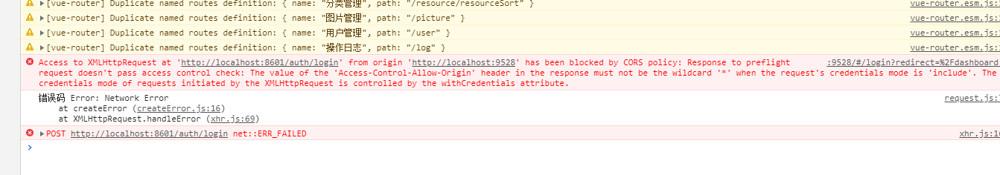
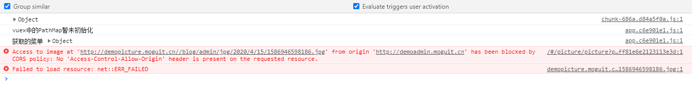
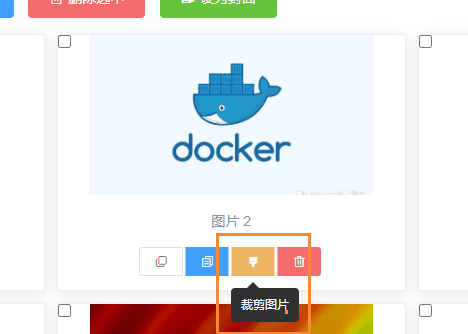
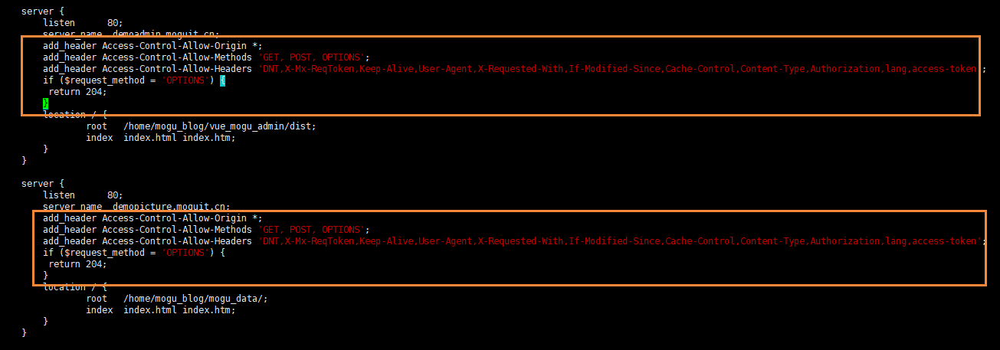
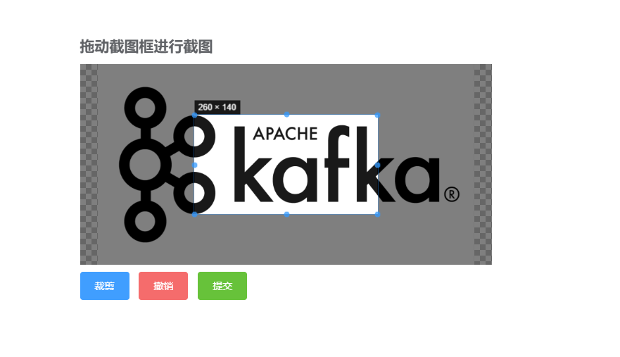

# 前后端分离项目解决跨域问题

## 前言

首先感谢群里小伙伴 **新** 反馈的问题，关于token刷新写入Cookie，以及图片裁剪出现跨域请求的问题。

作为前后端分离的项目，经常会遇到跨域问题，例如下面这样的



因为使用vue启动的前端项目运行在 9528端口，而后台项目运行在8601端口，这样因为不同端口的原因就造成了跨域请求。

同时及时在相同的域名或者端口上，也有可能会遇到跨域问题，例如下面这个



这是是因为在请求图片的时候遇到的一个跨域问题，但是这个图片只有在使用nginx静态代理到服务器上的图片时才会遇到，如果使用的是七牛云图片则不会出现问题。问题具体的场景是在图片裁剪的时候出现的。



点击裁剪后，无法正常的显示图片


## 关于跨域

跨域资源共享([CORS](https://developer.mozilla.org/zh-CN/docs/Glossary/CORS)) 是一种机制，它使用额外的 [HTTP](https://developer.mozilla.org/zh-CN/docs/Glossary/HTTP) 头来告诉浏览器 让运行在一个 origin (domain) 上的Web应用被准许访问来自不同源服务器上的指定的资源。当一个资源从与该资源本身所在的服务器**不同的域、协议或端口**请求一个资源时，资源会发起一个**跨域 HTTP 请求**。

比如，站点 http://domain-a.com 的某 HTML 页面通过 [ 的 src ](https://developer.mozilla.org/zh-CN/docs/Web/HTML/Element/Img#Attributes)请求 http://domain-b.com/image.jpg。网络上的许多页面都会加载来自不同域的CSS样式表，图像和脚本等资源。

出于安全原因，浏览器限制从脚本内发起的跨源HTTP请求。 例如，XMLHttpRequest和Fetch API遵循同源策略。 这意味着使用这些API的Web应用程序只能从加载应用程序的同一个域请求HTTP资源，除非响应报文包含了正确CORS响应头。

Spring 中对 CORS 规则的校验，都是通过委托给 DefaultCorsProcessor实现的。

DefaultCorsProcessor 处理过程如下：

- 判断依据是 Header中是否包含 Origin。如果包含则说明为 CORS请求，转到 2；否则，说明不是 CORS 请求，不作任何处理。

- 判断 response 的 Header 是否已经包含 Access-Control-Allow-Origin，如果包含，证明已经被处理过了, 转到 3，否则不再处理。

- 判断是否同源，如果是则转交给负责该请求的类处理
  是否配置了 CORS 规则，如果没有配置，且是预检请求，则拒绝该请求，如果没有配置，且不是预检请求，则交给负责该请求的类处理。如果配置了，则对该请求进行校验。
  校验就是根据 CorsConfiguration 这个类的配置进行判断：

  - 判断 origin 是否合法

  - 判断 method 是否合法

  - 判断 header是否合法

如果全部合法，则在 response header中添加响应的字段，并交给负责该请求的类处理，如果不合法，则拒绝该请求

## 前后端跨域问题

### 方法一

针对第一个问题，我们可以在我们后台的启动类上添加下面这个Bean即可，

```
    @Bean
    public WebMvcConfigurer corsConfigurer() {
        return new WebMvcConfigurer() {
            @Override
            public void addCorsMappings(CorsRegistry registry) {
                //配置允许跨域访问的路径
                registry.addMapping("/**/**")
                        .allowedOrigins("*")
                        .allowedMethods("*")
                        .allowedHeaders("*")
                        .allowCredentials(true)
                        .exposedHeaders("")
                        .maxAge(3600);
            }
        };
    }
```

### 方法二

或者使用下面的方法

```
    private CorsConfiguration buildConfig() {
        CorsConfiguration corsConfiguration = new CorsConfiguration();
        corsConfiguration.addAllowedOrigin("*");
        corsConfiguration.addAllowedHeader("*");
        corsConfiguration.addAllowedMethod("*");
        return corsConfiguration;
    }

    /**
     * 跨域过滤器
     *
     * @return
     */
    @Bean
    public CorsFilter corsFilter() {
        UrlBasedCorsConfigurationSource source = new UrlBasedCorsConfigurationSource();
        source.registerCorsConfiguration("/**", buildConfig());
        return new CorsFilter(source);
    }
```

### 注意

在这里我推荐使用的是第一种方法，最开始我使用的是第二个方法来解决跨域的问题的，但是后面有了一个新的需求时，也就是我的token需要在将要过期的时候刷新，然后我需要在token刷新后，后台将token传递到前台，我后端代码是这样编写的

```
            if(StringUtils.isNotEmpty(onlineAdmin) && !jwtHelper.isExpiration(token, audience.getBase64Secret())) {
                /**
                 * 得到过期时间
                 */
                Date expirationDate = jwtHelper.getExpiration(token, audience.getBase64Secret());
                long nowMillis = System.currentTimeMillis();
                Date nowDate = new Date(nowMillis);
                // 得到两个日期相差的间隔，秒
                Integer second = DateUtils.getSecondByTwoDay(expirationDate, nowDate);
                // 如果小于5分钟，那么更新过期时间
                if(second < refreshSecond) {
                    // 生成一个新的Token
                    String newToken = tokenHead + jwtHelper.refreshToken(token, audience.getBase64Secret(), expiresSecond * 1000);
                    // 生成新的token，发送到客户端
                    CookieUtils.setCookie("Admin-Token", newToken, expiresSecond.intValue());
                    // 重新更新Redis中的过期时间
                    redisUtil.setEx(RedisConf.LOGIN_TOKEN_KEY + RedisConf.SEGMENTATION + newToken, onlineAdmin, expiresSecond, TimeUnit.SECONDS);
                }
            } else {
                chain.doFilter(request, response);
                return;
            }
```

这个时候就需要我在axios中进行如下配置，即添加 withCredentials=true 这样才能够让后端的token传递到前端

```
// 创建axios实例
const service = axios.create({
  baseURL: '', // api 的 base_url
  withCredentials: true, //允许后台的cookie传递到前端
  timeout: 100000 // 请求超时时间
})

```

关于 withCredentials

>#### XMLHttpRequest 的 withCredentials 属性
>
>- 默认值为false。在获取同域资源时设置 withCredentials 没有影响。
>- true：在跨域请求时，会携带用户凭证
>- false：在跨域请求时，不会携带用户凭证；返回的 response 里也会忽略 cookie

但是如果我使用的是第二种解决跨域的方法，那么在我将这个值设置成true的时候，将无法进行登录，还是出现如下的问题，最后通过查阅资料，发现设置了第一种解决跨域的方法，能成功将token传递到前端，并且存入到Application 的 Cookie中。


## 图片跨域问题

关于图片跨域问题的解决方法，主要是需要在nginx配置允许跨域，因为蘑菇博客的图片是存储在本地服务器中的，然后通过nginx进行静态资源映射过去的，从而出现上面的图片跨域问题。

解决方法，就是需要在nginx.conf文件中进行修改，添加如下内容

```
        add_header Access-Control-Allow-Origin *;
        add_header Access-Control-Allow-Methods 'GET, POST, OPTIONS';
        add_header Access-Control-Allow-Headers 'DNT,X-Mx-ReqToken,Keep-Alive,User-Agent,X-Requested-With,If-Modified-Since,Cache-Control,Content-Type,Authorization,lang,access-token';
        if ($request_method = 'OPTIONS') {
         return 204;
        }

```

例如，我在 demoadmin.moguit.cn 和 demopicture.moguit.cn的nginx中的配置



添加完成后，我们重启nginx，然后等待一段时间后，即可正常显示图片了~

