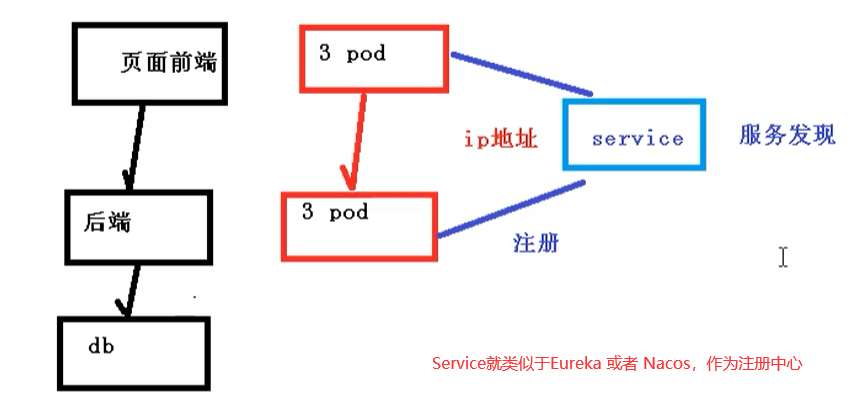
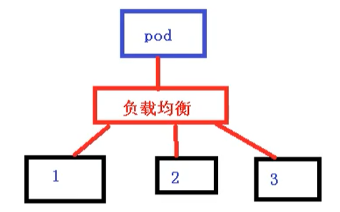
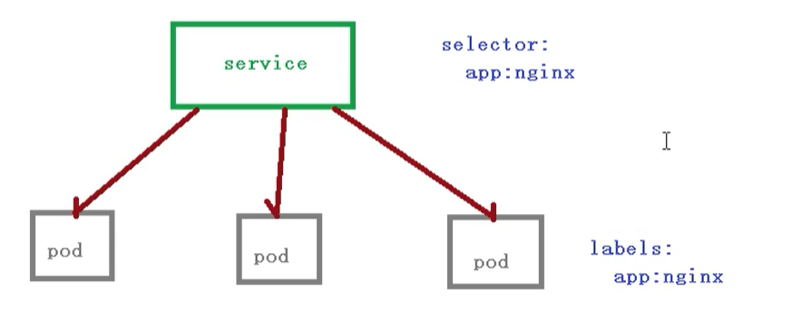

# Kubernetes核心技术Service

## 前言

前面我们了解到 Deployment 只是保证了支撑服务的微服务Pod的数量，但是没有解决如何访问这些服务的问题。一个Pod只是一个运行服务的实例，随时可能在一个节点上停止，在另一个节点以一个新的IP启动一个新的Pod，因此不能以确定的IP和端口号提供服务。

要稳定地提供服务需要服务发现和负载均衡能力。服务发现完成的工作，是针对客户端访问的服务，找到对应的后端服务实例。在K8S集群中，客户端需要访问的服务就是Service对象。每个Service会对应一个集群内部有效的虚拟IP，集群内部通过虚拟IP访问一个服务。

在K8S集群中，微服务的负载均衡是由kube-proxy实现的。kube-proxy是k8s集群内部的负载均衡器。它是一个分布式代理服务器，在K8S的每个节点上都有一个；这一设计体现了它的伸缩性优势，需要访问服务的节点越多，提供负载均衡能力的kube-proxy就越多，高可用节点也随之增多。与之相比，我们平时在服务器端使用反向代理作负载均衡，还要进一步解决反向代理的高可用问题。

## Service存在的意义

### 防止Pod失联【服务发现】

因为Pod每次创建都对应一个IP地址，而这个IP地址是短暂的，每次随着Pod的更新都会变化，假设当我们的前端页面有多个Pod时候，同时后端也多个Pod，这个时候，他们之间的相互访问，就需要通过注册中心，拿到Pod的IP地址，然后去访问对应的Pod



### 定义Pod访问策略【负载均衡】

页面前端的Pod访问到后端的Pod，中间会通过Service一层，而Service在这里还能做负载均衡，负载均衡的策略有很多种实现策略，例如：

- 随机
- 轮询
- 响应比



## Pod和Service的关系

这里Pod 和 Service 之间还是根据 label 和 selector 建立关联的 【和Controller一样】



我们在访问service的时候，其实也是需要有一个ip地址，这个ip肯定不是pod的ip地址，而是 虚拟IP `vip` 

## Service常用类型

Service常用类型有三种

- ClusterIp：集群内部访问
- NodePort：对外访问应用使用
- LoadBalancer：对外访问应用使用，公有云

### 举例

我们可以导出一个文件 包含service的配置信息

```bash
kubectl expose deployment web --port=80 --target-port=80 --dry-run -o yaml > service.yaml
```

service.yaml 如下所示

```yaml
apiVersion: v1
kind: Service
metadata:
  creationTimestamp: null
  labels:
    app: web
  name: web
spec:
  ports:
  - port: 80
    protocol: TCP
    targetPort: 80
  selector:
    app: web
status:
  loadBalancer: {}
```

如果我们没有做设置的话，默认使用的是第一种方式 ClusterIp，也就是只能在集群内部使用，我们可以添加一个type字段，用来设置我们的service类型

```yaml
apiVersion: v1
kind: Service
metadata:
  creationTimestamp: null
  labels:
    app: web
  name: web
spec:
  ports:
  - port: 80
    protocol: TCP
    targetPort: 80
  selector:
    app: web
  type: NodePort
status:
  loadBalancer: {}
```

修改完命令后，我们使用创建一个pod

```bash
kubectl apply -f service.yaml
```

然后能够看到，已经成功修改为 NodePort类型了，最后剩下的一种方式就是LoadBalanced：对外访问应用使用公有云

node一般是在内网进行部署，而外网一般是不能访问到的，那么如何访问的呢？

- 找到一台可以通过外网访问机器，安装nginx，反向代理
- 手动把可以访问的节点添加到nginx中

如果我们使用LoadBalancer，就会有负载均衡的控制器，类似于nginx的功能，就不需要自己添加到nginx上