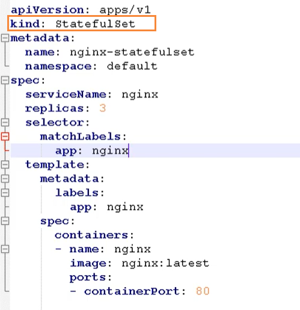
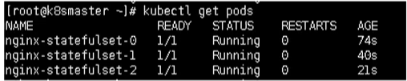
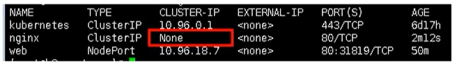
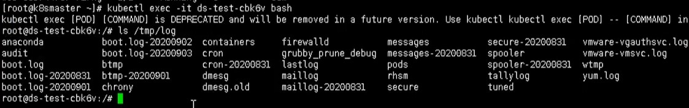
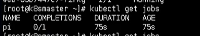
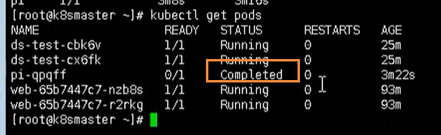
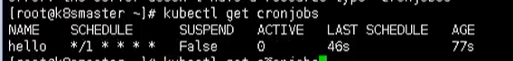
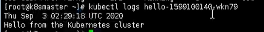
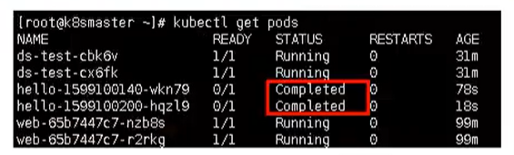

# Kubernetes控制器Controller详解

## 删除svc 和 statefulset

使用下面命令，可以删除我们添加的svc 和 statefulset

```bash
kubectl delete svc web

kubectl delete statefulset --all
```

## statefulset

statefulset主要是用来部署有状态应用

### 无状态应用

我们原来使用deployment，部署的都是无状态的应用，那什么是无状态应用？

- 认为Pod都是一样的
- 没有顺序要求
- 不考虑应用在哪个node上运行
- 能够进行随意伸缩和扩展

### 有状态应用

上述的因素都需要考虑到

- 让每个Pod独立的
- 让每个Pod独立的，保持Pod启动顺序和唯一性
- 唯一的网络标识符，持久存储
- 有序，比如mysql中的主从

### 部署有状态应用

无头service， ClusterIp：none

这里就需要使用 StatefulSet部署有状态应用




然后通过查看pod，能否发现每个pod都有唯一的名称



然后我们在查看service，发现是无头的service



这里有状态的约定，肯定不是简简单单通过名称来进行约定，而是更加复杂的操作

- deployment：是有身份的，有唯一标识
- statefulset：根据主机名 + 按照一定规则生成域名

每个pod有唯一的主机名，并且有唯一的域名

- 格式：主机名称.service名称.名称空间.svc.cluster.local
- 举例：nginx-statefulset-0.default.svc.cluster.local

## DaemonSet

DaemonSet主要是用来部署守护进程

守护进程在我们每个节点上，运行的是同一个pod，新加入的节点也同样运行在同一个pod里面

- 例子：在每个node节点安装数据采集工具


这里是不是一个FileBeat镜像，主要是为了做日志采集工作


进入某个 Pod里面，进入

```bash
kubectl exec -it ds-test-cbk6v bash
```

通过该命令后，我们就能看到我们内部收集的日志信息了




## Job和CronJob

一次性任务 和 定时任务

- 一次性任务：一次性执行完就结束
- 定时任务：周期性执行

### Job

一次性任务


使用下面命令，能够看到目前已经存在的Job

```bash
kubectl get jobs
```



在计算完成后，通过命令查看，能够发现该任务已经完成



我们可以通过查看日志，查看到一次性任务的结果

```bash
kubectl logs pi-qpqff
```


### CronJob

定时任务，cronjob.yaml如下所示


这里面的命令就是每个一段时间，这里是通过 cron 表达式配置的，通过 schedule字段

然后下面命令就是每个一段时间输出 

我们首先用上述的配置文件，创建一个定时任务

```bash
kubectl apply -f cronjob.yaml
```

创建完成后，我们就可以通过下面命令查看定时任务

```bash
kubectl get cronjobs
```



我们可以通过日志进行查看

```bash
kubectl logs hello-1599100140-wkn79
```



然后每次执行，就会多出一个 pod

