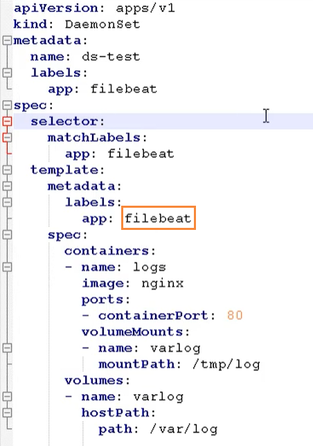
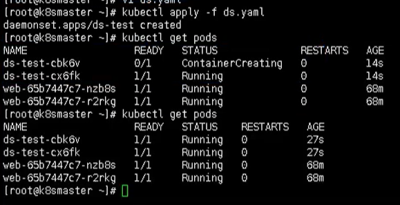
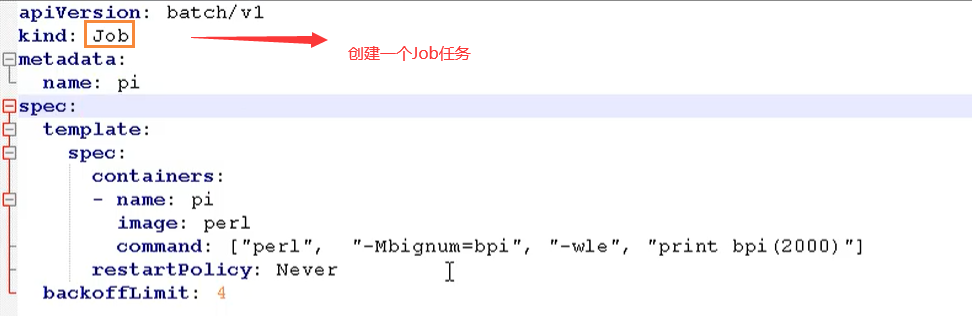
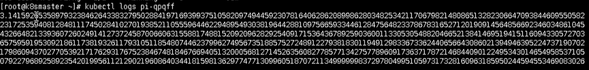
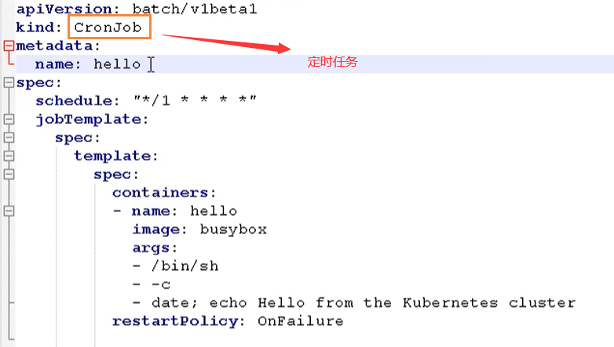

# Kubernetes控制器Controller详解

## Statefulset

Statefulset主要是用来部署有状态应用

对于StatefulSet中的Pod，每个Pod挂载自己独立的存储，如果一个Pod出现故障，从其他节点启动一个同样名字的Pod，要挂载上原来Pod的存储继续以它的状态提供服务。

### 无状态应用

我们原来使用 deployment，部署的都是无状态的应用，那什么是无状态应用？

- 认为Pod都是一样的
- 没有顺序要求
- 不考虑应用在哪个node上运行
- 能够进行随意伸缩和扩展

### 有状态应用

上述的因素都需要考虑到

- 让每个Pod独立的
- 让每个Pod独立的，保持Pod启动顺序和唯一性
- 唯一的网络标识符，持久存储
- 有序，比如mysql中的主从

适合StatefulSet的业务包括数据库服务MySQL 和 PostgreSQL，集群化管理服务Zookeeper、etcd等有状态服务

StatefulSet的另一种典型应用场景是作为一种比普通容器更稳定可靠的模拟虚拟机的机制。传统的虚拟机正是一种有状态的宠物，运维人员需要不断地维护它，容器刚开始流行时，我们用容器来模拟虚拟机使用，所有状态都保存在容器里，而这已被证明是非常不安全、不可靠的。

使用StatefulSet，Pod仍然可以通过漂移到不同节点提供高可用，而存储也可以通过外挂的存储来提供
高可靠性，StatefulSet做的只是将确定的Pod与确定的存储关联起来保证状态的连续性。

### 部署有状态应用

无头service， ClusterIp：none

这里就需要使用 StatefulSet部署有状态应用


然后通过查看pod，能否发现每个pod都有唯一的名称


然后我们在查看service，发现是无头的service


这里有状态的约定，肯定不是简简单单通过名称来进行约定，而是更加复杂的操作

- deployment：是有身份的，有唯一标识
- statefulset：根据主机名 + 按照一定规则生成域名

每个pod有唯一的主机名，并且有唯一的域名

- 格式：主机名称.service名称.名称空间.svc.cluster.local
- 举例：nginx-statefulset-0.default.svc.cluster.local

## DaemonSet

DaemonSet 即后台支撑型服务，主要是用来部署守护进程

长期伺服型和批处理型的核心在业务应用，可能有些节点运行多个同类业务的Pod，有些节点上又没有这类的Pod运行；而后台支撑型服务的核心关注点在K8S集群中的节点(物理机或虚拟机)，要保证每个节点上都有一个此类Pod运行。节点可能是所有集群节点，也可能是通过 nodeSelector选定的一些特定节点。典型的后台支撑型服务包括：存储、日志和监控等。在每个节点上支撑K8S集群运行的服务。

守护进程在我们每个节点上，运行的是同一个pod，新加入的节点也同样运行在同一个pod里面

- 例子：在每个node节点安装数据采集工具



这里是不是一个FileBeat镜像，主要是为了做日志采集工作



进入某个 Pod里面，进入

```bash
kubectl exec -it ds-test-cbk6v bash
```

通过该命令后，我们就能看到我们内部收集的日志信息了


## Job和CronJob

一次性任务 和 定时任务

- 一次性任务：一次性执行完就结束
- 定时任务：周期性执行

Job是K8S中用来控制批处理型任务的API对象。批处理业务与长期伺服业务的主要区别就是批处理业务的运行有头有尾，而长期伺服业务在用户不停止的情况下永远运行。Job管理的Pod根据用户的设置把任务成功完成就自动退出了。成功完成的标志根据不同的 spec.completions 策略而不同：单Pod型任务有一个Pod成功就标志完成；定数成功行任务保证有N个任务全部成功；工作队列性任务根据应用确定的全局成功而标志成功。

### Job

Job也即一次性任务



使用下面命令，能够看到目前已经存在的Job

```bash
kubectl get jobs
```


在计算完成后，通过命令查看，能够发现该任务已经完成


我们可以通过查看日志，查看到一次性任务的结果

```bash
kubectl logs pi-qpqff
```



### CronJob

定时任务，cronjob.yaml如下所示



这里面的命令就是每个一段时间，这里是通过 cron 表达式配置的，通过 schedule字段

然后下面命令就是每个一段时间输出 

我们首先用上述的配置文件，创建一个定时任务

```bash
kubectl apply -f cronjob.yaml
```

创建完成后，我们就可以通过下面命令查看定时任务

```bash
kubectl get cronjobs
```


我们可以通过日志进行查看

```bash
kubectl logs hello-1599100140-wkn79
```


然后每次执行，就会多出一个 pod


## 删除svc 和 statefulset

使用下面命令，可以删除我们添加的svc 和 statefulset

```bash
kubectl delete svc web

kubectl delete statefulset --all
```

## Replication Controller

Replication Controller 简称 **RC**，是K8S中的复制控制器。RC是K8S集群中最早的保证Pod高可用的API对象。通过监控运行中的Pod来保证集群中运行指定数目的Pod副本。指定的数目可以是多个也可以是1个；少于指定数目，RC就会启动新的Pod副本；多于指定数目，RC就会杀死多余的Pod副本。

即使在指定数目为1的情况下，通过RC运行Pod也比直接运行Pod更明智，因为RC也可以发挥它高可用的能力，保证永远有一个Pod在运行。RC是K8S中较早期的技术概念，只适用于长期伺服型的业务类型，比如控制Pod提供高可用的Web服务。

### Replica Set

Replica Set 检查 RS，也就是副本集。RS是新一代的RC，提供同样高可用能力，区别主要在于RS后来居上，能够支持更多种类的匹配模式。副本集对象一般不单独使用，而是作为Deployment的理想状态参数来使用