# Kubernetes配置管理

## Secret

Secret的主要作用就是加密数据，然后存在etcd里面，让Pod容器以挂载Volume方式进行访问

场景：用户名 和 密码进行加密

一般场景的是对某个字符串进行base64编码 进行加密

```bash
echo -n 'admin' | base64
```

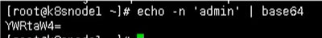

### 变量形式挂载到Pod

- 创建secret加密数据的yaml文件    secret.yaml

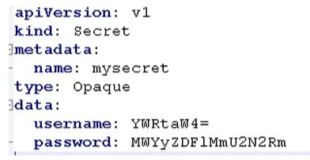

然后使用下面命令创建一个pod

```bash
kubectl create -f secret.yaml
```

通过get命令查看

```bash
kubectl get pods
```

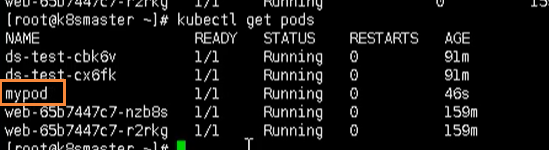

然后我们通过下面的命令，进入到我们的容器内部

```bash
kubectl exec -it mypod bash
```

然后我们就可以输出我们的值，这就是以变量的形式挂载到我们的容器中

```bash
# 输出用户
echo $SECRET_USERNAME
# 输出密码
echo $SECRET_PASSWORD
```

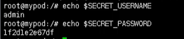

最后如果我们要删除这个Pod，就可以使用这个命令

```bash
kubectl delete -f secret-val.yaml
```

### 数据卷形式挂载

首先我们创建一个 secret-val.yaml 文件

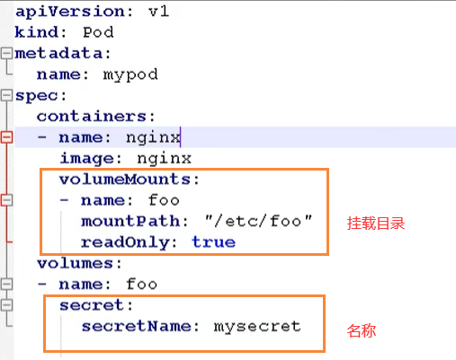

然后创建我们的 Pod

```bash
# 根据配置创建容器
kubectl apply -f secret-val.yaml
# 进入容器
kubectl exec -it mypod bash
# 查看
ls /etc/foo
```

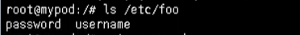

## ConfigMap

ConfigMap作用是存储不加密的数据到etcd中，让Pod以变量或数据卷Volume挂载到容器中

应用场景：配置文件

### 创建配置文件

首先我们需要创建一个配置文件 `redis.properties`

```bash
redis.port=127.0.0.1
redis.port=6379
redis.password=123456
```

### 创建ConfigMap

我们使用命令创建configmap

```bash
kubectl create configmap redis-config --from-file=redis.properties
```

然后查看详细信息

```bash
kubectl describe cm redis-config
```

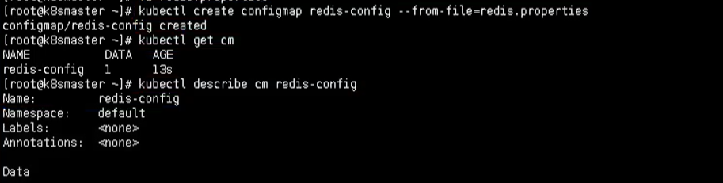

### Volume数据卷形式挂载

首先我们需要创建一个 `cm.yaml`

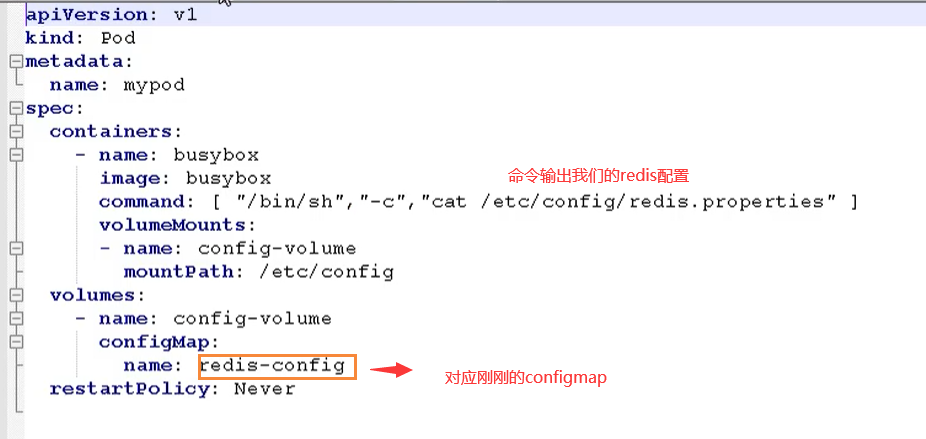

然后使用该yaml创建我们的pod

```bash
# 创建
kubectl apply -f cm.yaml
# 查看
kubectl get pods
```

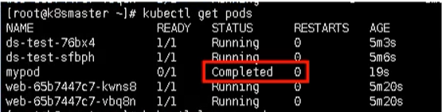

最后我们通过命令就可以查看结果输出了

```bash
kubectl logs mypod
```

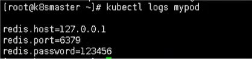

### 以变量的形式挂载Pod

首先我们也有一个 myconfig.yaml文件，声明变量信息，然后以configmap创建

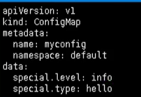

然后我们就可以创建我们的配置文件

```bash
# 创建pod
kubectl apply -f myconfig.yaml
# 获取
kubectl get cm
```

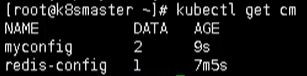

然后我们创建完该pod后，我们就需要在创建一个  config-var.yaml 来使用我们的配置信息

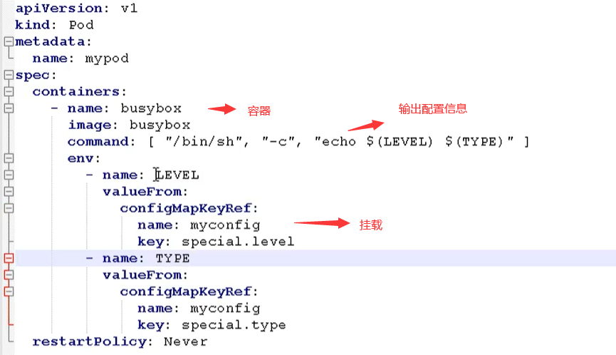

最后我们查看输出

```bash
kubectl logs mypod
```

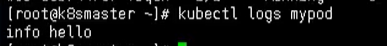