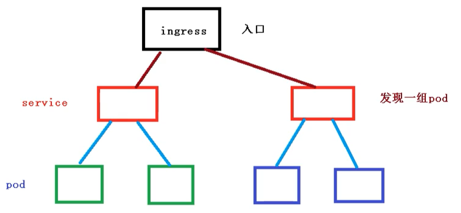
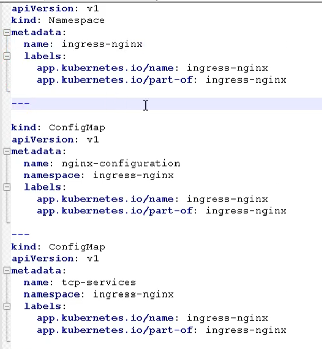
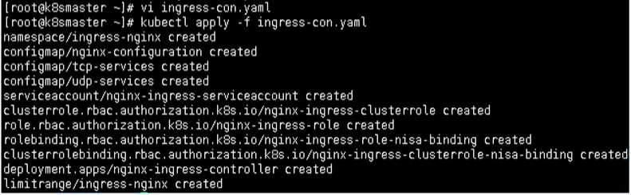
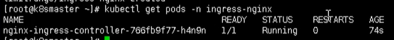
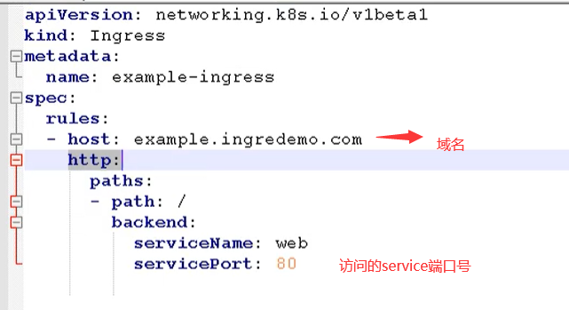
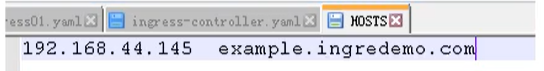
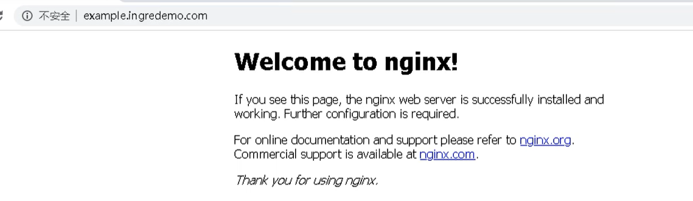

# Kubernetes核心技术Ingress

## 前言

原来我们需要将端口号对外暴露，通过 ip + 端口号就可以进行访问

原来是使用Service中的NodePort来实现

- 在每个节点上都会启动端口
- 在访问的时候通过任何节点，通过ip + 端口号就能实现访问

但是NodePort还存在一些缺陷

- 因为端口不能重复，所以每个端口只能使用一次，一个端口对应一个应用
- 实际访问中都是用域名，根据不同域名跳转到不同端口服务中

## Ingress和Pod关系

pod 和 ingress 是通过service进行关联的，而ingress作为统一入口，由service关联一组pod中



- 首先service就是关联我们的pod
- 然后ingress作为入口，首先需要到service，然后发现一组pod
- 发现pod后，就可以做负载均衡等操作

## Ingress工作流程

在实际的访问中，我们都是需要维护很多域名， a.com  和  b.com

然后不同的域名对应的不同的Service，然后service管理不同的pod


需要注意，ingress不是内置的组件，需要我们单独的安装

## 使用Ingress

步骤如下所示

- 部署ingress Controller【需要下载官方的】
- 创建ingress规则【对哪个Pod、名称空间配置规则】

### 创建Nginx Pod

创建一个nginx应用，然后对外暴露端口

```bash
# 创建pod
kubectl create deployment web --image=nginx
# 查看
kubectl get pods
```

对外暴露端口

```bash
kubectl expose deployment web --port=80 --target-port=80 --type:NodePort
```

### 部署 ingress controller

下面我们来通过yaml的方式，部署我们的ingress，配置文件如下所示



这个文件里面，需要注意的是 hostNetwork: true，改成ture是为了让后面访问到

```bash
kubectl apply -f ingress-con.yaml
```

通过这种方式，其实我们在外面就能访问，这里还需要在外面添加一层

```bash
kubectl apply -f ingress-con.yaml
```



最后通过下面命令，查看是否成功部署 ingress

```bash
kubectl get pods -n ingress-nginx
```



### 创建ingress规则文件

创建ingress规则文件，ingress-h.yaml



### 添加域名访问规则

在windows 的 hosts文件，添加域名访问规则【因为我们没有域名解析，所以只能这样做】



最后通过域名就能访问

